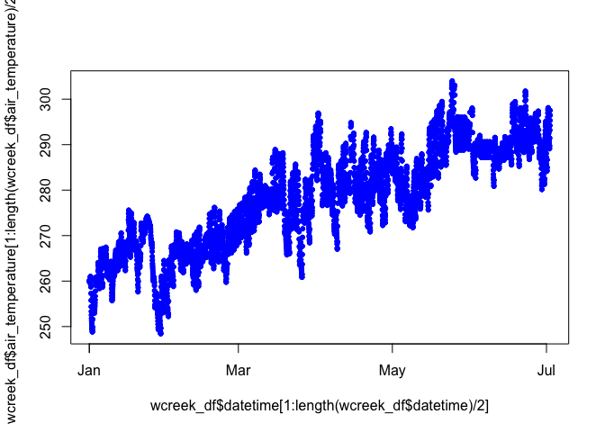
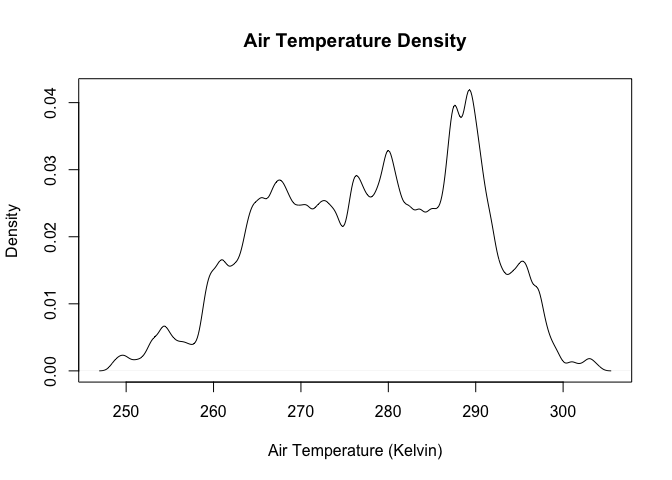
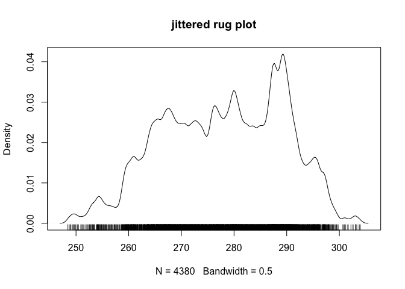
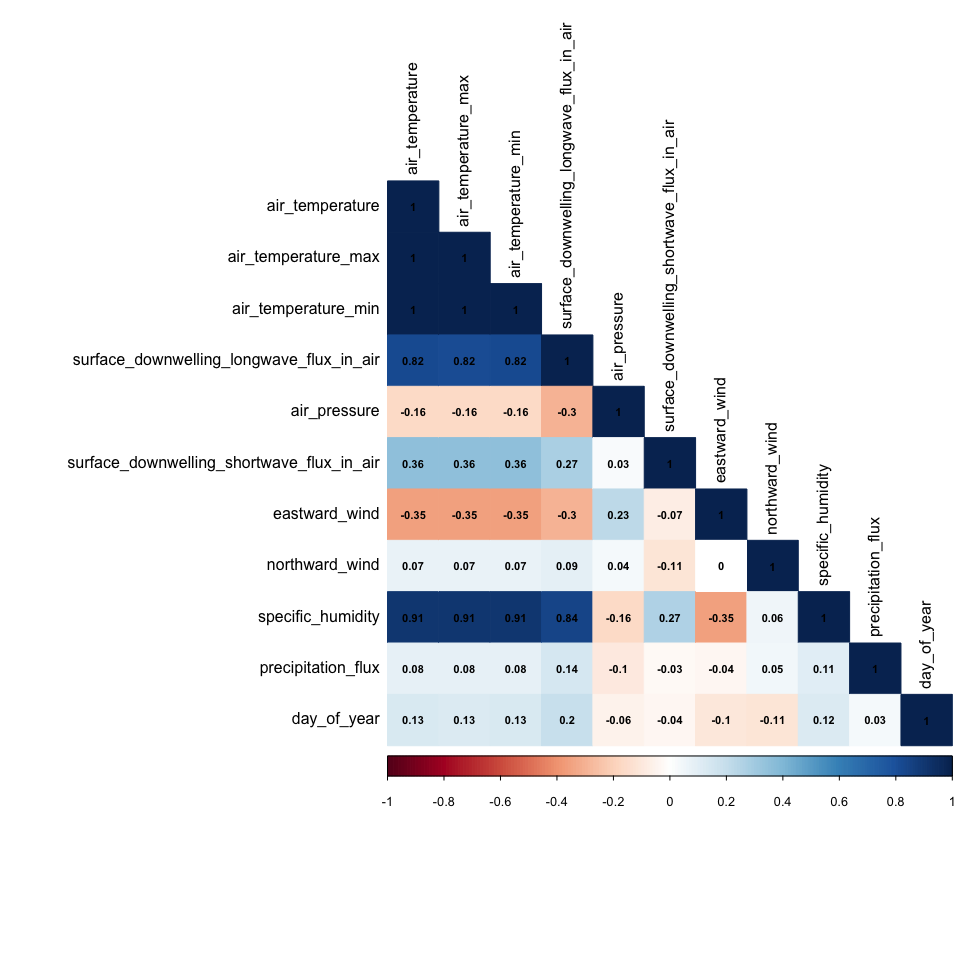
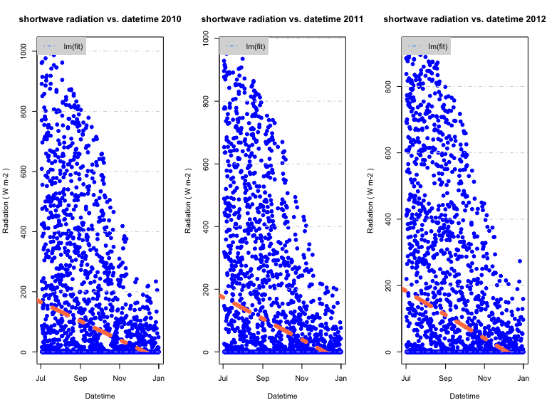
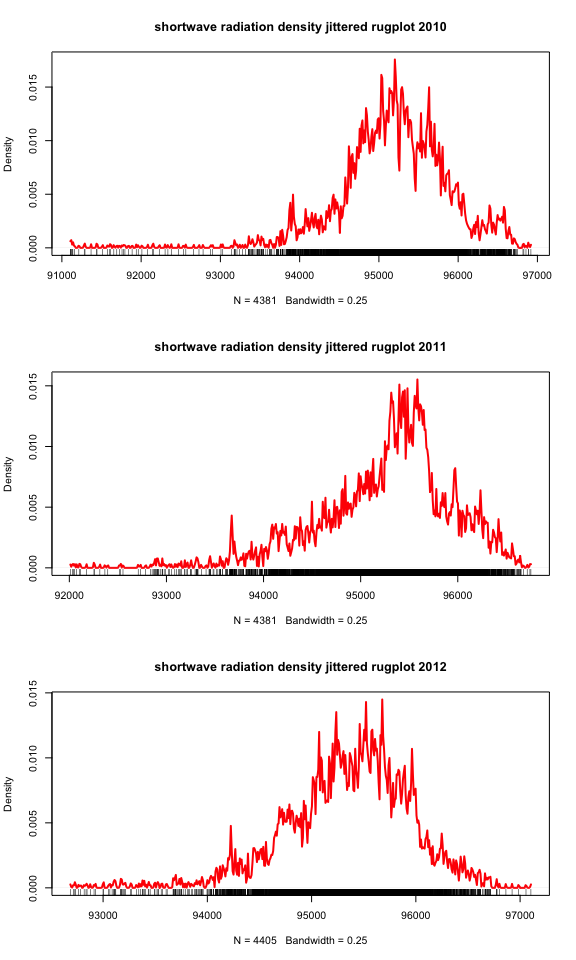

Week2 - BasicStatistics
================

# Basic Statistics

This week we’ll be diving into some basic statistical procedures. R
started out as THE statistical programming language. It spread like
wildfire for it’s performance and efficiency at crunching numbers. It’s
early success as a statistical programming langugae attracted the early
developers who really made R into the do-it-all language we’re using
today. First, I’ll throw in the useful definitions list at the top of
this tutorial just for ease of access. Second, we’ll dive into a recap
of for loops and how they’re structured. Then we’ll show off some of R’s
great statistics functions and how to add them to a plot. Finally, we’ll
have an assignment where we cover some
of

## Some Useful Definitions

| Function      | Description                                                                                                           |
| ------------- | --------------------------------------------------------------------------------------------------------------------- |
| ls            | lists contents of R workspace/global environment                                                                      |
| rm            | removes objects from R workspace                                                                                      |
| save          | save selected objects                                                                                                 |
| \+,-,\*,/,^   | arithmetic operators                                                                                                  |
| %\*%          | matrix multiplication                                                                                                 |
| t             | matrix transpose                                                                                                      |
| solve         | matrix inverse (and solving linear equations)                                                                         |
| c             | combines (concatenates) objects, simplest way to make vectors                                                         |
| seq           | creates vectors that are regular sequences                                                                            |
| rep           | replicates vectors                                                                                                    |
| length        | returns length of a vector                                                                                            |
| sum           | returns the sum                                                                                                       |
| mean          | returns the mean                                                                                                      |
| median        | returns the median                                                                                                    |
| sd            | returns the standard deviation (n − 1 in denominator)                                                                 |
| min           | returns minimum                                                                                                       |
| max           | returns maximum                                                                                                       |
| sort          | sort a vector (rearranges the vector in order)                                                                        |
| order         | returns indices of vectors that will order them                                                                       |
| rank          | returns rank of each element in vector                                                                                |
| \==, \<, \>   | comparison operators                                                                                                  |
| \<=, \>=, \!= |                                                                                                                       |
|               | , &                                                                                                                   |
| is.na         | tests for missing value NA                                                                                            |
| which         | does logical comparison and indicates which elements are TRUE that is, gives the TRUE indices of a logical object     |
| any           | does logical comparison returns 1 (TRUE) if any of the comparisons are TRUE, i.e. is at least one of the values true? |
| exp           | returns e to that power                                                                                               |
| log           | returns natural logarithm (to the base e)                                                                             |
| log10         | returns logarithm (to the base 10)                                                                                    |
| sqrt          | returns square root                                                                                                   |
| table         | does frequencies and cross-tabs                                                                                       |
| help          | help page on specified function                                                                                       |
| cbind         | combine by columns                                                                                                    |
| rbind         | combine by rows                                                                                                       |
| matrix        | create a matrix                                                                                                       |
| vector        | create a vector                                                                                                       |
| nrow          | number of rows in an array or data frame                                                                              |
| ncol          | number of columns in an array or data frame                                                                           |
| dim           | dimensions of an array or data frame                                                                                  |
| array         | create an array                                                                                                       |

| Function      | Description                                                       |
| ------------- | ----------------------------------------------------------------- |
| is.vector     | answers the question, is this a vector TRUE or FALSE              |
| as.vector     | attempts to coerce object into a vector                           |
| read.table    | reads data from a text file                                       |
| read.csv      | reads data from a text file with comma separated data             |
| write.table   | writes a data frame to a text file                                |
| is.data.frame | tests object to see if it is data frame                           |
| as.data.frame | coerces object into data frame                                    |
| is.factor     | tests object to see if it is a factor                             |
| as.factor     | coerces object into a factor                                      |
| head, tail    | list the first, last six rows                                     |
| names         | returns names of elements of object                               |
| colnames      | returns or sets column names of object                            |
| rownames      | returns or sets row names of object                               |
| subset        | select part of a vector, matrix, or data frame                    |
| merge         | merge two data frames                                             |
| lm            | multiple linear regression                                        |
| glm           | generalized linear regression                                     |
| anova         | analysis of variance                                              |
| chisq.test    | Pearson’s Chi-squared test for count data                         |
| summary       | shows results of various model fitting functions                  |
| predict       | predicted results from model                                      |
| hist          | histogram                                                         |
| boxplot       | box plot                                                          |
| plot          | scatterplot                                                       |
| lines         | connects points sequentially with lines (added to a plot)         |
| segments      | add lines to a plot (between pairs of points)                     |
| text          | add text to a plot                                                |
| legend        | add a legend to a plot                                            |
| abline        | add a line to a plot by specifying its slope and intercept        |
| passing       | an lm object will result in adding the predicted line to the plot |
| x11           | open another graphics window (PC)                                 |
| pdf           | open a pdf file for recording graphics                            |
| dev.off       | close graphics device                                             |
| par(mfrow)    | arranges multiple plots on same page (by row)                     |
| sample        | produces a random sample of the specified values                  |
| set.seed      | sets seed for next random sample (repeat random sample)           |
| rnorm         | produces a random sample from a normal distribution               |
| qnorm         | quantiles (percentiles) of normal distribution                    |
| pnorm         | CDF of normal distribution                                        |
| dnorm         | PDF of normal distribution                                        |
| rbinom        | produces a random sample from a binomial distribution             |

# Basic Statistics in R

R is famous for it’s easy-to-use statistics features and once you get
the hang of it you’ll never want to touch Microsoft Excel again. Despite
the fact that these stats functions seem pretty fancy to me, I call them
basic functions because R has so much to offer to statisticians. We’ll
be using multiple meteorological / climate model datasets for this
tutorial. Let’s get started with some of these functions…

### Load the data

``` r
library(ncdf4)
# open the netcdf file of Willow Creek, Wisconsin meteorology data
nc_file = nc_open("/Users/james/Documents/Github/geog473-673/datasets/WCr_1hr.2010.nc")
# what does the nc file look like 
nc_file
```

    ## File /Users/james/Documents/Github/geog473-673/datasets/WCr_1hr.2010.nc (NC_FORMAT_CLASSIC):
    ## 
    ##      10 variables (excluding dimension variables):
    ##         float air_temperature[latitude,longitude,time]   
    ##             units: Kelvin
    ##             _FillValue: -999
    ##         float air_temperature_max[latitude,longitude,time]   
    ##             units: Kelvin
    ##             _FillValue: -999
    ##         float air_temperature_min[latitude,longitude,time]   
    ##             units: Kelvin
    ##             _FillValue: -999
    ##         float surface_downwelling_longwave_flux_in_air[latitude,longitude,time]   
    ##             units: W/m2
    ##             _FillValue: -999
    ##         float air_pressure[latitude,longitude,time]   
    ##             units: Pascal
    ##             _FillValue: -999
    ##         float surface_downwelling_shortwave_flux_in_air[latitude,longitude,time]   
    ##             units: W/m2
    ##             _FillValue: -999
    ##         float eastward_wind[latitude,longitude,time]   
    ##             units: m/s
    ##             _FillValue: -999
    ##         float northward_wind[latitude,longitude,time]   
    ##             units: m/s
    ##             _FillValue: -999
    ##         float specific_humidity[latitude,longitude,time]   
    ##             units: g/g
    ##             _FillValue: -999
    ##         float precipitation_flux[latitude,longitude,time]   
    ##             units: kg/m2/s
    ##             _FillValue: -999
    ## 
    ##      3 dimensions:
    ##         latitude  Size:1
    ##             units: degree_north
    ##             long_name: latitude
    ##         longitude  Size:1
    ##             units: degree_east
    ##             long_name: longitude
    ##         time  Size:8760   *** is unlimited ***
    ##             units: sec
    ##             long_name: time

``` r
# ok, still a lot of info...let's list the names of the variables
names(nc_file$var)
```

    ##  [1] "air_temperature"                          
    ##  [2] "air_temperature_max"                      
    ##  [3] "air_temperature_min"                      
    ##  [4] "surface_downwelling_longwave_flux_in_air" 
    ##  [5] "air_pressure"                             
    ##  [6] "surface_downwelling_shortwave_flux_in_air"
    ##  [7] "eastward_wind"                            
    ##  [8] "northward_wind"                           
    ##  [9] "specific_humidity"                        
    ## [10] "precipitation_flux"

``` r
# alright, now we have some names, so let's put the variables into a new dataframe separate from the nc_file
var_names = names(nc_file$var)
willow_creek_2010 = list()
dim <- nc_file$dim
for (v in seq_along(var_names)){
  willow_creek_2010[[v]] = ncvar_get(nc_file, varid = var_names[v])
}
# convert the list into a dataframe
wcreek_df = data.frame(willow_creek_2010)
# tell the dataframe what the column names are
colnames(wcreek_df) = var_names
# print some summary stats of wcreek_df
summary(wcreek_df)
```

    ##  air_temperature air_temperature_max air_temperature_min
    ##  Min.   :248.4   Min.   :248.5       Min.   :248.2      
    ##  1st Qu.:270.5   1st Qu.:270.6       1st Qu.:270.4      
    ##  Median :280.9   Median :281.1       Median :280.7      
    ##  Mean   :279.8   Mean   :280.0       Mean   :279.6      
    ##  3rd Qu.:289.4   3rd Qu.:289.6       3rd Qu.:289.3      
    ##  Max.   :304.0   Max.   :304.0       Max.   :304.0      
    ##  surface_downwelling_longwave_flux_in_air  air_pressure  
    ##  Min.   :139.7                            Min.   :91108  
    ##  1st Qu.:263.0                            1st Qu.:94818  
    ##  Median :301.7                            Median :95236  
    ##  Mean   :304.7                            Mean   :95191  
    ##  3rd Qu.:351.6                            3rd Qu.:95650  
    ##  Max.   :444.1                            Max.   :96918  
    ##  surface_downwelling_shortwave_flux_in_air eastward_wind     
    ##  Min.   :   0.00                           Min.   :-10.6414  
    ##  1st Qu.:   0.00                           1st Qu.: -1.7298  
    ##  Median :   0.00                           Median : -0.2718  
    ##  Mean   :  78.04                           Mean   : -0.2817  
    ##  3rd Qu.:  12.62                           3rd Qu.:  1.2213  
    ##  Max.   :1045.39                           Max.   : 13.7162  
    ##  northward_wind     specific_humidity   precipitation_flux 
    ##  Min.   :-12.3305   Min.   :0.0001864   Min.   :0.000e+00  
    ##  1st Qu.: -1.5300   1st Qu.:0.0025622   1st Qu.:0.000e+00  
    ##  Median : -0.2183   Median :0.0051646   Median :0.000e+00  
    ##  Mean   : -0.1984   Mean   :0.0065146   Mean   :2.564e-05  
    ##  3rd Qu.:  1.0876   3rd Qu.:0.0100803   3rd Qu.:0.000e+00  
    ##  Max.   :  6.5341   Max.   :0.0258134   Max.   :9.102e-03

``` r
# ok, so we see the units and values
dim$time$units
```

    ## [1] "sec"

``` r
dim$time$vals[1:10]
```

    ##  [1]  3600  7200 10800 14400 18000 21600 25200 28800 32400 36000

``` r
# so without any extra metadata, we can back out that this data is hourly data just from the units being seconds and time between
# each recorded value (3600 seconds == 1 hour)
#### Add a datetime column ####
date.seq = seq(as.POSIXct("2010-01-01 00:00:00"), as.POSIXct("2010-12-31 23:00:00"), by="hour")
wcreek_df['datetime'] = date.seq
summary(wcreek_df)
```

    ##  air_temperature air_temperature_max air_temperature_min
    ##  Min.   :248.4   Min.   :248.5       Min.   :248.2      
    ##  1st Qu.:270.5   1st Qu.:270.6       1st Qu.:270.4      
    ##  Median :280.9   Median :281.1       Median :280.7      
    ##  Mean   :279.8   Mean   :280.0       Mean   :279.6      
    ##  3rd Qu.:289.4   3rd Qu.:289.6       3rd Qu.:289.3      
    ##  Max.   :304.0   Max.   :304.0       Max.   :304.0      
    ##  surface_downwelling_longwave_flux_in_air  air_pressure  
    ##  Min.   :139.7                            Min.   :91108  
    ##  1st Qu.:263.0                            1st Qu.:94818  
    ##  Median :301.7                            Median :95236  
    ##  Mean   :304.7                            Mean   :95191  
    ##  3rd Qu.:351.6                            3rd Qu.:95650  
    ##  Max.   :444.1                            Max.   :96918  
    ##  surface_downwelling_shortwave_flux_in_air eastward_wind     
    ##  Min.   :   0.00                           Min.   :-10.6414  
    ##  1st Qu.:   0.00                           1st Qu.: -1.7298  
    ##  Median :   0.00                           Median : -0.2718  
    ##  Mean   :  78.04                           Mean   : -0.2817  
    ##  3rd Qu.:  12.62                           3rd Qu.:  1.2213  
    ##  Max.   :1045.39                           Max.   : 13.7162  
    ##  northward_wind     specific_humidity   precipitation_flux 
    ##  Min.   :-12.3305   Min.   :0.0001864   Min.   :0.000e+00  
    ##  1st Qu.: -1.5300   1st Qu.:0.0025622   1st Qu.:0.000e+00  
    ##  Median : -0.2183   Median :0.0051646   Median :0.000e+00  
    ##  Mean   : -0.1984   Mean   :0.0065146   Mean   :2.564e-05  
    ##  3rd Qu.:  1.0876   3rd Qu.:0.0100803   3rd Qu.:0.000e+00  
    ##  Max.   :  6.5341   Max.   :0.0258134   Max.   :9.102e-03  
    ##     datetime                  
    ##  Min.   :2010-01-01 00:00:00  
    ##  1st Qu.:2010-04-02 06:45:00  
    ##  Median :2010-07-02 12:30:00  
    ##  Mean   :2010-07-02 12:30:00  
    ##  3rd Qu.:2010-10-01 18:15:00  
    ##  Max.   :2010-12-31 23:00:00

The data is loaded, organized, and ready for statistical analysis. Let’s
take a look at air temperature in relation to season. We’re going to
look at temperatures during the first half of the year by indexing air
temperature and date from the 1st index to half the length of the
dataset `[1:length(wcreek_df$datetime) / 2]` . So instead of having 8760
temperature values (there’s 8760 hours in a non leap-year), we only have
4380.

``` r
plot(wcreek_df$air_temperature[1:length(wcreek_df$air_temperature) / 2] ~ wcreek_df$datetime[1:length(wcreek_df$datetime) / 2], pch = 20, col="blue")
```

<!-- -->

``` r
# alright, so yeah we know in the northern hemisphere that temperature increases between winter and summer months...but what is the trend like?
fit <- lm(air_temperature[1:length(wcreek_df$air_temperature) / 2] ~ wcreek_df$datetime[1:length(wcreek_df$datetime) / 2], data = wcreek_df)
summary(fit)
```

    ## 
    ## Call:
    ## lm(formula = air_temperature[1:length(wcreek_df$air_temperature)/2] ~ 
    ##     wcreek_df$datetime[1:length(wcreek_df$datetime)/2], data = wcreek_df)
    ## 
    ## Residuals:
    ##      Min       1Q   Median       3Q      Max 
    ## -17.7676  -3.6200  -0.2501   3.7414  19.0855 
    ## 
    ## Coefficients:
    ##                                                      Estimate Std. Error
    ## (Intercept)                                        -2.473e+03  1.697e+01
    ## wcreek_df$datetime[1:length(wcreek_df$datetime)/2]  2.166e-06  1.336e-08
    ##                                                    t value Pr(>|t|)    
    ## (Intercept)                                         -145.7   <2e-16 ***
    ## wcreek_df$datetime[1:length(wcreek_df$datetime)/2]   162.1   <2e-16 ***
    ## ---
    ## Signif. codes:  0 '***' 0.001 '**' 0.01 '*' 0.05 '.' 0.1 ' ' 1
    ## 
    ## Residual standard error: 5.691 on 8757 degrees of freedom
    ## Multiple R-squared:  0.7501, Adjusted R-squared:   0.75 
    ## F-statistic: 2.628e+04 on 1 and 8757 DF,  p-value: < 2.2e-16

``` r
coef(fit)
```

    ##                                        (Intercept) 
    ##                                      -2.473363e+03 
    ## wcreek_df$datetime[1:length(wcreek_df$datetime)/2] 
    ##                                       2.166050e-06

``` r
# set our indexes
start_ind = 1
end_ind = length(wcreek_df$air_temperature) / 2 # calculate the length of the data and divide it by 2 to get the first half of year

plot(air_temperature[start_ind:end_ind] ~ wcreek_df$datetime[start_ind:end_ind], data = wcreek_df,
  main= "air_temperature vs. datetime",
  ylab= "Air Temperature ( Kelvin )",
  xlab= "Datetime",
  pch= 19, col= 'blue')
grid(NA,NULL, lty= 4) # NA first for no y axis grid lines, null second to ignore the default x axis linetype
abline(fit, col= 'black', lty= 4, lwd= 2)
legend("topleft", legend=c("lm(fit)"), col= 2, lty= 4, bg= "gray85", box.lty=0)
```

<!-- -->

So that’s how you would go about investigating trendlines. Histograms
are a good way to check out the distribution of data. Let’s do that and
add in a basic trendline for the probability distribution.

Let’s add this to a histogram of the
data

``` r
hist(wcreek_df$air_temperature[1:length(wcreek_df$air_temperature) / 2], freq = FALSE)
x <- seq(250, 310, length.out=100)
y <- with(wcreek_df, dnorm(x, mean(air_temperature[start_ind:end_ind]), 
          sd(air_temperature[start_ind:end_ind])))
lines(x, y, col = "red")
```

<!-- -->

Density plots can be thought of as plots of smoothed histograms. The
smoothness is controlled by a bandwidth parameter that is analogous to
the histogram binwidth. Let’s plot up the density of all the temperature
values within this half of the data.

``` r
d = density(wcreek_df$air_temperature[start_ind:end_ind], bw = 0.5)
plot(d, xlab = "Air Temperature (Kelvin)", ylab = "Density", main="Air Temperature Density", col="black")
```

<!-- -->

For a moderate number of observations a useful addition is a jittered
rug
plot:

``` r
plot(density(wcreek_df$air_temperature[start_ind:end_ind], bw = 0.5), main = "jittered rug plot")
rug(jitter(wcreek_df$air_temperature[start_ind:end_ind]))
```

<!-- -->

### Correlation Plots

Correlation plots show correlation coefficients across variables. For
example, we expect shortwave radiation and temperature to have high a
high correlation coefficient because generally speaking when the a lot
of sunlight is received at the surface, temperature increases. There’s a
handy package called `corrplot` that caluclates correlation coefficients
quickly and intuitively. We’ll need to install this package and run our
dataframe through it. One last thing…we’ll need to calculate the
residual values - that is the distance between actual data and the
trendline. It’s another way to express error. Let’s reload a Willow
Creek dataset.

``` r
library(corrplot)
```

    ## corrplot 0.84 loaded

``` r
library(lubridate) # might need to install lubridate
```

    ## 
    ## Attaching package: 'lubridate'

    ## The following object is masked from 'package:base':
    ## 
    ##     date

``` r
library(ncdf4)
y = 2010
nc_file = nc_open(paste0("/Users/james/Documents/Github/geog473-673/datasets/WCr_1hr.", y,".nc"))
# what does the nc file look like 
var_names = names(nc_file$var)
wcr_data = list()
dim <- nc_file$dim
for (v in seq_along(var_names)){
  wcr_data[[v]] = ncvar_get(nc_file, varid = var_names[v])
}
wcreek_df = data.frame(wcr_data)
colnames(wcreek_df) = var_names

date.seq = seq(as.POSIXct(paste0(y,"-01-01 00:00:00")), as.POSIXct(paste0(y,"-12-31 23:00:00")), by="hour")
# everything is the same as before, but HERE is where things change a little...
# instead of plugging in the datetimes into the data frame, we need to plug in a numeric. Since a datetime
# is a "POSIXct" class, the correlation matrix function won't know how to handle it. We need a NUMERIC value for this.
# for now, let's just choose our "date" label to be in the form of day-of-year
days = yday(date.seq) # use lubridates yday function, returns a NUMERIC value
wcreek_df['day_of_year'] = days
summary(wcreek_df)
```

    ##  air_temperature air_temperature_max air_temperature_min
    ##  Min.   :248.4   Min.   :248.5       Min.   :248.2      
    ##  1st Qu.:270.5   1st Qu.:270.6       1st Qu.:270.4      
    ##  Median :280.9   Median :281.1       Median :280.7      
    ##  Mean   :279.8   Mean   :280.0       Mean   :279.6      
    ##  3rd Qu.:289.4   3rd Qu.:289.6       3rd Qu.:289.3      
    ##  Max.   :304.0   Max.   :304.0       Max.   :304.0      
    ##  surface_downwelling_longwave_flux_in_air  air_pressure  
    ##  Min.   :139.7                            Min.   :91108  
    ##  1st Qu.:263.0                            1st Qu.:94818  
    ##  Median :301.7                            Median :95236  
    ##  Mean   :304.7                            Mean   :95191  
    ##  3rd Qu.:351.6                            3rd Qu.:95650  
    ##  Max.   :444.1                            Max.   :96918  
    ##  surface_downwelling_shortwave_flux_in_air eastward_wind     
    ##  Min.   :   0.00                           Min.   :-10.6414  
    ##  1st Qu.:   0.00                           1st Qu.: -1.7298  
    ##  Median :   0.00                           Median : -0.2718  
    ##  Mean   :  78.04                           Mean   : -0.2817  
    ##  3rd Qu.:  12.62                           3rd Qu.:  1.2213  
    ##  Max.   :1045.39                           Max.   : 13.7162  
    ##  northward_wind     specific_humidity   precipitation_flux   day_of_year 
    ##  Min.   :-12.3305   Min.   :0.0001864   Min.   :0.000e+00   Min.   :  1  
    ##  1st Qu.: -1.5300   1st Qu.:0.0025622   1st Qu.:0.000e+00   1st Qu.: 92  
    ##  Median : -0.2183   Median :0.0051646   Median :0.000e+00   Median :183  
    ##  Mean   : -0.1984   Mean   :0.0065146   Mean   :2.564e-05   Mean   :183  
    ##  3rd Qu.:  1.0876   3rd Qu.:0.0100803   3rd Qu.:0.000e+00   3rd Qu.:274  
    ##  Max.   :  6.5341   Max.   :0.0258134   Max.   :9.102e-03   Max.   :365

``` r
# awesome, now let's calculate the correlation coefficients
cor_wcreek = cor(wcreek_df)
head(cor_wcreek)
```

    ##                                           air_temperature air_temperature_max
    ## air_temperature                                 1.0000000           0.9998053
    ## air_temperature_max                             0.9998053           1.0000000
    ## air_temperature_min                             0.9998039           0.9992183
    ## surface_downwelling_longwave_flux_in_air        0.8200776           0.8177929
    ## air_pressure                                   -0.1622930          -0.1608531
    ## surface_downwelling_shortwave_flux_in_air       0.3566847           0.3555227
    ##                                           air_temperature_min
    ## air_temperature                                     0.9998039
    ## air_temperature_max                                 0.9992183
    ## air_temperature_min                                 1.0000000
    ## surface_downwelling_longwave_flux_in_air            0.8220495
    ## air_pressure                                       -0.1636746
    ## surface_downwelling_shortwave_flux_in_air           0.3577112
    ##                                           surface_downwelling_longwave_flux_in_air
    ## air_temperature                                                          0.8200776
    ## air_temperature_max                                                      0.8177929
    ## air_temperature_min                                                      0.8220495
    ## surface_downwelling_longwave_flux_in_air                                 1.0000000
    ## air_pressure                                                            -0.2955767
    ## surface_downwelling_shortwave_flux_in_air                                0.2705901
    ##                                           air_pressure
    ## air_temperature                            -0.16229303
    ## air_temperature_max                        -0.16085314
    ## air_temperature_min                        -0.16367456
    ## surface_downwelling_longwave_flux_in_air   -0.29557674
    ## air_pressure                                1.00000000
    ## surface_downwelling_shortwave_flux_in_air   0.02962979
    ##                                           surface_downwelling_shortwave_flux_in_air
    ## air_temperature                                                          0.35668470
    ## air_temperature_max                                                      0.35552272
    ## air_temperature_min                                                      0.35771119
    ## surface_downwelling_longwave_flux_in_air                                 0.27059006
    ## air_pressure                                                             0.02962979
    ## surface_downwelling_shortwave_flux_in_air                                1.00000000
    ##                                           eastward_wind northward_wind
    ## air_temperature                             -0.35196115     0.07174053
    ## air_temperature_max                         -0.35195936     0.07146779
    ## air_temperature_min                         -0.35182514     0.07198617
    ## surface_downwelling_longwave_flux_in_air    -0.29876208     0.09322482
    ## air_pressure                                 0.22972978     0.03904779
    ## surface_downwelling_shortwave_flux_in_air   -0.07181433    -0.11448984
    ##                                           specific_humidity precipitation_flux
    ## air_temperature                                   0.9064799         0.08391199
    ## air_temperature_max                               0.9056241         0.08342905
    ## air_temperature_min                               0.9069838         0.08436382
    ## surface_downwelling_longwave_flux_in_air          0.8416941         0.14016558
    ## air_pressure                                     -0.1628097        -0.09972888
    ## surface_downwelling_shortwave_flux_in_air         0.2681873        -0.02659980
    ##                                           day_of_year
    ## air_temperature                            0.13092138
    ## air_temperature_max                        0.12969058
    ## air_temperature_min                        0.13210535
    ## surface_downwelling_longwave_flux_in_air   0.19921975
    ## air_pressure                              -0.05711546
    ## surface_downwelling_shortwave_flux_in_air -0.03776747

``` r
# now let's calculate the residuals of the correlations with a 95% confidence interval
residuals_1 <- cor.mtest(wcreek_df, conf.level = .95)
# now let's plot this up. 
corrplot(cor_wcreek, p.mat = residuals_1$p, method = 'color', number.cex = .7, type = 'lower',
         addCoef.col = "black", # Add coefficient of correlation
         tl.col = "black", tl.srt = 90, # Text label color and rotation
         # Combine with significance
         sig.level = 0.05, insig = "blank")
```

<!-- -->

# Week 2 Assignment:

Using the WCr\_1hr.2010.nc, WCr\_1hr.2011.nc and WCr\_1hr.2012.nc found
in the datasets folder, complete the following:

1.  Make a **3 column plot** (each year gets 1 plot) of
    `surface_downwelling_shortwave_flux_in_air` (radiation from the sun)
    showing the data and trendlines for each year for the **second
    half** of the year (~ July 1 to Dec 31)

<!-- end list -->

  - Note that it’s alright if the abline goes outside of the plot, I’ll
    show you how to fix this later

<!-- end list -->

2.  Using the data and same time range above, make a **3 row plot**
    showing the jittered rug plot with 0.75 bandwidth for each year of
    `surface_downwelling_shortwave_flux_in_air`
3.  Submit plots to assignment 2 on canvas

Your final plots should look something like this **but with different
colors**

<!-- -->
<!-- -->

## Extra Credit - 2 points

Using the WCr\_1hr.2010.nc, WCr\_1hr.2011.nc and WCr\_1hr.2012.nc found
in the datasets folder, complete the following

1)  Fuse together the 3 datasets into one continuous dataframe.
2)  Resample the data from an hourly to a daily resolution
3)  Plot Air temperature for your new combined data frame and add a
    trendline to it.
4)  Submit to assignment above labeled ‘extra\_credit.png’
