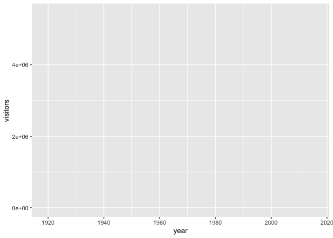
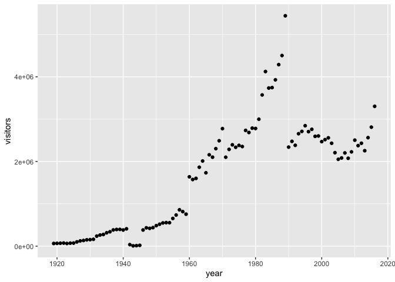
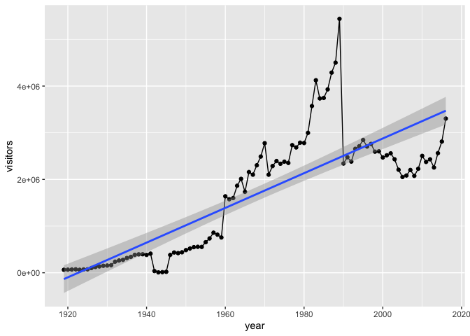
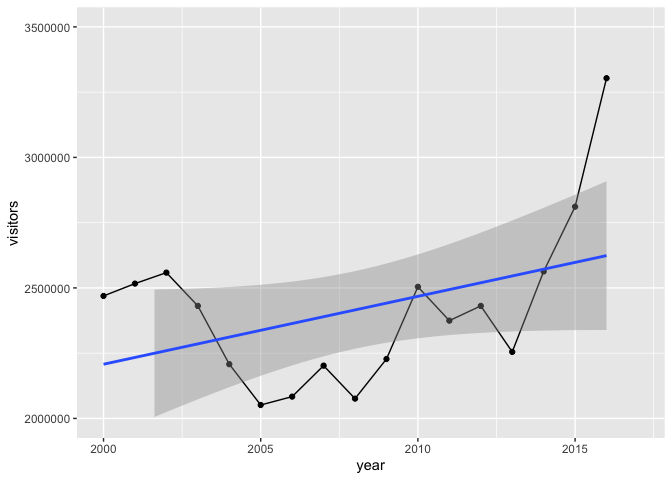
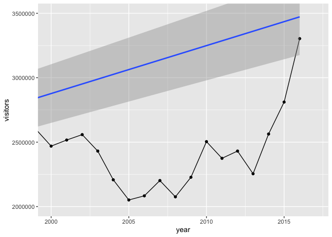
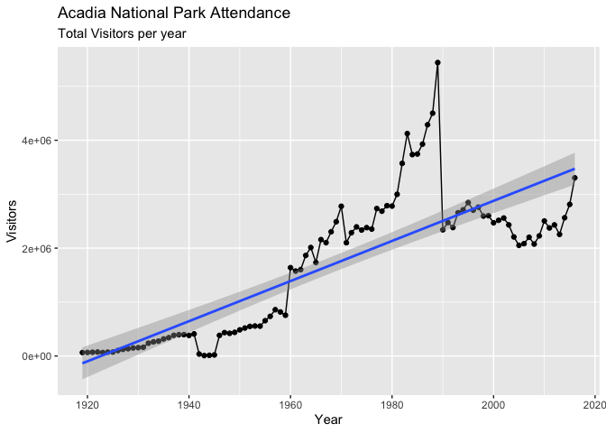
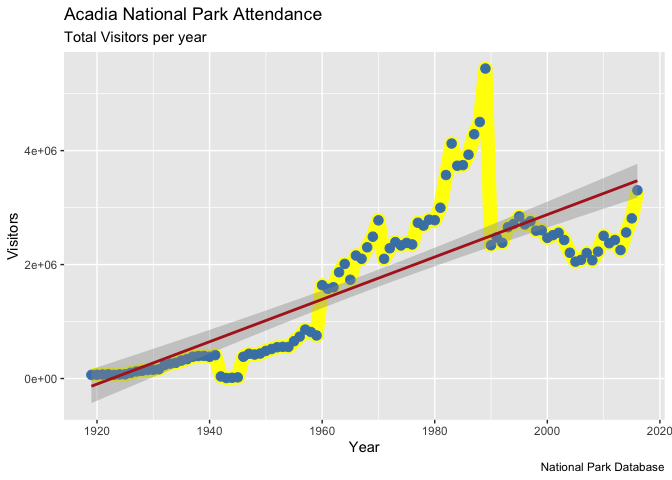

Week3 - ggplot2
================

### Quick tutorial - Correlation Plots

Correlation plots show correlation coefficients across variables. For
example, we expect shortwave radiation and temperature to have high a
high correlation coefficient because generally speaking when the a lot
of sunlight is received at the surface, temperature increases. There’s a
handy package called `corrplot` that caluclates correlation coefficients
quickly and intuitively. We’ll need to install this package and run our
dataframe through it. One last thing…we’ll need to calculate the
residual values - that is the distance between actual data and the
trendline. It’s another way to express error. For this quick tutorial,
let’s use the Willow Creek meteorology data we were just using.

``` r
library(corrplot)
```

    ## corrplot 0.84 loaded

``` r
library(lubridate) # might need to install lubridate
```

    ## 
    ## Attaching package: 'lubridate'

    ## The following object is masked from 'package:base':
    ## 
    ##     date

``` r
library(ncdf4)
y = 2010
nc_file = nc_open(paste0("/Users/james/Documents/Github/geog473-673/datasets/WCr_1hr.", y,".nc"))
# what does the nc file look like 
var_names = names(nc_file$var)
wcr_data = list()
dim <- nc_file$dim
for (v in seq_along(var_names)){
  wcr_data[[v]] = ncvar_get(nc_file, varid = var_names[v])
}
wcreek_df = data.frame(wcr_data)
colnames(wcreek_df) = var_names

date.seq = seq(as.POSIXct(paste0(y,"-01-01 00:00:00")), as.POSIXct(paste0(y,"-12-31 23:00:00")), by="hour")
# everything is the same as before, but HERE is where things change a little...
# instead of plugging in the datetimes into the data frame, we need to plug in a numeric. Since a datetime
# is a "POSIXct" class, the correlation matrix function won't know how to handle it. We need a NUMERIC value for this.
# for now, let's just choose our "date" label to be in the form of day-of-year
days = yday(date.seq) # use lubridates yday function, returns a NUMERIC value
wcreek_df['day_of_year'] = days
summary(wcreek_df)
```

    ##  air_temperature air_temperature_max air_temperature_min
    ##  Min.   :248.4   Min.   :248.5       Min.   :248.2      
    ##  1st Qu.:270.5   1st Qu.:270.6       1st Qu.:270.4      
    ##  Median :280.9   Median :281.1       Median :280.7      
    ##  Mean   :279.8   Mean   :280.0       Mean   :279.6      
    ##  3rd Qu.:289.4   3rd Qu.:289.6       3rd Qu.:289.3      
    ##  Max.   :304.0   Max.   :304.0       Max.   :304.0      
    ##  surface_downwelling_longwave_flux_in_air  air_pressure  
    ##  Min.   :139.7                            Min.   :91108  
    ##  1st Qu.:263.0                            1st Qu.:94818  
    ##  Median :301.7                            Median :95236  
    ##  Mean   :304.7                            Mean   :95191  
    ##  3rd Qu.:351.6                            3rd Qu.:95650  
    ##  Max.   :444.1                            Max.   :96918  
    ##  surface_downwelling_shortwave_flux_in_air eastward_wind     
    ##  Min.   :   0.00                           Min.   :-10.6414  
    ##  1st Qu.:   0.00                           1st Qu.: -1.7298  
    ##  Median :   0.00                           Median : -0.2718  
    ##  Mean   :  78.04                           Mean   : -0.2817  
    ##  3rd Qu.:  12.62                           3rd Qu.:  1.2213  
    ##  Max.   :1045.39                           Max.   : 13.7162  
    ##  northward_wind     specific_humidity   precipitation_flux   day_of_year 
    ##  Min.   :-12.3305   Min.   :0.0001864   Min.   :0.000e+00   Min.   :  1  
    ##  1st Qu.: -1.5300   1st Qu.:0.0025622   1st Qu.:0.000e+00   1st Qu.: 92  
    ##  Median : -0.2183   Median :0.0051646   Median :0.000e+00   Median :183  
    ##  Mean   : -0.1984   Mean   :0.0065146   Mean   :2.564e-05   Mean   :183  
    ##  3rd Qu.:  1.0876   3rd Qu.:0.0100803   3rd Qu.:0.000e+00   3rd Qu.:274  
    ##  Max.   :  6.5341   Max.   :0.0258134   Max.   :9.102e-03   Max.   :365

``` r
# awesome, now let's calculate the correlation coefficients
cor_wcreek = cor(wcreek_df)
head(cor_wcreek)
```

    ##                                           air_temperature air_temperature_max
    ## air_temperature                                 1.0000000           0.9998053
    ## air_temperature_max                             0.9998053           1.0000000
    ## air_temperature_min                             0.9998039           0.9992183
    ## surface_downwelling_longwave_flux_in_air        0.8200776           0.8177929
    ## air_pressure                                   -0.1622930          -0.1608531
    ## surface_downwelling_shortwave_flux_in_air       0.3566847           0.3555227
    ##                                           air_temperature_min
    ## air_temperature                                     0.9998039
    ## air_temperature_max                                 0.9992183
    ## air_temperature_min                                 1.0000000
    ## surface_downwelling_longwave_flux_in_air            0.8220495
    ## air_pressure                                       -0.1636746
    ## surface_downwelling_shortwave_flux_in_air           0.3577112
    ##                                           surface_downwelling_longwave_flux_in_air
    ## air_temperature                                                          0.8200776
    ## air_temperature_max                                                      0.8177929
    ## air_temperature_min                                                      0.8220495
    ## surface_downwelling_longwave_flux_in_air                                 1.0000000
    ## air_pressure                                                            -0.2955767
    ## surface_downwelling_shortwave_flux_in_air                                0.2705901
    ##                                           air_pressure
    ## air_temperature                            -0.16229303
    ## air_temperature_max                        -0.16085314
    ## air_temperature_min                        -0.16367456
    ## surface_downwelling_longwave_flux_in_air   -0.29557674
    ## air_pressure                                1.00000000
    ## surface_downwelling_shortwave_flux_in_air   0.02962979
    ##                                           surface_downwelling_shortwave_flux_in_air
    ## air_temperature                                                          0.35668470
    ## air_temperature_max                                                      0.35552272
    ## air_temperature_min                                                      0.35771119
    ## surface_downwelling_longwave_flux_in_air                                 0.27059006
    ## air_pressure                                                             0.02962979
    ## surface_downwelling_shortwave_flux_in_air                                1.00000000
    ##                                           eastward_wind northward_wind
    ## air_temperature                             -0.35196115     0.07174053
    ## air_temperature_max                         -0.35195936     0.07146779
    ## air_temperature_min                         -0.35182514     0.07198617
    ## surface_downwelling_longwave_flux_in_air    -0.29876208     0.09322482
    ## air_pressure                                 0.22972978     0.03904779
    ## surface_downwelling_shortwave_flux_in_air   -0.07181433    -0.11448984
    ##                                           specific_humidity precipitation_flux
    ## air_temperature                                   0.9064799         0.08391199
    ## air_temperature_max                               0.9056241         0.08342905
    ## air_temperature_min                               0.9069838         0.08436382
    ## surface_downwelling_longwave_flux_in_air          0.8416941         0.14016558
    ## air_pressure                                     -0.1628097        -0.09972888
    ## surface_downwelling_shortwave_flux_in_air         0.2681873        -0.02659980
    ##                                           day_of_year
    ## air_temperature                            0.13092138
    ## air_temperature_max                        0.12969058
    ## air_temperature_min                        0.13210535
    ## surface_downwelling_longwave_flux_in_air   0.19921975
    ## air_pressure                              -0.05711546
    ## surface_downwelling_shortwave_flux_in_air -0.03776747

``` r
# now let's calculate the residuals of the correlations with a 95% confidence interval
residuals_1 <- cor.mtest(wcreek_df, conf.level = .95)
# now let's plot this up. 
corrplot(cor_wcreek, p.mat = residuals_1$p, method = 'color', number.cex = .7, type = 'lower',
         addCoef.col = "black", # Add coefficient of correlation
         tl.col = "black", tl.srt = 90, # Text label color and rotation
         # Combine with significance
         sig.level = 0.05, insig = "blank")
```

<!-- -->

# ggplot2

So far, we’ve only used `base graphics` plotting routines. While there
are endless customizations and schemes that can be used to generate
publiation quality material, many advanced R programmers use `ggplot2`
to create plots. `ggplot2` is a go-to plotting package and can do all
that `base graphics` can do. So what’s so different about it? Well,
`ggplot2` is designed to work with `dataframes`, rather than individual
`vectors`. `ggplot2` also has more aesthetic options that allow for more
visually unique & pleasing plots. The first thing you’ll notice about
`ggplot2` is that the syntax is different. Instead of coding all
customizations through arguments or additional functions with the
`add=TRUE` option keyed in, `ggplot2` uses `+` to add in extra layers to
a plot. This may seem weird at first, but the longer you spend with it
the more regular it will seem.

``` r
library(ggplot2)
# load in a dataset - https://github.com/jsimkins2/geog473-673/blob/master/datasets/acadia.csv
acadia = read.csv("/Users/james/Documents/Github/geog473-673/datasets/acadia.csv")
# list the top rows of acadia
head(acadia)
```

    ##   X region state code            park_name          type visitors year
    ## 1 1     NE    ME ACAD Acadia National Park National Park    64000 1919
    ## 2 2     NE    ME ACAD Acadia National Park National Park    66500 1920
    ## 3 3     NE    ME ACAD Acadia National Park National Park    69836 1921
    ## 4 4     NE    ME ACAD Acadia National Park National Park    73779 1922
    ## 5 5     NE    ME ACAD Acadia National Park National Park    64200 1923
    ## 6 6     NE    ME ACAD Acadia National Park National Park    71758 1924

``` r
# remove the X column, it's just a duplicate index
acadia$X = NULL
# Initialize Ggplot
ggplot(acadia, aes(x=year, y=visitors))  # year and visitors are columns in acadia dataframe, aes() stands for aesthetics
```

<!-- -->

``` r
# simple scatter plot
ggplot(acadia, aes(x=year, y=visitors)) + geom_point()
```

<!-- -->

``` r
# simple line plot
ggplot(acadia, aes(x=year, y=visitors)) + geom_line()
```

<!-- -->

``` r
# remember the trendline? here is how easy it is to add with ggplot2
ggplot(acadia, aes(x=year, y=visitors)) + geom_point() + geom_smooth(method="lm")
```

<!-- -->

Notice above how `ggplot()` creates a ggplot plot, but the
`geom_point()` or `geom_line()` add the data to the plot. This is a key
difference between `base graphics` and `ggplot2`. Also notice how you
add what you want to the plot via the `+` symbol. Since the `aes()`
(aesthetics) axes are already defined and since the `acadia` dataframe
has been set, the functions `geom_point()` and `geom_line()` already
know what data to add to the plots based on the dataset, x and y axes.

Another cool thing about ggplot2() is that we can save a plot as an
object and accumuatively add things to
it

``` r
g = ggplot(acadia, aes(x=year, y=visitors)) + geom_point() + geom_smooth(method="lm")
plot(g)
```

<!-- -->

``` r
# technically, we don't even have to say plot(g)...we can just print it and it will plot!
g = ggplot(acadia, aes(x=year, y=visitors))
g = g + geom_point()
g = g + geom_line()
g = g + geom_smooth(method="lm")
g
```

<!-- -->

We can “crop” out areas of a plot - note this deletes
points

``` r
g = ggplot(acadia, aes(x=year, y=visitors)) + geom_point() + geom_line() + geom_smooth(method="lm")
g + xlim(c(2000,2017)) + ylim(c(2000000, 3500000))  # x axis years 2000 to 2017, ylimit 2000000 to 3500000
```

    ## Warning: Removed 81 rows containing non-finite values (stat_smooth).

    ## Warning: Removed 81 rows containing missing values (geom_point).

    ## Warning: Removed 81 rows containing missing values (geom_path).

<!-- -->

Instead of cropping out, we can also just zoom in - which doesn’t delete
points

``` r
g = ggplot(acadia, aes(x=year, y=visitors)) + geom_point() + geom_line() + geom_smooth(method="lm")
g + coord_cartesian(xlim=c(2000,2017), ylim = c(2000000, 3500000))  # x axis years 2000 to 2017, ylimit 2000000 to 3500000
```

<!-- -->

Notice how different the trendline is above\!\!\! When we just zoom in,
we preserve all of the data going into the plot which helps us keep the
trendline of the entire dataset.

Now let’s check out adjusting the x/y labels and title. There are 2
ways.

``` r
# Add Title and Labels
g1 = ggplot(acadia, aes(x=year, y=visitors)) + geom_point() + geom_line() + geom_smooth(method="lm")
g1 + labs(title="Acadia National Park Attendance", subtitle="Total Visitors per year", y="Visitors", x="Year", caption="National Park Database")
```

<!-- -->

``` r
# or
g2 = ggplot(acadia, aes(x=year, y=visitors)) + geom_point() + geom_line() + geom_smooth(method="lm")
g2 = g2 + ggtitle("Acadia National Park Attendance", subtitle="Total Visitors per year")
g2 + xlab("Year") + ylab("Visitors")
```

<!-- -->

What about changing up the colors, size, etc.?

``` r
g = ggplot(acadia, aes(x=year, y=visitors)) +
    geom_line(col="yellow", size=5) + 
    geom_point(col="steelblue", size=3) + 
    geom_smooth(method="lm", col="firebrick") +
    labs(title="Acadia National Park Attendance", subtitle="Total Visitors per year", y="Visitors", x="Year", caption="National Park Database")

g
```

<!-- -->

## Density Plots

Remember density plots from last week? They look better in ggplot2…

``` r
library(ncdf4)
y = 2010
nc_file = nc_open(paste0("/Users/james/Documents/Github/geog473-673/datasets/WCr_1hr.", y,".nc"))
# what does the nc file look like 
var_names = names(nc_file$var)
wcr_data = list()
dim <- nc_file$dim
for (v in seq_along(var_names)){
  wcr_data[[v]] = ncvar_get(nc_file, varid = var_names[v])
}
wcreek_df = data.frame(wcr_data)
colnames(wcreek_df) = var_names

# now plot
ggplot(wcreek_df) + 
  geom_density(data = wcreek_df, aes(x=specific_humidity, y=..density.., color = 'Specific Humidity'), size=3, adjust = 1, fill="lightblue", alpha = 0.5) + 
  xlab("Specific Humidity") + 
  ggtitle("Gaussian Specific Humidity Densities 2010") + 
  scale_color_manual(values = c('Specific Humidity' = 'firebrick')) +
  scale_shape_manual(labels = c("Specific Humidity"), values = c(1))
```

<!-- -->

Let’s break this down. I created a `ggplot` plot of `wcreek_df`. I
called the `geom_density` function and declared my `data` and my `aes`
specifications which included my x axis - `specific humidity` - and my y
axis - `..density..` - which is necessary for the plot to know that’s
the axes you want density on. The final piece to the `aes()` argument is
the color. I set the color of the line equal to `Specific Humidity`
which ggplot recognizes as `firebrick` because of the
`scale_color_manual` values I entered below. I set the `size` of the
density line, set the `adjust` which is just ggplots name for bandwidth,
declared a fill color to `fill` in the density area and gave that fill
color an `alpha` of 0.5 to make it semi-transparent. Xlabel and title
we’ve already covered. Finally I set a manual color label and shape of
the label for specific humidity.

## Assignment:

Using the WCr\_1hr.2012.nc found in the datasets folder, complete the
following:

1.  Using `ggplot2`, create an `geom_line` plot of `air_temperature`.
    **Zoom in** to the first half of the year. Be Sure to include
    trendline and includes appropriate titles, axes, labels, etc.

2.  Using `ggplot2`, create a density plot of `air temperature` with
    appropriate titles, axes, legend etc.

3.  Submit plots to assignment 3 on canvas

Your final plots should look something like
these…

<!-- --><!-- -->

## Extra Credit - 2.5 Points \!\!\!

Using the WCr\_1hr.2010.nc, WCr\_1hr.2011.nc and WCr\_1hr.2012.nc found
in the datasets folder, complete the following

1)  Create a density plot using ggplot2 of “Air temperature” with each
    year being a component of the density plot (adding each year to the
    density plot as you loop through the data). Adjust alpha settings,
    colors, linetypes, etc. to make each line extinct.
2)  Submit to assignment above labeled ‘extra\_credit.png’ - **also
    submit your code**.

## EXTRA, EXTRA CREDIT - 2.5 Points \!\!\!

Make the same plot as the extra credit plot above but include 2 smaller,
zoomed in plots on the same image that highlight the tails of the
distributions. Submit image (large image) AND code.
