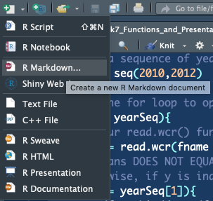
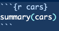
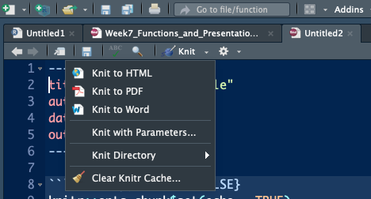

```{r setup, include=FALSE}
knitr::opts_chunk$set(echo = TRUE)
```

This week we are going to focus up on some formal work with R - creating your own functions and displaying R code & results in a fancy style. Functions are important for code speed and documentation. Presenting R code is important if you need to explain how to do something using R (this is how I create a tutorial). We'll start by explaining functions and going through an example. Afterwards, we'll show how RMarkdown works so you can explain how fancy this function of yours really is. 

# Functions
We create functions to speed up and organize code. So far, we've only been coding things via scripting and occasionally using for loops. While this is fine, it's slower than writing functions would be. Writing or creating functions is considered much cleaner and more *proper*. As a recap, whenever we use the phrase `library(ncdf4)` we are loading the `ncdf4` package. Within that package are a number of `.R` scripts/files that contain functions that someone has been kind enough to write to save us time. By using `library(ncdf4)`, R reads in all of those functions and thus knows what we want when we execute a function like `nc_open()`. Instead of re-writing `nc_open()` over and over again every time we want to open a netcdf file, we are able to just load the function. We're going to write a function today to save us time loading netcdf files.

### Back to Willow Creek, WI
Loading in all of the weather data from Willow Creek, WI is cumbersome. Let's write a function that reads in the data and converts everything to a dataframe for us. 

#### My Read Willow Creek Data function

```{r}
library(ncdf4)
read.wcr = function(fname) {
  fullname = strsplit(fname, "/")
  dataset_str = fullname[[1]][length(fullname[[1]])]
  datname = strsplit(dataset_str, "_")[[1]][1]
  data.year = substr(dataset_str, nchar(dataset_str)-6, nchar(dataset_str)-3)
  data.date = seq(from=as.POSIXct(paste0(data.year,"-1-1 0:00", tz="UTC")),to=as.POSIXct(paste0(data.year,"-12-31 23:00", tz="UTC")),by="hour")
  vars.info <- data.frame(CF.name = c("date", "air_temperature", "precipitation_flux", "surface_downwelling_shortwave_flux_in_air",
                                      "specific_humidity", "surface_downwelling_longwave_flux_in_air", "air_pressure",
                                      "eastward_wind", "northward_wind", "wind_speed"))
  df <- list()
  tem <- ncdf4::nc_open(fname)
  dim <- tem$dim
  for (j in seq_along(vars.info$CF.name)) {
    if (exists(as.character(vars.info$CF.name[j]), tem$var)) {
      df[[j]] <- ncdf4::ncvar_get(tem, as.character(vars.info$CF.name[j]))
    } else {
      df[[j]] = NA
    }
  }
  names(df) <- vars.info$CF.name
  df <- data.frame(df)
  nc_close(tem)
  if(all(is.na(df$date))){
    df$date = data.date
  }
  if(all(is.na(df$wind_speed))){
    df$wind_speed = sqrt(df$eastward_wind^2 + df$northward_wind^2)
  }
  return(df)
}
```
#### What if all means...
Above is our function in all it's glory. All we're doing is reading a netCDF file that we know the structure of (and it's variables). The syntax is very similar to that of a for loop. `read.wcr` is our function name, the `function()` command tells R we're declaring a function. `fname` is one of the arguments that the function takes. For example, the function what we use for opening netCDF files - `nc_open()` has the following arguments...

`nc_open( filename, write=FALSE, readunlim=TRUE, verbose=FALSE, 
 	auto_GMT=TRUE, suppress_dimvals=FALSE )`
 	
The function I've coded above only takes the filename, but if our routine was more complex we could add more arguments in. Once the argument is taken in, we **generalize** naming schemes that are unimportant. Notice how I use object names like `tem` for example. This is short for temporary, and is set up to be overwritten if we were to use this function within a for loop to open multiple files. There's also some extra bits down at the bottom where we calculate wind speed from eastward and northward wind components **if** the entire data frame of `wind_speed` is null. AKA, if we tell R to get the `wind_speed` variable but it doesn't exist, then it will just return *NA* for each value for that variable. This is nice to have given the case where some files have a variable and others don't.

Finally, focus in on the `return(df)` line. This is what the function spits back out. We can put whatever we want here. For example, let's write a function like so...

```{r}

xfunc = function(){
  statement = "I put the fun in functions"
  return(statement)
}

xfunc()
```

`return` is what we get out of a function. Now, let's actually use the `read.wcr()` function we wrote above. 

```{r}
wcr_df = read.wcr(fname = "~/Documents/Github/geog473-673/datasets/WCr_1hr.2010.nc")

summary(wcr_df)
```

It's as simple as that...This is why programming becomes a black box and why we don't always look under the hood. We don't need to. Once we write a function that works as nicely as this, we don't need to go back to said function until it breaks for some reason. Programmers are lazy. The better programmer you are, the lazier you can become. Why make things harder than they have to be?

Let's set up a for loop for this to show how we might read in all 3 years of data. We're going to use the `rbind()` function to latch on extra data here.

#### Use the function in a for loop

```{r}

# create a sequence of years for the years we have data
yearSeq = seq(2010,2012)

# begin the for loop to open each year of data
for (y in yearSeq){
  # use our read.wcr() function and paste in the filename that changes for each year of data
  tem_df = read.wcr(fname = paste0("~/Documents/Github/geog473-673/datasets/WCr_1hr.",y,".nc"))
  # != means DOES NOT EQUAL. This statement reads as - if y DOES NOT EQUAL the first year in yearSeq, proceed to use rbind
  # otherwise, if y is indeed the first year in yearSeq, we need to initialize wcr_df BEFORE we overwrite tem_df
  if (y != yearSeq[1]){
    wcr_df = rbind(wcr_df, tem_df)
  } else {
    wcr_df = tem_df
  }
}

length(wcr_df$date)
summary(wcr_df)
```

`!=` means DOES NOT EQUAL. The `!` means DOES NOT. This statement reads as - if `y` DOES NOT EQUAL the first year in `yearSeq`, proceed to use `rbind()`. Otherwise, if `y` is indeed the first year in `yearSeq`, we need to initialize `wcr_df` BEFORE we overwrite `tem_df`

I have this in the commented sections, but felt it was worth repeating. Anyway, based on the summary we see that we have successfully merged the 3 datasets into one continuous dataset. Since we defined the function above, we don't need to make a messy for loop with all of the function bits in it. Functions speed up our program and also make for more sophisticated coding. 


## RMarkdown
Code is often messy and difficult to explain. Sharing code with numerous comments is fine, but if you really want to explain how your code is working and make it look good you'll want to use RMarkdown. This is how I create the tutorials that you use for my classes. RMarkdown is a combination of HTML like syntax with R. Here is how you make an RMarkdown document.

- Open a new RMarkdown document

```{r, echo=FALSE}

```

- Enter in details

```{r, echo=FALSE}
knitr::include_graphics("../documents/images/rmd2.png")
```

- It should look something like this

```{r, echo=FALSE}
knitr::include_graphics("../documents/images/rmd3.png")
```

- Enter R code into the `{r}` section

```{r, echo=FALSE}

```

- Add any additional text you might like
- Knit the RMarkdown file to a PDF

```{r, echo=FALSE}

```

Et Voila! There you have it, a professional looking RMarkdown PDF that makes your R code prettier. 

Here's what it should look like - https://github.com/jsimkins2/geog473-673/tree/master/Advanced_R/rmdtest.pdf


# Assignment

Create a function that extracts and plots a spatial dataset given a time range. Follow the steps below:

1) Choose an online dataset like we did last week.
2) Create a function that extracts the data given a time range, creates a data frame and plots the dataset. 
3) Include arguments within the function such as time range, spatial extents, etc. 
4) Create an RMarkdown PDF that details how the function works.
5) Include an example of the function working to plot the given dataset 
6) Submit resulting PDF to Canvas week 7 assignment

## Extra Credit!! 3 Points

Turn your above images into a GIF of at least 4 iamges. Here's a quick example on how one might do this...

https://jarrettmeyer.com/2018/11/20/creating-animated-gif-r

But it is one of many ways to do this...