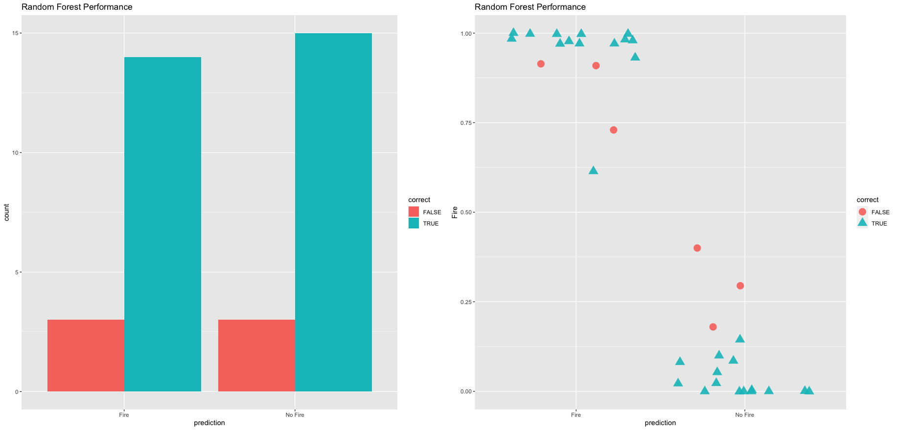

# Random Forest Modeling

```{r, echo=FALSE, out.width="70%", fig.align="center"}
  
```

In this tutorial, we'll explore feature engineering, training and test splitting, and model selecting with random forests. We'll introduce the `caret` package, a popular R package with machine learning tools. The dataset we'll be using is called `Bejaia_ForestFires.csv` and contains information regarding forest fire conditions in Algeria. We are going to use machine learning practices to extract trends from the dataset and attempt to predict whether a forest fire will occur on a particular day given environmental conditions. Here are the variables within the dataset:

**Weather Observations**

Date 
: Day, month ('june' to 'september') for the year 2012

Temp 
: Max daily temperature in degrees Celsius: 22 to 42

RH 
: Relative Humidity in %: 21 to 90

Ws 
: Wind speed in km/h: 6 to 29

Rain
: Total daily precip in mm: 0 to 16.8

**Fire Weather Indices**

FFMC 
: Fine Fuel Moisture Code index from the FWI system: 28.6 to 92.5

DMC 
: Duff Moisture Code index from the FWI system: 1.1 to 65.9

DC 
: Drought Code index from the FWI system: 7 to 220.4

ISI 
: Initial Spread Index from the FWI system: 0 to 18.5

BUI 
: Buildup Index from the FWI system: 1.1 to 68

FWI 
: Class Weather Index : 0 to 31.1

**Class Component**

: Class : Whether or not a Forest Fire was present on that day


## Prepare the Data

The `Bejaia_ForestFires.csv` dataset is located in the course datasets folder. Let's open it and plot the Forest Fire presence/absence (the `Class` variable). 

```{r, warning=FALSE, message=FALSE, out.width="50%", fig.align="center"}
library(ggplot2)
library(tibble)
ff_data = read.csv("/Users/james/Documents/Github/geog473-673/datasets/Bejaia_ForestFires.csv")
ff_data = as.tibble(ff_data)
# response variable used for classification
ggplot(ff_data, aes(x = Class, fill = Class)) +
  geom_bar()
```

Now, let's use the `gather` function from the `tidyverse` to evaluate each variable against the Class (aka Fire or No Fire). Once we have our `gathered` data frame, let's show a density plot for each variable.

```{r, warning=FALSE, message=FALSE, out.width="80%", fig.align="center"}
library(tidyverse)
gathered = gather(ff_data, x, y, day:FWI)

ggplot(data = gathered, aes(x = y, color = Class, fill = Class)) +
    geom_density(alpha = 0.3) +
    facet_wrap( ~ x, scales = "free", ncol = 3)
```

## Dimensionality Reduction

Sometimes datasets contain too many variables and evaluating which are important can be difficult. Fortunately, there are statistical methods we can use in R to reduce the number of dimensions to retain only the high impact variables. 

### Principal Component Analysis

Principal Component Analysis (PCA) is a popular statistical method that uses correlations and covariances between variables to reduce data that contains *many* variables. PCA projects the data with fewer dimensions (aka the principal components) using linear combinations across the dataset variables. The dimensions (principal components) are ordered from most explained variance to least explained variance (of the original variables). Principal component analysis can also reveal important features of the data such as outliers and departures from a multinormal distribution. First, we'll need to cut out the Fire Weather Indices of our dataset. These are calculated based on environmental conditions and are used to help predict forest fires. We're going to remove these and attempt to create new methods for predicting whether there will be a forest fire or not.

```{r, warning=FALSE, message=FALSE, out.width="50%", fig.align="center"}
library(ellipse)

# create dataframe with only weather variables - turn Class variable into a factor then turn it into numeric so we can run prcomp
cutdata = data.frame(Temperature = ff_data$Temperature, Rain = ff_data$Rain, RH = ff_data$RH, Ws = ff_data$Ws, Class = as.numeric(as.factor(ff_data$Class)))
head(cutdata)

# perform pca using prcomp and extract scores 
pcaOutput <- prcomp(as.matrix(cutdata), scale = TRUE, center = TRUE)
pcaOutput

# create separate dataframe
pcaOutput2 <- as.data.frame(pcaOutput$x)
  
# add Class as variable for the groups
pcaOutput2$groups <- ff_data$Class 

# calculate centroids of PC1 and PC2
centroids <- aggregate(cbind(PC1, PC2) ~ groups, pcaOutput2, mean)

# calculate 95% confidence ellipsoids so we can plot these polygons over ggplot
conf.rgn  <- do.call(rbind, lapply(unique(pcaOutput2$groups), function(t)
  data.frame(groups = as.character(t),
             ellipse(cov(pcaOutput2[pcaOutput2$groups == t, 1:2]),
                   centre = as.matrix(centroids[centroids$groups == t, 2:3]),
                   level = 0.95),
             stringsAsFactors = FALSE)))

# Plot PC1 and PC2
ggplot(data = pcaOutput2, aes(x = PC1, y = PC2, group = as.factor(groups), color = as.factor(groups))) + 
    geom_polygon(data = conf.rgn, aes(fill = groups), alpha = 0.2) +
    geom_point(size = 2, alpha = 0.6) + 
  labs(title = "Principal Component Analysis of Bejaia Forest Fires: PC1 and PC2")


```


### t-SNE Dimensionality Reduction

TSNE Dimensionality Reduction removes redundant information and preserves high impact information within a dataset. TSNE is similar to PCA with the main difference being that TSNE retains nonlinear variance. First, we'll calculate a proximity matrix of our `ff_data` dataframe using the `dist` function. This function will calculate the relative distances (euclidean) between the rows of the dataset. Then, we'll use the `tsne` function from the `tsne` package. 

```{r, warning=FALSE, message=FALSE, out.width="50%", fig.align="center"}
library(tsne)

sne_data = dist(ff_data)
sne_data = tsne(sne_data)
sne_data = as.data.frame(sne_data)
sne_data$Class = ff_data$Class

ggplot(data = sne_data, aes(x = V1, y = V2, color = group)) +
    geom_point()

```

### Multidimensional Scaling

Multidimensional scaling (MDS) is a technique that creates a map displaying the relative positions of a number of objects, given only a table of the distances between them. It flows similarly to TSNE in R but instead of using `tsne` we'll be using `cmdscale` to perform classical multidimensional scaling based on the proximity matrix.

```{r, warning=FALSE, message=FALSE, out.width="50%", fig.align="center"}
# create proximity matrix
prox = dist(ff_data)
# perform mds
m_scale = cmdscale(prox)
m_scale = as.data.frame(m_scale)
# add the class variable back in
m_scale$Class = ff_data$Class

# plot
ggplot(data = m_scale,aes(x = V1, y = V2, color = Class)) +
    geom_point() +
  labs(title = 'Multidimensional Scaling of Bejaia Forest Fire Data')


```


## Random Forests

Random Forest is a machine learning method for classification or regression predictions. These predictions are based on the generation of multiple decision trees trees. Decision trees serve as the building block for random forests. The `caret` package is a popular machine learning package in R that can be used to create random forest models. Our goal is to create a random forest model that predicts the presence/absence of a forest fire given environmental conditions. 

### Decision Trees

Classification in R can be done using the `rpart` and `rpart.plot` packages. These can be used to calculate and show decision trees (aka classification trees) for a given scenario. In our case, we'll calculate and plot the decision tree for whether or not there is a forest fire. Before we proceed, when we calculate random values going into a model in R, it's good practice to use the `set.seed()` function. The `set.seed()` function sets the starting number used to generate a sequence of random numbers – it ensures that you get the same result if you start with that same seed each time you run the same process. 

```{r, warning=FALSE, message=FALSE, out.width="50%", fig.align="center"}
library(rpart)
library(rpart.plot)
library(caret)

# cut the data but htis time preserve 'Fire' and 'No Fire' characters of the ff_data$Class
cutdata = data.frame(Temperature = ff_data$Temperature, Rain = ff_data$Rain, RH = ff_data$RH, Ws = ff_data$Ws, Class = ff_data$Class)
cutdata$Class = as.factor(cutdata$Class)

# now that it's a factor, we need to redefine the levels again
levels(cutdata$Class) = c("Fire", "No Fire")

# set the seed
set.seed(42)
# calculate the rpart model
fit <- rpart(Class ~ .,
            data = cutdata,
            method = "class",
            control = rpart.control(xval = 10, 
                                    minbucket = 2, 
                                    cp = 0), 
             parms = list(split = "information"))

# plot the fit!
rpart.plot(fit, extra = 100)

```

### Data Partition

The goal of this exercise is to predict the presence/absence of a forest fire given environmental conditions. We'll need to provide the model with a training dataset to learn from and a test dataset to test itself against. This can be done using `createDataPartition` from the `caret` package. Then, let's calculate a correlation matrix  using `corrplot`. 

```{r, warning=FALSE, message=FALSE, out.width="50%", fig.align="center"}
# set the seed
set.seed(42)
# create test and train datasets
index <- createDataPartition(as.factor(cutdata$Class), p = 0.7, list = FALSE)
train_data <- cutdata[index, ]
test_data  <- cutdata[-index, ]

library(corrplot)

# calculate correlation matrix
num_train_data = train_data
num_train_data$Class = as.numeric(num_train_data$Class)
corMatMy <- cor(num_train_data)
corrplot(corMatMy, order = "hclust")


highlyCor <- colnames(train_data)[findCorrelation(corMatMy, cutoff = 0.7, verbose = TRUE)]


```

### Training the Model

Now, let's use our training dataset to train a model using random forest methods. Remember, we're training our model to predict the `Class` variable (i.e. Fire vs No Fire) based on the other variables (temperature, relative humidity, etc.)

```{r, warning=FALSE, message=FALSE, out.width="50%", fig.align="center"}
# set the seed
set.seed(42)

# create the model
model_rf <- caret::train(Class ~ .,
                         data = train_data,
                         method = "rf",
                         preProcess = c("scale", "center"),
                         trControl = trainControl(method = "repeatedcv", 
                                                  number = 5, 
                                                  repeats = 3, 
                                                  savePredictions = TRUE, 
                                                  verboseIter = FALSE))

# print the random forest model output 
model_rf

# print out the confusion matrix 
model_rf$finalModel$confusion

# plot variable importance of the model
importance <- varImp(model_rf, scale = TRUE)
plot(importance)

```

Rain is the most important variable for the presence/absence of forest fires. Relative Humidity and Temperature carry importance but not as much as Rain. Wind Speed doesn't seem to be all that important. 

### Testing the Model

In order to test our Random Forest model, `model_rf`, we'll need to use a confusion matrix. A Confusion matrix is a matrix used for evaluating the performance of a classification model. The matrix compares the actual target values (the testing data class) with those predicted by `model_rf`. This gives us a holistic view of how well our random forest model is performing and shows what kinds of errors it is making. After we get some statistics from the confusino matrix, well need to run the model using the `predict` function on the `test_data`. 

```{r, warning=FALSE, message=FALSE, out.width="50%", fig.align="center"}
# Calculate the confusion matrix
confusionMatrix(predict(model_rf, test_data), as.factor(test_data$Class))

# Predict the model 
results <- data.frame(actual = test_data$Class,
                      predict(model_rf, test_data, type = "prob"))

# rename the variables/columns
names(results) = c('actual', 'Fire', 'No.Fire')

# declare fire vs no fire based on probabilities
results$prediction <- ifelse(results$Fire > 0.5, "Fire",
                             ifelse(results$No.Fire > 0.5, "No Fire", NA))

# declare whether the model was right or wrong (true or false)
results$correct <- ifelse(results$actual == results$prediction, TRUE, FALSE)

# plot the results
ggplot(results, aes(x = prediction, fill = correct)) +
  geom_bar(position = "dodge") + 
  labs(title = "Random Forest Performance", xlab = "Prediction")

# plot thhe results using geom_jitter
ggplot(results, aes(x = prediction, y = Fire, color = correct, shape = correct)) +
  geom_jitter(size = 3, alpha = 0.9) + 
  labs(title = "Random Forest Performance", xlab = "Prediction")

```

### Hyperparameter Tuning

Models like the random forest model we constructed above are built based on the predictor variables. Model parameters are constructed *based* on these variables, although hyperparameters are not model parameters and they cannot be directly trained from the data. Model parameters are learned during training when we optimize a loss function.  Sometimes, the construction of the architecture (i.e. format of a decision tree) may not be optimal. The act of finding the optimal model archicture is called hyperparameter tuning. We can tune our model by applying a `tuneGrid` argument with the `caret::train()` function. Our `tuneGrid` will be defined by `mtry` : The number of variables randomly sampled as candidates at each split.

```{r, warning=FALSE, message=FALSE, out.width="50%", fig.align="center"}
# plot the original model
plot(model_rf)

# create hyperparameter grid
set.seed(42)
grid <- expand.grid(mtry = c(1:10))

model_rf_tune_man <- caret::train(Class ~ .,
                         data = train_data,
                         method = "rf",
                         preProcess = c("scale", "center"),
                         trControl = trainControl(method = "repeatedcv", 
                                                  number = 10, 
                                                  repeats = 10, 
                                                  savePredictions = TRUE, 
                                                  verboseIter = FALSE),
                         tuneGrid = grid)

model_rf_tune_man
plot(model_rf_tune_man)

```

Notice hoe many more predictors we get. Our dataset is not the best example for this practice because our dataset only has a handful of predictors. However, The search of the `tuneGrid` function above is not random by default. Let's perform a random search of the tuning parmaeters and provide a `tuneLength` -  An integer denoting the amount of granularity in the tuning parameter grid. 

```{r, warning=FALSE, message=FALSE, out.width="50%", fig.align="center"}
model_rf_tune_auto <- caret::train(Class ~ .,
                         data = train_data,
                         method = "rf",
                         preProcess = c("scale", "center"),
                         trControl = trainControl(method = "repeatedcv", 
                                                  number = 10, 
                                                  repeats = 10, 
                                                  savePredictions = TRUE, 
                                                  verboseIter = FALSE,
                                                  search = "random"),
                         tuneGrid = grid,
                         tuneLength = 15)
model_rf_tune_auto
plot(model_rf_tune_auto)

```

As we see above, random forest models can quickly become complex due to the fact that there's uncertainty in any classification prediction. A particular model can require tuning as seen above. Once again, this practice is much more useful for a dataset with more predictors but it's important to show how it can be done here. 

## Assignment

Perform the exact same analysis for the `SidiBel_ForestFires.csv` dataset (this has the same variables as `Bejaia_ForestFires.csv`). Proceed with the same workflow and create the same plots. Add plots to a document (Word, Google Docs, or RMarkdown file, your choice).

**Upload file (as word doc, PDF, whatever works) to UD Canvas.**