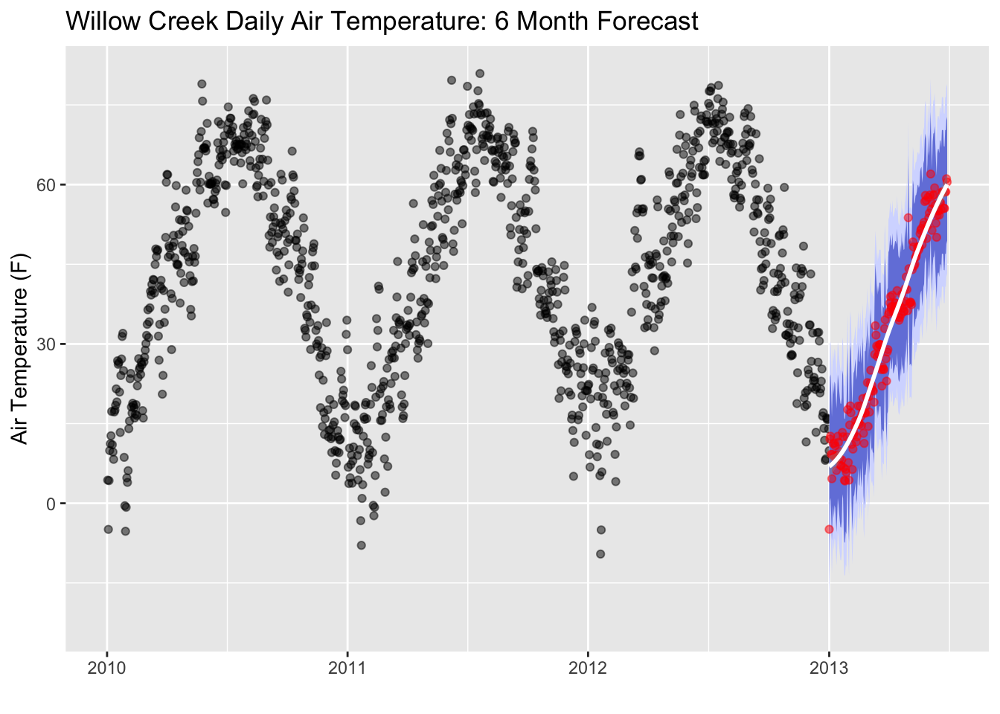

# Time Series Forecasting

```{r, echo=FALSE, out.width="70%", fig.align="center"}
  
```

Time series forecasting is widely used in sciences with the intended purpose of predicting the future based on present data. This type of machine learning technique has been used for weather forecasting, glacier melting outlooks, and carbon dioxide concentration predictions. In this tutorial, we will use the Willow Creek Weather Datasets and build an Air Temperature Forecast using Linear Regression Modeling. 


## Load the Packages and Data

Let's use the `read.wcr` function that we previously created to load in our dataset. 

```{r, warning=FALSE, message=FALSE, out.width="50%", fig.align="center"}
library(ncdf4)
read.wcr = function(fname) {
  fullname = strsplit(fname, "/")
  dataset_str = fullname[[1]][length(fullname[[1]])]
  datname = strsplit(dataset_str, "_")[[1]][1]
  data.year = substr(dataset_str, nchar(dataset_str)-6, nchar(dataset_str)-3)
  data.date = seq(from=as.POSIXct(paste0(data.year,"-1-1 0:00", tz="UTC")),to=as.POSIXct(paste0(data.year,"-12-31 23:00", tz="UTC")),by="hour")
  vars.info <- data.frame(CF.name = c("date", "air_temperature", "precipitation_flux", "surface_downwelling_shortwave_flux_in_air",
                                      "specific_humidity", "surface_downwelling_longwave_flux_in_air", "air_pressure",
                                      "eastward_wind", "northward_wind", "wind_speed"))
  df <- list()
  tem <- ncdf4::nc_open(fname)
  dim <- tem$dim
  for (j in seq_along(vars.info$CF.name)) {
    if (exists(as.character(vars.info$CF.name[j]), tem$var)) {
      df[[j]] <- ncdf4::ncvar_get(tem, as.character(vars.info$CF.name[j]))
    } else {
      df[[j]] = NA
    }
  }
  names(df) <- vars.info$CF.name
  df <- data.frame(df)
  nc_close(tem)
  if(all(is.na(df$date))){
    df$date = data.date
  }
  return(df)
}

```

Now, let's throw the `read.wcr` function into a loop so we can read in the data for each year. 

```{r, warning=FALSE, message=FALSE, out.width="50%", fig.align="center"}

# create a sequence of years for the years we have data
yearSeq = seq(2010,2012)

# begin the for loop to open each year of data
for (y in yearSeq){
  # use our read.wcr() function and paste in the filename that changes for each year of data
  tem_df = read.wcr(fname = paste0("~/Documents/Github/geog473-673/datasets/WCr_1hr.",y,".nc"))
  # != means DOES NOT EQUAL. This statement reads as - if y DOES NOT EQUAL the first year in yearSeq, proceed to use rbind
  # otherwise, if y is indeed the first year in yearSeq, we need to initialize wcr_df BEFORE we overwrite tem_df
  if (y != yearSeq[1]){
    wcr_df = rbind(wcr_df, tem_df)
  } else {
    wcr_df = tem_df
  }
}

length(wcr_df$date)
head(wcr_df)
```

Our data has been read in. Let's convert the Air Temperature units from degrees Kelvin to degrees Fahrenheit. Then, let's plot our time series. 

```{r, warning=FALSE, message=FALSE, out.width="50%", fig.align="center"}
library(ggplot2)
library(lubridate)

# convert the data to Fahrenheit
wcr_df$air_temperature = (wcr_df$air_temperature - 273.15) * (9/5) + 32

ggplot(data = wcr_df, aes(x = date, y = air_temperature)) +
    geom_rect(xmin = as.POSIXct("2010-01-01"),
              xmax = as.POSIXct("2012-06-01"),
              ymin = -10, ymax = 100,
              fill = "lightblue", alpha = 0.1) +
    annotate("text", x = as.POSIXct("2011-01-01") , y = 80,
             color = "blue", label = "Train Region") +
    annotate("text", x = as.POSIXct("2012-12-01"), y = 80,
             color = "coral", label = "Test Region") +
    geom_point(size=0.5, alpha = 0.5, color = "black") +
    labs(title = "Willow Creek Hourly Air Temperature - 2010-2013",y = "Air Temperature (F)", x = "")

```

When we build a linear regression model for a time series dataset, we select a training period and a testing period. For our case, we're going to train the dataset 
now aggregate to a daily with xts package - to plot we have to use the index

## Aggregate Data
```{r, warning=FALSE, message=FALSE, out.width="50%", fig.align="center"}
library(xts)
library(zoo)
xt = xts(wcr_df, order.by = wcr_df$date)
daily = xts::apply.daily(xt,mean)
daily = data.frame(date=index(daily), coredata(daily))
daily$date.1 = NULL
ggplot(data = daily, aes(x = date, y = air_temperature)) +
    geom_rect(xmin = as.POSIXct("2010-01-01"),
              xmax = as.POSIXct("2012-06-01"),
              ymin = -10, ymax = 85,
              fill = "lightblue", alpha = 0.1) +
    annotate("text", x = as.POSIXct("2011-01-01") , y = 70,
             color = "blue", label = "Train Region") +
    annotate("text", x = as.POSIXct("2012-12-01"), y = 70,
             color = "coral", label = "Test Region") +
    geom_point(alpha = 0.5, color = "black") +
    labs(title = "Willow Creek Daily Air Temperature - 2010-2013",y = "Air Temperature (F)", x = "")


```

 create subsets of training and test dataset - weird xts syntax

## Prepping the Model
```{r, warning=FALSE, message=FALSE, out.width="50%", fig.align="center"}
train = daily[1:which(daily$date == as.POSIXct("2012-05-31 23:00:00 EDT")),]
test = daily[which(daily$date == as.POSIXct("2012-06-01 23:00:00 EDT")):length(daily$date),]

train = data.frame(date = train$date, air_temperature =  train$air_temperature)
test = data.frame(date = test$date, air_temperature =  test$air_temperature)
```


prep the data with recipes bake

must install 4.0.3 r for stupid timetk to work


```{r, warning=FALSE, message=FALSE, out.width="50%", fig.align="center"}
library(timetk)
library(recipes)
rec_train <- recipe(air_temperature ~ ., data = train)
recipe_ts = step_timeseries_signature(recipe = rec_train, "date") 

```

```{r, warning=FALSE, message=FALSE, out.width="50%", fig.align="center"}
recipe_spec = recipe_ts
recipe_spec = step_rm(recipe_spec, date)
recipe_spec = step_rm(recipe_spec, contains("iso"), 
            contains("second"), contains("minute"), contains("hour"),
            contains("am.pm"), contains("xts"))
recipe_spec = step_normalize(recipe_spec, contains("index.num"), date_year)
recipe_spec = step_interact(recipe_spec, ~ date_month.lbl * date_day)
recipe_spec = step_interact(recipe_spec, ~ date_month.lbl * date_mweek)
recipe_spec = step_interact(recipe_spec, ~ date_month.lbl * date_wday.lbl * date_yday)
recipe_spec_final = step_dummy(recipe_spec, contains("lbl"), one_hot = TRUE) 

```

Regularization is a process of introducing additional information in order to solve an ill-posed problem or to prevent overfitting

## Running the Model
```{r, warning=FALSE, message=FALSE, out.width="50%", fig.align="center"}
library(workflows)
library(parsnip)
library(recipes)
library(yardstick)
library(glmnet)
library(tidyverse)

model_spec_glmnet <- parsnip::linear_reg(mode = "regression", penalty = 2, mixture = 0)
set_engine(model_spec_glmnet, "glmnet")

workflow_glmnet = add_recipe(workflow(), recipe_spec_final)
workflow_glmnet = add_model(workflow_glmnet, model_spec_glmnet)
workflow_glmnet

workflow_trained <- workflow_glmnet
workflow_trained = fit(workflow_glmnet, data = train)

prediction_tbl = predict(workflow_trained, test)
prediction_tbl = bind_cols(prediction_tbl, test) 
prediction_tbl

ggplot(data = daily, aes(x = date, y = air_temperature)) +
    geom_rect(xmin = as.POSIXct("2010-01-01"),
              xmax = as.POSIXct("2012-06-01"),
              ymin = -10, ymax = 85,
              fill = "lightblue", alpha = 0.01) +
    annotate("text", x = as.POSIXct("2011-01-01") , y = 75,
             color = "blue", label = "Train Region") +
    annotate("text", x = as.POSIXct("2012-12-01"), y = 75,
             color = "coral", label = "Test Region") + 
   geom_point(alpha = 0.5, color = "black") +
    geom_point(aes(x = date, y = .pred), data = prediction_tbl, 
               alpha = 0.5, color =  "darkblue") +
    labs(title = "GLM: Out-Of-Sample Forecast")

```


## Validation and Accuracy
```{r, warning=FALSE, message=FALSE, out.width="50%", fig.align="center"}
metrics(prediction_tbl, air_temperature, .pred)

ggplot(data = prediction_tbl, aes(x = date, y = air_temperature - .pred)) +
  geom_hline(yintercept = 0, color = "black") +
  geom_point(color = "blue", alpha = 0.5) +
  geom_smooth(span = 0.05, color = "red") +
  geom_smooth(span = 1.00, se = FALSE) +
  labs(title = "GLM Model Residuals, Out-of-Sample", y = "Air Temperature: Actual - Predicted",  x = "") +
  scale_y_continuous(limits = c(-5, 5))
```


## Future Forecasting

```{r, warning=FALSE, message=FALSE, out.width="50%", fig.align="center"}
# Extract bikes index
idx <- tk_index(daily)
# Get time series summary from index
daily_summary <- tk_get_timeseries_summary(idx)

idx_future <- tk_make_future_timeseries(idx, n_future = 180)
future_tbl <- tibble(date = idx_future) 
head(future_tbl)

future_predictions_tbl = fit(workflow_glmnet, data = daily)
future_predictions_tbl = predict(future_predictions_tbl, future_tbl)
future_predictions_tbl = bind_cols(future_predictions_tbl, future_tbl)

ggplot(data = daily, aes(x = date, y = air_temperature)) +
    geom_rect(xmin = as.POSIXct("2010-01-01"),
              xmax = as.POSIXct("2012-06-01"),
              ymin = -10, ymax = 85,
              fill = "lightblue", alpha = 0.01) +
    annotate("text", x = as.POSIXct("2011-01-01") , y = 75,
             color = "blue", label = "Train Region") +
    annotate("text", x = as.POSIXct("2012-12-01"), y = 75,
             color = "coral", label = "Test Region") + 
   geom_point(alpha = 0.5, color = "black") +
  geom_point(aes(x = as.POSIXct(date), y = .pred), data = future_predictions_tbl,
               alpha = 0.5, color = "dodgerblue1") +
    geom_smooth(aes(x = as.POSIXct(date), y = .pred), data = future_predictions_tbl,
                method = 'loess', color = "dodgerblue4") + 
    labs(title = "Willow Creek Air Temperature: 6-Month Forecast", y = "Air Temperature (F)", x = "")
    labs(title = "GLM: Out-Of-Sample Forecast")


```


```{r, warning=FALSE, message=FALSE, out.width="50%", fig.align="center"}
# Calculate standard deviation of residuals
test_resid_sd <- summarize(prediction_tbl, stdev = sd(air_temperature- .pred))
future_predictions_tbl <- mutate(future_predictions_tbl, 
        lo.95 = .pred - 1.96 * test_resid_sd$stdev,
        lo.80 = .pred - 1.28 * test_resid_sd$stdev,
        hi.80 = .pred + 1.28 * test_resid_sd$stdev,
        hi.95 = .pred + 1.96 * test_resid_sd$stdev)

ggplot(data = daily, aes(x = date, y = air_temperature)) +
    geom_point(alpha = 0.5, color = "black") +
    geom_ribbon(aes(y = .pred, x = as.POSIXct(date),ymin = lo.95, ymax = hi.95), 
                data = future_predictions_tbl, 
                fill = "#D5DBFF", color = NA, size = 0) +
    geom_ribbon(aes(y = .pred, x = as.POSIXct(date),ymin = lo.80, ymax = hi.80, fill = key), 
                data = future_predictions_tbl,
                fill = "#596DD5", color = NA, size = 0, alpha = 0.8) +
    geom_point(aes(x = as.POSIXct(date), y = .pred), data = future_predictions_tbl,
               alpha = 0.5, color = "red") +
    geom_smooth(aes(x = as.POSIXct(date), y = .pred), data = future_predictions_tbl,
                method = 'loess', color = "white")+ 
    labs(title = "Willow Creek Daily Air Temperature: 6 Month Forecast",y = "Air Temperature (F)", x = "")
    
```


## Assignment
Perform this same analysis for a weekly resolution for air temperature. does the model do better or worse. 


