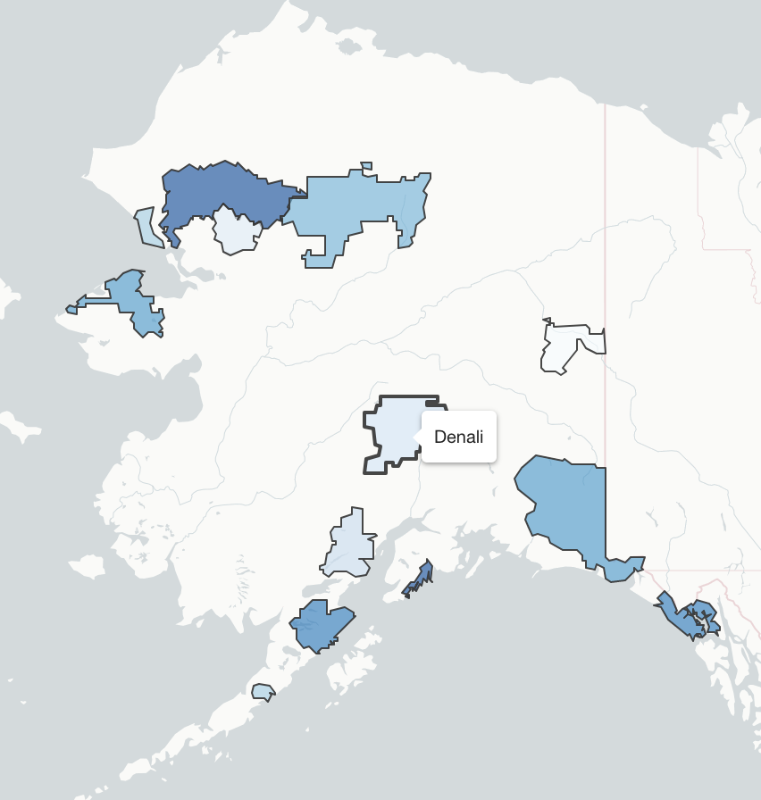

# Shapefiles 

```{r, echo=FALSE, out.width="60%", fig.align="center"}
  
```

Shapefiles are polygons containing geolocated data. R is great at handling shapefiles and is often faster and more efficient in visualizing these than other programs like ArcGIS. For shapefiles, we will use a combination of new packages. Most notably, we'll be using `rgdal`, a package designed to work with geolocated datasets with any projection, and `sp` (spatial points), the sister package of `sf`. These two packages are useful for reading and curating shapefiles. Data derived from these two packages can also work with mulitiple visualization packages including `ggplot2`. 

## Reading in Shapefiles 

Often times, the spatial data that we want aren't in a nice, gridded lat/lon. The oblate spheroid that we call home presents some challenges when it comes to displaying spatial datasets. Often times, datasets like these are stored as separate entities - shapefiles & data tables. Fortunately, we have multiple avenues for working with this data. For this tutorial, we're going to use data from the University of Delaware [coastal flooding dashboard](coast-flood.udel.edu) - a emergency warning product for the coastal communities of Delaware. 

The data is located in the datasets folder under the *folder* titled `cfms_shapefiles/`. The file we need to read in from this group is `cfms_watersheds.shp`, **however, we need all files from this folder to stick together**. In other words, all files must reside in the same folder together on your local machine. In any program, when you read in a shapefile (`.shp`), the program automatically references the `.shx`, `.prj`, `.dbf`, etc. files as well. 

```{r}
#Load packages
library(RColorBrewer)
library(rgdal)
library(sp)
library(ggplot2)
library(ggmap)
library(scales)
library(viridis)

# Use the readOGR function from the rgdal package to open a shapefile & constituents
coast.shp <- readOGR("/Users/james/Documents/Github/geog473-673/datasets/cfms_shapefiles/cfms_watersheds.shp")
class(coast.shp)
coast.shp@proj4string
```

We use `readOGR` from the `rgdal` package to load in the shapefile. As stated above, even though we only key the loading of the `cfms_watersheds.shp` file, `readOGR` is also opening the other files (`.shx`, `.prj`, `.dbf`, etc.) as well. This projection is **unique**. It's a transverse mercator with some specific lat_0 and lon_0 starting points. Notice the class of the shapefile - the underlying package controlling it's translation to R is the `sp` package.  The `sp` package provides classes and methods for the points, lines, polygons, and grids of this shapefile. Notice the *@* symbol in `coast.shp@proj4string`. This is how we query metadata associated with shapefiles. 


## Combining Shapefiles with Data

We have a data file that contains flooding data for the polygons of the shapefile read in above. This data file is `water_levels.csv`. Let's read this data in. 

```{r}
plot(coast.shp)
# Open the dataset that corresponds to the water levels within the shapefile boxes 
coast.data <- read.csv("/Users/james/Documents/Github/geog473-673/datasets/cfms_shapefiles/water_levels.csv")
head(coast.data)
```

The data is loaded, but how to we correspond the data of the `csv` file with the appropriate polygon within the `shp` file? We must find a matching key. In this case, the key is the `station`. Both the `coast.shp` and `coast.data` datasets contain the `station` variable. Now, we must merge together the flooding data with the station within each polygon. 

```{r}
# now let's find the matching key - in this case, the matching key is the "station".
as.vector(coast.shp$station[1:5])
as.vector(coast.data$station[1:5])
```

`station` is the matching column, but the stations are not in the same order. We must reorder them appropriately before we merge together the datasets. 

```{r}
# notice the difference above - let's reorder the data from the shapefile and the csv data by the station, otherwise merging will NOT work. 
coast.shp  = coast.shp[order(as.vector(coast.shp$station)),]
coast.data  = coast.data[order(as.vector(coast.data$station)),]
as.vector(coast.shp$station[1:5])
as.vector(coast.data$station[1:5])
```

Now that the order of the stations are the same, we can merge together the two datasets. We will merge together the datasets using the `merge` function from `sp`. Here, we denote the use of this function by `sp::merge`. Why? There are multiple merge functions in R, and we need to tell R which package contains the specific merge function we wish to use. The function is straight-forward, but one argument that you may notice is the `duplicateGeoms = TRUE` argument. We need to specify this because we have multiple data values for the same station name. For example, there are multiple `DBOFS001` stations above. 

```{r}
# merge together the shapefile data and the csv data based on common variable, here called 'station' - we MUST use the duplicateGeoms argument because there are multiple values for the same station name
merged.coast = sp::merge(coast.shp,coast.data,by='station', duplicateGeoms = TRUE)
class(merged.coast)
```

We have merged together the data for each station and thus each polygon now has data associated with it. There's 24 variables here and station is the only variable we've covered so far. The variable that contains the data we're interested in here is called `maxpred`, which is the maximum predicted water level in feet above sea level for the next 24 hours for each station. Before we color the polygons based on this `maxpred` variable, we need to create a color palette using `RColorBrewer`. 


```{r}
# Now let's use brewer.pal from RColorBrewer to create a blues color pallette
mycolours <- brewer.pal(8, "Blues")
```


## Visualizing the Shapefiles & Data

The color scheme has been prepared with the appropriate breaks that we wanted. Now, we can plot the dataset and color the shapefile polygons. There are multiple ways to plot this data and we'll begin with a simple `spplot` from the `sp` package.

```{r, out.width="60%", fig.align="center"}
# first we'll plot a simple one to show this function
spplot(obj = merged.coast, zcol = "maxpred")

# now let's add in extra arguments and color our polygons with our colorshcmee
spplot(obj = merged.coast, zcol = "maxpred", par.settings = list(axis.line = list(col ="transparent")), main = "Projected Water Levels (Feet)", cuts = 5, col ="transparent", col.regions = mycolours)

```

Simple and displays the data easily. Now we turn our attention to the `tamp` package - Thematic Map Visualization. Thematic maps are geographical maps in which spatial data distributions are visualized. This package offers a flexible, layer-based, and easy to use approach to create thematic maps, such as choropleths and bubble maps. It is based on the grammar of graphics, and resembles the syntax of ggplot2.


```{r, out.width="60%", fig.align="center"}
library(tmap)
tm_shape(merged.coast) + 
  tm_polygons(col='maxpred', title = "Projected Water Levels", palette = "Blues") + tm_style("classic") + tm_scale_bar(position = c("left", "bottom")) 
```

We automatically queried a Blues color palette with automatic breaks with the `tm_shape` and `tm_polygons` functions. Notice how similar this functionality is to `ggplot2`. Let's turn our attention to `ggplot2` at this time. Before we use this package, we will need to convert our `SpatialPolygonsDataFrame` to a `sf` dataframe. For this, we can use the `st_as_sf` function which converts a foreign object to an `sf` object.


```{r, out.width="60%", fig.align="center"}
library(sf)
# convert it to an sf object
gg_merged = st_as_sf(merged.coast)
class(gg_merged)
# now we use geom_sf since our gg_merged is now a simple feature
ggplot() + geom_sf(data = gg_merged, aes(fill = maxpred))
```

Let's get rid of the default gray background of this `ggplot` instance. This default background is actually part of the default `ggplot` theme. There are multiple themes we can use including theme_bw(), theme_dark(), theme_light(), theme_void() and more.

```{r, echo=FALSE, out.width="60%", fig.align="center"}
ggplot() + geom_sf(data = gg_merged, aes(fill = maxpred)) + theme_void()
```

Each of these themes are useful under varying circumstances. The void theme is nice when we want to bring more visual focus to the data. However, this map would look better if we added in state polygons.

```{r, out.width="60%", fig.align="center", warning=FALSE}
# read in the states shapefile from the course datasets folder
states <- readOGR("/Users/james/Documents/Github/geog473-673/datasets/ne_10m_admin_1_states_provinces/ne_10m_admin_1_states_provinces.shp")
class(states)
states = st_as_sf(states)
class(states)

ggplot(data = states) + geom_sf() + theme_void() +
  geom_sf(data = gg_merged, aes(fill = maxpred)) +
  coord_sf(xlim = c(-76.1, -74.7), ylim = c(38.3,40), expand = FALSE) +
  scale_fill_distiller(palette = "Blues", direction= 1)

```

Looks pretty good even though the shapefile isn't quite as sharp as we'd like. Besides the shapefile which we added to the plot via `geom_sf()`, take notice of the `theme_void()`...this plot will NOT WORK without `theme_void()`. There is ongoing github discussions with some of the developers at `ggplot2` to figure out why, but for now just make sure you use `theme_void` to add shapefiles to the same plot in R and have them work properly. Also take note of the `scale_fill_distiller` function. This is an easy way to throw in a `RColorbrewer` color pallette. In this case we used the Blues colorpallete since we're dealing with water but you can make it any `RColorbrewer` palette you want. Also notice the `direction=1`. This reverses the order of the blues color pallette. Instead of the `scale_fill_distiller` function, you can also use `scale_fill_viridis()` function which has some default pallettes such as - “magma”, “plasma”, and “inferno”. 


The last package we'll introduce for visualizing shapefiles is the `mapview` package. This package overlays shapefiles and corresponding data over an HTML based interactive map. This package handles a lot of the dirty work for us. 

```{r, out.width="60%", fig.align="center"}
library(mapview)
mapview(merged.coast['maxpred'], col.regions = mycolours)
```


## Saving a shapefile
So we combined our csv station data with the corresponding shapefile statoin to make these plots. We don't need to duplicate that hard work again because we can actually save our merged shapefile/csv as an ENVI shapefile using the `writeOGR` function from `rgdal`. 

```{r, eval=FALSE}
writeOGR(obj = merged.coast, dsn = "/Users/james/Downloads/coast_files/merged.coast", layer = "coast-rgdal", driver = "ESRI Shapefile")
```


# Week 5 Assignment - Replicate these Plots

Using the **ne_10m_parks_and_protected_lands** shapefile dataset, map the names of the protected lands (variable is `name`) in the **Pacific Northwest** using the methods listed below. You will need to download all of the contents of the **ne_10m_parks_and_protected_lands** shapefile folder. Below, a bounding lat/lon box of -127 W, -110 E, 40 S, 50 N was used for `tmap` plot and `ggplot` plot. You may use a bounding box of your choice where you see fit. 

1) `tmap`
2) `ggplot2`
3) `mapview`
 

Create the 3 plots above and make them look as close as possible to the ones below. 


```{r, echo=FALSE, warning=FALSE, message=FALSE, fig.width=7, fig.height=7}
library(maptools)
m <- readOGR("/Users/james/Documents/Github/geog473-673/datasets//ne_10m_parks_and_protected_lands/ne_10m_parks_and_protected_lands_area.shp")

library(tmap)
tm_shape(m,bbox=tmaptools::bb(matrix(c(-127,40,-110,50),2,2))) + 
  tm_polygons(col='name', title = "Protected Lands", palette = "Spectral") + tm_style("classic") + tm_scale_bar(position = c("right", "bottom")) +
  tm_layout(legend.title.size = 0.7,legend.text.size = 0.5, legend.position = c("left","center")) +
  tm_layout(title="Protected Areas in Pacific NW")


states <- readOGR("/Users/james/Documents/Github/geog473-673/datasets/ne_10m_admin_1_states_provinces/ne_10m_admin_1_states_provinces.shp")
class(states)
states = st_as_sf(states)
class(states)


ggplot(data = states) + geom_sf() + theme_void() +
  geom_sf(data = st_as_sf(m), aes(fill=name), fill="darkgreen", colour = "aquamarine3", alpha=0.8) +
  coord_sf(xlim = c(-127, -110), ylim = c(40,50), expand = FALSE) + 
  theme(legend.position = "none") + ggtitle("Protected Lands in Pacific NW")


library(mapview)
mapview(m['name'], col.regions = mycolours)
```

** Submit plots to UD Canvas **


