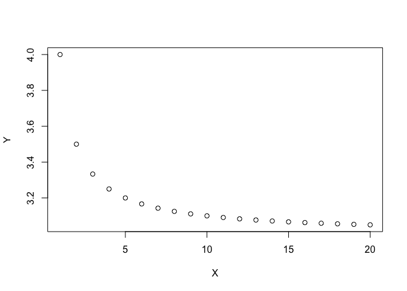
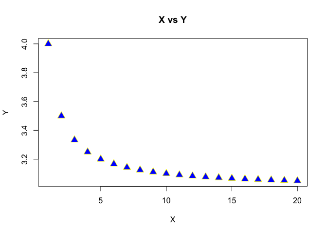
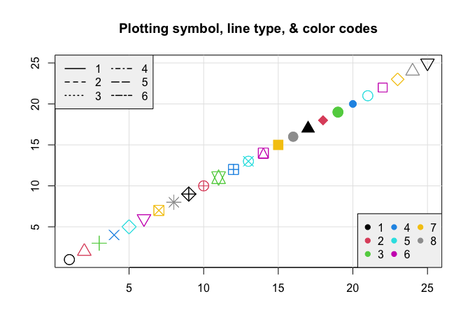
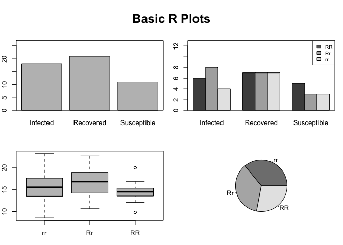
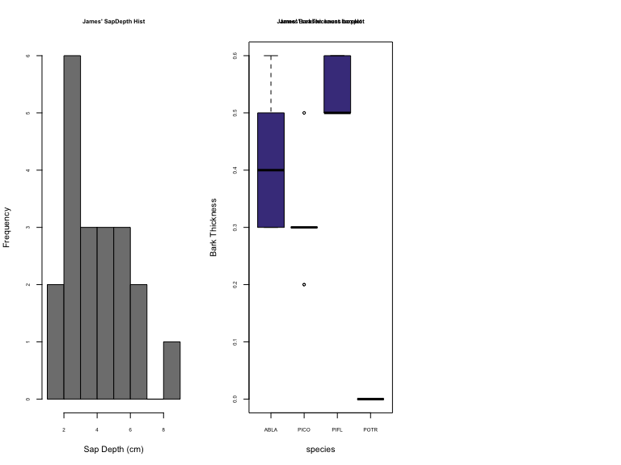

Expanding on Basic R Plotting
================

## Basic Plotting

R has a plethora of plotting packages, tools, and techniques. Although
more popular visualization methods require the installation of other
packages, the base plotting package in R can be customized to look
professional.

# Downloading Datafiles via R

All datasets used for this class will be found here -
<https://github.com/jsimkins2/geog473-673/tree/master/datasets/>

In order to download these files easily, you can use the following code:

`download.file("https://github.com/jsimkins2/geog473-673/tree/master/datasets/world_shpfiles/world.shp",
destfile = "/Users/james/Downloads/world.shp" , mode='wb')`

Follow this format for any of the datasets. Here is another example for
the `TreeData.csv`

`download.file("https://github.com/jsimkins2/geog473-673/tree/master/datasets/TreeData.csv",
destfile = "/Users/james/Downloads/TreeData.csv" , mode='wb')`

## Expanding on Basic Plots in R

Variable Assignment & Operations

``` r
x = 7
y = 9
z <- y * (x/2 + 7) + sqrt(y)

print(x)
```

    ## [1] 7

``` r
y
```

    ## [1] 9

``` r
z
```

    ## [1] 97.5

``` r
X <- 1:20
Y <- (1 + 1/X) + 2
X
```

    ##  [1]  1  2  3  4  5  6  7  8  9 10 11 12 13 14 15 16 17 18 19 20

``` r
Y
```

    ##  [1] 4.000000 3.500000 3.333333 3.250000 3.200000 3.166667 3.142857 3.125000
    ##  [9] 3.111111 3.100000 3.090909 3.083333 3.076923 3.071429 3.066667 3.062500
    ## [17] 3.058824 3.055556 3.052632 3.050000

``` r
plot(X,Y)
```

<!-- -->

Now let’s add in some extra arguments to the plot function to make it
prettier

``` r
plot(x=X,y=Y, type = "p", pch=c(24), col = 'yellow', bg='blue', cex = 1.6, xlab = "X", ylab = "Y")
title("X vs Y")
```

<!-- -->

Having trouble remembering the arguments that the function `plot()`
accepts? Same…so just run `?plot` for RStudio’s built in helper.

Recap:

  - type == type of plot - p stands for points
  - pch == plotting ‘character’, i.e., symbol to use
  - col == color
  - bg == background color (only applicable for pch’s between 21:25)
  - cex == size of the points
  - xlab == x label
  - ylab == y label

## In Class Exercise:

Create a plot above using a sequence of X values where Y is the log of
the X values. Use both lines and points, pch of 21, cex of 1.5, and
colors of your choosing.

## More Plotting

Let’s take a look at the different kind of points and arguments that go
into a plotting function call

``` r
plot(1:25, 1:25, xlab="",ylab="",pch=1:25,col=1:25,cex=2)
grid(lty=1, col="gray90")
points(1:25, 1:25, xlab="",ylab="",pch=1:25,col=1:25,cex=2)
title("Plotting symbol, line type, & color codes")
legend("topleft", legend=1:6, lty=1:6, lwd=1.5, ncol=2, bg="gray95")
legend("bottomright", legend=1:8, col=1:8, ncol=3, pch=19, bg="gray95")
```

<!-- -->

## Basic types of plots with dummy data

We’re going to create a fake dataset of those who are infected by the
coronavirus. Let’s do so using the `sample()` function.

``` r
# Create a random sample of the 3 types - Susceptible, Infected and Recovered
InfStatus <- factor(sample(c("Susceptible", "Infected", "Recovered"),size = 50, replace = TRUE))
I <- table(InfStatus)
I
```

    ## InfStatus
    ##    Infected   Recovered Susceptible 
    ##          14          13          23

``` r
# Now let's make a random sample of 3 genotypes (RR, Rr, and rr)
Genotype <- factor(sample(c("RR", "Rr", "rr"), size = 50, replace = TRUE))
G <- table(Genotype)
G
```

    ## Genotype
    ## rr Rr RR 
    ## 17 12 21

``` r
#show genotype and infected status as a table 
table(Genotype, InfStatus)
```

    ##         InfStatus
    ## Genotype Infected Recovered Susceptible
    ##       rr        6         4           7
    ##       Rr        2         4           6
    ##       RR        6         5          10

Note - We turned the sample data info a `factor` to make sure the
factors aren’t double indexed…here is what I mean…

``` r
# WITHOUT the factor
test <- sample(c("Susceptible", "Infected", "Recovered"),size = 50, replace = TRUE)
test
```

    ##  [1] "Infected"    "Infected"    "Recovered"   "Susceptible" "Susceptible"
    ##  [6] "Recovered"   "Recovered"   "Susceptible" "Recovered"   "Recovered"  
    ## [11] "Infected"    "Infected"    "Recovered"   "Susceptible" "Susceptible"
    ## [16] "Susceptible" "Susceptible" "Recovered"   "Infected"    "Infected"   
    ## [21] "Susceptible" "Infected"    "Infected"    "Susceptible" "Susceptible"
    ## [26] "Infected"    "Recovered"   "Susceptible" "Recovered"   "Susceptible"
    ## [31] "Susceptible" "Infected"    "Recovered"   "Susceptible" "Recovered"  
    ## [36] "Susceptible" "Susceptible" "Infected"    "Recovered"   "Recovered"  
    ## [41] "Recovered"   "Susceptible" "Susceptible" "Infected"    "Infected"   
    ## [46] "Infected"    "Recovered"   "Susceptible" "Susceptible" "Susceptible"

``` r
class(test)
```

    ## [1] "character"

``` r
# Now as a factor
test2 <- factor(sample(c("Susceptible", "Infected", "Recovered"),size = 50, replace = TRUE))
test2
```

    ##  [1] Infected    Susceptible Recovered   Infected    Infected    Susceptible
    ##  [7] Susceptible Recovered   Infected    Recovered   Recovered   Susceptible
    ## [13] Recovered   Susceptible Recovered   Infected    Recovered   Susceptible
    ## [19] Susceptible Infected    Susceptible Susceptible Susceptible Infected   
    ## [25] Recovered   Infected    Infected    Susceptible Susceptible Infected   
    ## [31] Infected    Infected    Infected    Susceptible Infected    Susceptible
    ## [37] Recovered   Recovered   Recovered   Infected    Recovered   Susceptible
    ## [43] Susceptible Infected    Recovered   Infected    Recovered   Infected   
    ## [49] Recovered   Recovered  
    ## Levels: Infected Recovered Susceptible

``` r
class(test2)
```

    ## [1] "factor"

## Now let’s plot this fake data

``` r
par(mfrow=c(2, 2), mar=c(3, 2, 2, 1), oma=c(0, 0, 3, 0), bg = "white") ## create plot array of 2 row x 2 columns
plot(InfStatus, ylim = c(0, 27)) # basic plot with y limit set as a range
box() # just adds a box around the plot above
barplot(table(Genotype, InfStatus), ylim = c(0, 13), beside = TRUE) # barplot
box() # adds a box around the plot above
legend("topright", c("RR", "Rr", "rr"), fill = c("gray40", "gray70", "gray90"), ncol = 1, cex = 0.75) # legend
boxplot(rnorm(50, mean = 15, sd = 3) ~ Genotype, col = "gray75") # boxplot
pie(G, col = c("gray50", "gray70", "gray90")) # pie plot
mtext("Basic R Plots", outer = TRUE, cex = 1.5, font = 2) # main title
```

<!-- -->

# Playing with Tree Data

Let’s say you’re an ecologist who collected some tree data samples out
in the field. Let’s load this into R and explore the data. In order to
proceed, you’ll need to download **TreeData.csv** which is located here
-
(<https://github.com/jsimkins2/geog473-673/tree/master/datasets/TreeData.csv>)

``` r
# Navigate to the location where your file is stored locally. Use read.csv() function to load the data
treedat <- read.csv("/Users/james/Documents/Github/geog473-673/datasets/TreeData.csv")
treedat
```

    ##    tree  spp season Infected  dbh SapDepth BarkThick NobarkArea Heartwood
    ## 1     1 PICO Summer      Yes 42.2      8.4       0.3     1359.2     483.1
    ## 2     2 ABLA   Fall      Yes 13.4      2.0       0.4      124.7      58.1
    ## 3     3 ABLA Summer       No 13.1      1.5       0.3      122.7      70.9
    ## 4     4 PICO Spring       No 15.0      4.1       0.2      167.4      32.2
    ## 5     5 POTR Winter      Yes 14.2      3.6       0.0      158.4      38.5
    ## 6     6 POTR Winter      Yes 20.0      5.9       0.0      314.2      52.8
    ## 7     7 ABLA Summer      Yes  9.1      2.1       0.3       56.7      14.5
    ## 8     8 ABLA Spring       No  9.2      2.5       0.5       52.8       8.0
    ## 9     9 ABLA   Fall      Yes 27.3      3.0       0.6      535.0     317.3
    ## 10   10 PICO   Fall       No 11.2      3.4       0.3       88.2      11.3
    ## 11   11 PICO Spring      Yes 18.0      5.9       0.3      237.8      24.6
    ## 12   12 POTR Summer       No  9.0      3.0       0.0       63.6       7.1
    ## 13   13 POTR Spring       No 15.4      4.1       0.0      186.3      40.7
    ## 14   14 POTR Winter       No 24.1      6.2       0.0      456.2     107.5
    ## 15   15 PICO Winter      Yes 24.2      7.0       0.5      422.7      66.5
    ## 16   16 PIFL   Fall       No 14.4      4.2       0.5      141.0      19.6
    ## 17   17 PIFL Winter       No 13.1      2.2       0.6      111.2      44.2
    ## 18   18 PIFL Summer      Yes 21.5      5.1       0.6      323.7      80.1
    ## 19   19 PIFL Spring       No 13.4      2.2       0.5      120.8      50.3
    ## 20   20 PIFL   Fall      Yes 16.2      3.5       0.5      181.5      52.8
    ##    SapArea
    ## 1    876.1
    ## 2     66.6
    ## 3     51.8
    ## 4    135.2
    ## 5    119.9
    ## 6    261.3
    ## 7     42.2
    ## 8     44.8
    ## 9    217.7
    ## 10    76.9
    ## 11   213.2
    ## 12    56.5
    ## 13   145.5
    ## 14   348.7
    ## 15   356.3
    ## 16   121.4
    ## 17    67.0
    ## 18   243.5
    ## 19    70.5
    ## 20   128.6

`treedat` is a data frame. As a reminder, a data frame is essentially a
2-dimensional array that contains a *combination* of vectors (columns of
data) that are of the class; integer, numeric, character. This is
*different* from a matrix which can only contain *1 type* of data. In
this case, we have some tree data that includes species of tree, season
the data was collected, diameter of the tree, bark thickness, area of no
bark, heartwood diameter, and sapwood diameter.


Now, let’s edit htis dataframe to the format we want it in. Then, let’s
plot a histogram of bark thickness and a boxplot of sapdepth by species.

``` r
# let's set the rownames equal to the tree column
treedat <- read.csv("/Users/james/Documents/Github/geog473-673/datasets/TreeData.csv",row.names='tree')
# print treedat
treedat
```

    ##     spp season Infected  dbh SapDepth BarkThick NobarkArea Heartwood SapArea
    ## 1  PICO Summer      Yes 42.2      8.4       0.3     1359.2     483.1   876.1
    ## 2  ABLA   Fall      Yes 13.4      2.0       0.4      124.7      58.1    66.6
    ## 3  ABLA Summer       No 13.1      1.5       0.3      122.7      70.9    51.8
    ## 4  PICO Spring       No 15.0      4.1       0.2      167.4      32.2   135.2
    ## 5  POTR Winter      Yes 14.2      3.6       0.0      158.4      38.5   119.9
    ## 6  POTR Winter      Yes 20.0      5.9       0.0      314.2      52.8   261.3
    ## 7  ABLA Summer      Yes  9.1      2.1       0.3       56.7      14.5    42.2
    ## 8  ABLA Spring       No  9.2      2.5       0.5       52.8       8.0    44.8
    ## 9  ABLA   Fall      Yes 27.3      3.0       0.6      535.0     317.3   217.7
    ## 10 PICO   Fall       No 11.2      3.4       0.3       88.2      11.3    76.9
    ## 11 PICO Spring      Yes 18.0      5.9       0.3      237.8      24.6   213.2
    ## 12 POTR Summer       No  9.0      3.0       0.0       63.6       7.1    56.5
    ## 13 POTR Spring       No 15.4      4.1       0.0      186.3      40.7   145.5
    ## 14 POTR Winter       No 24.1      6.2       0.0      456.2     107.5   348.7
    ## 15 PICO Winter      Yes 24.2      7.0       0.5      422.7      66.5   356.3
    ## 16 PIFL   Fall       No 14.4      4.2       0.5      141.0      19.6   121.4
    ## 17 PIFL Winter       No 13.1      2.2       0.6      111.2      44.2    67.0
    ## 18 PIFL Summer      Yes 21.5      5.1       0.6      323.7      80.1   243.5
    ## 19 PIFL Spring       No 13.4      2.2       0.5      120.8      50.3    70.5
    ## 20 PIFL   Fall      Yes 16.2      3.5       0.5      181.5      52.8   128.6

``` r
# look at the data frame variable names 
names(treedat)
```

    ## [1] "spp"        "season"     "Infected"   "dbh"        "SapDepth"  
    ## [6] "BarkThick"  "NobarkArea" "Heartwood"  "SapArea"

``` r
# print the dbh variable
treedat$dbh
```

    ##  [1] 42.2 13.4 13.1 15.0 14.2 20.0  9.1  9.2 27.3 11.2 18.0  9.0 15.4 24.1 24.2
    ## [16] 14.4 13.1 21.5 13.4 16.2

``` r
# rename the dbh variable, but first let's be sure our index of the dbh variable is correct
colnames(treedat)[4]
```

    ## [1] "dbh"

``` r
# yep, dbh is the index number 4 
colnames(treedat)[4] = "tree.diameter"
treedat
```

    ##     spp season Infected tree.diameter SapDepth BarkThick NobarkArea Heartwood
    ## 1  PICO Summer      Yes          42.2      8.4       0.3     1359.2     483.1
    ## 2  ABLA   Fall      Yes          13.4      2.0       0.4      124.7      58.1
    ## 3  ABLA Summer       No          13.1      1.5       0.3      122.7      70.9
    ## 4  PICO Spring       No          15.0      4.1       0.2      167.4      32.2
    ## 5  POTR Winter      Yes          14.2      3.6       0.0      158.4      38.5
    ## 6  POTR Winter      Yes          20.0      5.9       0.0      314.2      52.8
    ## 7  ABLA Summer      Yes           9.1      2.1       0.3       56.7      14.5
    ## 8  ABLA Spring       No           9.2      2.5       0.5       52.8       8.0
    ## 9  ABLA   Fall      Yes          27.3      3.0       0.6      535.0     317.3
    ## 10 PICO   Fall       No          11.2      3.4       0.3       88.2      11.3
    ## 11 PICO Spring      Yes          18.0      5.9       0.3      237.8      24.6
    ## 12 POTR Summer       No           9.0      3.0       0.0       63.6       7.1
    ## 13 POTR Spring       No          15.4      4.1       0.0      186.3      40.7
    ## 14 POTR Winter       No          24.1      6.2       0.0      456.2     107.5
    ## 15 PICO Winter      Yes          24.2      7.0       0.5      422.7      66.5
    ## 16 PIFL   Fall       No          14.4      4.2       0.5      141.0      19.6
    ## 17 PIFL Winter       No          13.1      2.2       0.6      111.2      44.2
    ## 18 PIFL Summer      Yes          21.5      5.1       0.6      323.7      80.1
    ## 19 PIFL Spring       No          13.4      2.2       0.5      120.8      50.3
    ## 20 PIFL   Fall      Yes          16.2      3.5       0.5      181.5      52.8
    ##    SapArea
    ## 1    876.1
    ## 2     66.6
    ## 3     51.8
    ## 4    135.2
    ## 5    119.9
    ## 6    261.3
    ## 7     42.2
    ## 8     44.8
    ## 9    217.7
    ## 10    76.9
    ## 11   213.2
    ## 12    56.5
    ## 13   145.5
    ## 14   348.7
    ## 15   356.3
    ## 16   121.4
    ## 17    67.0
    ## 18   243.5
    ## 19    70.5
    ## 20   128.6

``` r
# Now let's do some plotting 
par(mfrow=c(1,2)) ## create plot array of 1 row x 2 columns
par(cex.axis=0.8) ## shrinks the name size of the x axes. If we don't do this, not all the names in the boxplot show up
par(cex.main=0.7) ## shrinks the name size of the titles. If we don't do this, the titles don't fit in the window
# Use the his() function to plot a histogram 
hist(treedat$BarkThick, xlab= "Bark Thickness (cm)", main= "Histogram: Bark Thickness", col= "gray50")
boxplot(SapDepth ~ spp, data= treedat, ylab= "SapDepth", col= "darkslateblue", main= "Boxplot: Sapwood Depth by Species")
```

<!-- -->

Note: hist() is the histogram function and boxplot() is the boxplot
function. For the boxplot, notice how the x \~ y, data=dataframe syntax
is. It’s slightly different than the plotting instances above and for
the histogram. For a histogram, the hist() function can only intake
numerical values. Thus, if we wanted to take a species histogram, we
would have to take a workaround like so -

``` r
barplot(vector(summary(treedat$spp)))
```

## Assignment:

Using the TreeData.csv above, complete the following:

1.  Rename ‘spp’ variable to ‘species’
2.  Make a 3 column plot consisting of Sapwood Depth histogram, boxplot
    of Bark Thickness by species, and a histogram showing the seasonal
    counts.
3.  Submit plot to Assignment 1 on Canvas

Your final plot should look like this

<!-- -->
