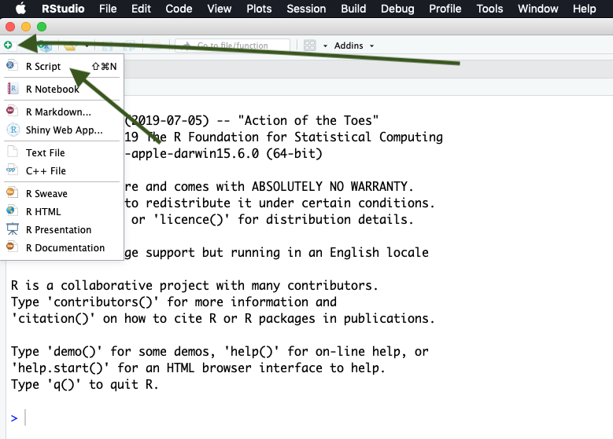

# R & RStudio

By now you've downloaded R and RStudio and you're probably wondering, why do I need to download both? R is that programming language that is running on your computer. RStudio is what we call an Indegrated Development Environment (IDE) - this is a technical term for a pretty application that's all dressed up on the surface but underneath is really crunching some numbers (using R) at serious speeds. RStudio is the application we'll be using. It is our Microsoft Excel. RStudio runs R in the background for us and gives us information and a nice, user-friendly layout. Let's open RStudio and get familiar with it.


## Open RStudio
Navigate to your applications folder on your computer. Launch RStudio. When you open it for the first time, you should see this.


```{r, echo=FALSE, out.width="100%", fig.align="center"}
knitr::include_graphics("images/openR_1.png")  
```


This is RStudio. When you open it for the first time, we'll need to open a new RScript to begin coding. 


**Open new R Script**


To open a new R Script, we select the blankpage with green plus icon and select R Script from the menu. 


```{r, echo=FALSE, out.width="100%", fig.align="center"}
  
```


This opens up the new R script and we can begin coding in R. Now that we have the R Script open, you'll notice 4 quadrants. Let's run through what those quadrants are.


## R Studio Layout


```{r, echo=FALSE, out.width="100%", fig.align="center"}
knitr::include_graphics("images/Full_image_3.png")  
```


Now let's describe what's going on here in a little more detail.


**R Script** - This is your canvas. This is where we write and edit our code. A lot of trial and error goes on here. 


```{r, echo=FALSE, out.width="100%", fig.align="center"}
knitr::include_graphics("images/script4.png")  
```


**R Console** - This is where you run your code. When we talk about running code, we mean we're telling R to execute the code we've written in the R Script. R Console is the place inside RStudio where we are using the R programming language. 


```{r, echo=FALSE, out.width="100%", fig.align="center"}
knitr::include_graphics("images/console5.png")  
```


**Variable Environment** - This area keeps track of your variables, data tables, filenames, etc. Anything that you run in R that has a name will be stored here. Imagine the Variable Environment to be your closet - every time you make/buy a new sweater, the sweater goes in the closet. We can select data tables to view from this list here.


```{r, echo=FALSE, out.width="100%", fig.align="center"}
  
```


**Files/Plots/Help** - In this quadrant, we can toggle through files on our computer (we can view where your files are stored), view plots/visualizations that we're creating in R (whenever you create a plot in R it is output here first), search for help and descriptions of R functions (there's descriptions on every function you'll use in R - they can all be loaded here in the help tab), and more.


```{r, echo=FALSE, out.width="100%", fig.align="center"}
knitr::include_graphics("images/files7.png")  
```

## Installing and Using Packages

To use a function in R that performs a task (such as plotting, statistical analysis, etc.), we must first load the package into our R session. When we use Microsoft Excel, nearly all the functions you can use with it are available in the toolbar at the top of the page. In R, however, you'll need to load in the packages you'd like to use. Once the package is loaded, R will recognize any functions you call that are part of that package. 

In R, the package is the toolbox; the function is the tool. We need to load the woodworking toolbox in order to use the hammer.

Most of the packages you'll want to use are not previously installed on R. You'll need to install them onto your local machine. Once they are installed once, you shouldn't have to worry about installing them again. Here's how you install the `ggplot2` package.

```{r, eval=FALSE}
install.packages("ggplot2")
```

Paste this code into your **console**. Then hit enter and watch R run your code to install the packages!

If R console returns with a question like, "Would you like to install from source? Yes / No" - answer with **Yes**. These packages we're downloading contain pre-written code that other developers have created so we don't have to recreate the wheel. Source is a location where the package is stored - it's the initial location it was created, in fact. Think of the package download location as a Car Dealership - all car dealerships sell the same thing, but they all have different cars in different colors from different years. When we select source, we select a car directly from the manufacturer. 

## Loading the installed packages into R

Here's the code we use to load a package:

```{r, eval=FALSE}
library(ggplot2)
```

You may be wondering, why do I need to load in the packages I want to use? R is designed to be *fast*. If you were to pre-load every single package available in R, you'd be loading thousands and thousands of packages. We can keep R light and fast by only loading the specific "toolboxes" we need. 

Now that the `ggplot2` package is installed, we can use any function that is within that package. If you're curious about what functions are in a particular package, [most packages have thorough documentation and examples online](https://ggplot2.tidyverse.org/reference/). 

## Running Code

In R, there are multiple ways to run code. Remember that we write code in an R Script and run that code in the console. We can execute code in the following ways:

1) Click 'Run' at the top of the R script. Note that yours may not look the exact same, but just find a `Run` button to click!


```{r, echo=FALSE, out.width="100%", fig.align="center"}
knitr::include_graphics("images/runRcode.png")  
```

  - This option allows you to run sections of your code, line by line, or the whole script.

2) While the cursor is on a line of code you want to run in the R script, Hit `Ctrl + Enter` on Windows, `Cmd + Enter` on Mac. This will run that line of code.

3) Select and highlight the section of code you want to run in the R script, Hit `Ctrl + Enter` on Windows, `Cmd + Enter` on Mac.This will run that selected section of code.

4) As you become more advanced, you'll be able to write a script in RStudio and then run the entire script on your computer without opening it again. We won't touch this in this workshop, but it's straight-forward once you get the hang of it.


## Checkpoint - Writing your first R code

Let's write an R script that prints out names, run the code to make sure it works properly, and then save it.

```{r}
# load the base package - remember the # key indicates a comment, R does not run these lines of code!
library(base)

# let's create a list with our names 
names = list('Peter', 'Sarah', 'Tom', 'Helen')

# now let's use the print function to print out those names
print(names)
```

You can copy and paste this code in your script quadrant and then Run the code as specified above. You can also paste it directly into your console and click enter but note that doing so this way **will not save your code**. We write scripts, save them, and then run them in the console. 

Here's what it looks like when we copy it to the Script quadrant.

```{r, echo=FALSE, out.width="100%", fig.align="center"}
knitr::include_graphics("images/first_r_script.png")  
```

Now here's what it looks like after I run the code...

```{r, echo=FALSE, out.width="100%", fig.align="center"}
knitr::include_graphics("images/first_r_script2.png")  
```

## Explanation - Writing your first R code

**Line by Line Explanation** 

In this example, we created a variable called `names` (the object or thing that we create in R that can be called on by it's variable name - think of this a sa column in Excel). We used the `list()` function to populate a list of names (we know it's a function because of the `()`). Then we used the `print()` function to print out the `names` variable. Once the script has been written, we can navigate to **File -> Save As...-> `print_names.R` **. Remember, **no spaces** in the filename and it must be saved as **.R**. 

**What's going on with R/RStudio here?**

We wrote our script in the Script quadrant of Rstudio. When we were ready to run the script, we ran the code which sent the code down to the `console` quadrant. The `console` quadrant is where the R programming language is actually running. Our fancy RStudio application talks to R for us so we don't have to. Note that our `names` variable can be found in the `Variable Environment` quadrant since we ran that object in R. It can now be called on anytime. Now we can see how RStudio is really the middle-man between us and R. Note the term using R may be used as short-hand for saying using RStudio - it's no longer important to state the difference now that we know what's really going on.


