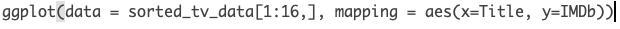

# Definitions & Rules

This is a reference guide to look back on when you're stuck. These definitions and rules are not expected to be understood right now but it's important you know you can look back on this as a quick-reference. 

## Important R Programming Definitions

Read through these now to get familiar and refer back to these whenever you need a refresher. You're not expected to have these memorized or even understood at this moment. These will make more sense as we progress through the course.

| Coding Name | Example | Definition |
|--------|------------------|--------------------------|
| syntax | R code | the nomenclature and structure of a programming language| 
| debugging | Failed R run | debugging involves fixing R code that is written incorrectly and doesn't run |
| variable | `names` | Variables are used to store data, whose value can be changed according to our need. Variables can be declared using `<-` (tradiational way) **or** by `=` (conventional way) |
| package | `library(ggplot2)` | A collection of functions prewritten in R| 
| function | `print()` | A function is a set of statements organized together to perform a specific task. R has a set of preloaded functions that are part of the `base` package. If a function cannot be found as part of the `base` package, the function has likely already been built under another package that needs to be loaded in. **Functions can be identified due to their enclosing parantheses ()**|
| arguments | `read.csv(file = "datasets/tv_shows.csv", header = FALSE)`| Components of a function that are separated by commas and declared using the `=` sign. Arguments in this example are `file = ` and `header = `|
| index | `tv_data[3,55]` | The position of data within a data frame, matrix, list, vector, etc. In R, data is **indexed as [row,column] and indexing is done via brackets []** | 
| loop | `for (n in names){print(n)}`| Repeats a task for a specified number of times. Saves a programmer from repeating codelines with different parameters. |
| logical | `TRUE, FALSE` | TRUE and FALSE logical operators are declared using all caps  | 
| arithmetic operators | `+,-,*,/,^` | Math operators used for addition, subtraction, multiplication, division, exponent, respectively. |
| comparison operators | `==, <, >, <=, >=, !=`| Is equal to, less than, greater than, less than or equal to, greater than or equal to, is NOT equal to, respectively | 
| and/or operators  | `&, |` | AND, OR | 
| string | `a_string = "anythign within quotes, single or double"` | Any value written within a pair of single quote or double quotes in R is treated as a string. |
| numeric | `1` | Any number - integer, float, etc. |
| vector | `as.vector(x = c(1,2,3,4))` | Vectors are the most basic R data objects and there are six types of atomic vectors. They are logical, integer, double, complex, character and raw.|
| lists | `list('Peter', 'Sarah', 'Tom', 'Helen')` | Lists are the R objects which contain elements of different types like − numbers, strings, vectors and another list inside it|
| matrix | `matrix(c(1:5), nrow = 3, byrow = TRUE)` | Matrices are the R objects in which the elements are arranged in a two-dimensional rectangular layout.| 
| array | `array(data = c(1,2,3))`| Arrays are the R data objects which can store data in more than two dimensions. For example − If we create an array of dimension (1, 2, 3) then it creates 3 rectangular matrices each with 1 rows and 2 columns. Arrays can store only one data type.| 
| data frame | `data.frame(tv_data)` | R version of Excel Spreadsheet. A data frame is a table or a two-dimensional array-like structure in which each column contains values of one variable and each row contains one set of values from each column. | 
| factor | `factor()` | Factors are the data objects which are used to categorize the data and store it as levels. They can store both strings and integers. They are useful in the columns which have a limited number of unique values. Like "Male, "Female" and True, False etc. They are useful in data analysis for statistical modeling.| 
| help | `help(read.csv)` | Default helper function in R. Opens up documentation on a particular function in the lower right quadrant of R. | 
| class | `class(tv_data)` | Tells us what R is recognizing something as |
| concatenate (`c`) | c("a", "b", "c") |  A quick utility for concatenating strings together |
| filepath | "/Users/james/Downloads/" |  The location on your computer where a file is stored. A filepath with a leading slash (akak "/" ) is also referred to as root. Root is the furthest back you can go on your computer. Think of a filepath like this - "/Earth/UnitedStates/Delaware/Newark/" |

[Additional examples can be found here](https://www.tutorialspoint.com/r/index.htm)

## Rules

1. Parantheses (), Brackets [], Curly brackets {}, Quotations "" must be used in pairs

  A **very important** aspect to pay attention to are the parantheses, brackets, and curly brackets. Each time we use one of these, the brackets **must be opened, then must be closed**. What I mean by this is the following: Notice how when we use the `head()` function, we do so like this `head(sorted_tv_data)`. `sorted_tv_data` goes **inside** the enclosed parantheses and thus is an *argument* of the `head()` function. 
  
  Now let's look at a more complicated example. Similar to the rules of PEMDAS that we learned in algebra, the start and ending of parantheses work in the same way. For example:
  
  `ggplot(data = sorted_tv_data[1:16,], mapping = aes(x=Title, y=IMDb))`
  
  The `ggplot` function encloses *another* function by the name of `aes` (stands for aesthetics). Before we *close* the `ggplot` function, we *open* the `aes` function. This is because the `aes` function is declared **within** the `ggplot` function. We must **close** the `aes` function *before* we close the `ggplot` function. In other words, follow along with this example:
  
    `function(inside_function(inside_inside_function()))`
  
  The inside_inside_function is here:
  
    function(inside_function(**inside_inside_function()**))
  
  The inside_function is here:
  
    function(**inside_function(inside_inside_function())**)
  
  The first functions parantheses are enclosing the bolded above. Placing functions within one another is referred to as **nested functions**. This is handy, but can be difficult to read if too many functions are nested as things are evaluated from the inside out. If you're ever confused about where a functions parentheses begins and ends, simply place your cursor *to the right* of a parenthesis.
  
  ```{r, echo=FALSE, out.width="100%", fig.align="center"}
    
  ```

  Always close your parantheses in the right place. The same applies to quotes ( both `""` and `''` )
  
2. If you don't have a package, you must install that package.

3. Packages MUST be loaded for each R session.

4. Variable names cannot replicate function/package names.


## General Recommendations 

1. Comment, comment, comment. A comment is a brief note on what you were doing when you wrote a line of code. For example, if you write some R code that edits part of a dataframe (R's version of an Excel Spreadsheet), comment what you were thinking here and why you did it this way. Once you become comfortable coding in R, you'll be able to churn out new R scripts at a faster rate. It's very important that you comment on what you're doing at each step in the script so if you need to look back on something you wrote you can reference what you were doing there. A comment in R is declared using the pound symbol (#). 

2. Keep raw data raw. An advantage of R is being able to read in an original spreadsheet and output a new spreadsheet as a separate file. In other words, when you read in a dataset (for example, `tv_shows.csv`) and make changes to this file, do not save it was `tv_shows.csv` - thus overwriting the file. Instead, name it something like `tv_shows_edited.csv`. Also, notice how we use underscores (`_`) in between words of a filename - this is good practice that should be replicated (spaces are bad, see 4)

3. When in doubt, Google your R question - [look for StackOverflow links](https://stackoverflow.com/). StackOverflow is a web-forum where programmers can post questions for help. This is an incredible tool that even advanced programmers and developers use daily. There are other helpful forums out there - StackOverflow is the most popular. 

4. Spaces in variable/file names are BAD. A variable is an object or column that you create in R. For example, if you have a list of student names (`student_names = list("John", "Peter", "Sebastian")`, the variable here would be `student_names`. Let's get into the habit of using underscores '_' or dashes '-' or periods '.' to separate words instead of spaces. From the computers side of variable name storage, it's much safe to declare a variable name such as **data_file** as opposed to **data file**

Keep in mind, these will make more sense after we get more familiar with R - it's alright if they're confusing right now!


## Checkpoint - Writing your first R code

Let's write an R script that prints out names, run the code to make sure it works properly, and then save it.

```{r}
# load the base package - remember the # key indicates a comment, R does not run these lines of code!
library(base)

# let's create a list with our names 
names = list('Peter', 'Sarah', 'Tom', 'Helen')

# now let's use the print function to print out those names
print(names)
```

You can copy and paste this code in your script quadrant and then Run the code as specified above. You can also paste it directly into your console and click enter but note that doing so this way **will not save your code**. We write scripts, save them, and then run them in the console. 

Here's what it looks like when we copy it to the Script quadrant.

```{r, echo=FALSE, out.width="100%", fig.align="center"}
knitr::include_graphics("images/first_r_script.png")  
```

Now here's what it looks like after I run the code...

```{r, echo=FALSE, out.width="100%", fig.align="center"}
knitr::include_graphics("images/first_r_script2.png")  
```

## Explanation - Writing your first R code

**Line by Line Explanation** 

In this example, we created a variable called `names` (the object or thing that we create in R that can be called on by it's variable name - think of this a sa column in Excel). We used the `list()` function to populate a list of names (we know it's a function because of the `()`). Then we used the `print()` function to print out the `names` variable. Once the script has been written, we can navigate to **File -> Save As...-> `print_names.R` **. Remember, **no spaces** in the filename and it must be saved as **.R**. 

**What's going on with R/RStudio here?**

We wrote our script in the Script quadrant of Rstudio. When we were ready to run the script, we ran the code which sent the code down to the `console` quadrant. The `console` quadrant is where the R programming language is actually running. Our fancy RStudio application talks to R for us so we don't have to. Note that our `names` variable can be found in the `Variable Environment` quadrant since we ran that object in R. It can now be called on anytime. Now we can see how RStudio is really the middle-man between us and R. Note the term using R may be used as short-hand for saying using RStudio - it's no longer important to state the difference now that we know what's really going on.


