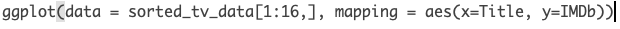

# Technical Definitions & Rules

## Important R Programming Definitions

Read through these now to get familiar and refer back to these whenever you need a refresher. You're not expected to have these memorized or even understood at this moment. These will make more sense as we progress through the course.

| Coding Name | Example | Definition |
|--------|------------------|--------------------------|
| syntax | R code | the nomenclature and structure of a programming language| 
| debugging | Failed R run | debugging involves fixing R code that is written incorrectly and doesn't run |
| variable | `names` | Variables are used to store data, whose value can be changed according to our need. Variables can be declared using `<-` (tradiational way) **or** by `=` (conventional way) |
| package | `library(ggplot2)` | A collection of functions prewritten in R| 
| function | `print()` | A function is a set of statements organized together to perform a specific task. R has a set of preloaded functions that are part of the `base` package. If a function cannot be found as part of the `base` package, the function has likely already been built under another package that needs to be loaded in. **Functions can be identified due to their enclosing parantheses ()**|
| arguments | `read.csv(file = "datasets/tv_shows.csv", header = FALSE)`| Components of a function that are separated by commas and declared using the `=` sign. Arguments in this example are `file = ` and `header = `|
| index | `tv_data[3,55]` | The position of data within a data frame, matrix, list, vector, etc. In R, data is **indexed as [row,column] and indexing is done via brackets []** | 
| loop | `for (n in names){print(n)}`| Repeats a task for a specified number of times. Saves a programmer from repeating codelines with different parameters. |
| logical | `TRUE, FALSE` | TRUE and FALSE logical operators are declared using all caps  | 
| arithmetic operators | `+,-,*,/,^` | Math operators used for addition, subtraction, multiplication, division, exponent, respectively. |
| comparison operators | `==, <, >, <=, >=, !=`| Is equal to, less than, greater than, less than or equal to, greater than or equal to, is NOT equal to, respectively | 
| and/or operators  | `&, |` | AND, OR | 
| string | `a_string = "anythign within quotes, single or double"` | Any value written within a pair of single quote or double quotes in R is treated as a string. |
| numeric | `1` | Any number - integer, float, etc. |
| vector | `as.vector(x = c(1,2,3,4))` | Vectors are the most basic R data objects and there are six types of atomic vectors. They are logical, integer, double, complex, character and raw.|
| lists | `list('Peter', 'Sarah', 'Tom', 'Helen')` | Lists are the R objects which contain elements of different types like − numbers, strings, vectors and another list inside it|
| matrix | `matrix(c(1:5), nrow = 3, byrow = TRUE)` | Matrices are the R objects in which the elements are arranged in a two-dimensional rectangular layout.| 
| array | `array(data = c(1,2,3))`| Arrays are the R data objects which can store data in more than two dimensions. For example − If we create an array of dimension (1, 2, 3) then it creates 3 rectangular matrices each with 1 rows and 2 columns. Arrays can store only one data type.| 
| data frame | `data.frame(tv_data)` | R version of Excel Spreadsheet. A data frame is a table or a two-dimensional array-like structure in which each column contains values of one variable and each row contains one set of values from each column. | 
| factor | `factor()` | Factors are the data objects which are used to categorize the data and store it as levels. They can store both strings and integers. They are useful in the columns which have a limited number of unique values. Like "Male, "Female" and True, False etc. They are useful in data analysis for statistical modeling.| 
| help | `help(read.csv)` | Default helper function in R. Opens up documentation on a particular function in the lower right quadrant of R. | 
| class | `class(tv_data)` | Tells us what R is recognizing something as |
| concatenate (`c`) | c("a", "b", "c") |  A quick utility for concatenating strings together |
| filepath | "/Users/james/Downloads/" |  The location on your computer where a file is stored. A filepath with a leading slash (akak "/" ) is also referred to as root. Root is the furthest back you can go on your computer. Think of a filepath like this - "/Earth/UnitedStates/Pennsylvania/Lancaster/" |

[Additional examples can be found here](https://www.tutorialspoint.com/r/index.htm)

## Definitions in Action - TV Data Example

Now that we're comfortable with R Studio and have some definitions under our belt, let's dive in a little into some R code and discuss it. Here is a script that loads a dataset about TV shows and examines their IMDb rating. We downloaded this dataset already and can likely be found in your Downloads folder. You'll need to unzip `dataforge-master.zip`. The file will be stored in `dataforge-master/datasets/tv_shows.csv`

**First, let's just show the script without running it.**


```{r, eval=FALSE}
# Load in the dataset using the read.csv() function
tv_data = read.csv(file = "/Users/james/Downloads/dataforge-master/datasets/tv_shows.csv", header = FALSE)

# have R tell us what class tv_data is
class(tv_data)

# find the number of rows
nrow(tv_data)

# print the top 5 rows of the dataset using the head() function
head(tv_data)

# another way to print out the first 5 rows
print(tv_data[1:5, ])

# print out the first 5 rows of the tv_data Title column
head(tv_data$Title)

# print out the first 5 rows of the tv_data Title Column
head(tv_data['Title'])

# print out the first 7 rows of the tv_data Title Column
print(tv_data['Title'][1:7,])

# sort the tv_data dataframe by the IMDb column from High values to Low values
sorted_tv_data = tv_data[order(tv_data$IMDb, decreasing = TRUE), ]

# print the top 5 rows of the dataset
head(sorted_tv_data)

# a column X is bugging me and shouldn't be there - let's NULL it out to remove it from our dataframe
sorted_tv_data$X = NULL

# print the first 10 rows of the sorted_tv_data column
print(sorted_tv_data[1:10,])

# Barplot the first 16 rows of tv data 
ggplot(data = sorted_tv_data[1:16,], mapping = aes(x=Title, y=IMDb)) + geom_bar(stat = "identity") + theme(axis.text.x=element_text(angle=45, hjust=1))
```


Now, let's run the script. Note that this will run line by line, so below each snippet of code, **R will execute the code. Remember, the code is executed in the console. R output is designated by the `##` **


```{r, out.width="100%", fig.align="center"}
library(ggplot2)

# Load in the dataset using the read.csv() function
tv_data = read.csv("/Users/james/Downloads/dataforge-master/datasets/tv_shows.csv")

# have R tell us what class tv_data is
class(tv_data)

# print the top 5 rows of the dataset using the head() function
head(tv_data)

# another way to print out the first 5 rows
print(tv_data[1:5, ])

# print out the first 5 rows of the tv_data Title column
head(tv_data$Title)

# print out the first 5 rows of the tv_data Title Column
head(tv_data['Title'])

# print out the first 7 rows of the tv_data Title Column
print(tv_data['Title'][1:7,])

# sort the tv_data dataframe by the IMDb column from High values to Low values
sorted_tv_data = tv_data[order(tv_data$IMDb, decreasing = TRUE), ]

# print the top 5 rows of the dataset
head(sorted_tv_data)

# a column X is bugging me and shouldn't be there - let's NULL it out to remove it from our dataframe
sorted_tv_data$X = NULL

# print the first 10 rows of the sorted_tv_data column
print(sorted_tv_data[1:10,])

# Barplot the first 16 rows of tv data 
ggplot(data = sorted_tv_data[1:16,], mapping = aes(x=Title, y=IMDb)) + geom_bar(stat = "identity") + theme(axis.text.x=element_text(angle=45, hjust=1))

```

### Line by Line Discussion

Remember that you are not expected to understand this completely at this point - let's run through this and familiarize ourselves with the code. 


| Code | Discussion |
|--------------------------|----------------------------------|
|`tv_data = read.csv(file = "/Users/james/Downloads/dataforge-master/datasets/tv_shows.csv")`| `tv_shows.csv` is our `filename`. `"/Users/james/Downloads/dataforge-master/datasets/"` is the `filepath` (the location on our computer where the file is stored). We open the file using the `read.csv()` function. Within the `read.csv()` function, we used the `file = ` argument to state which file we wanted to open - note that within functions, arguments can **only** be specified via the `=` sign. We name our dataset as `tv_data`. Notice that we used the `=` operator to declare our dataset as `tv_data`, but we also could've used the traditional way of `<-`. Note that if you're ever confused about where your file is stored, you can enter read.csv(file = "") into R and with your cursor between the quotations, hit the **tab** key on your keyboard. This will have R tell you the starting location of where it's looking for the file. Once this is loaded, **run this line of code** - now `tv_data` is an R `data.frame` |
| `class(tv_data)` | We use the `class()` function to have R tell us the class of our `tv_data` |
| `nrow(tv_data)` | we use the `nrow()` function have R tell us the number of rows in `tv_data` |
| `head(tv_data)` | The `head()` function prints out the first 5 rows of an R dataframe. This is the same as viewing the first 5 rows in Microsoft Excel| 
| `tv_data[1:5,]` | Here we use indexing (via the `[]` brackets) to print out the first 5 rows of the `tv_data` dataframe `tv_data[row 1 to row 5, all columns]`. In R, the rows and columns are separated by a comma and the colon symbol can be interpreted as `to`. So, when we have `[1:5,]` we're telling R to print row 1 to row 5. By leaving the column part blank (aka part after the comma), we're telling R to print all columns from the specified rows.| 
| `head(tv_data$Title)` | We print out the first 5 rows of the `Title` column of the `tv_data` dataframe. We query the `Title` column using the `$` key. If we type `tv_data$` and hit the `Tab` key on our keyboard, R presents us with autocomplete options which are the column names within the `tv_data` dataset | 
| `print(tv_data['Title'][1:7,])` | We print out the first 7 rows of the `Title` column using the index method. When querying a column/variable from a dataframe, we can either use the `tv_data$Title` or we can use the `tv_data['Title']`. The additional brackets showing `[1:7,]` print the first 7 rows.  | 
|`sorted_tv_data = tv_data[order(tv_data$IMDb, decreasing = TRUE), ]` | Here we create a new dataframe called `sorted_tv_data` where we order the `tv_data` dataframe by each rows `IMDb` score. This can be read as `from the tv_data dataframe, order the all of the rows based on the tv_data$IMDB column with decreasing order`. `order()` is a function and `decreasing = TRUE` is an argument of that function. Since the columns are remaining the same, we leave the space after the `,` blank. | 
| `head(sorted_tv_data)`| Print the first 5 lines of our new `sorted_tv_data` dataframe. | 
| `sorted_tv_data$X = NULL` | We notice a column named `X` and see that it has no meaning since we have a default row number within the R dataframe. We want to delete this column without disturbing the rest of the dataframe. We do so by telling R that the `X` column shall be converted to `NULL`, thus removing the column| 
| `ggplot(data = sorted_tv_data[1:16,], mapping = aes(x=Title, y=IMDb)) + geom_bar(stat = "identity") + theme(axis.text.x=element_text(angle=45, hjust=1))` | Create a `ggplot` instance from the `ggplot2` package. We first create the `ggplot` instance, declare the `data` as the first 16 rows of the `sorted_tv_data`, declare the `mapping` aesthetics (`aes`) where we set the `x` axis of the plot equal to the `sorted_tv_data` `Title`, and the `y` axis equal to the `sorted_tv_data` `IMDB` rating. Once `ggplot` understands the dataset we want to plot and what goes to each axis, we `+` add a `geom_bar` to the code, telling `ggplot` that we want a barplot. We do need to add one argument within the `geom_bar` function and that is `stat = "identity"`. `stat` is the statistical transformation to use on the data for this layer. It's a fancy way of saying "what should the bars represent?". In our case, we set `stat = "identity"` so that the heights of the bars to represent values in the data. `ggplot2` is the most popular plotting package in R and creates some beautiful plots. We'll learn more about `ggplot2` in the next section.   | 

Need a little more help on a function used above? Use the `help` feature by running the following in your console!

```{r, eval=FALSE}
help(ggplot)
```

## Parantheses (), Brackets [], and Curly brackets {}

A **very important** aspect to pay attention to are the parantheses, brackets, and curly brackets. Each time we use one of these, the brackets **must be opened, then must be closed**. What I mean by this is the following: Notice how when we use the `head()` function, we do so like this `head(sorted_tv_data)`. `sorted_tv_data` goes **inside** the enclosed parantheses and thus is an *argument* of the `head()` function. 

Now let's look at a more complicated example. Similar to the rules of PEMDAS that we learned in algebra, the start and ending of parantheses work in the same way. For example:

`ggplot(data = sorted_tv_data[1:16,], mapping = aes(x=Title, y=IMDb))`

The `ggplot` function encloses *another* function by the name of `aes` (stands for aesthetics). Before we *close* the `ggplot` function, we *open* the `aes` function. This is because the `aes` function is declared **within** the `ggplot` function. We must **close** the `aes` function *before* we close the `ggplot` function. In other words, follow along with this example:

  `function(inside_function(inside_inside_function()))`

The inside_inside_function is here:

  function(inside_function(**inside_inside_function()**))

The inside_function is here:

  function(**inside_function(inside_inside_function())**)

The first functions parantheses are enclosing the bolded above. Placing functions within one another is referred to as **nested functions**. This is handy, but can be difficult to read if too many functions are nested as things are evaluated from the inside out. If you're ever confused about where a functions parentheses begins and ends, simply place your cursor *to the right* of a parenthesis.

```{r, echo=FALSE, out.width="100%", fig.align="center"}
  
```

  Rule: Always close your parantheses in the right place. The same applies to quotes ( both `""` and `''` )

You are not expected to fully grasp everything at this point. As we progress through the tutorials, these concepts will make more sense. 


