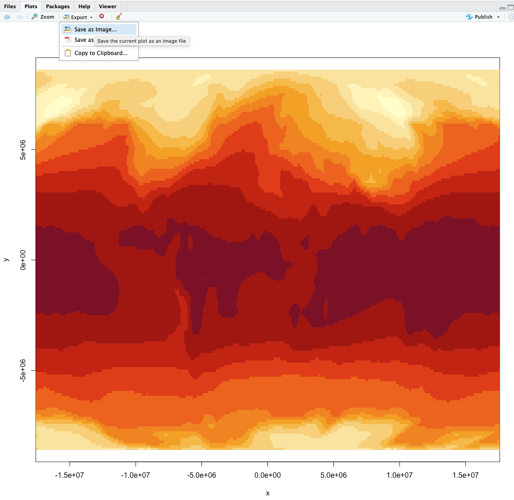

# Basic R Scripts

In this example, we'll begin with data science question and answer it in R. We'll go through these scripts line by line to show how we can use R. To follow along, copy each of these lines and paste them in your R Script (top left quadrant). Once it's pasted there, we can run each line and view the output in the R Console (bottom left quadrant).

## Global Carbon-Dioxide Concentrations

CO2 is a greenhouse gas responsible for trapping heat. Human's have released more CO2 into the atmosphere through industrialism. How have global carbon-dioxide (CO2) concentrations changed over time? 

First, we load the dataset. In our case, the dataset we'll be using is pre-built into R as `co2`, meaning we don't need to download this dataset, we just need to call it. The `co2` dataset contains atmospheric concentrations of CO2 are expressed in parts per million (ppm). This data is a time-series of monthly CO2 concentrations recorded between 1959 and 1997. First, let's make sure the pre-built data is installed correcly. 

```{r}
co2
```

This dataset is stored in R as `co2`. We can create a new variable called co2_data that replicates this `co2` dataset.

```{r}
co2_data <- co2
co2_data
```

We replicate this dataset and rename it as `co2_data` so that it's a variable that is shown in our global environment (top right quadrant).

What class is this data?

```{r}
class(co2_data)
```

A `ts` class is a time-series class. We can print out a summary of the co2 dataset like so. 

```{r}
summary(co2_data)
```

The `summary()` function is a base function R offers for quick statistics. 

How long is this dataset?


```{r}
length(co2_data)
```

468 months worth of CO2 observations. 

Can we plot this dataset?

```{r}
plot(x = co2, ylab = "Atmospheric concentration of CO2 (ppm)", main = "CO2 Dataset")
```

Altogether, this script looks like this...


```{r, eval=FALSE}
# make sure the dataset is loaded - it's a prebuilt dataset automatically loaded into R
co2

# rename the dataset as co2_data so it is visible in our global environment
co2_data <- co2
co2_data

# identify the class of the co2_data object
class(co2_data)

# print the summary of the co2_data dataset
summary(co2_data)

# find the length of the co2_data dataset using the length() function
length(co2_data)

# plot the dataset using the default plot function
plot(x = co2, ylab = "Atmospheric concentration of CO2 (ppm)", main = "CO2 Dataset")
```

Above is our script. We run this script in the console. We can save this script and re-run this at any time. An example of this would be saving this file as `co2_script.R`. Once this is saved, you can close R, re-open it, and re-run your `co2_script.R` without re-writing any code. 

### Saving your plot

We can save any plot from the R plot window. Simply navigate to the **Plots** tab and select **Export** then **Save As Image**. 

```{r, echo=FALSE, out.width="60%", fig.align="center"}
  
```


## Cars - Motor Trends Magazine Data

The data was extracted from the 1974 Motor Trend US magazine, and comprises fuel consumption and 10 aspects of automobile design and performance for 32 automobiles (1973–74 models).

Load the dataset - again this is a pre-loaded dataset, but let's call on it so we can bring it into our global environment.

```{r}
data('mtcars')
head(mtcars)
```

The `head()` function is a quick function that prints out the first few rows of a dataset. 

What's exactly is `mtcars`?

```{r}
class(mtcars)
```

It's a data.frame. Data Frames have a different storage than time series. You can also view this dataframe by clicking on the `mtcars` dataframe in your global environment. What are the dimensions of this dataframe? How many rows and columns does it have?


```{r}
dim(mtcars)
nrow(mtcars)
ncol(mtcars)
```

We have 32 rows and 11 columns within this dataframe. 

What are our column names?

```{r}
colnames(mtcars)
```

What are our row names (aka the make of the car)?

```{r}
rownames(mtcars)
```

How do we extract individual columns/variables from this dataframe?

```{r}
mtcars["mpg"]
```

We can also extract the vector of data using the `$` operator.

```{r}
mtcars$mpg
```

What are the statistics like for each variable?

```{r}
summary(mtcars)
```

Notice that now the `summary()` function is printing out the summary statistics for each column (aka variable) within our dataframe (`mtcars`)

What if we just wanted to focus on the first 5 cars in the dataset? We need to index.

```{r}
mtcars[1:5,]
```

Remember, data is stored as `Row, Column`. Above, we're `indexing` the first 5 rows and then including all columns. What if we just wanted to focus on the first column?

```{r}
mtcars[1:5,1]
```

That's the `mpg` column of the first 5 cars. Which car has the best miles per gallon (mpg)?

```{r}
barplot(height = mtcars$mpg[1:5], names.arg = rownames(mtcars)[1:5])
```

The Datsun 710 has the highest MPG rating of the first 5 cars (rows) in the dataset. 

The entire script looks like this:

```{r, eval=FALSE}
# load the data - the mtcars dataset is pre-built 
data('mtcars')

# print out the first few rows of the dataset using the head() function
head(mtcars)

# print the class of the mtcars dataset
class(mtcars)

# dimensions of the mtcars dataframe
dim(mtcars)

# number of rows
nrow(mtcars)

# number of columns
ncol(mtcars)

# column names
colnames(mtcars)

# row names
rownames(mtcars)

# selecting the miles per gallon column
mtcars["mpg"]

# selecting the vector of the mpg column
mtcars$mpg

# printing a summary of the dataframe
summary(mtcars)

# indexing the first 5 rows, including all of the columns
mtcars[1:5,]

# indexing the first 5 rows and the 1st column
mtcars[1:5,1]

# creating a barplot of mpg for the first 5 cars
barplot(height = mtcars$mpg[1:5], names.arg = rownames(mtcars)[1:5])
```

