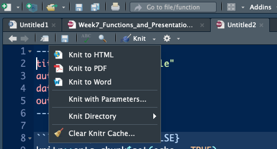

# Functions and Code Presentation

In this tutorial, we'll focus on functions and displaying R code & results with style. Functions are important for code speed and documentation. Presenting R code is important if you need to explain how to do something using R (i.e. this tutorial). We'll start by explaining functions and proceeding through a complex example. Afterwards, we'll show how `RMarkdown` works so you can present a complex function of your own. 

## Functions
We create functions to speed up and organize code. So far, we've only been coding things via scripting and occasionally using for loops. While this is fine, it's slower than writing functions would be. Writing or creating functions is considered much cleaner and more *proper*. As a recap, whenever we use the phrase `library(ncdf4)` we are loading the `ncdf4` package. Within that package are a number of `.R` scripts/files that contain functions that someone has been kind enough to write for the world. By using `library(ncdf4)`, R reads in all of those functions and thus knows what we want when we execute a function like `nc_open()`. Instead of re-writing the pure function of `nc_open()` over and over again every time we want to open a netcdf file, we are able to just load the function. Before we get further into `ncdf4`, let's write some R code to square a sequence of values. 

```{r}
# square a sequence of values with start of 5 and stop of 10
arg1 = 1
arg2 = 5
my.seq = seq(arg1, arg2, 1)
my.seq.squared = my.seq ** 2
my.seq.squared
```

This code is straight-forward and light. Let's now assume, however, that we want to run this code on multiple sets of start and stop values. If we turn the code above into a function, this is streamlined.

```{r}
# create a function called seq_squared
seq_squared = function(arg1, arg2){
  my.seq = seq(arg1, arg2, 1)
  my.seq.squared = my.seq ** 2
  return(my.seq.squared)
}

seq_squared(arg1 = 5, arg2 = 10)
```

Above we have a function that takes in start and stop values of a sequence, uses these values to make a sequence, and returns the squares of each of these values. We create a new `function` in R using the `function` R call and name it `seq_squared`. When we write a function of our own, we can add in our own arguments as we see fit. In this case, we create arguments named `arg1` and `arg2`. These arguments are used to create `my.seq` which is a sequence within our `xfunc` function. We create a `my.seq.squared ` variable which is a vector of `my.seq` values squared. Ultimately, `my.seq.squared` is the output of our function. It's what we include in our `return` statement. Every function requires something to be returned, and `my.seq.squared` is the output of our `seq_squared`. 

## NetCDF Processing Function
Loading in all of the weather data from Willow Creek, WI is cumbersome. Let's write a function that reads in the data and converts everything to a dataframe for us. 

```{r}
library(ncdf4)
read.wcr = function(fname) {
  fullname = strsplit(fname, "/")
  dataset_str = fullname[[1]][length(fullname[[1]])]
  datname = strsplit(dataset_str, "_")[[1]][1]
  data.year = substr(dataset_str, nchar(dataset_str)-6, nchar(dataset_str)-3)
  data.date = seq(from=as.POSIXct(paste0(data.year,"-1-1 0:00", tz="UTC")),to=as.POSIXct(paste0(data.year,"-12-31 23:00", tz="UTC")),by="hour")
  vars.info <- data.frame(CF.name = c("date", "air_temperature", "precipitation_flux", "surface_downwelling_shortwave_flux_in_air",
                                      "specific_humidity", "surface_downwelling_longwave_flux_in_air", "air_pressure",
                                      "eastward_wind", "northward_wind", "wind_speed"))
  df <- list()
  tem <- ncdf4::nc_open(fname)
  dim <- tem$dim
  for (j in seq_along(vars.info$CF.name)) {
    if (exists(as.character(vars.info$CF.name[j]), tem$var)) {
      df[[j]] <- ncdf4::ncvar_get(tem, as.character(vars.info$CF.name[j]))
    } else {
      df[[j]] = NA
    }
  }
  names(df) <- vars.info$CF.name
  df <- data.frame(df)
  nc_close(tem)
  if(all(is.na(df$date))){
    df$date = data.date
  }
  return(df)
}
```

In the function above, we've refactored code that we previously wrote to read in a Willow Creek netCDF file. `read.wcr` is our function name, the `function()` command tells R we're declaring a function. `fname` is one of the arguments that the function takes. For example, the function what we use for opening netCDF files - `nc_open()` has the following arguments...

`nc_open( filename, write=FALSE, readunlim=TRUE, verbose=FALSE, 
 	auto_GMT=TRUE, suppress_dimvals=FALSE )`
 	
The function we've coded above only takes the filename, but if our routine was more complex we could add more arguments in. Once the argument is taken in, we **generalize** naming schemes that are unimportant. Notice how we use object names like `tem` for example. This is short for temporary, and is set up to be overwritten if we were to use this function within a for loop to open multiple files.

Finally, focus in on the `return(df)` line - `return` is what we get out of a function. Now, let's actually use the `read.wcr()` function we wrote above. 

```{r}
wcr_df = read.wcr(fname = "~/Documents/Github/geog473-673/datasets/WCr_1hr.2010.nc")

summary(wcr_df)
```

It's as simple as that. This is why programming can become a black box and why we don't always look under the hood. Code and functions like the one above can be messy and as long as we understand the output we don't always care how it gets done. 

Remember that we have Willow Creek weather data for 2010, 2011, and 2012. Let's set up a for loop for this to show how we might read in all 3 years of data. We're going to use the `rbind()` function to latch on extra data here.

## Functions in For Loops

```{r}

# create a sequence of years for the years we have data
yearSeq = seq(2010,2012)

# begin the for loop to open each year of data
for (y in yearSeq){
  # use our read.wcr() function and paste in the filename that changes for each year of data
  tem_df = read.wcr(fname = paste0("~/Documents/Github/geog473-673/datasets/WCr_1hr.",y,".nc"))
  # != means DOES NOT EQUAL. This statement reads as - if y DOES NOT EQUAL the first year in yearSeq, proceed to use rbind
  # otherwise, if y is indeed the first year in yearSeq, we need to initialize wcr_df BEFORE we overwrite tem_df
  if (y != yearSeq[1]){
    wcr_df = rbind(wcr_df, tem_df)
  } else {
    wcr_df = tem_df
  }
}

length(wcr_df$date)
summary(wcr_df)
```

Remember, `!=` means DOES NOT EQUAL. This statement reads as - if `y` DOES NOT EQUAL the first year in `yearSeq`, proceed to use `rbind()`. Otherwise, if `y` is indeed the first year in `yearSeq`, we need to initialize `wcr_df` BEFORE we overwrite `tem_df`. 

Based on the summary we see that we have successfully merged the 3 datasets into one continuous dataset. Since we defined the function above, we don't need to make a messy for loop with all of the function bits in it. Functions speed up our program and also make for more sophisticated coding. 


## RMarkdown
Code is often messy and difficult to explain. One R feature that can make explaining code or a function easier is `RMarkdown`. This is how this textbook has been built. `RMarkdown` is a combination of HTML like syntax with R. Here is how you make an RMarkdown document.

- Open a new RMarkdown document - `File -> New File -> R Markdown...`

```{r, echo=FALSE, out.width="60%", fig.align="center"}
knitr::include_graphics("images/rmd1.png")
```

- Enter in details

```{r, echo=FALSE, out.width="60%", fig.align="center"}
knitr::include_graphics("images/rmd2.png")
```

- The initial RMarkdown should look like this

```{r, echo=FALSE, out.width="60%", fig.align="center"}
knitr::include_graphics("images/rmd3.png")
```

- We tell RMarkdown we want to write and run R code with 3 backticks and `{r}` -  **\```{r}**
- We end our R code section with 3 backticks - **\```**
- Thus, for our `my.seq.squared` function above, it would be coded like this in RMarkdown. 

**\```{r}**
```{r}
# create a function called seq_squared
seq_squared = function(arg1, arg2){
  my.seq = seq(arg1, arg2, 1)
  my.seq.squared = my.seq ** 2
  return(my.seq.squared)
}

```
**\```**

In our example here, R code is keyed in the R Markdown document like so. 

```{r, echo=FALSE, out.width="60%", fig.align="center"}
knitr::include_graphics("images/rmd4.png")
```

Notice the `cars` inside of `{r cars}`. This names the coding section but has no impact on the code itself. We do not need to name each coding section - `{r}` alone will suffice. 

Anything outside of the R code sections will show up as plain text. When we are finished with our R Markdown document, we need to `Knit` the document. See the blue yarn ball at the top of your script? This will create a new PDF file. 

```{r, echo=FALSE, out.width="60%", fig.align="center"}

```

Et Voila! A professional looking RMarkdown PDF that makes your R code easier to explain and present. [Here's what the output above should look like](https://github.com/jsimkins2/geog473-673/tree/master/Advanced_R/rmdtest.pdf)


## Assignment

Create a function that extracts and plots a spatial dataset given a time range. Follow the steps below:

1) Choose an online dataset like we did last week.
2) Create a function that extracts the data given a time range, creates a data frame and plots the dataset. 
3) Include arguments within the function such as time range, spatial extents, etc. 
4) Create an RMarkdown PDF that details how the function works.
5) Include an example of the function working to plot the given dataset 
6) Submit resulting PDF to Canvas week 7 assignment

