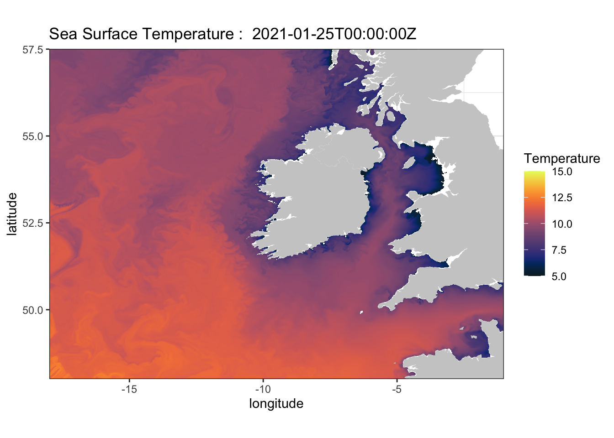

--- 
title: "R Programming for Geospatial Sciences"
author: "James Simkins"
date: "`r Sys.Date()`"
site: 'github.com/jsimkins2/geog473-673'
documentclass: book
biblio-style: apalike
link-citations: yes
description: "Advanced R"
---

# Preface

```{r, echo=FALSE, out.width="80%", fig.align="center"}

```


- Phase 1: Advanced R for Geospatial Sciences - 02/15/2021 - 04/16/2021 – 2cr

- Phase 2: Machine Learning with R – 04/19/2021 to 05/18/2021 – 1cr


The objective of the spring installment of GEOG 473/673 is to expand on the topics covered in the fall version of GEOG 473/673 – open source environmental computing. The course will be split into 2 phases. The first phase is a 2-credit course focused on using advanced tools within the R programming language. The goal of this phase is for students to gain practical experience with challenging R topics that can be used for generating publication quality material. The second phase is a 1-credit course focused on introducing machine learning practices and implementing these via R. Machine Learning is a growing practice in data science and can be useful for geospatial sciences. Students will apply R programming knowledge and gain confidence in machine learning techniques and application with R. This challenging, fast-paced course is intended for students that already have programming experience with R or Python.

## Course Github

https://github.com/jsimkins2/geog473-673

## Syllabus

https://github.com/jsimkins2/geog473-673/blob/master/documents/spring_geog473_673_syllabus.pdf

## Phase 1: Spring GEOG473-673 2-Credit Agenda
This course is split into 2 phases but this textbook will be the only material for both courses. YouTube recordings will accompany all tutorials. 

| Week | Topic |
|:----------|:----------|
|1 | [Customizing Plots](https://jsimkins2.github.io/geog473-673/plot-customization.html)|
|2 | [Basic Statistics](https://jsimkins2.github.io/geog473-673/basic-statistics.html)| 
|3 | [Plotting with `ggplot2`](https://jsimkins2.github.io/geog473-673/plotting-with-ggplot2.html)| 
|4 | [Spatial Plots with `ggplot2`](https://jsimkins2.github.io/geog473-673/spatial-plots-with-ggplot2.html)| |
|5 | [Shapefiles](https://jsimkins2.github.io/geog473-673/shapefiles.html)|
|6 | [Remote Data Extraction](https://jsimkins2.github.io/geog473-673/remote-data-extraction.html) |
|7 | [Functions and Code Presentation](https://jsimkins2.github.io/geog473-673/functions-and-code-presentation.html) |
|8 | [Project](https://github.com/jsimkins2/geog473-673/blob/master/documents/AdvancedR_finalproject.pdf)| 
|9 | [Project](https://github.com/jsimkins2/geog473-673/blob/master/documents/AdvancedR_finalproject.pdf)|

## Phase 2: Spring GEOG473-673 1-Credit Agenda
| Week | Topic |
|:----------|:----------|
|1 | [Machine Learning Intro](https://jsimkins2.github.io/geog473-673/machine-learning-with-r.html)|
|2 | [Time Series Forecasting](https://jsimkins2.github.io/geog473-673/time-series-forecasting.html)|
|3 | [Time Series Forecasting](https://jsimkins2.github.io/geog473-673/time-series-forecasting.html)|
|4 | [Random Forest Modeling](https://jsimkins2.github.io/geog473-673/random-forest-modeling.html)|
|5 | [Random Forest Modeling](https://jsimkins2.github.io/geog473-673/random-forest-modeling.html)|

