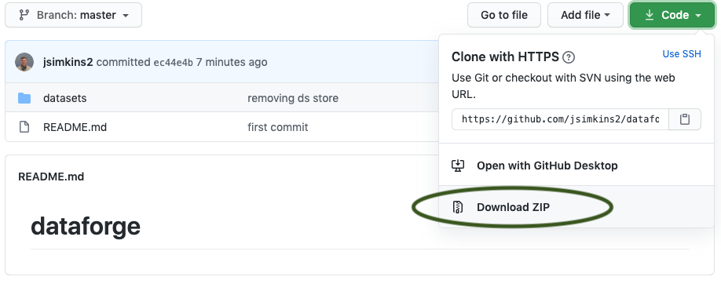

--- 
title: "Test"
author: "James Simkins"
date: "`r Sys.Date()`"
site: 'github.com/jsimkins2/geog473-673'
documentclass: book
biblio-style: apalike
link-citations: yes
description: "Phase 1 - Introduction to R"
---

# Welcome

```{r, echo=FALSE, out.width="100%", fig.align="center"}
knitr::include_graphics("images/goes_band13.png")  
```
Phase 1: Environmental Computing with R - 9/1/2020 to 10/1/2019 – 1cr

Phase 2: Spatial Computing with Python – 10/2/2020 to 12/10/2020 – 2cr

The objective of GEOG 473/673 Open-sourced Environmental Computing is for advanced undergraduate and graduate students to gain practical experience with R & Python, two industry-leading open-sourced programming languages. Both of these languages are used to assemble, read, and manage large geospatial and environmental datasets by academics, government scientists, and private industry. Each of these programming languages offer a plethora of free packages that allow a user to work with big spatial data in an analytical manner without paying a dime. The demand for students knowledgeable in R & Python is continuing to grow. It’s important to note that this is an Introduction to R (or Python), NOT an introduction to programming. This challenging, fast-paced course is intended for students that already have at least basic programming experience. 

## Syllabus

https://github.com/jsimkins2/geog473-673/blob/master/documents/fall_geog473_673_syllabus.pdf

## Agenda
This course is split into 2 phases - R and Python. For the R phase, this will be our scheudle.

|Week     |      Focus|
+
|1 | [An Introduction to R](#01-Overview)|
|2 | [R Syntax, Classes & Datatypes](#Week2: R Syntax, Classes, & Datatypes)| 
|3 | [Time Series Analysis with DEOS data](#05-Avacados2)| 
|4 | [Raster Analysis with Oceanography data](#06-visa)| |
|5 | [Resampling and Reprojecting Rasters with climatological temperature data](#07-visa)| |


Before the training, please do the following (10 minutes). All software is free and trusted. 

## Download and Install R

1. Navigate to the R website: <https://cloud.r-project.org/>


2. Click Download for your Operating System (Windows, Mac OSx, or Linux - if you don't have a MacBook, then you're using Windows most likely)

```{r, echo=FALSE, out.width="70%", fig.align="center"}
knitr::include_graphics("images/os_image.png")  
```


3. Click the most recent R version to download. Install the downloaded application as you would with any other application on your computer.

```{r, echo=FALSE, out.width="70%", fig.align="center"}
knitr::include_graphics("images/download_r.png")  
```


## Download and Install RStudio

1. Navigate to the RStudio Website: <http://www.rstudio.com/download> 


2. Click Download under RStudio Desktop Free

```{r, echo=FALSE, out.width="70%", fig.align="center"}
knitr::include_graphics("images/rstudio_download1.png")  
```


3. This website detects your operating system, allowing you to just click download again. *Note that if it doesn't automatically detect just select the download next to your operating system below this*

*Note that you may be asked to install command line developer tools if you're using a Mac - select Yes.*

```{r, echo=FALSE, out.width="70%", fig.align="center"}
knitr::include_graphics("images/Rstudio_download2.png")  
```


4. Install the downloaded application as you normally would on your computer. 


## Download workshop data

1. Navigate to the database - https://github.com/jsimkins2/geog473-673/tree/master/datasets

2. Click on **Code** - then click **download as zip**

```{r, echo=FALSE, out.width="70%", fig.align="center"}
  
```