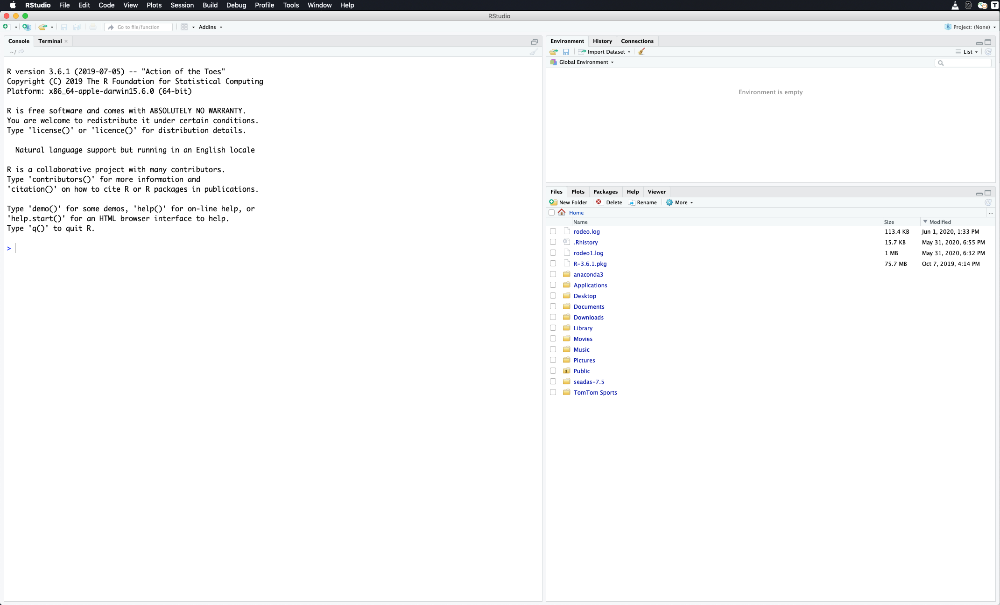
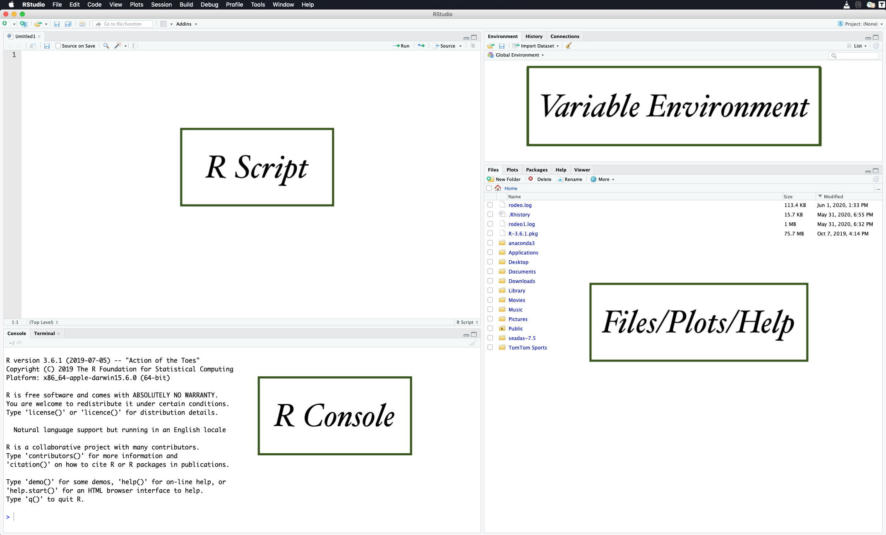
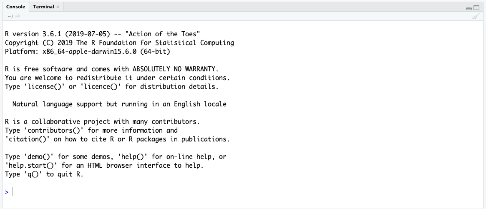
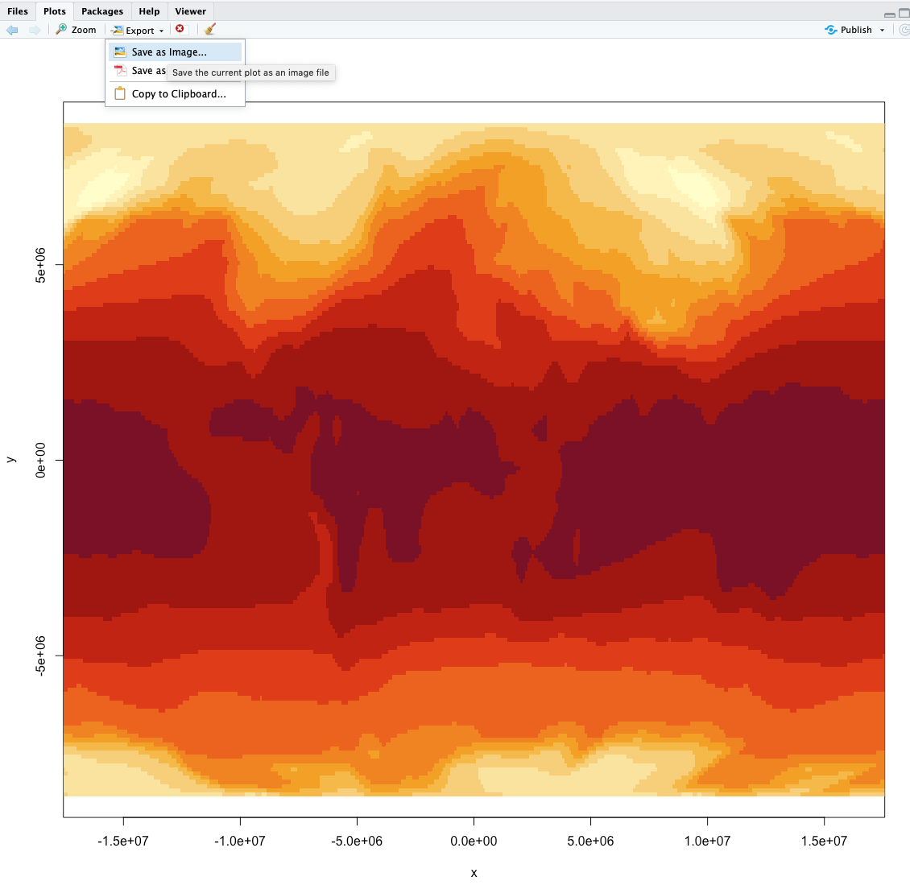
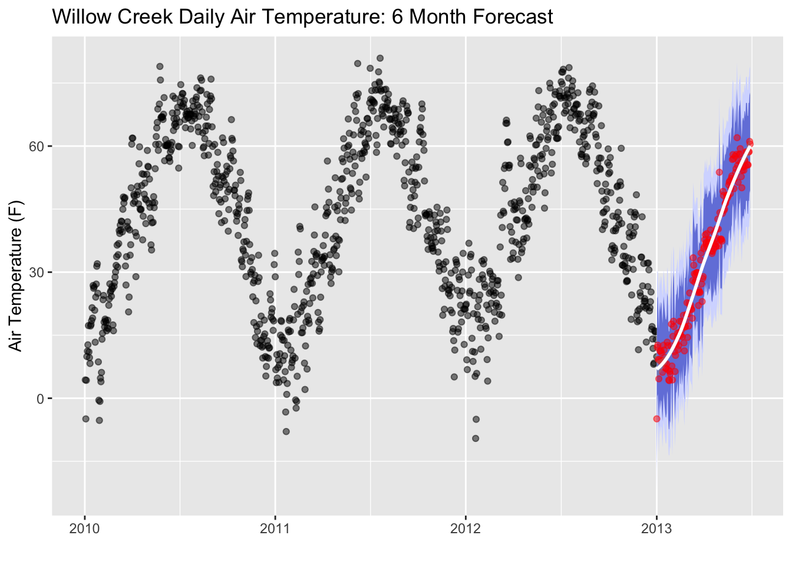
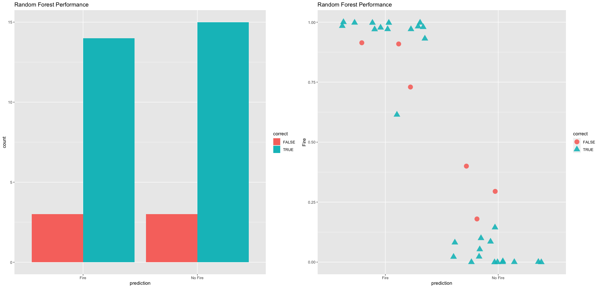

--- 
title: "Advanced R for Geospatial Sciences"
author: "James Simkins"
date: "`r Sys.Date()`"
site: 'github.com/jsimkins2/geog473-673'
documentclass: book
biblio-style: apalike
link-citations: yes
description: "Advanced R"
---

# Preface

```{r, echo=FALSE, out.width="100%", fig.align="center"}
knitr::include_graphics("images/goes_band13.png")  
```


- Phase 1: Advanced R for Geospatial Sciences - 02/15/2021 - 04/16/2021 – 2cr

- Phase 2: Machine Learning with R – 04/19/2021 to 05/18/2021 – 1cr


The objective of the spring installment of GEOG 473/673 is to expand on the topics covered in the fall version of GEOG 473/673 – open source environmental computing. The course will be split into 2 phases. The first phase is a 2-credit course focused on using advanced tools within the R programming language. The goal of this phase is for students to gain practical experience with challenging R topics that can be used for generating publication quality material. The second phase is a 1-credit course focused on introducing machine learning practices and implementing these via R. Machine Learning is a growing practice in data science and can be useful for geospatial sciences. Students will apply R programming knowledge and gain confidence in machine learning techniques and application with R. This challenging, fast-paced course is intended for students that already have programming experience with R or Python.


## Course Github

https://github.com/jsimkins2/geog473-673

## Syllabus

https://github.com/jsimkins2/geog473-673/blob/master/documents/fall_geog473_673_syllabus.pdf

## Agenda
This course is split into 2 phases but this textbook will be the only material for both courses. YouTube recordings will accompany all tutorials. 

|Week     |      Focus|
|----------|----------|
|1 | [An Introduction to R](https://jsimkins2.github.io/geog473-673/getting-started-with-r.html)|
|2 | [Scientific R Scripts](https://jsimkins2.github.io/geog473-673/scientific-r-scripts.html)| 
|3 | [Time Series Analysis with DEOS data](https://jsimkins2.github.io/geog473-673/time-series-fun-with-deos.html)| 
|4 | [Raster Analysis with Oceanography & Global Tree Cover data](https://jsimkins2.github.io/geog473-673/oceanography-global-tree-cover.html)| |
|5 | [Resampling and Reprojecting Rasters with climatological temperature data](https://jsimkins2.github.io/geog473-673/reprojecting-writing-rasters.html)| 

<!--chapter:end:Index.Rmd-->

# Getting Started with R

## Why is there such a buzz around R?

R is an open-source programming language used for data science, statistics, and data visualization. R is currently ranked as the [7th most popular language in the world](http://pypl.github.io/PYPL.html). Since R is open-source, anyone can contribute to or use R packages that contain pre-built functions/operations. This greatly accelerates our ability to share and collaborate. 

The first thing you need to do to get started with R is to install it
on your computer. R works on pretty much every platform available,
including the widely available Windows, Mac OS X, and Linux
systems. R takes up very little space on your machine, despite it's pleathora of data-science capabilities. All of these downloads are 100% free and trusted sources.

## Reasons to love R

| Attribute | Reason |
|----|----------|
| Speed | R is FAST. It can number crunch magnitudes faster than Microsoft Excel, for example. |
| Capacity | R can handle millions of data records. Large datasets that crash in Microsoft Excel or ArcGIS won't crash in R. |
| Risk Reduction | After writing a single R Script, the process of your data science routine is auditable and reproducible within milliseconds. We can write 1 script and make alterations as we see fit. We don't have to replicate a process of pointing and clicking in Microsoft Excel or ArcGIS. For example, if you are working with a dataset that multiple people are using, you can load this dataset in R and perform the tasks that you need *without* making any changes to the original dataset. |
| Visualizations | R is capable to create high quality visualizations and also has the capacity to create interactive visualizations that can easiliy be shared. Plots or images can easily be exported to PNG, JPEG, or even web-based interactive dashboards that can be hosted on a webpage |
| Collaboration | R script sharing is safe and easy. As mentioned above, a team using the same data input file but performing different tasks on it can do so without editing the data input file for everyone else. Data output can also be shared without the concern of a colleague editing the file output. RStudio connect or Github are also popular free track all changes that take place between R script files.|
| Price | R is completely free! Yes...every bit of it!  |

## Downloading Guide

1. Navigate to the R website: <https://cloud.r-project.org/>
  
  
2. Click Download for your Operating System (Windows, Mac OSx, or Linux - if you don't have a MacBook, then you're using Windows most likely)

```{r, echo=FALSE, out.width="70%", fig.align="center"}
knitr::include_graphics("images/os_image.png")  
```


3. Click the most recent R version to download. Install the downloaded application as you would with any other application on your computer.

```{r, echo=FALSE, out.width="70%", fig.align="center"}
knitr::include_graphics("images/download_r.png")  
```


## Rstudio

While R is the language, RStudio is the application we use to run R. Technically speaking, RStudio is an integrated development environment for R. RStudio makes coding in R easier by highlighting syntax, autocompleting symbols and names, and visualizing our R environment. These aspects are explained in further detail in the [R Coding Fundamentals] section. For now, let's download RStudio. 


1. Navigate to the RStudio Website: <http://www.rstudio.com/download> 
  
  
2. Click Download under RStudio Desktop Free

```{r, echo=FALSE, out.width="70%", fig.align="center"}
knitr::include_graphics("images/rstudio_download1.png")  
```


3. This website detects your operating system, allowing you to just click download again. *Note that if it doesn't automatically detect just select the download next to your operating system below this*

*Note that you may be asked to install command line developer tools if you're using a Mac - select Yes.*
  
```{r, echo=FALSE, out.width="70%", fig.align="center"}
knitr::include_graphics("images/Rstudio_download2.png")  
```


4. Install the downloaded application as you normally would on your computer. 


## Download Course Datasets

1. Navigate to the database - https://github.com/jsimkins2/geog473-673/tree/master/datasets

2. Click on **Code** - then click **download as zip**
  
```{r, echo=FALSE, out.width="70%", fig.align="center"}
knitr::include_graphics("images/download_as_zip.png")  
```

## Video Examples

If you want to watch a step-by-step tutorial on how to install
R for Mac or Windows, you can watch these videos courtest of Dr. Roger Peng

- [Installing R on Windows](http://youtu.be/Ohnk9hcxf9M)

- [Installing R on the Mac](https://youtu.be/uxuuWXU-7UQ)

- [Installing RStudio](https://youtu.be/bM7Sfz-LADM)

## Getting familiar with RStudio

By now you've downloaded R and RStudio and you're probably wondering, why do I need to download both? R is that programming language that is running on your computer. RStudio is what we call an Indegrated Development Environment (IDE) - this is a technical term for a pretty application that's all dressed up on the surface but underneath is really crunching some numbers (using R) at serious speeds. RStudio is the application we'll be using. Let's open RStudio and get familiar with it.


## Open RStudio
Navigate to your applications folder on your computer. Launch RStudio. When you open it for the first time, you should see this.


```{r, echo=FALSE, out.width="100%", fig.align="center"}
  
```


This is RStudio. When you open it for the first time, we'll need to open a new RScript to begin coding. 


**Open new R Script**


To open a new R Script, we select the blankpage with green plus icon and select R Script from the menu. 


```{r, echo=FALSE, out.width="100%", fig.align="center"}
knitr::include_graphics("images/new_script2.png")  
```


This opens up the new R script and we can begin coding in R. Now that we have the R Script open, you'll notice 4 quadrants. Let's run through what those quadrants are.


## R Studio Layout


```{r, echo=FALSE, out.width="100%", fig.align="center"}
  
```


Now let's describe what's going on here in a little more detail.


**R Script** - This is your canvas. This is where we write and edit our code. A lot of trial and error goes on here. 


```{r, echo=FALSE, out.width="100%", fig.align="center"}
knitr::include_graphics("images/script4.png")  
```


**R Console** - This is where you run your code. When we talk about running code, we mean we're telling R to execute the code we've written in the R Script. R Console is the place inside RStudio where we are using the R programming language. 


```{r, echo=FALSE, out.width="100%", fig.align="center"}
  
```


**Variable Environment** - This area keeps track of your variables, data tables, filenames, etc. Anything that you run in R that has a name will be stored here. Imagine the Variable Environment to be your closet - every time you make/buy a new sweater, the sweater goes in the closet. We can select data tables to view from this list here.


```{r, echo=FALSE, out.width="100%", fig.align="center"}
knitr::include_graphics("images/environment6.png")  
```


**Files/Plots/Help** - In this quadrant, we can toggle through files on our computer (we can view where your files are stored), view plots/visualizations that we're creating in R (whenever you create a plot in R it is output here first), search for help and descriptions of R functions (there's descriptions on every function you'll use in R - they can all be loaded here in the help tab), and more.


```{r, echo=FALSE, out.width="100%", fig.align="center"}
knitr::include_graphics("images/files7.png")  
```


<!--chapter:end:01-Getting-Started.Rmd-->

# Definitions & Rules

This is a reference guide to look back on when you're stuck. These definitions and rules are not expected to be understood right now but it's important you know you can look back on this as a quick-reference. 

## Important R Programming Definitions

Read through these now to get familiar and refer back to these whenever you need a refresher. You're not expected to have these memorized or even understood at this moment. These will make more sense as we progress through the course.

| Coding Name | Example | Definition |
|--------|------------------|--------------------------|
| syntax | R code | the nomenclature and structure of a programming language| 
| debugging | Failed R run | debugging involves fixing R code that is written incorrectly and doesn't run |
| variable | `my_var` | Variables are used to store data, whose value can be changed according to our need. Variables can be declared using `<-` (tradiational way) **or** by `=` (conventional way) |
| package | `library(ggplot2)` | A collection of functions prewritten in R| 
| function | `print()` | A function is a set of statements organized together to perform a specific task. R has a set of preloaded functions that are part of the `base` package. If a function cannot be found as part of the `base` package, the function has likely already been built under another package that needs to be loaded in. **Functions can be identified due to their enclosing parantheses ()**|
| arguments | `read.csv(file = "datasets/tv_shows.csv", header = FALSE)`| Components of a function that are separated by commas and declared using the `=` sign. Arguments in this example are `file = ` and `header = `|
| index | `tv_data[3,55]` | The position of data within a data frame, matrix, list, vector, etc. In R, data is **indexed as [row,column] and indexing is done via brackets []** | 
| loop | `for (n in names){print(n)}`| Repeats a task for a specified number of times. Saves a programmer from repeating codelines with different parameters. |
| logical | `TRUE, FALSE` | TRUE and FALSE logical operators are declared using all caps  | 
| arithmetic operators | `+,-,*,/,^` | Math operators used for addition, subtraction, multiplication, division, exponent, respectively. |
| comparison operators | `==, <, >, <=, >=, !=`| Is equal to, less than, greater than, less than or equal to, greater than or equal to, is NOT equal to, respectively | 
| and/or operators  | `&, |` | AND, OR | 
| string | `a_string = "anythign within quotes, single or double"` | Any value written within a pair of single quote or double quotes in R is treated as a string. |
| numeric | `1` | Any number - integer, float, etc. |
| vector | `as.vector(x = c(1,2,3,4))` | Vectors are the most basic R data objects and there are six types of atomic vectors. They are logical, integer, double, complex, character and raw.|
| lists | `list('Peter', 'Sarah', 'Tom', 'Helen')` | Lists are the R objects which contain elements of different types like − numbers, strings, vectors and another list inside it|
| matrix | `matrix(c(1:5), nrow = 3, byrow = TRUE)` | Matrices are the R objects in which the elements are arranged in a two-dimensional rectangular layout.| 
| array | `array(data = c(1,2,3))`| Arrays are the R data objects which can store data in more than two dimensions. For example − If we create an array of dimension (1, 2, 3) then it creates 3 rectangular matrices each with 1 rows and 2 columns. Arrays can store only one data type.| 
| data frame | `data.frame(tv_data)` | R version of Excel Spreadsheet. A data frame is a table or a two-dimensional array-like structure in which each column contains values of one variable and each row contains one set of values from each column. | 
| factor | `factor()` | Factors are the data objects which are used to categorize the data and store it as levels. They can store both strings and integers. They are useful in the columns which have a limited number of unique values. Like "Male, "Female" and True, False etc. They are useful in data analysis for statistical modeling.| 
| help | `help(read.csv)` | Default helper function in R. Opens up documentation on a particular function in the lower right quadrant of R. | 
| class | `class(tv_data)` | Tells us what R is recognizing something as |
| concatenate (`c`) | c("a", "b", "c") |  A quick utility for concatenating strings together |
| filepath | "/Users/james/Downloads/" |  The location on your computer where a file is stored. A filepath with a leading slash (akak "/" ) is also referred to as root. Root is the furthest back you can go on your computer. Think of a filepath like this - "/Earth/UnitedStates/Delaware/Newark/" |

[Additional examples can be found here](https://www.tutorialspoint.com/r/index.htm)

## Rules

1. Variable names must be assigned.

```{r}
names_list <- list('Peter', 'Sarah', 'Tom', 'Helen')
```

2. `#` is the Comment Operator - anything on the same line of the # comment operator will not be run by R.

```{r}
# comments can be above
names_list <- list('Peter', 'Sarah', 'Tom', 'Helen') # comments can be outside

## comments can be anywhere.
```

3. Parantheses (), Brackets [], Curly brackets {}, Quotations "" must be used in pairs

```{r, eval=FALSE}
names_list = list('Peter', 'Sarah', 'Tom', 'Helen')

for (n in names_list){
  print(n)
}
```
  
4. If you don't have a package, you must install that package. (After you install once, you don't need to install again.)

```{r, eval=FALSE}
install.packages('ggplot2')
```

5. Packages MUST be loaded for each R session.

```{r, eval=FALSE}
library(ggplot2)
```

6. Variable names should not replicate function/package names.


## General Recommendations 

1. Comment, comment, comment. A comment is a brief note on what you were doing when you wrote a line of code. For example, if you write some R code that edits part of a dataframe (R's version of an Excel Spreadsheet), comment what you were thinking here and why you did it this way. Once you become comfortable coding in R, you'll be able to churn out new R scripts at a faster rate. It's very important that you comment on what you're doing at each step in the script so if you need to look back on something you wrote you can reference what you were doing there. A comment in R is declared using the pound symbol (#). 

2. Keep raw data raw. An advantage of R is being able to read in an original spreadsheet and output a new spreadsheet as a separate file. In other words, when you read in a dataset (for example, `tv_shows.csv`) and make changes to this file, do not save it was `tv_shows.csv` - thus overwriting the file. Instead, name it something like `tv_shows_edited.csv`. Also, notice how we use underscores (`_`) in between words of a filename - this is good practice that should be replicated (spaces are bad, see 4)

3. When in doubt, Google your R question - [look for StackOverflow links](https://stackoverflow.com/). StackOverflow is a web-forum where programmers can post questions for help. This is an incredible tool that even advanced programmers and developers use daily. There are other helpful forums out there - StackOverflow is the most popular. 

4. Spaces in variable/file names are BAD. A variable is an object or column that you create in R. For example, if you have a list of student names (`student_names = list("John", "Peter", "Sebastian")`, the variable here would be `student_names`. Let's get into the habit of using underscores '_' or dashes '-' or periods '.' to separate words instead of spaces. From the computers side of variable name storage, it's much safer to declare a variable name such as **data_file** as opposed to **data file**

Keep in mind, these will make more sense after we get more familiar with R - it's alright if they're confusing right now!


<!--chapter:end:02-Definitions.Rmd-->

# R Coding Fundamentals

Now that we're comfortable with R Studio and have some definitions under our belt, let's dive in a little into some R code and discuss it. These fundamentals can always be referred back to when we might be stuck coding later on. 

## Entering Input

In the R Script area, we write code. Whenever we want to assign a variable, we do so using the assignment operator. The `<-` symbol is the assignment operator. We can also use `=` which is a bit more intuitive. It is alright to interchange these when assigning variables. 

```{r}
val <- 1
print(val)
val
msg <- "hello"
```

`val` and `msg` are both variables that we assigned. 

We use the `#` character to write comments inside our code. Commented code is NOT executed by R. 

```{r, eval=FALSE}
x <-  ## Incomplete expression
```

Anything to the right of the # (including the # itself) is ignored. 

## Running Code

After placing the above code in your R Script area, we can run the code. Code execution is done in the R Console. We can "send" our code in the R Script to the R Console using the Run Button, ctrl + enter (Windows), or cmd + enter (Mac). We can select specific lines of code to run, larger chunks, or the entire R Script. 

```{r, echo=FALSE, out.width="70%", fig.align="center"}
knitr::include_graphics("images/runRcode.png")  
```

## Evaluation

When a complete expression is entered at the prompt, it is evaluated
and the result of the evaluated expression is returned. The result may
be *auto-printed*.

```{r}
val <- 14   ## nothing printed
val         ## auto-printing occurs
print(val)  ## explicit printing
```

The `[1]` shown in the output indicates that `x` is a vector and `14`
is its first element. Typically we do not explicitly print variables since auto-printing is easier. 

When an R vector is printed you will notice that an index for the
vector is printed in square brackets `[]` on the side. For example,
see this integer sequence of length 10.

```{r,echo=FALSE}
old <- options(width = 40)
```

```{r}
my_seq <- 10:20
my_seq
```

```{r,echo=FALSE}
options(old)
```

Notice the `[1]` that preceeds the sequence. The output inside the square bracket is not part of the vector itself, it's just part of the printed output that has additional information to be more user-friendly. This extra information is not part of the object itself. Also note that we used the `:` operator to create a sequence of integers from 10 to 20 (`10:20`). 

Note that the `:` operator is used to create integer sequences.


## R Objects

R has five basic or "atomic" classes of objects:

-   character

-   numeric (real numbers)

-   integer

-   complex

-   logical (True/False)

The most basic type of R object is a vector. Empty vectors can be
created with the `vector()` function.  There is really only one rule
about vectors in R, which is that **A vector can only contain objects
of the same class**.

But of course, like any good rule, there is an exception, which is a
*list*, which we will get to a bit later. A list is represented as a
vector but can contain objects of different classes. Indeed, that's
usually why we use them.


## Numbers

Numbers in R are generally treated as numeric objects. We can explicitly declare numbers as integers, floats, etc., but I won't cover that here. 

There is also a special number `Inf` which represents infinity. This
allows us to represent entities like `1 / 0`. This way, `Inf` can be
used in ordinary calculations; e.g. `1 / Inf` is 0.

The value `NaN` represents an undefined value ("not a number"); e.g. 0
/ 0; `NaN` can also be thought of as a missing value (more on that
later)


## Attributes

R objects can have attributes, which are like metadata for the
object. These metadata can be very useful in that they help to
describe the object. For example, column names on a data frame help to
tell us what data are contained in each of the columns. Some examples
of R object attributes are

-   names, dimnames

-   dimensions (e.g. matrices, arrays)

-   class (e.g. integer, numeric)

-   length

-   other user-defined attributes/metadata

Attributes of an object (if any) can be accessed using the
`attributes()` function. Not all R objects contain attributes, in
which case the `attributes()` function returns `NULL`.

## Creating Vectors

The `c()` function is referred to as the concatenate function. Using this, we can create vectors of objects by concatenating them together.

```{r}
x <- c(1.25, 2.50)       ## numeric
x <- c(TRUE, FALSE)    ## logical
x <- c(T, F)           ## logical
x <- c("yes", "no", "maybe")  ## character
x <- 25:44              ## integer
x <- c(1+2i, 3+8i)     ## complex
```

Note that in the above example, `T` and `F` are short-hand ways to
specify `TRUE` and `FALSE`. However, in general one should try to use
the explicit `TRUE` and `FALSE` values when indicating logical
values.

## Mixing Objects

There are occasions when different classes of R objects get mixed
together. Sometimes this happens by accident but it can also happen on
purpose. So what happens with the following code?

```{r}
y <- c(1.7, "a")   ## character
y <- c(TRUE, 2)    ## numeric
y <- c("a", TRUE)  ## character
```

In each case above, we are mixing objects of two different classes in
a vector. But remember that the only rule about vectors says this is
not allowed. When different objects are mixed in a vector, _coercion_
occurs so that every element in the vector is of the same class.

In the example above, we see the effect of *implicit coercion*. What R
tries to do is find a way to represent all of the objects in the
vector in a reasonable fashion. Sometimes this does exactly what you
want and...sometimes not. For example, combining a numeric object with
a character object will create a character vector, because numbers can
usually be easily represented as strings.


## Explicit Coercion

Objects can be explicitly coerced from one class to another using the
`as.*` functions, if available.

```{r}
x <- 0:10
class(x)
as.numeric(x)
as.logical(x)
as.character(x)
```

Sometimes, R can't figure out how to coerce an object and this can
result in `NA`s being produced.

```{r}
x <- c("a", "b", "c")
as.numeric(x)
as.logical(x)
as.complex(x)
```

When nonsensical coercion takes place, you will usually get a warning
from R.


## Matrices

Matrices are vectors with a _dimension_ attribute. The dimension
attribute is itself an integer vector of length 2 (number of rows,
number of columns)

```{r}
m <- matrix(nrow = 2, ncol = 3) 
m
dim(m)
attributes(m)
```

Matrices are constructed _column-wise_, so entries can be thought of
starting in the "upper left" corner and running down the columns.

```{r}
m <- matrix(1:6, nrow = 2, ncol = 3) 
m
```

Matrices can also be created directly from vectors by adding a
dimension attribute.

```{r}
m <- 1:10 
m
dim(m) <- c(2, 5)
m
```

Matrices can be created by _column-binding_ or _row-binding_ with the
`cbind()` and `rbind()` functions.

```{r}
x <- 1:3
y <- 10:12
cbind(x, y)
rbind(x, y) 
```

## Lists

Lists are a special type of vector that can contain elements of
different classes. Lists are a very important data type in R and you
should get to know them well. Lists, in combination with the various
"apply" functions discussed later, make for a powerful combination.

Lists can be explicitly created using the `list()` function, which
takes an arbitrary number of arguments.

```{r}
x <- list(1, "a", TRUE) 
x
```

We can also create an empty list of a prespecified length with the
`vector()` function

```{r}
x <- vector("list", length = 5)
x
```

## Factors

Factors are used to represent categorical data and can be unordered or
ordered. One can think of a factor as an integer vector where each
integer has a _label_. Factors are important in statistical modeling
and are treated specially by modelling functions like `lm()` and
`glm()`.

Using factors with labels is _better_ than using integers because
factors are self-describing. Having a variable that has values "Male"
and "Female" is better than a variable that has values 1 and 2.

Factor objects can be created with the `factor()` function.

```{r}
x <- factor(c("yes", "yes", "no", "yes", "no")) 
x
table(x) 
## See the underlying representation of factor
unclass(x)  
```

Often factors will be automatically created for you when you read a
dataset in using a function like `read.table()`. Those functions often
default to creating factors when they encounter data that look like
characters or strings.

The order of the levels of a factor can be set using the `levels`
argument to `factor()`. This can be important in linear modelling
because the first level is used as the baseline level.

```{r}
x <- factor(c("yes", "yes", "no", "yes", "no"))
x  ## Levels are put in alphabetical order
x <- factor(c("yes", "yes", "no", "yes", "no"),
            levels = c("yes", "no"))
x
```

## Missing Values

Missing values are denoted by `NA` or `NaN` for q undefined
mathematical operations.

- `is.na()` is used to test objects if they are `NA`

- `is.nan()` is used to test for `NaN`

- `NA` values have a class also, so there are integer `NA`, character
  `NA`, etc.

- A `NaN` value is also `NA` but the converse is not true


```{r}
## Create a vector with NAs in it
x <- c(1, 2, NA, 10, 3)  
## Return a logical vector indicating which elements are NA
is.na(x)    
## Return a logical vector indicating which elements are NaN
is.nan(x)   
```

```{r}
## Now create a vector with both NA and NaN values
x <- c(1, 2, NaN, NA, 4)
is.na(x)
is.nan(x)
```

## Data Frames

Data frames are used to store tabular data in R. They are an important
type of object in R and are used in a variety of statistical modeling
applications. We'll be working with many dataframes throughout these tutorials. 

Data frames are represented as a special type of list where every
element of the list has to have the same length. Each element of the
list can be thought of as a column and the length of each element of
the list is the number of rows.

Unlike matrices, data frames can store different classes of objects in
each column. Matrices must have every element be the same class
(e.g. all integers or all numeric).

In addition to column names, indicating the names of the variables or
predictors, data frames have a special attribute called `row.names`
which indicate information about each row of the data frame.

Data frames are usually created by reading in a dataset using the
`read.table()` or `read.csv()`. However, data frames can also be
created explicitly with the `data.frame()` function or they can be
coerced from other types of objects like lists.

Data frames can be converted to a matrix by calling
`data.matrix()`. While it might seem that the `as.matrix()` function
should be used to coerce a data frame to a matrix, almost always, what
you want is the result of `data.matrix()`.

```{r}
x <- data.frame(foo = 1:4, bar = c(T, T, F, F)) 
x
nrow(x)
ncol(x)
```

## Names

R objects can have names, which is very useful for writing readable
code and self-describing objects. Here is an example of assigning
names to an integer vector.

```{r}
x <- 1:3
names(x)
names(x) <- c("New York", "Seattle", "Los Angeles") 
x
names(x)
```

Lists can also have names, which is often very useful.

```{r}
x <- list("Los Angeles" = 1, Boston = 2, London = 3) 
x
names(x)
```

Matrices can have both column and row names.

```{r}
m <- matrix(1:4, nrow = 2, ncol = 2)
dimnames(m) <- list(c("a", "b"), c("c", "d")) 
m
```

Column names and row names can be set separately using the
`colnames()` and `rownames()` functions.

```{r}
colnames(m) <- c("h", "f")
rownames(m) <- c("x", "z")
m
```

Note that for data frames, there is a separate function for setting
the row names, the `row.names()` function. Also, data frames do not
have column names, they just have names (like lists). So to set the
column names of a data frame just use the `names()` function. Yes, I
know its confusing. Here's a quick summary:

| Object | Set column names | Set row names |
| ------ | ---------------- | ------------- |
| data frame | `names()` | `row.names()` |
| matrix | `colnames()` | `rownames()` |


## Summary

There are a variety of different builtin-data types in R. In this
chapter we have reviewed the following

- atomic classes: numeric, logical, character, integer, complex

- vectors, lists

- factors

- missing values

- data frames and matrices

All R objects can have attributes that help to describe what is in the
object. Perhaps the most useful attribute is names, such as column and
row names in a data frame, or simply names in a vector or
list. Attributes like dimensions are also important as they can modify
the behavior of objects, like turning a vector into a matrix.

The content in this section was adapted from [Dr. Roger Peng](https://github.com/rdpeng)


<!--chapter:end:03-Fundamentals.Rmd-->

# Basic R Scripts

In this example, we'll begin with data science question and answer it in R. We'll go through these scripts line by line to show how we can use R. To follow along, copy each of these lines and paste them in your R Script (top left quadrant). Once it's pasted there, we can run each line and view the output in the R Console (bottom left quadrant).

## Global Carbon-Dioxide Concentrations

CO2 is a greenhouse gas responsible for trapping heat. Human's have released more CO2 into the atmosphere through industrialism. How have global carbon-dioxide (CO2) concentrations changed over time? 

First, we load the dataset. In our case, the dataset we'll be using is pre-built into R as `co2`, meaning we don't need to download this dataset, we just need to call it. The `co2` dataset contains atmospheric concentrations of CO2 are expressed in parts per million (ppm). This data is a time-series of monthly CO2 concentrations recorded between 1959 and 1997. First, let's make sure the pre-built data is installed correcly. 

```{r}
co2
```

This dataset is stored in R as `co2`. We can create a new variable called co2_data that replicates this `co2` dataset.

```{r}
co2_data <- co2
co2_data
```

We replicate this dataset and rename it as `co2_data` so that it's a variable that is shown in our global environment (top right quadrant).

What class is this data?

```{r}
class(co2_data)
```

A `ts` class is a time-series class. We can print out a summary of the co2 dataset like so. 

```{r}
summary(co2_data)
```

The `summary()` function is a base function R offers for quick statistics. 

How long is this dataset?


```{r}
length(co2_data)
```

468 months worth of CO2 observations. 

Can we plot this dataset?

```{r}
plot(x = co2, ylab = "Atmospheric concentration of CO2 (ppm)", main = "CO2 Dataset")
```

Altogether, this script looks like this...


```{r, eval=FALSE}
# make sure the dataset is loaded - it's a prebuilt dataset automatically loaded into R
co2

# rename the dataset as co2_data so it is visible in our global environment
co2_data <- co2
co2_data

# identify the class of the co2_data object
class(co2_data)

# print the summary of the co2_data dataset
summary(co2_data)

# find the length of the co2_data dataset using the length() function
length(co2_data)

# plot the dataset using the default plot function
plot(x = co2, ylab = "Atmospheric concentration of CO2 (ppm)", main = "CO2 Dataset")
```

Above is our script. We run this script in the console. We can save this script and re-run this at any time. An example of this would be saving this file as `co2_script.R`. Once this is saved, you can close R, re-open it, and re-run your `co2_script.R` without re-writing any code. 

### Saving your plot

We can save any plot from the R plot window. Simply navigate to the **Plots** tab and select **Export** then **Save As Image**. 

```{r, echo=FALSE, fig.cap="Save As Image", out.width = '80%'}
  
```

## Cars - Motor Trends Magazine Data

The data was extracted from the 1974 Motor Trend US magazine, and comprises fuel consumption and 10 aspects of automobile design and performance for 32 automobiles (1973–74 models).

Load the dataset - again this is a pre-loaded dataset, but let's call on it so we can bring it into our global environment.

```{r}
data('mtcars')
head(mtcars)
```

The `head()` function is a quick function that prints out the first few rows of a dataset. 

What's exactly is `mtcars`?

```{r}
class(mtcars)
```

It's a data.frame. Data Frames have a different storage than time series. You can also view this dataframe by clicking on the `mtcars` dataframe in your global environment. What are the dimensions of this dataframe? How many rows and columns does it have?


```{r}
dim(mtcars)
nrow(mtcars)
ncol(mtcars)
```

We have 32 rows and 11 columns within this dataframe. 

What are our column names?

```{r}
colnames(mtcars)
```

What are our row names (aka the make of the car)?

```{r}
rownames(mtcars)
```

How do we extract individual columns/variables from this dataframe?

```{r}
mtcars["mpg"]
```

We can also extract the vector of data using the `$` operator.

```{r}
mtcars$mpg
```

What are the statistics like for each variable?

```{r}
summary(mtcars)
```

Notice that now the `summary()` function is printing out the summary statistics for each column (aka variable) within our dataframe (`mtcars`)

What if we just wanted to focus on the first 5 cars in the dataset? We need to index.

```{r}
mtcars[1:5,]
```

Remember, data is stored as `Row, Column`. Above, we're `indexing` the first 5 rows and then including all columns. What if we just wanted to focus on the first column?

```{r}
mtcars[1:5,1]
```

That's the `mpg` column of the first 5 cars. Which car has the best miles per gallon (mpg)?

```{r}
barplot(height = mtcars$mpg[1:5], names.arg = rownames(mtcars)[1:5])
```

The Datsun 710 has the highest MPG rating of the first 5 cars (rows) in the dataset. 

The entire script looks like this:

```{r zzzzzzzzzzzzzzzzzzzzzzzzzzzzzzzzzzzzzzzzzzzzzzzzzz, eval=FALSE}
# load the data - the mtcars dataset is pre-built 
data('mtcars')

# print out the first few rows of the dataset using the head() function
head(mtcars)

# print the class of the mtcars dataset
class(mtcars)

# dimensions of the mtcars dataframe
dim(mtcars)

# number of rows
nrow(mtcars)

# number of columns
ncol(mtcars)

# column names
colnames(mtcars)

# row names
rownames(mtcars)

# selecting the miles per gallon column
mtcars["mpg"]

# selecting the vector of the mpg column
mtcars$mpg

# printing a summary of the dataframe
summary(mtcars)

# indexing the first 5 rows, including all of the columns
mtcars[1:5,]

# indexing the first 5 rows and the 1st column
mtcars[1:5,1]

# creating a barplot of mpg for the first 5 cars
barplot(height = mtcars$mpg[1:5], names.arg = rownames(mtcars)[1:5])
```


<!--chapter:end:04-Basic-R-Scripts.Rmd-->

# Scientific R Scripts

So far, the examples of R scripts we've shown have been general purpose scripts. For this week, we're going to cover an example where we want to plot sea surface temperature from a given netCDF file. A netCDF file (network Common Data Format) is an advanced filetype that is incredibly efficient at storing data and heavily used in physical sciences. Within each file, metadata (time, latitude info, longitude info, projection, etc.), and variables (sea surface temperature, latitude points, longitude points, chlorophyll, etc.) can be found. The netCDF file we'll be looking at in this example is **OR_ABI-L2-SSTF-M3_G16_s20192081300453_e20192081400161_c20192081406297.nc**. This is a data file from the GOES-16 (Geostationary Operational Environmental Satellite) satellite that shows a snapshot of the Northwest Atlantic Ocean and Eastern Seaboard. So we have the data, but what does it look like?

A scientific R Script might look like this:

```{r, message=FALSE, warning=FALSE}
# James Simkins
# Load libraries
library(ncdf4)
library(fields)
ncFile <- ncdf4::nc_open("~/Documents/Github/geog473-673/datasets/OR_ABI-L2-SSTF-M3_G16_s20192081300453_e20192081400161_c20192081406297.nc")
sstK <- ncdf4::ncvar_get(nc=ncFile, varid="SST")
lat <- ncdf4::ncvar_get(nc=ncFile, varid="latitude")
lon <- ncdf4::ncvar_get(nc=ncFile, varid="longitude")
# convert sst from Kelvin to Celsius
sstC <- sstK - 273.15
# remove values below 0C
sstC[sstC < 0] = NA
# Plot the matrix
fields::image.plot(x=lon, y=lat, z=sstC, legend.lab="Celsius")
title("GOES-R SST Product 7/25/2019 19:00 UTC")
```

## Script Breakdown

```{r, message=FALSE, warning=FALSE}
# Load libraries
library(ncdf4)
library(fields)
```

In R, we need to call on packages/libraries that we want to load in. As a reminder, packages are the toolbox we want to bring into R and the functions inside each package are the tools within that specific toolbox. The `library()` base function loads packages. After we load a package, R will know what we mean when we call on a function from that package. 

```{r, message=FALSE, warning=FALSE}
# Load libraries
library(ncdf4)
library(fields)
#######################################

ncFile <- ncdf4::nc_open(filename="~/Documents/Github/geog473-673/datasets/OR_ABI-L2-SSTF-M3_G16_s20192081300453_e20192081400161_c20192081406297.nc")
sstK <- ncdf4::ncvar_get(nc=ncFile, varid="SST")
lat <- ncdf4::ncvar_get(nc=ncFile, varid="latitude")
lon <- ncdf4::ncvar_get(nc=ncFile, varid="longitude")
```

Our object name is `ncFile` and it holds an opened NetCDF file. We open this file via the `nc_open()` function that's within the `ncdf4` library. Note the `ncdf4::nc_open()` syntax. Using this syntax, we explicitly tell R we wish to use the `nc_open()` function within (`::`) the `ncdf4` package. This is not necessary after loading the `ncdf4` package above but is still important ot know.

Notice we can use either `<-` or `=` for objects (like `ncFile` or `sstK`) but I MUST use `=` within the *function* 'walls' (the parantheses). 

 We open the netcdf file and then extract what we want out of it using `ncvar_get()`, which is short for "netcdf variable get". Confused about how to use `ncvar_get()`? Try running `help(ncvar_get)` in your console. 


```{r, message=FALSE, warning=FALSE}
# Load libraries
library(ncdf4)
library(fields)
ncFile <- ncdf4::nc_open(filename="~/Documents/Github/geog473-673/datasets/OR_ABI-L2-SSTF-M3_G16_s20192081300453_e20192081400161_c20192081406297.nc")
sstK <- ncdf4::ncvar_get(nc=ncFile, varid="SST")
#######################################
# convert sst from Kelvin to Celsius
sstC <- sstK - 273.15
```

The SST variable from the netCDF file was in Kelvin and we want to convert it to Celsius. Right now, sstK is a matrix. How do I know this? Look at your environment, or simply type into your console:

```{r, message=FALSE, warning=FALSE}
# Load libraries
library(ncdf4)
library(fields)
ncFile <- ncdf4::nc_open(filename="~/Documents/Github/geog473-673/datasets/OR_ABI-L2-SSTF-M3_G16_s20192081300453_e20192081400161_c20192081406297.nc")
sstK <- ncdf4::ncvar_get(nc=ncFile, varid="SST")
#######################################

class(sstK)
```

Class is a useful function that is loaded with the base library everytime you fire up R. It tells us what type of object we have. Now that we know this is a matrix, we can subtract 0 Celsius, or 273.15 Kelvin. When we have a matrix in R and perform any math on it, it does that math on each and every matrix value.

#Quick and Dirty Quality Control

There are bad values that crept into the dataset and we need to convert all of them to `NaN` (aka Not A Number...also known as `NA` (Not Available) in R). How do we know there are bad values in this dataset?

```{r, message=FALSE, warning=FALSE}
# Load libraries
library(ncdf4)
library(fields)
ncFile <- ncdf4::nc_open(filename="~/Documents/Github/geog473-673/datasets/OR_ABI-L2-SSTF-M3_G16_s20192081300453_e20192081400161_c20192081406297.nc")
sstK <- ncdf4::ncvar_get(nc=ncFile, varid="SST")
#######################################

summary(as.vector(sstK))
```

`summary()` is another great base function. In order to use it on a matrix, we need to convert it to a vector - summary can't do 2 dimensional objects like matrices, it needs a one dimensional vector of numbers. Notice the `Min` in the summary output. -999? No way is that a valid Kelvin value, especially since we subtract another 273.15 to this number to make the the Celsius matrix. So clearly we have some bad data that we need to convert to `NA`'s. We do this by...

```{r, message=FALSE, warning=FALSE}
library(ncdf4)
library(fields)
ncFile <- ncdf4::nc_open("~/Documents/Github/geog473-673/datasets/OR_ABI-L2-SSTF-M3_G16_s20192081300453_e20192081400161_c20192081406297.nc")
sstK <- ncdf4::ncvar_get(nc=ncFile, varid="SST")
lat <- ncdf4::ncvar_get(nc=ncFile, varid="latitude")
lon <- ncdf4::ncvar_get(nc=ncFile, varid="longitude")
# convert sst from Kelvin to Celsius
sstC <- sstK - 273.15
#######################################

# remove values below 0C
sstC[sstC < 0] = NA
```

This line reads as: `sstC` where `sstC` is less than `0` equals `NA`. The brackets here can be thought of as the 'condition', that is what you're looking to change. This is called a vector operation, which we will get more into later but these are important becuase it's far faster to do this than a for loop. 

```{r, message=FALSE, warning=FALSE}
library(ncdf4)
library(fields)
ncFile <- ncdf4::nc_open("~/Documents/Github/geog473-673/datasets/OR_ABI-L2-SSTF-M3_G16_s20192081300453_e20192081400161_c20192081406297.nc")
sstK <- ncdf4::ncvar_get(nc=ncFile, varid="SST")
lat <- ncdf4::ncvar_get(nc=ncFile, varid="latitude")
lon <- ncdf4::ncvar_get(nc=ncFile, varid="longitude")
# convert sst from Kelvin to Celsius
sstC <- sstK - 273.15
# remove values below 0C
#######################################

sstC[sstC < 0] = NA
summary(as.vector(sstC))
```

Now we see that our summary looks good (even though we're looking at a matrix in celsius now). So all that's left to do is plot this up...

```{r, message=FALSE, warning=FALSE}
# James Simkins
# Load libraries
library(ncdf4)
library(fields)
ncFile <- ncdf4::nc_open("~/Documents/Github/geog473-673/datasets/OR_ABI-L2-SSTF-M3_G16_s20192081300453_e20192081400161_c20192081406297.nc")
sstK <- ncdf4::ncvar_get(nc=ncFile, varid="SST")
lat <- ncdf4::ncvar_get(nc=ncFile, varid="latitude")
lon <- ncdf4::ncvar_get(nc=ncFile, varid="longitude")

# convert sst from Kelvin to Celsius
sstC <- sstK - 273.15
# remove values below 0C
sstC[sstC < 0] = NA

#######################################
# Plot the matrix
fields::image.plot(x=lon, y=lat, z=sstC, legend.lab="Celsius")
title("GOES-R SST Product 7/25/2019 19:00 UTC")
```


Now we plot this up using the `image.plot()` function from the `fields` library. `image.plot()` takes the arguments `x`, `y`, and `z`. This is a 2 dimensional dataset of Sea Surface Temperature where the `x` is `longitude`, the `y` is `latitude`, and what we plot within the box (`z`) is `sstC`. Notice that for this kind of plot, the 'title()' function is a separate function rather than an argument that goes inside of `image.plot()`. Remember, if you're ever confused about something like this just tell R you need 'help()'. 


## In Class Exercise

1) Go to https://github.com/jsimkins2/geog473-673/tree/master/datasets
2) Download 'OR_ABI-L2-SSTF-M3_G16_s20192081300453_e20192081400161_c20192081406297.nc'
3) Make simple plot of the 'DQF' (Data Quality Flag) variable

-Hint: You may have to use 'install.packages' in your console first 

Aim for something like this:
```{r, echo=FALSE}
library(ncdf4)
library(fields)
ncFile <- ncdf4::nc_open("~/Documents/Github/geog473-673/datasets/OR_ABI-L2-SSTF-M3_G16_s20192081300453_e20192081400161_c20192081406297.nc")
sstK <- ncdf4::ncvar_get(ncFile, "DQF")
lat <- ncdf4::ncvar_get(ncFile, "latitude")
lon <- ncdf4::ncvar_get(ncFile, "longitude")

#png("~/Documents/Github/geog473-673/R-Section1/Week2_RSyntaxClassesDatatypes_files/figure-markdown_github/Week2_dqf_plot.png", width = 10, height = 6, units = "in",res = 200)
fields::image.plot(x=lon, y=lat, z=sstK, legend.lab = "Level")
title("GOES-R DQF 7/25/2019 19:00 UTC")
#dev.off()
```

### Further Explanation of DataTypes

If you look into your environment from the in class exercise, you'll notice under the 'Data' tab you have a large matrix of the DQF values. R stores these matrices without the column/row identifier (aka lat & lon). We provide the image.plot() function with the lon & lat arrays becuase it doesn't know what the x & y coordinates are of the matrix. Notice that the environment tells you the dimensions - the matrix is 2778 x 1989. R is indexed from 1 to the length of the dimension. Here is what I mean:

- ```dim(sstC)``` is ```2778 1989```
- ```dim(lat)``` is ```1989```
- ```lat[0]``` is ```numeric(0)```
- ```lat[1]``` is ```16.00283```
- ```lat[1989]``` is ```51.98563```
- ```lat[1990]``` is ```NA```

The above tests are referred to as indexing. The 1st point of the lat array is 16.00283. In R, we index using brackets []. If you want to find more values other than just a single point, the procedure is referred to as indexing/slicing/subsetting.

```lat[1:10]```
is
``` 16.00283 16.02093 16.03903 16.05713 16.07523 16.09333 16.11143 16.12953 16.14763 16.16573```

The lat object we've been exploring here is an 'array'. 

An array is a vector with one or more dimensions. So, an array with one dimension is (almost) the same as a vector. An array with two dimensions is (almost) the same as a matrix. An array with three or more dimensions is an n-dimensional array.

A vector is what is called an array in all other programming languages except R — a collection of cells with a fixed size where all cells hold the same type (integers or characters or reals or whatever).

<!--chapter:end:Week2_RSyntaxClassesDatatypes.Rmd-->

# Time Series fun with DEOS

This week we'll look at some Time-Series data from DEOS. Delaware has the highest concentration of environmental monitoring stations in the country thanks to DEOS (Delaware Environmental Observing System) which is controlled by University of Delaware's CEMA (Center for Environmental Monitoring and Analysis). The data collected using this dense network is useful for a variety of purposes. Before we dive into the data, let's cover an important skill - the for loop.

## For Loops

For loops & conditional statements are a key skill in programming. They allow you to process through large datasets or multiple datasets thus minimizing the amount of manual work you need to do. The basic for loop looks like this...

```{r}
# Generate sequence of numbers from 1 to 10 using the seq() function (seq for sequence)
numbersList = seq(from=1,to=10,by=1)
# Multiply each number in the numbersList by 8 and print the result
for (i in numbersList){
  temNumber = i * 8
  print(temNumber)
}
```

Notice the general structure of R for loops. `for` signals to R you're beginning a for loop, which requires the general structure to look like:

for (something in something inside these parentheses){
  do something within these curly brackets
}

Yes, you must have these parentheses and curly brackets present and surrounding the appropriate code. If you forget a parentheses or curly bracket you'll have **errors** pop up...this happens to advanced programmers all the time, so don't be discouraged if it takes time getting used to this. 

The general structure is always: for(condition){do something}. If statements are set up the same way

```{r}
# Generate sequence of numbers from 1 to 10 using the seq() function (seq for sequence)
numbersList = seq(from=1,to=10,by=1)
# Multiply each number in the numbersList by 8 and print the result
for (i in numbersList){
  if (i==4){
    temNumber = i * 8
    print(temNumber)
  }
}
```

This is referred to as a *nested loop*, because there is a conditional statement within another one. Key takeaway here: in programming languages, `=` is an assignment (i.e. `x = 4`), whereas `==` is an equality test (`i == 4`). To put this loop in layman's terms: `for i in numbersList, if i is equal to 4, multiply i by 8 and then print temNumber`. 

We can also have nested for loops. 

```{r}
# Generate sequence of numbers from 1 to 3 this time using the seq() function (seq for sequence)
numbersList = seq(from=1,to=3,by=1)
lettersList = list("A", "B", "C")

for (num in numbersList){
  for (let in lettersList){
    print(c(num,let))
  }
}
```

You can name the object within the list whatever you want (i, j, num, let, etc.). Also, `c()` is the concatenate function that combines values into a vector or list. The order doesn't matter in this for loop...

```{r}
# Generate sequence of numbers from 1 to 3 this time using the seq() function (seq for sequence)
numbersList = seq(from=1,to=3,by=1)
lettersList = list("A", "B", "C")

for (let in lettersList){
  for (num in numbersList){
    print(c(num,let))
  }
}
```

But it does in this one...

```{r}
# Generate sequence of numbers from 1 to 10 using the seq() function (seq for sequence)
numbersList = seq(from=1,to=10,by=1)
# Multiply each number in the numbersList by 8 and print the result
if (i==4){
  for (i in numbersList){
    temNumber = i * 8
    print(temNumber)
  }
}
```

Here's one more example for multi conditional statement with an else...

```{r}
# Generate sequence of numbers from 1 to 3 this time using the seq() function (seq for sequence)
numbersList = seq(from=1,to=3,by=1)
lettersList = list("A", "B", "C")

for (num in numbersList){
  for (let in lettersList){
    if (num == 3 && let == "B"){
      print(c(num,let))
    } else{
      print("Not what we want")
    }
  }
}
```

`&&` means "and" ... `||` means "or"...these are useful in multi conditional statements. The `else` statement is an appendage of the `if` statement. It basically means if `num == 3` and `let == B` is `false`, `print "not what we want"`. Notice that the 'else' statement is outside of the `if` statement but immediately after it. 


In Class Exercise: debug this for loop

```{r, eval=FALSE,error=FALSE, warning=FALSE}
soiltype <- list("sand", "silt", "saline", "clay", "peat")
permeability <- c(0.09, 0.05, 0.03, 0.01, 0.005)

for (s in seq(length(soiltype)){
  print(a)
  for (p in permeability)
    if (p == 0.05 | p == 0.005){
      print(permeability[s])
    }
  }
}
```

And get this output...
```{r, echo=FALSE}
soiltype <- list("sand", "silt", "saline", "clay", "peat")
permeability <- c(0.09, 0.05, 0.03, 0.01, 0.005)

for (s in seq(length(soiltype))){
  print(s)
  for (p in permeability){
    if (p == 0.05 | p == 0.005){
      print(permeability[s])
    }
  }
}
```
## DEOS Data

The dataset we'll be using is named - **DEOS.csv** . It contains a variety of meteorological variables collected at 5 minute intervals. Let's dive into the coded example.

**Note: When we load the file, your path might look something like this:**

  `Downloads/geog473-673/datasets/DEOS.csv`
  
Remember, we need to tell R *where* we stored the file we want to open. We can use `getwd()` to see where R is looking right now. From there, we can tell it to look in `Downloads`, or `Documents`, or `Desktop`, etc. 

``` {r, warning = FALSE}
# load the data using read.csv()
deos_data <- read.csv("../datasets/DEOS.csv", header = TRUE, skip=0, stringsAsFactors = FALSE)

# view the top few rows of data using the head() function
head(deos_data)

# view summary of the data
summary(deos_data)

# view variable names
colnames(deos_data)

#the variable names look wonky because they have spaces in them - spaces in variable names is a big no-no
#change the names to something more readable
names(deos_data) = c("datetime", "air_temperature", "dewpoint", "windspeed", "winddirection", "pressure", "solar_radiation", "wind_gust", "precipitation")

# print the first datetime value 
deos_data$datetime[1]

# view the class of the first date index
class(deos_data$datetime)

# give it a datetime class, notice the format
deos_data$datetime = as.POSIXct(deos_data$datetime, format = '%Y-%m-%d %H:%M')

# subset the data using the which.min() and which.max() functions to find our indices
low_ind = which.min(deos_data$datetime < "2014-04-04 00:00:00")
upper_ind = which.max(deos_data$datetime > "2015-04-04 23:59")

# plot the dataset by indexing it between teh low_ind and upper_ind
plot(deos_data$datetime[low_ind:upper_ind], deos_data$air_temperature[low_ind:upper_ind], type = "l", col = 'red', 
     xlab = paste0(deos_data$datetime[low_ind], " to ", deos_data$datetime[upper_ind]), ylab = "Celsius")
# add a title to the plot
title("1 Year Air Temperature at Station")

#subset the data using the subset function  this time
subDeos = subset(deos_data, deos_data$datetime >= "2014-07-04 00:00:00" & deos_data$datetime <= "2014-07-11 23:59:00")

# Now add dewpoint to that plot
plot(x = subDeos$datetime, y = subDeos$air_temperature, type = "l", col = 'red', xlab = paste0(subDeos$datetime[1], " to ",   subDeos$datetime[length(subDeos$datetime)]), ylab = "Celsius", ylim = c(5,40))
# add "lines" to the plot, in this case we want our line to be the dewpoint
lines(x = subDeos$datetime, y = subDeos$dewpoint, col = 'yellow')
legend('bottomright', legend=c('Air Temp', 'Dew Pt'), col = c('red', 'yellow'), lty = c(1, 1))
title("Air Temperature & Dew Point Temperature")

```


## Assignment

1. Subset dataset to January 2015 only
2. Convert Wind Speed & Wind Gust data from m/s to mph
3. Plot wind speed and wind gust on same plot - wind gust as points first, then wind speed as a line second
- *Hint: you'll have to use an argument of `type = "p"` for wind gust.*
4. Add legend
5. Compute correlation coefficient between wind gust and wind speed using `cor()` function - add to title of plot
6. Deliver Resulting Plot to Canvas assignment week3


Aim for something like this (does not have to be exact)...

``` {r end of week 3, echo = FALSE, message = FALSE, warning = FALSE}
library(basicPlotteR)
# load the data using read.csv()
deos_data <- read.csv("../datasets/DEOS.csv", header = TRUE, skip=0, stringsAsFactors = FALSE)

#the variable names look wonky because they have spaces in them - spaces in variable names is a big no-no
#change the names to something more readable
names(deos_data) = c("datetime", "air_temperature", "dewpoint", "windspeed", "winddirection", "pressure", "solar_radiation", "wind_gust", "precipitation")

deos_data$windspeed = deos_data$windspeed * 2.23694
deos_data$wind_gust = deos_data$wind_gust * 2.23694
# give it a datetime class, notice the format
deos_data$datetime = as.POSIXct(deos_data$datetime, format = '%Y-%m-%d %H:%M')

# subset the data using the which.min() and which.max() functions to find our indices
subDeos = subset(deos_data, deos_data$datetime >= "2015-01-01 00:00:00" & deos_data$datetime <= "2015-01-31 23:59:00")

# Now add dewpoint to that plot
plot(x = subDeos$datetime, y = subDeos$wind_gust, type = "p", col = 'dodgerblue2', xlab = paste0(subDeos$datetime[1], " to ",   subDeos$datetime[length(subDeos$datetime)]), ylab = "mph", ylim = c(5,40), pch=c(18))
# add "lines" to the plot, in this case we want our line to be the dewpoint
lines(x = subDeos$datetime, y = subDeos$windspeed, col = 'dodgerblue4', pch=c(18))
legend('topleft', legend=c('Wind Gust', 'Wind Speed'), col = c('dodgerblue2', 'dodgerblue4'), lty = c(1, 1))
title(paste0('Correlation Coefficient = ', round(cor(subDeos$windspeed, subDeos$wind_gust), 4)))
watermark("Prof Simkins", col="red", cex=0.8, alpha = 0.3)
```

<!--chapter:end:Week3_TimeSeriesDEOS.Rmd-->

# Oceanography & Global Tree Cover

This week we'll use a different dataset from the GOES-16 satellite to explore new coding practices. We'll take what we have learned from the example and apply it to a global tree cover dataset. First, let's cover an important skill - understanding the `paste0()` function. 

## `Paste0()`

Last week we covered the for loop which is an essential programming skill. We also touched on the `paste0()` function, but this is incredibly useful and should be expanded upon. `paste0()` is the sister function of `paste()`, who's cousin is `sprintf()` . It depends on preference, but most coders I know gravitate towards `paste0()`. Let's check out all 3. 

``` {r paste00000000000000000, warning=FALSE}
# Paste Example 1 - default sep (aka separation) is space
paste("file", "number", "32")

# Paste Example 2 - set sep to "_"
paste("file", "number", "32", sep = "_")

# Paste0 Example 1 - 0 for 0 separating characters
paste0("file", "number", "32")

# sprintf example 1
sprintf("%s %s %s", "file", "number", "32")

# sprintf example 2
person <-"Grover"
action <-"flying"
message(sprintf("On %s I realized %s was...\n%s by the street", Sys.Date(), person, action))


# Notice that paste() is limiting because the separating character is not always present between
# each string you're concatenating
# Let's use paste0 here
fileList <- c('filename1', 'filename2', 'filename3', 'filename4')
dateFolder <- c('0813', '0814', '0815', '0816')
homeDir <- "~/Documents/"
pathList <- list()

for (i in 1:length(fileList)){
  print(i)
  tempString <- paste0(homeDir, dateFolder[i], '/', fileList[i])
  pathList[i] <- tempString
}

pathList

pathList[[1]]


# Now let's rewrite using sprintf
fileList <- c('filename1', 'filename2', 'filename3', 'filename4')
dateFolder <- c('0813', '0814', '0815', '0816')
homeDir <- "~/Documents/"
pathList <- list()

pathList <- sprintf("%s%s/%s", homeDir, dateFolder, fileList)

pathList

pathList[[1]]

#sprintf is a very useful and quick function for combining various strings into longer strings
#but paste0 allows you a little more freedom and is slightly more intuitive

```

Debug and fix the following code:

``` {r, eval=FALSE}
# Let's use paste0 here
fileList <- c('sstData20190912', 'sstData20190913', 'sstData20190914', 'sstData20190915')
dateFolder <- seq(0912, 0915, 1)
homeDir <- "~/Documents/"
pathList <- list()

for (i in fileList){
  print(i)
  tempString <- paste0(homeDir, dateFolder[i], '/', i)
  pathList[i] <- tempString
}

pathList

pathList[[1]]
```

```{r, echo=FALSE, eval=FALSE}
#Answer
fileList <- c('sstData20190912', 'sstData20190913', 'sstData20190914', 'sstData20190915')
dateFolder <- seq(0912, 0915, 1)
homeDir <- "~/Documents/"
pathList <- list()

for (i in seq_along(fileList)){
  print(i)
  tempString <- paste0(homeDir, '0', dateFolder[i], '/', fileList[i])
  pathList[i] <- tempString
}

pathList

pathList[[1]]
```
The final `pathList[[1]]` should look like this...

`"~/Documents/0912/sstData20190912"`


## Rasters

Rasters offer us a 2 dimensional dataset (matrix) of data with geospatial coordinates. Rasters can come in a variety of filetypes including netCDF, GeoTIFF, CSV (if they come in CSV, they'll be massive - this is an inefficient datatype), etc. We'll be looking at the GOES-16 Rolling 1 Day average datafile - **GOES_R_ROLLING_1DAY_20190814.nc**. The GOES-16 Satellite records sea surface temperatures every hour. A rolling 1 day is an average of the previous 24 hours of record of sea surface temperature (and this dataset is created by CEMA here at UD). 

``` {r raster section, message=FALSE, warning=FALSE, error = FALSE}
library(maptools)
library(sp)
library(ncdf4)
library(raster)
library(rasterVis)
library(RColorBrewer)
ncFile <- nc_open("../datasets/GOES_R_ROLLING_1DAY_20190814.nc")
sstGoes <- ncvar_get(ncFile, varid = "sst")
sstRast <- raster(sstGoes)

# plot using quick 'image' function from raster
image(sstRast)

# netcdf stores data backwards, so to convert it to raster we need to transpose it
sstRast <- t(sstRast)

# plot using quick 'image' function from raster
image(sstRast)

# now we see that the data is just upside down, so we use the flip() function
sstRast <- flip(sstRast, 2)

# plot using quick 'image' function from raster
image(sstRast)

sstRast

# notice that the extent and crs information are wrong/not included so let's fix this
lat = ncvar_get(ncFile, "latitude")
lon = ncvar_get(ncFile, "longitude")

# define new extents for the raster
extent(sstRast) = c(min(lon), max(lon), min(lat), max(lat))
# define the proj4 projection string
crs(sstRast) = "+proj=longlat +datum=WGS84 +no_defs "

sstRast
image(sstRast)

# levelplot the sstRast - levelplot is from rasterVis package
levelplot(sstRast)

# USA shapefiles via the getData function
usa <- getData('GADM', country = 'USA', level = 1)

# Throw together the usa spatial polygons data frame
plt <- levelplot(sstRast, margin=F, par.settings=BuRdTheme,
       main="GOES-R Rolling SST 08/14")
plt + layer(sp.polygons(usa, col='black',fill='grey', lwd=0.4))
```

```{r geotiff section}
# Now let's do the same with geotiff
tifFile = "../datasets/goesSST.tif"
sstRast = raster(tifFile)

# Quick image using raster's image plot generator function
image(sstRast)

# Now let's load a base dataset of world maps that R already has stored
data(wrld_simpl)
plt <- levelplot(sstRast, margin=F, par.settings=BuRdTheme,
       main="GOES-R Rolling SST 08/14")
plt + layer(sp.lines(wrld_simpl, col='black', lwd=0.4))

# Let's do the same plot but with a custom shapefile
# note that even though we only point the function to the '.shp' file, the '.shx' and '.dbf' need to be in the same folder for this to work. 
world.shp <- rgdal::readOGR("../datasets/world_shpfiles/world.shp")

# add custom color theme using brewer.pal from the package RColorBrewer and setting the rasterTheme
mapTheme <- rasterTheme(region=brewer.pal(8,"Reds"))

plt <- levelplot(sstRast, margin=F, par.settings=mapTheme,
       main="GOES-R Rolling SST 08/14")
plt + layer(sp.lines(world.shp, col='gray', lwd=0.4))


```

## Assignment

1. Download treecov.nc from the datasets folder

2. Open tree cover % as a variable, remove bad values (*i.e. percentages outside of 0 and 100*).

3. Plot tree cover variable using a green theme. Be sure to add coastlines via your choice of underlying dataset. Ensure correct latitude/longitudes are displayed. Add title.

4. Submit resulting image to Canvas assignment 4

``` {r end of week 44444444444444444444, echo = FALSE, message = FALSE, error = FALSE, warning = FALSE, fig.height=10, fig.width=16}
library(basicPlotteR)
library(ncdf4)
library(raster)
library(rgdal)
# load the data using read.csv()
trees = nc_open("../datasets/treecov.nc")
treecov = ncvar_get(trees, "treecov")
treecov[treecov < 0] = NA
treecov = raster(treecov)

# netcdf stores data backwards, so to convert it to raster we need to transpose it
treecov <- t(treecov)

# now we see that the data is just upside down, so we use the flip() function
treecov <- flip(treecov, 2)
lat = ncvar_get(trees, "lat")
lon = ncvar_get(trees, "lon")

# define new extents for the raster
extent(treecov) = c(min(lon), max(lon), min(lat), max(lat))
# define the proj4 projection string
crs(treecov) = "+proj=longlat +datum=WGS84 +no_defs "

world.shp <- readOGR("../datasets/world_shpfiles/world.shp")

# add custom color theme using brewer.pal from the package RColorBrewer and setting the rasterTheme
mapTheme <- rasterTheme(region=brewer.pal(8,"Greens"))

plt <- levelplot(treecov, margin=F, par.settings=mapTheme,
       main="Tree Cover Percentage")
plt + layer(sp.lines(world.shp, col='gray', lwd=0.4)) + layer(panel.text(0,0,"Prof Simkins", alpha=0.3, col = "blue"))
```

<!--chapter:end:Week4_Oceanography.Rmd-->

# Reprojecting & Writing Rasters

This week work on handling raster datasets that have undesirable projections. We'll reproject these datasets and then write them to a new datafile that we can use in the future. 

## Indexing Data

```{r}
matA=matrix(1:16,4,4)
matA
matA[2,3]
matA[c(1,3),c(2,4)]
matA[1:3,2:4]
matA[1:2,]
matA[,1:2]
matA[1,]
dim(matA)
```
##In Class Exercise: 

Starting with this code...
```{r}
matA=matrix(1:16,4,4)
```

Make this matrix....
```{r, echo=FALSE}
matA=matrix(1:16,4,4)
matA = matA * 2
matA[3,4] = 39
matA[2,] = 47
matA[1,1] = 1
matA
```


## Resampling and Reprojecting

This week we'll be working an example with **globalTemClim1961-1990.nc**. This is Global Temperature climatology from 1961 to 1990. We'll look at resampling this raster to a different size (resolution). Next, we'll reproject this dataset. Reprojection and resampling are a frequent task for spatial datasets because the Earth isn't flat (despite what your distant relative on Facebook might think). Earth's shape (oblate spheroid) presents challenging projection issues. 

```{r, warning=FALSE, message=FALSE}
# load in the packages
library(raster)
library(rasterVis)
library(maptools) # also loads sp package

# load in dataset directly via raster package, specify varname which is 'tem' for 'temperature' 
temClim = raster("../datasets/globalTemClim1961-1990.nc", varname = 'tem', band=1)
temClim

# Create a new, blank raster that has a totally different sizing
newRaster = raster(nrow = 180, ncol = 360)
newRaster

#resample the temClim raster to the resizedRaster
resTemClim = resample(x=temClim, y=newRaster, method='bilinear') # can be set to nearest neighbor using 'ngb' method
resTemClim

#define new projection as robinson via a proj4 string. Note that this can also be achieved
# using EPSG codes with the following - "+init=epsg:4326" for longlat
newproj <- CRS("+proj=robin +lon_0=0 +x_0=0 +y_0=0 +ellps=WGS84 +datum=WGS84 +units=m +no_defs" )
newproj

# reproject the raster to the new projection
projTemClim = projectRaster(resTemClim,crs=newproj)
projTemClim

data(wrld_simpl)
plt <- levelplot(resTemClim, margin=F, par.settings=BuRdTheme,
                 main="January Global Average Temp 1961-1990")
plt + layer(sp.lines(wrld_simpl, col='black', lwd=0.4))

# convert the wrld_simpl land polygons to the robinson projection
wrld_simpl = spTransform(wrld_simpl, CRS("+proj=robin +lon_0=0 +x_0=0 +y_0=0 +ellps=WGS84 +datum=WGS84 +units=m +no_defs" ))

plt <- levelplot(projTemClim, margin=F, par.settings=BuRdTheme,
                 main="January Global Average Temp 1961-1990")
plt + layer(sp.lines(wrld_simpl, col='black', lwd=0.4))
```

## PNGs
The `png()` function is a function that saves a plot to png. After we invoke the function and fill out the arguments, we need to execute the plot code between the `png()` function and `dev.off()`. `dev.off()` tells R that you're done adding things to the plot and that it can be done plotting.


```{r, eval=FALSE}
png(filename = "~/Downloads/myPNG.png", width = 10, height = 6, units = 'in',res=100)
plt <- levelplot(projTemClim, margin=F, par.settings=BuRdTheme,
                 main="January Global Average Temp 1961-1990")
plt + layer(sp.lines(wrld_simpl, col='black', lwd=0.4))
dev.off()
```

## Writing Rasters

```{r, eval=FALSE}
writeRaster(x=projTemClim, filename="~/Downloads/projectedTemClim1961-1990.tif", format='GTiff',
            varname="Temperature", longname="Global Average Temperature January 1960-1990",
            xname="lon", yname="lat")

```

You can save these rasters in a variety of formats. If you're interested in looking them up, run `help(writeRaster)` and read about the `format` argument. 

## Assignment

1. Load in globalTemClim1961-1990.nc 
2. Extract data for January and July
3. Find difference between two months globally
5. Enhance resolution 2x using nearest neighbor method 
  - (*hint: run help(resample) if you get stuck*)
6. Plot in mollwide projection
  - (*"+proj=moll +lon_0=0 +x_0=0 +y_0=0 +datum=WGS84 +units=m +no_defs"*)
7. Write raster to NetCDF
8. Upload PNG **and** netCDF file to Canvas under week 5 assignment

``` {r end of reprojecting, echo = FALSE, message = FALSE, error = FALSE, warning = FALSE, fig.height=10, fig.width=16}
library(raster)
library(rasterVis)
library(maptools) # also loads sp package

# load in dataset directly via raster package, specify varname which is 'tem' for 'temperature' 
jan = raster("../datasets/globalTemClim1961-1990.nc", varname = 'tem', band=1)
july = raster("../datasets/globalTemClim1961-1990.nc", varname = 'tem', band=7)

temClim = july - jan
# Create a new, blank raster that has a totally different sizing
newRaster = raster(nrow = 2*nrow(temClim), ncol = 2*ncol(temClim))


#resample the temClim raster to the resizedRaster
resTemClim = resample(x=temClim, y=newRaster, method='ngb')


#define new projection as robinson via a proj4 string. Note that this can also be achieved
# using EPSG codes with the following - "+init=epsg:4326" for longlat
newproj <- CRS("+proj=moll +lon_0=0 +x_0=0 +y_0=0 +datum=WGS84 +units=m +no_defs" )


# reproject the raster to the new projection
projTemClim = projectRaster(resTemClim,crs=newproj)


data(wrld_simpl)

# convert the wrld_simpl land polygons to the robinson projection
wrld_simpl = spTransform(wrld_simpl, CRS("+proj=moll +lon_0=0 +x_0=0 +y_0=0 +datum=WGS84 +units=m +no_defs"))

plt <- levelplot(projTemClim, margin=F, par.settings=BuRdTheme,
                 main="July- January: Global Average Temp 1961-1990")
plt + layer(sp.lines(wrld_simpl, col='black', lwd=0.4)) + layer(panel.text(0,0,"Prof Simkins", alpha=1, col = "black"))
```

<!--chapter:end:Week5_Reprojecting.Rmd-->

# Customizing R Base Plots

```{r, echo=FALSE, out.width="100%", fig.align="center"}
knitr::include_graphics("../documents/images/tree_basic_plots.png")  
```

R has a plethora of plotting packages, tools, and techniques. Generally speaking, base R graphs aren't as popular amongst advanced R users as others (e.g. `ggplot`). That being said, R base graphing offers a variety of styling techniques and unique customization. The base R plotting methods will offer a solid foundation before we learn more about the aforementioned `ggplot`. 

Boxplots, histograms, pie charts, bar charts, and scatter plots are readily available and customizable in the base R plotting package. We can customize and style colors, text, line types, plotting symbols, line thicknesses, symbol size, and much more. 


## Expanding on Basic Plots in R

Variable Assignment & Operations
```{r, out.width="60%", fig.align="center"}
x = 7
y = 9
z <- y * (x/2 + 7) + sqrt(y)

print(x)
y
z

X <- 1:20
Y <- (1 + 1/X) + 2
X
Y

plot(X,Y)
```

Now let's add in some extra arguments to the plot function to make it prettier
```{r, out.width="60%", fig.align="center"}
plot(x=X,y=Y, type = "b", pch=c(24), col = 'blue', bg='yellow', cex = 1.6, xlab = "X", ylab = "Y", 
     col.lab = "orange", lwd=1.4, lty=2, main = "X vs Y")
```

| `plot()` Argument | Definition |
|----|----------|
| `type` | type of plot - p stands for points|
| `pch` | plotting ‘character’, i.e., symbol to use|
| `col` | color|
| `bg` | background color (only applicable for pch's between 21:25)|
| `cex` | size of the points|
| `xlab` | x label|
| `ylab` | y label |
| `col.lab` | x and y label color |
| `lwd` | line width |
| `lty` | line type |
| `main` | title of the plot | 


For more argument definitions, use the `help()` function or `?` function like so - `help(plot)` or `?plot`. Multiple options may pop up. This occurs when you have two functions from different packages with the same name. In this case, the `plot()` function we are using is from the `base` package. 

### Adding to a Plot
We can add additional items to a particular plot. Some of these items might be...

| Function | Definition |
|----|----------|
| `legend` | adds a legend to a plot |
|`lines` |connects points sequentially with lines (added to a plot) |
| `points` | plots points (adds to a plot)
|`segments`| add lines to a plot (between pairs of points)|
|`text` |add text to a plot|
|`legend` |add a legend to a plot|
|`abline` |add a line to a plot by specifying its slope and intercept|
| `title` | title can also be added outside of the function you use. This is necessary when we want an overarching title for multiple plots in one figure.  |

Let's use our previous example but go about plotting it a different way to show how it works.

```{r, out.width="60%", fig.align="center"}
# plot our X and Y as a line plot
plot(x=X,y=Y, type = "l", col='blue', xlab = "X", ylab = "Y",col.lab = "orange", lwd=1.4, lty=2, main = "X vs Y")
# add points to the line via the points function
points(x=X, y=Y, pch=c(24), col = 'blue', bg='yellow', cex = 1.6)
# add a vertical line at 3.4 
abline(v=10)
# add a legend
legend(x = "topright", legend=c("my points"), pch=c(24), col = 'blue', pt.bg='yellow')
```

Let's add in another 

```{r, out.width="70%", fig.align="center"}
plot(1:25, 1:25, xlab="",ylab="",pch=1:25,col=1:25,cex=2)
grid(lty=1, col="gray90")
points(1:25, 1:25, xlab="",ylab="",pch=1:25,col=1:25,cex=2)
title("Plotting symbol, line type, & color codes")
legend("topleft", legend=1:6, lty=1:6, lwd=1.5, ncol=2, bg="gray95")
legend("bottomright", legend=1:8, col=1:8, ncol=3, pch=19, bg="gray95")
```

## Barplots, Boxplots, Pie Charts
We're going to create a fake dataset of those who are infected by the coronavirus. Let's do so using the `sample()` function.
```{r}
# Create a random sample of the 3 types - Susceptible, Infected and Recovered
InfStatus <- factor(sample(c("Susceptible", "Infected", "Recovered"),size = 50, replace = TRUE))
I <- table(InfStatus)
I

# Now let's make a random sample of 3 genotypes (RR, Rr, and rr)
Genotype <- factor(sample(c("RR", "Rr", "rr"), size = 50, replace = TRUE))
G <- table(Genotype)
G

#show genotype and infected status as a table 
table(Genotype, InfStatus)
```

Note - We turned the sample data info a `factor` to add `levels` (i.e. categories) of our test data.

```{r}
# WITHOUT the factor
test <- sample(c("Susceptible", "Infected", "Recovered"),size = 50, replace = TRUE)
test
class(test)

# Now as a factor
test2 <- factor(sample(c("Susceptible", "Infected", "Recovered"),size = 50, replace = TRUE))
test2
class(test2)
```

### Combining Plots

R makes it easy to combine multiple plots into one overall graph, using either the `par()` function. With the `par()` function, you can include the option `mfrow=c(nrows, ncols)` to create a matrix of `nrows` x `ncols` plots that are filled in by row. The  Additionally, we can control text size with `cex` - a number indicating the amount by which plotting text and symbols should be scaled relative to the default. 1=default, 1.5 is 50% larger, 0.5 is 50% smaller, etc. Here's some more descriptions. 

| option|	description|
| :--- | :------ |
| `mfrow` |  `mfrow=c(nrows, ncols)` - `nrows` x `ncols` plots that are filled in by row|
| `mar` | A numerical vector of the form c(bottom, left, top, right) which gives the number of lines of margin to be specified on the four sides of the plot |
|`oma` | A vector of the form c(bottom, left, top, right) giving the size of the outer margins in lines of text.| 
| `bg` | background color |
| `cex` | magnification of text and symbols relative to default.  
|`cex.axis`	|magnification of axis annotation relative to `cex`|
|`cex.lab`|	magnification of x and y labels relative to `cex`|
|`cex.main`	|magnification of titles relative to `cex`|
|`cex.sub`|	magnification of subtitles relative to `cex`|

We can always list the `par` settings by entering `par()` in the console. Let's use these par settings with our test data created above.

```{r, out.width="60%", fig.align="center"}
par(mfrow=c(2, 2), mar=c(3, 2, 2, 1), oma=c(0, 0, 3, 0), bg = "white") ## create plot array of 2 row x 2 columns
plot(InfStatus, ylim = c(0, 27)) # basic plot with y limit set as a range
box() # adds a box around the plot coded before this line
barplot(table(Genotype, InfStatus), ylim = c(0, 13), beside = TRUE, col = c("seagreen4", "coral", "dodgerblue2")) # barplot
box() # adds a box around the plot coded before this line
legend("topright", c("RR", "Rr", "rr"), fill = c("seagreen4", "coral", "dodgerblue2"), ncol = 1, cex = 0.75) # legend for the previous plot, which in this case is the barplot
boxplot(rnorm(50, mean = 15, sd = 3) ~ Genotype,  col = c("seagreen4", "coral", "dodgerblue2")) # boxplot
pie(G, col = c("seagreen4", "coral", "dodgerblue2")) # pie plot
mtext("Basic R Plots with Test Genotype Data", outer = TRUE, cex = 1.5, font = 2) # main title
```


## Tree Data
We're going to download the `TreeData.csv` file from the [course github]("https://github.com/jsimkins2/geog473-673/tree/master/datasets/") using a direct method. We can use the `download.file()` function to do this. 

`download.file(url = "https://github.com/jsimkins2/geog473-673/tree/master/datasets/TreeData.csv", destfile = "/Users/james/Downloads/TreeData.csv" , mode='wb')`

The `url` argument is the direct url of the file we wish to download. `destfile` is the destination file path + name - note that this is *my relative path* and that yours will look different. `mode` describes the method with whcih to write the file (`wb` can be used in most cases). 

### Loading the Dataset

```{r}
# Our file location is our destfile argument above. For me, it's /Users/james/Downloads/TreeData.csv
treedat <- read.csv("/Users/james/Documents/Github/geog473-673/datasets/TreeData.csv")
treedat
```

`treedat` is a data frame. As a reminder, a data frame is essentially a 2-dimensional array that contains a *combination* of vectors (columns of data) that are of the class; integer, numeric, character. This is *different* from a matrix which can only contain *1 type* of data. In this case, we have some tree data that includes species of tree, season the data was collected, diameter of the tree, bark thickness, area of no bark, heartwood diameter, and sapwood diameter.

```{r, echo=FALSE, out.width="60%", fig.align="center"}
knitr::include_graphics("../documents/images/heartwoodvssapwood.jpeg")
```

Let's manipulate this dataframe to make it easier to work wtih.

```{r, out.width="60%", fig.align="center"}
# let's set the rownames equal to the tree column
treedat <- read.csv("/Users/james/Documents/Github/geog473-673/datasets/TreeData.csv",row.names='tree')
# print treedat
treedat
# look at the data frame variable names 
names(treedat)
# print the dbh variable
treedat$dbh
# rename the dbh variable, but first let's be sure our index of the dbh variable is correct
colnames(treedat)[4]
# yep, dbh is the index number 4 
colnames(treedat)[4] = "tree.diameter"
treedat
```

Now that our data is curated, let's create a figure with 2 plots in the window; plot 1 will be a histogram of bark thickness and plot 2 will be a boxplot of sapdepth by species.


```{r, out.width="60%", fig.align="center"}
# Now let's do some plotting 
par(mfrow=c(1,2)) ## create plot array of 1 row x 2 columns
par(cex.axis=0.8) ## shrinks the name size of the x axes. If we don't do this, not all the names in the boxplot show up
par(cex.main=0.7) ## shrinks the name size of the titles. If we don't do this, the titles don't fit in the window
# Use the his() function to plot a histogram 
hist(treedat$BarkThick, xlab= "Bark Thickness (cm)", main= "Histogram: Bark Thickness", col= "darkgreen")
boxplot(SapDepth ~ spp, data= treedat, ylab= "SapDepth", col= "darkslateblue", main= "Boxplot: Sapwood Depth by Species")

```

First we notice that with the `par()` function, we can declare arguments in different lines so long as we call the `par()` function again. `hist()` is the histogram function; `boxplot()` is the boxplot function. The `boxplot()` function using a slightly different syntax for plotting in the form of `y ~ x`, or **y versus x**. `hist()`, on the other hand, can only plot numerical values. For categorical data, such as our tree species column, must be plotted with `barplot()` and the `table()` function. 

```{r, out.width="60%", fig.align="center"}
# print the table function output of treedat$spp - notice the categorical help from the table function
table(treedat$spp)
# plot this categorical data using barplot() function
barplot(table(treedat$spp))

# customize the barplot function
barplot(table(treedat$spp), main="SPP Count Barplot",
xlab="SPP",
ylab="Count",
border="red",
col="blue",
density=10)
```


## Assignment:

1. Create the plot below using a sequence of X values where Y is the `log` of the X values. For the line type, use `type = "b"` to obtain lines and points. Use a `pch` of 21, `cex` of 1.5, and colors of your choosing. 

```{r, echo=FALSE, out.width="60%", fig.align="center"}
X=1:10
Y=log(X)
plot(x=X,y=Y, type = "b", pch=c(24), col = 'yellow', bg='blue', cex = 1.6, xlab = "X", ylab = "Y")
title("X vs Y")
```

Using the `TreeData.csv` from the course dataset folder, complete the following:

2. Rename `spp` variable to `species`
3. Make a 3 column plot consisting of a **Sapwood Depth histogram**, **a boxplot of Bark Thickness by species**, and a **seasonal count barplot**. Use your own colors, borders, line types, etc. Your plot does not have to perfectly match the example below, but try and get close to it. 
4. **Submit the plot to UD Canvas.**


Your final plot should look like this

```{r, echo=FALSE, out.width="60%", fig.align="center"}
# let's set the rownames equal to the tree column
treedat <- read.csv("/Users/james/Documents/Github/geog473-673/datasets/TreeData.csv",row.names='tree')
# rename the dbh variable, but first let's be sure our index of the species variable is correct
#colnames(treedat)[1]
colnames(treedat)[1] = "species"

# Now let's do some plotting 
par(mfrow=c(1,3)) ## create plot array of 1 row x 3columns
par(mar=c(3, 2, 2, 1), oma=c(0, 0, 3, 0), bg = "white")
par(cex.axis=0.6) ## shrinks the name size of the x axes. If we don't do this, not all the names in the boxplot show up
par(cex.main=0.7) ## shrinks the name size of the titles. If we don't do this, the titles don't fit in the window
# Use the his() function to plot a histogram 
hist(treedat$SapDepth, xlab= "Sap Depth (cm)", main= "Sap Depth Histogram", col= "darkgreen")
boxplot(BarkThick ~ species, data= treedat, ylab= "Bark Thickness", col= "darkslateblue", main= "Bark Thickness Boxplot")
barplot(table(treedat$season), main="Season Count",
xlab="Season",
ylab="Count",
border="red",
col="blue",
density=10)
mtext("James' Tree Data Plot", outer = TRUE, cex = 0.5, font = 2) # main title
```

<!--chapter:end:base_plotting_customization.Rmd-->

# Basic Statistics in R

This week we'll be diving into some basic statistical procedures. R started out as THE statistical programming language. It spread like wildfire for it's performance and efficiency at crunching numbers. It's early success as a statistical programming langugae attracted the early developers who really made R into the do-it-all language we're using today. First, I'll throw in the useful definitions list at the top of this tutorial just for ease of access. Second, we'll dive into a recap of for loops and how they're structured. Then we'll show off some of R's great statistics functions and how to add them to a plot. Finally, we'll have an assignment where we cover some of 

## Statistical Function Dictionary

| Function                 |             Description        |
| -----------| -------------------------------------------- |
| length| returns length of a vector | 
| sum | returns the sum |
| mean | returns the mean | 
| median | returns the median | 
| sd | returns the standard deviation (n − 1 in denominator) | 
| min | returns minimum | 
| max | returns maximum |
| sort | sort a vector (rearranges the vector in order) |
| order | returns indices of vectors that will order them |
| rank | returns rank of each element in vector | 
|lm |multiple linear regression|
|glm |generalized linear regression|
|anova |analysis of variance|
|chisq.test |Pearson’s Chi-squared test for count data|
|summary| shows results of various model fitting functions|
|predict |predicted results from model|
|passing |an lm object will result in adding the predicted line to the plot|
|sample |produces a random sample of the specified values|
|set.seed |sets seed for next random sample (repeat random sample)|
|rnorm |produces a random sample from a normal distribution|
|qnorm |quantiles (percentiles) of normal distribution|
|pnorm |CDF of normal distribution|
|dnorm |PDF of normal distribution|
|rbinom |produces a random sample from a binomial distribution|
|fitdistrplus| package that helps find the fit of univariat eparametric distributions |
|plotdist| empirical distribution plotting function |
|descdist| Computes descriptive parameters of an empirical distribution and provides a skewness-kurtosis plot |
|fitdist| Fits various distributions to data |
|denscomp|plots the histogram against fitted density functions|
|cdfcomp|lots the empirical cumulative distribution against fitted distribution functions|
|qqcomp|plots theoretical quantiles against empirical ones|
|ppcomp|plots theoretical probabilities against empirical ones|

## Basic Statistics in R

R is famous for it's easy-to-use statistics features and once you get the hang of it you'll never want to touch Microsoft Excel again. Despite the fact that these stats functions seem pretty fancy to me, I call them basic functions because R has so much to offer to statisticians. In this tutorial, we examine meteorological observations that were recorded in Willow Creek Wisconsin, USA. There are 3 years of Willow Creek data - WCr_1hr.2010.nc, WCr_1hr.2011.nc, WCr_1hr.2012.nc. Let's start with the 2010 dataset. 

### Load Willow Creek data
```{r}
library(ncdf4)
# open the netcdf file of Willow Creek, Wisconsin meteorology data
nc_file = nc_open("/Users/james/Documents/Github/geog473-673/datasets/WCr_1hr.2010.nc")
# what does the nc file look like 
nc_file
# ok, still a lot of info...let's list the names of the variables
names(nc_file$var)
# alright, now we have some names, so let's put the variables into a new dataframe separate from the nc_file
var_names = names(nc_file$var)
willow_creek_2010 = list()
dim <- nc_file$dim
for (v in seq_along(var_names)){
  willow_creek_2010[[v]] = ncvar_get(nc_file, varid = var_names[v])
}
# convert the list into a dataframe
wcreek_df = data.frame(willow_creek_2010)
# tell the dataframe what the column names are
colnames(wcreek_df) = var_names

# let's rename the variables to make them shorter - note that these short names MUST be in the same order as the longer names
short_names = c("tair", "tmax", "tmin", "lwave", "pres", "swave", "ewind", "nwind", "shum", "prec")
# rename the column names to our new short name vector
colnames(wcreek_df) = short_names
# print the first few lines
head(wcreek_df)
```

Our data has been read in and the variables have been renamed for our convenience. A major note here is that the replacement names **must** be in the same order as the variable names. Now, we turn our attnetion to the time component of this data. This is a time series dataset of weather variables so we'll need a time variable to keep us organized. Here's how we can create one...

```{r}
### TIME ###
# what are the units of time
dim$time$units
# how are the time values spaced
dim$time$vals[1:10]
# we can back out that this data is hourly data just from knowing the units are seconds and time between
# each recorded value is 3600 (3600 seconds == 1 hour)
#### Add a datetime column ####
date.seq = seq(as.POSIXct("2010-01-01 00:00:00"), as.POSIXct("2010-12-31 23:00:00"), by="hour")
wcreek_df['datetime'] = date.seq
wcreek_df$datetime[1:10]
```

The data is loaded, organized, and ready for statistical analysis. 

### Subsetting Data

In certain cases, our dataset may be too large. For example, our dataset contains 1 year of data. How can we subset our dataset from January 1 to June 30?

We can use the `which` function to find out which row a particular datetime is located. In other words, the `which` function returns the dates index position. In order for this to work, **the datetime format we use must match the datetime format of the dataset**. In our case, the datetime is YYYY-mm-dd, so we need to search with that format. After we have our indices, we can subset the `wcreek_df` dataset using `wcreek_df[rows,columns]` subsetting rules. 

```{r}
# use YYYY-mm-dd to return which datettime index has a value of 2010-01-01
start_ind = which(wcreek_df$datetime == "2010-01-01")
# use YYYY-mm-dd to return which datettime index has a value of 2010-06-30
end_ind = which(wcreek_df$datetime == "2010-06-30")
# Index our wcree_df dataframe using the indices gathered above. We want all columns so column section stays blank
jan2jun = wcreek_df[start_ind:end_ind,]
```

Note that there is also a `subset` function which is handy, but unreliable. Sometimes this function produces unintended consequences so the above method is the preferred for subsetting data. 

### Trends and Distributions

Our dataset has been subset from January 1 to June 30. In the Northern Hemisphere, we would expect air temperature to increase from January to June. Let's examine this and fit a trendline to the data. 

```{r, out.width="60%", fig.align="center"}
# air temperature ~ datetime - remember, the tilde (~) here can be thought of as 'versus' or 'against'.
# So this plot is tair versus datetime 
plot(tair ~ datetime, data = jan2jun, pch = 20, col="blue")

# use the lm function to fit a trendline to the data 
fit <- lm(tair ~ datetime, data = jan2jun)
summary(fit)
coef(fit)

plot(tair ~ datetime, data = jan2jun,
  main= "tair vs. datetime",
  ylab= "Air Temperature ( Kelvin )",
  xlab= "Datetime",
  pch= 19, col= 'blue')
grid(NA,NULL, lty= 4) # NA first for no y axis grid lines, null second to ignore the default x axis linetype
abline(fit, col= 'black', lty= 4, lwd= 2)
legend("topleft", legend=c("lm(fit)"), col= 2, lty= 4, bg= "gray85", box.lty=0)
```

Just as we suspected, the temperature increases from January to June. So, we have an idea of the trend now, but what about the frequency of recorded temperatures? Are some temperatures more likely to occur than others in this dataset? Histograms are a good way to check the distribution and answer these questions. Then, we'll overlay the expected probability distribution function given the standard deviation and mean values of the `jan2jun` dataset using the `dnorm` function.

Let's add this to a histogram of the data. 

```{r, out.width="60%", fig.align="center"}
# plot a histogram of jan2jun air temperature and add a normal distribution over it. 
hist(jan2jun$tair, freq = FALSE, main= "Willow Creek Air Temp - Jan 1 to June 30, 2010", xlab = "Temperature (Kelvin)")
# create a sequence covering the x axis of our histogram
temp_bins <- seq(240, 310, length.out=100)
# calculate the normal PDF of tair
y <- dnorm(x=temp_bins, mean=mean(jan2jun$tair), sd=sd(jan2jun$tair))
# add lines of the normal dist to the histogram
lines(temp_bins, y, col = "red", lwd=2, lty=2)
```

Generally speaking, a normal distribution does a reasonable job capturing the actual data points. We see that there is a positive trend in the dataset and that the normal PDF underestimates warmer temperatures. Density plots are another plotting method that can show the distribution of data. Density plots can be thought of as plots of smoothed histograms. The smoothness is controlled by a bandwidth parameter that is analogous to the histogram binwidth. Let's create a density plot the `jan2jun` air temperature. 

```{r, out.width="60%", fig.align="center"}
# calculate the density 
d = density(jan2jun$tair, bw = 0.5)
# plot the density of tair
plot(d, xlab = "Air Temperature (Kelvin)", ylab = "Density", main="Air Temperature Density", col="black", lwd=2)
# fill in the space below the density distribution instead of leaving it white
polygon(d, col="coral", border="blue")
```

### Finding a Best-Fit Distribution

The `fitdistrplus` package is excellent for performing statistical analysis tests and fitting distributions. We can use this package to tell us which distribution fits a particular set of data best. One useful function to perform quick histograms with empirical fits and cumulative distributions is the `plotdist` function.

```{r, out.width="60%", fig.align="center"}
library(fitdistrplus)

plotdist(jan2jun$tair, histo = TRUE, demp = TRUE)
```

In the previous section, we fit our histogram of Air Temperature with a normal distribution. Was this a good selection? We can use the `descdist` function to plot a Cullen and Frey Graph. This graph provides analysis for which distribution (normal, uniform, exponential, etc.) best fits our data. Basically, we just look to see which theoretical distribution is closest to our observation point. 

```{r, fig.width=7, fig.height=7, fig.align="center"}
descdist(jan2jun$tair)
```

Uniform, normal, and gamma distributions are the 3 closest to our air temperature data. Let's fit each of these distributions to the empirical data and create a density plot (`denscomp`), a cumulative density function plot (`cdfcomp`), a Q-Q plot (`qqcomp`), and a P-P plot (`ppcomp`) for these distributions.

```{r, fig.width=7, fig.height=7, fig.align="center"}
fit_u  <- fitdist(jan2jun$tair, "unif")
fit_n  <- fitdist(jan2jun$tair, "norm")
fit_g <- fitdist(jan2jun$tair, "gamma")
summary(fit_g)

par(mfrow=c(2,2))
plot.legend <- c("uniform", "normal", "gamma")
denscomp(list(fit_u, fit_n, fit_g), legendtext = plot.legend)
cdfcomp (list(fit_u, fit_n, fit_g), legendtext = plot.legend)
qqcomp  (list(fit_u, fit_n, fit_g), legendtext = plot.legend)
ppcomp  (list(fit_u, fit_n, fit_g), legendtext = plot.legend)
```

  Some of the statistics shown in this section are beyond the scope of this course but this package is important to know of.

### Correlation Plots

Correlation plots show correlation coefficients across variables. For example, we expect shortwave radiation and temperature to have high a high correlation coefficient because generally speaking when the a lot of sunlight is received at the surface, temperature increases. There's a handy package called `corrplot` that caluclates correlation coefficients quickly and intuitively. If you don't have the package installed, you'll need to use -  `install.packages("corrplot")`.  

For the correlation plot, we're going to use the full year dataset, `wcreek_df`, rather than the `jan2jun` dataset. When we calculate correlations, the more data we have the better. We're also going to calculate residual values - that is the distance between actual data and the trendline. It's another way to express error. When we have a large dataset like this with many scatter points, it's difficult to nail down a specific trendline that may capture the dataset the best. Different trendlines may represent the data in similar ways. Residuals measure the diffence between a particular trendline and the data point. 


```{r, fig.width=10, fig.height=10}
library(corrplot)
# create a duplicate of the wcreek_df - remove the datetime variable from this
wcreek_nodate = wcreek_df
# we need to remove the datetime so our dataset is full of numeric values only - no datetime values or characters
wcreek_nodate$datetime = NULL

# awesome, now let's calculate the correlation coefficients
cor_wcreek = cor(wcreek_nodate)
head(cor_wcreek)
# now let's calculate the residuals of the correlations with a 95% confidence interval
residuals_1 <- cor.mtest(wcreek_nodate, conf.level = .95)
# now let's plot this up. 
corrplot(cor_wcreek, p.mat = residuals_1$p, method = 'color', number.cex = .7, type = 'lower',
         addCoef.col = "black", # Add coefficient of correlation
         tl.col = "black", tl.srt = 90, # Text label color and rotation
         # Combine with significance
         sig.level = 0.05, insig = "blank")
```

Do these correlations make sense? Let's take two variables that are highly correlated - temperature and shortwave radiation (sunlight). Our correalation is .36 for these two variables - this is a slight correlation. Why isn't the correlation higher? Advection - that is air being transported from other locations via wind. 


# Week 2 Assignment:

Using the `WCr_1hr.2012.nc` dataset found in the datasets folder, create a document (word, pdf, notepad, etc.) answering these questions with accompanied figures (no code).

1. Subset the data between July 1 and Dec 31. 
2. Create a scatterplot with a trendline of Shortwave Radiation similar to the air temperature example above. Does this trendline make sense? 
3. Create a filled density plot of Shortwave Radiation similar to the air temperature example above. Note, you will need to change your binwidth to fit the shortwave dataset. Does this density plot make sense? Why or why not? 
4. Create a correlation plot of your willow creek 2012 dataset. How does it compare to the 2010 dataset in the tutorial?

Save your plots created in #2, #3, #4, attach them to a document and answer the questions. Submit this document to Canvas. 


## Extra Credit - 2 points

Using the WCr_1hr.2010.nc, WCr_1hr.2011.nc and WCr_1hr.2012.nc found in the datasets folder, complete the following

1) Fuse together the 3 datasets into one continuous dataframe.
2) Resample the data from an hourly to a daily resolution
3) Plot Air temperature for your new combined data frame and add a trendline to it.
4) Submit to assignment above labeled 'extra_credit.png'


<!--chapter:end:BasicStatistics.Rmd-->

# ggplot2

```{r, echo=FALSE, out.width="80%", fig.align="center"}
knitr::include_graphics("../documents/images/ggplot2.jpeg")  
```


So far, we've only used `base graphics` plotting routines. While there are endless customizations and schemes that can be used to generate publiation quality material, many advanced R programmers use `ggplot2` to create plots. `ggplot2` is a go-to plotting package and can do all that `base graphics` can do with different styling. `ggplot2` is designed to work with `dataframes`, rather than individual `vectors`. `ggplot2` also has more aesthetic options that allow for more visually unique & pleasing plots. The first thing you'll notice about `ggplot2` is that the syntax is different. Instead of coding all customizations through arguments or additional functions with the `add=TRUE` option keyed in, `ggplot2` uses `+` to add in extra layers to a plot. This may seem weird at first, but the longer you spend with it the more regular it will seem. Below is a brief dicitonary of important `ggplot` functions.

| Function | Description |
| -----------| --------------------------- |
| `ggplot()` | Creates a new ggplot |
| `aes()` | Construct aesthetic mappings |
| `+` | add components to a plot | 
| `geom_line()` | add line geometry to a ggplot |
| `geom_point()` | add point geometry to a ggplot |
| `geom_smooth()` | adds a trendline to a ggplot based on provided aesthetic data |
| `geom_density()` | adds a density plot to a ggplot |
| `scale_color_manual` | Adds color to ggplot layers | 
| `xlim()` | x limits | 
| `ylim()` | y limits | 
| `xlab()` | x label | 
| `ylab()` | y label | 
|`ggtitle()`| adds title to a ggplot |
|`labs()` | ggplot function that takes a number of arguments and adds them to a ggplot (title, x label, y label, etc.)|

```{r, out.width="60%", fig.align="center"}
library(ggplot2)
# load in a dataset - https://github.com/jsimkins2/geog473-673/blob/master/datasets/acadia.csv
acadia = read.csv("/Users/james/Documents/Github/geog473-673/datasets/acadia.csv")
# list the top rows of acadia
head(acadia)
# remove the X column, it's just a duplicate index
acadia$X = NULL
# Initialize Ggplot
ggplot(acadia, aes(x=year, y=visitors))  # year and visitors are columns in acadia dataframe, aes() stands for aesthetics

# simple scatter plot
ggplot(acadia, aes(x=year, y=visitors)) + geom_point()

# simple line plot
ggplot(acadia, aes(x=year, y=visitors)) + geom_line()

# remember the trendline? here is how easy it is to add with ggplot2
ggplot(acadia, aes(x=year, y=visitors)) + geom_point() + geom_smooth(method="lm")
```

Notice above how `ggplot()` creates a ggplot plot, but the `geom_point()` or `geom_line()` add the data to the plot. This is a key difference between `base graphics` and `ggplot2`. Also notice how you add what you want to the plot via the `+` symbol. Since the `aes()` (aesthetics) axes are already defined and since the `acadia` dataframe has been set, the functions `geom_point()` and `geom_line()` already know what data to add to the plots based on the dataset, x and y axes. 

Another cool thing about ggplot2() is that we can save a plot as an object and accumuatively add things to it

```{r, out.width="60%", fig.align="center"}
g = ggplot(acadia, aes(x=year, y=visitors)) + geom_point() + geom_smooth(method="lm")
plot(g)

# technically, we don't even have to say plot(g)...we can just print it and it will plot!
g = ggplot(acadia, aes(x=year, y=visitors))
g = g + geom_point()
g = g + geom_line()
g = g + geom_smooth(method="lm")
g
```

If you place `aes` in the initial `ggplot` argument, that sets the aesthetics, and the dataframe, for the entire plot regardless of the layers you add to it. However, we can also place an `aes` argument for *each* ggplot function we use (`geom_line`, `geom_point`, `geom_smooth`, etc.). **This is useful if we are working with multiple datasets**. Let's create a dummy dataset with half the visitors of the `acadia` dataset and place the aesthetic function (`aes`) in each `geom_point` function. 

```{r, out.width="60%", fig.align="center"}
# create dummy data where we divide the actual number of visitors by 2
dummy_data = acadia
dummy_data$visitors = dummy_data$visitors/2
# plot a ggplot instance with multiple lines
g = ggplot(acadia) + geom_point(aes(x=year, y=visitors), color="red") + geom_smooth(data = acadia, aes(x=year, y=visitors), method="lm", color="red") + geom_point(data = dummy_data,aes(x=year, y=visitors), color="blue") + geom_smooth(data = dummy_data, aes(x=year, y=visitors), method="lm")
plot(g)
```

We can "crop" out areas of a plot using `xlim` and `ylim`. This method does delete points, however.

```{r, out.width="60%", fig.align="center"}
g = ggplot(acadia, aes(x=year, y=visitors)) + geom_point() + geom_line() + geom_smooth(method="lm")
g + xlim(c(2000,2017)) + ylim(c(2000000, 3500000))  # x axis years 2000 to 2017, ylimit 2000000 to 3500000
```

Instead of cropping out, we can also just zoom in with the `coord_cartesian` function (we're using cartesian coordinates here). This method **does not delete points**.

```{r, out.width="60%", fig.align="center"}
g = ggplot(acadia, aes(x=year, y=visitors)) + geom_point() + geom_line() + geom_smooth(method="lm")
g + coord_cartesian(xlim=c(2000,2017), ylim = c(2000000, 3500000))  # x axis years 2000 to 2017, ylimit 2000000 to 3500000
```

Notice how different the trendline is above. When we just zoom in, we preserve all of the data going into the plot which helps us keep the trendline of the entire dataset. 

Now let's check out adjusting the x/y labels and title. There are 2 ways.

```{r, out.width="60%", fig.align="center"}
# Add Title and Labels
g1 = ggplot(acadia, aes(x=year, y=visitors)) + geom_point() + geom_line() + geom_smooth(method="lm")
g1 + labs(title="Acadia National Park Attendance", subtitle="Total Visitors per year", y="Visitors", x="Year", caption="National Park Database")

# or
g2 = ggplot(acadia, aes(x=year, y=visitors)) + geom_point() + geom_line() + geom_smooth(method="lm")
g2 = g2 + ggtitle("Acadia National Park Attendance", subtitle="Total Visitors per year")
g2 + xlab("Year") + ylab("Visitors")
```

What about changing up the colors, size, etc.?

```{r, out.width="60%", fig.align="center"}
g = ggplot(acadia, aes(x=year, y=visitors)) +
    geom_line(col="yellow", size=5) + 
    geom_point(col="steelblue", size=3) + 
    geom_smooth(method="lm", col="firebrick") +
    labs(title="Acadia National Park Attendance", subtitle="Total Visitors per year", y="Visitors", x="Year", caption="National Park Database")

g
```

## ggplot2 with Willow Creek Meteorological Data

Let's use `ggplot2` to with the Willow Creek 2010 dataset.

```{r, out.width="60%", fig.align="center"}
library(ncdf4)
y = 2010
nc_file = nc_open(paste0("/Users/james/Documents/Github/geog473-673/datasets/WCr_1hr.", y,".nc"))
# what does the nc file look like 
var_names = names(nc_file$var)
wcr_data = list()
dim <- nc_file$dim
for (v in seq_along(var_names)){
  wcr_data[[v]] = ncvar_get(nc_file, varid = var_names[v])
}
wcreek_df = data.frame(wcr_data)
colnames(wcreek_df) = var_names
# create a new short_names vector that matches the order of the actual names
short_names = c("tair", "tmax", "tmin", "lwave", "pres", "swave", "ewind", "nwind", "shum", "prec")
# rename the column names to our new short name vector
colnames(wcreek_df) = short_names
date.seq = seq(as.POSIXct(paste0(y,"-01-01 00:00:00")), as.POSIXct(paste0(y,"-12-31 23:00:00")), by="hour")
wcreek_df['datetime'] = date.seq

# Plot a ggplot point plot of willow creek 2010 shortwave radiation
ggplot(wcreek_df) + 
  geom_point(data = wcreek_df, aes(y=swave, x=datetime, color = 'Shortwave Radiation'), size=0.5, alpha = 0.5) + 
  xlab("Date") + 
  ylab("Shortwave Radiaiton (W/m2") + 
  ggtitle("Willow Creek Shortwave Radiation 2010") + 
  scale_color_manual(values = c('Shortwave Radiation' = 'firebrick'))

# plot a ggplot density plot of the specific humidity
ggplot(wcreek_df) + 
  geom_density(data = wcreek_df, aes(x=shum, y=..density.., color = 'Specific Humidity'), size=3, adjust = 1, fill="lightblue", alpha = 0.5) + 
  xlab("Specific Humidity") + 
  ggtitle("Gaussian Specific Humidity Densities 2010") + 
  scale_color_manual(values = c('Specific Humidity' = 'firebrick'))

```

Let's break down the `geom_density` plot above. First, we create a `ggplot` *window* of `wcreek_df` dataframe. Then, we call the the `geom_density` function and declared `data` argument as `wcreek_df`. Then, we specified the `aes` (aesthetics) function within the `geom_density` function. In the `aes`, we declared the x axis - `specific humidity` - and the y axis - `..density..` - which is necessary for the plot to know that's the axis to place the density on. The final piece to the `aes()` argument is the color. Notice that we also set the color here to "Specific Humidity". This is not a color in R. Rather, it's a reference to the color we declare down below with `scale_color_manual`. In other words, we state below that the color of "Specific Humidity" is firebrick within the `scale_color_manual` function. Still within the `geom_density` function, we set the `size` of the `density` line, set the `adjust` which is ggplots term for bandwidth, declared a fill color to `fill` in the density area and gave that fill color an `alpha` of 0.5 to make it semi-transparent. Xlabel and title we've already covered. Finally I set a manual color label and shape of the label for specific humidity.

## Assignment:
Using the `WCr_1hr.2012.nc` found in the datasets folder, complete the following:

1. Using `ggplot2`, create an `geom_line` plot for `air_temperature`. Add a trendline to this plot. Include appropriate titles, axes, labels, colors, etc.

2. Using `ggplot2`, create a density plot of `air temperature` with appropriate titles, axes, legend etc. 

3. Submit the plots to UD canvas.


Your final plots should look something like these...

```{r, echo=FALSE}
library(ncdf4)
y = 2012
nc_file = nc_open(paste0("/Users/james/Documents/Github/geog473-673/datasets/WCr_1hr.", y,".nc"))
# what does the nc file look like 
var_names = names(nc_file$var)
wcr_data = list()
dim <- nc_file$dim
for (v in seq_along(var_names)){
  wcr_data[[v]] = ncvar_get(nc_file, varid = var_names[v])
}
wcreek_df = data.frame(wcr_data)
colnames(wcreek_df) = var_names
date.seq = seq(as.POSIXct(paste0(y,"-01-01 00:00:00")), as.POSIXct(paste0(y,"-12-31 23:00:00")), by="hour")
wcreek_df['datetime'] = date.seq
# now plot
ggplot(wcreek_df, aes(x=datetime, y=air_temperature)) +
  geom_line(col="coral", size=1) + 
  geom_point(col="dodgerblue4", size=0.4) + 
  geom_smooth(method="lm", col="black") + 
  labs(title="2012 Willow Creek Air Temperature", subtitle="Hourly Resolution", y="Temperature (Kelvin) ", x="DateTime", caption="Ameriflux Data")

ggplot(wcreek_df) + 
  geom_density(data = wcreek_df, aes(x=air_temperature, y=..density.., color = 'Air Temperature'), size=3, adjust = 1, fill="coral", alpha = 0.5) + 
  xlab("Air Temperature") + 
  ggtitle("Gaussian Air Temperature Densities 2012") + 
  scale_color_manual(values = c('Air Temperature' = 'darkblue')) +
  scale_shape_manual(labels = c("Air Temperature"), values = c(1))

```

## Extra Credit - 2 Points

Using the WCr_1hr.2010.nc, WCr_1hr.2011.nc and WCr_1hr.2012.nc found in the datasets folder, complete the following

1) Create a density plot using ggplot2 of "Air temperature" with each year being a component of the density plot (adding each year to the density plot as you loop through the data). Adjust alpha settings, colors, linetypes, etc. to make each line extinct.
2) Submit to assignment above labeled 'extra_credit.png' - **also submit your code**.

<!--chapter:end:ggplot2.Rmd-->

# Spatial Data with ggplot2

```{r, echo=FALSE, out.width="80%", fig.align="center"}
knitr::include_graphics("../documents/images/ggplot2.jpeg")  
```

In Geospatial Sciences we're constantly working with spatial datasets that come in many different projections. We've previously shown how R can be used to read in spatial data, reproject spatial data, and resample spatial datasets. Once a spatial dataset can be stored in R as a data frame, we can use `ggplot` to plot it. 

| Function | Description |
| -----------| --------------------------- |
| `geom_sf()` | Adds geometry stored in a `sf` object to a ggplot |
| `coord_sf()` | Provides coordinate specifications for a ggplot |
| `geom_raster()` | Plots a data frame as a raster on a ggplot |
| `st_crs()` | Obtains projection information from an EPSG code |
| `geom_sf_label()` | adds label to an sf geometry |
| `scale_fill_gradientn()` | adds a density plot to a ggplot |
| `borders()` | Adds country borders to a ggplot | 
| `coord_quickmap()` | Approximates projected lines for faster image creation | 
| `colorRampPalette()` | Create custom color ramp palette | 
| `brewer.pal()` | Grabs premade color palette from RColorBrewer | 
| `grid.arrange()` | Function that allows you to organize multiple ggplot objects into the same window | 

## Simple Features

One package useful for spatial data in R is the `sf` package (short for simple features). It contains functions that perform equations that place uneven projections on a 2 dimensional computer screen. It can handle many projections and is built to work seamlessly with `ggplot`. For sample data, we're also going to load `ozmaps` which contains maps of Australia.

```{r}
library(ozmaps)
library(sf)

oz_states <- ozmaps::ozmap_states
oz_states
```

`oz_states` is a simple feature which stores data like data frames but has a projection (proj4string), spatial extents, and polygon geometry. In other words, we have shapes on a map that are georeferenced and stored within a data frame that `ggplot` is great at working with. There are two columns - `NAME` and `geometry`. The `NAME` column is the name of the Australian State. The `geometry` specifies where the lines of the polygons are drawn (the state boundaries). So, let's plot these polygons!

```{r, out.width="70%", fig.align="center"}
library(ggplot2)
ggplot(data = oz_states) + 
  geom_sf() + 
  coord_sf()
```

```{r, out.width="70%", fig.align="center"}
# if we declare mapping aesthetics, we can tell ggplot to fill the spatial features (australian states) based on the NAME column / variable - ggplot automatically chooses coloring for us if we don't specify
ggplot() + 
  geom_sf(data = oz_states, mapping = aes(fill = NAME)) +
  coord_sf()
```

The function `coord_sf` allows to deal with the coordinate system, which includes both projection and extent of the map. By default, the map will use the coordinate system of the first layer that defines one (i.e. scanned in the order provided), or if none, fall back on WGS84 (latitude/longitude, the reference system used in GPS). Remember, our `oz_states` is a simple feature data frame that contains projection information. Thus, `coord_sf` is assuming we want the projection of `oz_states` - `+proj=longlat +ellps=GRS80 +towgs84=0,0,0,0,0,0,0 +no_defs`. We can specify our own `crs` argument if we want to override the assumed projection. If we set the `crs` argument to a valid PROJ4 string, we can accoimplish this. Let's project our `oz_states` onto a Mollewide graph.

```{r, out.width="70%", fig.align="center"}
ggplot() + 
  geom_sf(data = oz_states, mapping = aes(fill = NAME)) +
  coord_sf(crs = "+proj=moll +lon_0=0 +x_0=0 +y_0=0 +datum=WGS84 +units=m +no_defs") + 
  ggtitle("oz_states projected onto Mollewide ggplot")
```

We did not overwrite the data to this new projection. We simply performed a transformation on the fly to fit the data to a new grid. Instead of a PROJ4 string, we could use an EPSG code with the `st_crs()` function. Let's not project our data onto a grid with EPSG code 3112. 

```{r, out.width="70%", fig.align="center"}
ggplot() + 
  geom_sf(data = oz_states, mapping = aes(fill = NAME)) +
  coord_sf(crs = st_crs(3112)) + 
  ggtitle("oz_states projected onto EPSG 3112")
```

`st_crs()` is that simple, just plug in the code and the function will grab the PROJ4 string for you. `coord_sf` has other options that are useful too such as x and y limits. Let's go back to our regular projection of this data and show the limits in action. 

```{r, out.width="70%", fig.align="center", warning=FALSE}
ggplot() + 
  geom_sf(data = oz_states, mapping = aes(fill = NAME), show.legend = FALSE) +
  coord_sf(xlim = c(140, 150), ylim=c(-44, -39.5)) +
  geom_sf_label( data = oz_states, aes(label = NAME))
```

We also added `geom_sf_label` which adds a label to an `sf` geometry. In this case, we added the Tasmania name tag to the geometry. 

## Sea Surface Temperature ggplot

When it comes to spatial data, the `raster` package is our go-to library. After the data is translated to a dataframe and ready to plot, we'll need the help of a package called `mapproj` which makes sense of some external maps that `ggplot2` uses.

```{r, out.width="70%", fig.align="center"}
library(ggplot2)
library(mapproj)
library(maptools) # also loads sp package
library(raster)
library(rasterVis)
library(RColorBrewer)
sstRast <- raster("/Users/james/Documents/Github/geog473-673/datasets/GOES_R_ROLLING_1DAY_20190814.nc")
# crop the raster so this runs faster
sstRast <- crop(sstRast, extent(-100,-80,16,30))
sstRast

# convert to dataframe and 
df <- as.data.frame(sstRast, xy = TRUE)
head(df)

# plot the raster
ggplot() +
  geom_raster(data = df , aes(x = x, y = y, fill = Sea.Surface.Temperature)) + 
  coord_sf()
```

In this case, `df` is just a data frame - not an `sf` data frame. We need to use `geom_raster` in this case to plot a regular data frame as a raster. As for the projeciton, `ggplot` automatically guessed lat/long which in this case is correct. A better practice is to use the `crs` from the `sstRast` which contains all of the projection information.

```{r, out.width="70%", fig.align="center"}
# print the crs of the sstRast
crs(sstRast)

# plug in crs into the `coord_sf` function
ggplot() +
  geom_raster(data = df , aes(x = x, y = y, fill = Sea.Surface.Temperature)) + 
  coord_sf(crs=crs(sstRast))
```

The georeferenced data is properly placed. Let's now turn our attention to the coloring of the data. We can use the `RColorBrewer` package to create our own color palettes. Also, becuase we're in lat/long projection, we're going to use `coord_quickmap` instead of `coord_sf`. This function approximates geolocated lines for faster plotting. This can be used in lat/long projected data close to the equator. 

```{r, out.width="70%", fig.align="center"}
# now let's use a better colorscheme
jet.colors <- colorRampPalette(c("#00007F", "blue", "#007FFF", "cyan", "#7FFF7F", "yellow", "#FF7F00", "red", "#7F0000"))
ggplot() +
  geom_raster(data = df , aes(x = x, y = y, fill = Sea.Surface.Temperature)) + 
  scale_fill_gradientn(colors = jet.colors(7), limits = c(28, 33)) + 
  coord_quickmap()

# now let's add borders using the borders function
ggplot() +
  geom_raster(data = df , aes(x = x, y = y, fill = Sea.Surface.Temperature)) + 
  scale_fill_gradientn(colors = jet.colors(7), limits = c(28, 33)) + 
  borders(fill="white", xlim = c(-100,-80), ylim=c(16,30),alpha = 0.5) +
  coord_quickmap(xlim = c(-100,-80), ylim=c(16,30))
```

Let's get rid of the expanded area beyond the raster domain using the `expand=FALSE` argument in `coord_quickmap()`

```{r, out.width="70%", fig.align="center"}
ggplot() +
  geom_raster(data = df , aes(x = x, y = y, fill = Sea.Surface.Temperature)) + 
  scale_fill_gradientn(colors = jet.colors(7), limits = c(28, 33)) + 
  borders(fill="white", xlim = c(-100,-80), ylim=c(16,30),alpha = 0.5) +
  coord_quickmap(xlim = c(-100,-80), ylim=c(16,30),expand = FALSE)
```

## R Color Brewer Palettes

There are a number of pre-made color palettes from `RColorBrewer`. Here is a list. 

```{r, fig.width=8, fig.height=12, fig.align="center"}
library(RColorBrewer)
display.brewer.all()
```

Let's plot using a Yellow-Orange-Red palette and a white NA value

```{r, out.width="70%", fig.align="center"}
cols <- brewer.pal(9, "YlOrRd") # maximum number of colors in palette YlOrRd is 9
pal <- colorRampPalette(cols)

ggplot() +
  geom_raster(data = df , aes(x = x, y = y, fill = Sea.Surface.Temperature)) + 
  scale_fill_gradientn(colors = pal(20), limits = c(25, 35),na.value = "white") + 
  borders(fill="white", xlim = c(-100,-80), ylim=c(16,30),alpha = 0.5) +
  coord_quickmap(xlim = c(-100,-80), ylim=c(16,30),expand = FALSE)    

```

### Multi Plot ggplot 

Multiple Plots in one window is possible with ggplot2 but is done with a different method. Remember how we explicitly named ggplot2 instances in the previous tutorial? We must do that again in order to achieve the results we want. Let's split up the image above into West Gulf of Mexico and East Gulf of Mexico. 

```{r, out.width="70%", fig.align="center"}
library(ggplot2)
library(grid)
library(gridExtra)

p1 = ggplot() +
  geom_raster(data = df , aes(x = x, y = y, fill = Sea.Surface.Temperature), show.legend=FALSE) + 
  scale_fill_gradientn(colors = pal(20), limits = c(25, 35),na.value = "white") + 
  borders(fill="white", xlim = c(-100,-90), ylim=c(16,30),alpha = 0.5) +
  coord_quickmap(xlim = c(-100,-90), ylim=c(16,30),expand = FALSE)    

p2 = ggplot() +
  geom_raster(data = df , aes(x = x, y = y, fill = Sea.Surface.Temperature), show.legend=FALSE) + 
  scale_fill_gradientn(colors = pal(20), limits = c(25, 35),na.value = "white") + 
  borders(fill="white", xlim = c(-90,-80), ylim=c(16,30),alpha = 0.5) +
  coord_quickmap(xlim = c(-90,-80), ylim=c(16,30),expand = FALSE)    

# use the grid.arrange function from grid and gridExtra to plot our 2 ggplots in the same window
grid.arrange(p1,p2, ncol=2, nrow=1)
```

`grid.arrange` takes ggplot objects and plots them onto a window with specified rows and columns. Here we wanted these two separate plots side by side. 

#Assignment:

1. Download `treecov.nc` from the datasets folder

2. For South America and Africa, plot the tree cover variable using `ggplot2`. Use a green color theme from `RColorBrewer`. Add borders.

3. Place each `ggplot` next to each other in one plot window using `grid.arrange`.  

4. Submit resulting image to UD Canvas.


Your final product should look something like...

```{r,echo=FALSE, fig.width=14, fig.height=14}
library(ggplot2)
library(grid)
library(gridExtra)
library(maptools) # also loads sp package
library(raster)
library(rasterVis)
library(RColorBrewer)

treeRast <- raster("/Users/james/Documents/Github/geog473-673/datasets/treecov.nc")
df <- as.data.frame(treeRast, xy = TRUE) 
cols <- brewer.pal(9, "Greens")# nmaximum for palette YlOrRd is 9
pal <- colorRampPalette(cols)

g1 = ggplot() +
  geom_raster(data = df , aes(x = x, y = y, fill = treecov)) + 
  scale_fill_gradientn(colors = pal(20), limits = c(0, 100), na.value = "white") + 
  borders(colour='black') + 
  coord_quickmap(xlim = c(-100,-30), ylim=c(-60,20),expand = FALSE) +
  labs(title="South America Tree Cover %", y="Latitude", x="Longitude")

g2 = ggplot() +
  geom_raster(data = df , aes(x = x, y = y, fill = treecov)) + 
  scale_fill_gradientn(colors = pal(20), limits = c(0, 100), na.value = "white") + 
  borders(colour='black') + 
  coord_quickmap(xlim = c(-20,60), ylim=c(-40,40),expand = FALSE) +
  labs(title="Africa Tree Cover %", y="Latitude", x="Longitude")


grid.arrange(g1,g2, ncol=2, nrow=1)
```


## Extra Credit - 2 Points

Using the data above, approximate the average tree cover for South America and Africa (extents don't have to be exact, just generally)

1) Plot the same domains above but this time color each continent (yes, the whole thing) based on the average tree cover. For example, if one of the continent has an average tree cover of 30%, the entire continent would be red based on the colorscale you choose where 30% is red. 

2) Submit plot and code to canvas 

<!--chapter:end:spatial_ggplot2.Rmd-->

# Shapefiles 

```{r, echo=FALSE, out.width="60%", fig.align="center"}
knitr::include_graphics("../documents/images/denali.png")  
```

Shapefiles are polygons containing geolocated data. R is great at handling shapefiles and is often faster and more efficient in visualizing these than other programs like ArcGIS. For shapefiles, we will use a combination of new packages. Most notably, we'll be using `rgdal`, a package designed to work with geolocated datasets with any projection, and `sp` (spatial points), the sister package of `sf`. These two packages are useful for reading and curating shapefiles. Data derived from these two packages can also work with mulitiple visualization packages including `ggplot2`. 

## Reading in Shapefiles 

Often times, the spatial data that we want aren't in a nice, gridded lat/lon. The oblate spheroid that we call home presents some challenges when it comes to displaying spatial datasets. Often times, datasets like these are stored as separate entities - shapefiles & data tables. Fortunately, we have multiple avenues for working with this data. For this tutorial, we're going to use data from the University of Delaware [coastal flooding dashboard](coast-flood.udel.edu) - a emergency warning product for the coastal communities of Delaware. 

The data is located in the datasets folder under the *folder* titled `cfms_shapefiles/`. The file we need to read in from this group is `cfms_watersheds.shp`, **however, we need all files from this folder to stick together**. In other words, all files must reside in the same folder together on your local machine. In any program, when you read in a shapefile (`.shp`), the program automatically references the `.shx`, `.prj`, `.dbf`, etc. files as well. 

```{r}
#Load packages
library(RColorBrewer)
library(rgdal)
library(sp)
library(ggplot2)
library(ggmap)
library(scales)
library(viridis)

# Use the readOGR function from the rgdal package to open a shapefile & constituents
coast.shp <- readOGR("/Users/james/Documents/Github/geog473-673/datasets/cfms_shapefiles/cfms_watersheds.shp")
class(coast.shp)
coast.shp@proj4string
```

We use `readOGR` from the `rgdal` package to load in the shapefile. As stated above, even though we only key the loading of the `cfms_watersheds.shp` file, `readOGR` is also opening the other files (`.shx`, `.prj`, `.dbf`, etc.) as well. This projection is **unique**. It's a transverse mercator with some specific lat_0 and lon_0 starting points. Notice the class of the shapefile - the underlying package controlling it's translation to R is the `sp` package.  The `sp` package provides classes and methods for the points, lines, polygons, and grids of this shapefile. Notice the *@* symbol in `coast.shp@proj4string`. This is how we query metadata associated with shapefiles. 


## Combining Shapefiles with Data

We have a data file that contains flooding data for the polygons of the shapefile read in above. This data file is `water_levels.csv`. Let's read this data in. 

```{r}
plot(coast.shp)
# Open the dataset that corresponds to the water levels within the shapefile boxes 
coast.data <- read.csv("/Users/james/Documents/Github/geog473-673/datasets/cfms_shapefiles/water_levels.csv")
head(coast.data)
```

The data is loaded, but how to we correspond the data of the `csv` file with the appropriate polygon within the `shp` file? We must find a matching key. In this case, the key is the `station`. Both the `coast.shp` and `coast.data` datasets contain the `station` variable. Now, we must merge together the flooding data with the station within each polygon. 

```{r}
# now let's find the matching key - in this case, the matching key is the "station".
as.vector(coast.shp$station[1:5])
as.vector(coast.data$station[1:5])
```

`station` is the matching column, but the stations are not in the same order. We must reorder them appropriately before we merge together the datasets. 

```{r}
# notice the difference above - let's reorder the data from the shapefile and the csv data by the station, otherwise merging will NOT work. 
coast.shp  = coast.shp[order(as.vector(coast.shp$station)),]
coast.data  = coast.data[order(as.vector(coast.data$station)),]
as.vector(coast.shp$station[1:5])
as.vector(coast.data$station[1:5])
```

Now that the order of the stations are the same, we can merge together the two datasets. We will merge together the datasets using the `merge` function from `sp`. Here, we denote the use of this function by `sp::merge`. Why? There are multiple merge functions in R, and we need to tell R which package contains the specific merge function we wish to use. The function is straight-forward, but one argument that you may notice is the `duplicateGeoms = TRUE` argument. We need to specify this because we have multiple data values for the same station name. For example, there are multiple `DBOFS001` stations above. 

```{r}
# merge together the shapefile data and the csv data based on common variable, here called 'station' - we MUST use the duplicateGeoms argument because there are multiple values for the same station name
merged.coast = sp::merge(coast.shp,coast.data,by='station', duplicateGeoms = TRUE)
class(merged.coast)
```

We have merged together the data for each station and thus each polygon now has data associated with it. There's 24 variables here and station is the only variable we've covered so far. The variable that contains the data we're interested in here is called `maxpred`, which is the maximum predicted water level in feet above sea level for the next 24 hours for each station. Before we color the polygons based on this `maxpred` variable, we need to create a color palette using `RColorBrewer`. 


```{r}
# Now let's use brewer.pal from RColorBrewer to create a blues color pallette
mycolours <- brewer.pal(8, "Blues")
```


## Visualizing the Shapefiles & Data

The color scheme has been prepared with the appropriate breaks that we wanted. Now, we can plot the dataset and color the shapefile polygons. There are multiple ways to plot this data and we'll begin with a simple `spplot` from the `sp` package.

```{r, out.width="60%", fig.align="center"}
# first we'll plot a simple one to show this function
spplot(obj = merged.coast, zcol = "maxpred")

# now let's add in extra arguments and color our polygons with our colorshcmee
spplot(obj = merged.coast, zcol = "maxpred", par.settings = list(axis.line = list(col ="transparent")), main = "Projected Water Levels (Feet)", cuts = 5, col ="transparent", col.regions = mycolours)

```

Simple and displays the data easily. Now we turn our attention to the `tamp` package - Thematic Map Visualization. Thematic maps are geographical maps in which spatial data distributions are visualized. This package offers a flexible, layer-based, and easy to use approach to create thematic maps, such as choropleths and bubble maps. It is based on the grammar of graphics, and resembles the syntax of ggplot2.


```{r, out.width="60%", fig.align="center"}
library(tmap)
tm_shape(merged.coast) + 
  tm_polygons(col='maxpred', title = "Projected Water Levels", palette = "Blues") + tm_style("classic") + tm_scale_bar(position = c("left", "bottom")) 
```

We automatically queried a Blues color palette with automatic breaks with the `tm_shape` and `tm_polygons` functions. Notice how similar this functionality is to `ggplot2`. Let's turn our attention to `ggplot2` at this time. Before we use this package, we will need to convert our `SpatialPolygonsDataFrame` to a `sf` dataframe. For this, we can use the `st_as_sf` function which converts a foreign object to an `sf` object.


```{r, out.width="60%", fig.align="center"}
library(sf)
# convert it to an sf object
gg_merged = st_as_sf(merged.coast)
class(gg_merged)
# now we use geom_sf since our gg_merged is now a simple feature
ggplot() + geom_sf(data = gg_merged, aes(fill = maxpred))
```

Let's get rid of the default gray background of this `ggplot` instance. This default background is actually part of the default `ggplot` theme. There are multiple themes we can use including theme_bw(), theme_dark(), theme_light(), theme_void() and more.

```{r, echo=FALSE, out.width="60%", fig.align="center"}
ggplot() + geom_sf(data = gg_merged, aes(fill = maxpred)) + theme_void()
```

Each of these themes are useful under varying circumstances. The void theme is nice when we want to bring more visual focus to the data. However, this map would look better if we added in state polygons.

```{r, out.width="60%", fig.align="center", warning=FALSE}
# read in the states shapefile from the course datasets folder
states <- readOGR("/Users/james/Documents/Github/geog473-673/datasets/ne_10m_admin_1_states_provinces/ne_10m_admin_1_states_provinces.shp")
class(states)
states = st_as_sf(states)
class(states)

ggplot(data = states) + geom_sf() + theme_void() +
  geom_sf(data = gg_merged, aes(fill = maxpred)) +
  coord_sf(xlim = c(-76.1, -74.7), ylim = c(38.3,40), expand = FALSE) +
  scale_fill_distiller(palette = "Blues", direction= 1)

```

Looks pretty good even though the shapefile isn't quite as sharp as we'd like. Besides the shapefile which we added to the plot via `geom_sf()`, take notice of the `theme_void()`...this plot will NOT WORK without `theme_void()`. There is ongoing github discussions with some of the developers at `ggplot2` to figure out why, but for now just make sure you use `theme_void` to add shapefiles to the same plot in R and have them work properly. Also take note of the `scale_fill_distiller` function. This is an easy way to throw in a `RColorbrewer` color pallette. In this case we used the Blues colorpallete since we're dealing with water but you can make it any `RColorbrewer` palette you want. Also notice the `direction=1`. This reverses the order of the blues color pallette. Instead of the `scale_fill_distiller` function, you can also use `scale_fill_viridis()` function which has some default pallettes such as - “magma”, “plasma”, and “inferno”. 


The last package we'll introduce for visualizing shapefiles is the `mapview` package. This package overlays shapefiles and corresponding data over an HTML based interactive map. This package handles a lot of the dirty work for us. 

```{r, out.width="60%", fig.align="center"}
library(mapview)
mapview(merged.coast['maxpred'], col.regions = mycolours)
```


## Saving a shapefile
So we combined our csv station data with the corresponding shapefile statoin to make these plots. We don't need to duplicate that hard work again because we can actually save our merged shapefile/csv as an ENVI shapefile using the `writeOGR` function from `rgdal`. 

```{r, eval=FALSE}
writeOGR(obj = merged.coast, dsn = "/Users/james/Downloads/coast_files/merged.coast", layer = "coast-rgdal", driver = "ESRI Shapefile")
```


# Week 5 Assignment - Replicate these Plots

Using the **ne_10m_parks_and_protected_lands** shapefile dataset, map the names of the protected lands (variable is `name`) in the **Pacific Northwest** using the methods listed below. You will need to download all of the contents of the **ne_10m_parks_and_protected_lands** shapefile folder. Below, a bounding lat/lon box of -127 W, -110 E, 40 S, 50 N was used for `tmap` plot and `ggplot` plot. You may use a bounding box of your choice where you see fit. 

1) `tmap`
2) `ggplot2`
3) `mapview`
 

Create the 3 plots above and make them look as close as possible to the ones below. 


```{r zzzzzzzzzzzzzzzzzzzzzzzzzzzzzzzzzzzzzzzzzzzzzzzzzzzz, echo=FALSE, warning=FALSE, message=FALSE, fig.width=7, fig.height=7}
library(maptools)
m <- readOGR("/Users/james/Documents/Github/geog473-673/datasets//ne_10m_parks_and_protected_lands/ne_10m_parks_and_protected_lands_area.shp")

library(tmap)
tm_shape(m,bbox=tmaptools::bb(matrix(c(-127,40,-110,50),2,2))) + 
  tm_polygons(col='name', title = "Protected Lands", palette = "Spectral") + tm_style("classic") + tm_scale_bar(position = c("right", "bottom")) +
  tm_layout(legend.title.size = 0.7,legend.text.size = 0.5, legend.position = c("left","center")) +
  tm_layout(title="Protected Areas in Pacific NW")


states <- readOGR("/Users/james/Documents/Github/geog473-673/datasets/ne_10m_admin_1_states_provinces/ne_10m_admin_1_states_provinces.shp")
class(states)
states = st_as_sf(states)
class(states)


ggplot(data = states) + geom_sf() + theme_void() +
  geom_sf(data = st_as_sf(m), aes(fill=name), fill="darkgreen", colour = "aquamarine3", alpha=0.8) +
  coord_sf(xlim = c(-127, -110), ylim = c(40,50), expand = FALSE) + 
  theme(legend.position = "none") + ggtitle("Protected Lands in Pacific NW")


library(mapview)
mapview(m['name'], col.regions = mycolours)
```

** Submit plots to UD Canvas **


<!--chapter:end:shapefiles.Rmd-->

# THREDDS and ERDDAP

```{r, echo=FALSE, out.width="60%", fig.align="center"}
knitr::include_graphics("../documents/images/erddap.png")  
```


Up to this point, we've been using locally downloaded datasets derived from the course datasets folder. We downloaded these files in bulk or individually like so...

`download.file("https://github.com/jsimkins2/geog473-673/tree/master/datasets/TreeData.csv", destfile = "/Users/james/Downloads/TreeData.csv" , mode='wb')`

While Github is excellent for code, it's not a cloud service for datasets. THREDDS and ERDDAP are the future of environmental data repositories. 

## THREDDS

THREDDS (Thematic Realtime Environmental Distributed Data Services) is an efficient way to extract specific areas or time periods of a dataset. For example, if you're studying 2000-2020 water temperatures of the Delaware Bay, you don't necessarily want a water temperature dataset covering the Atlantic Ocean from 1960-2020. It's a waste of time to have to download, store, and process all of that data just to sub-select the Delaware Bay from 2000-2020. THREDDS makes it possible to download your desired subset from the get-go, saving you time and hard-drive space. 

Here are some NASA/NOAA/UDEL THREDDS servers:

1) https://thredds.jpl.nasa.gov/thredds/catalog.html - NASA Jet Propulsion Labratory
2) https://thredds.daac.ornl.gov/thredds/catalog.html - Oak Ridge National Lab 
3) https://pae-paha.pacioos.hawaii.edu/thredds/catalog.html - Pacific Islands Ocean Observing System 
4) http://thredds.demac.udel.edu/thredds/catalog.html - UDEL DEMAC
5) http://basin.ceoe.udel.edu/thredds/catalog.html - UDEL Satellite Receiving Station 
6) http://www.smast.umassd.edu:8080/thredds/catalog.html - UMASS Thredds

If you have a dataset or type of data you're interested in, google search it with **thredds** or **thredds server** after it.

Today we'll use UDEL's Satellite Receiving Station THREDDS (#5 on the list). It's located at this URL - http://basin.ceoe.udel.edu/thredds/catalog.html 


Here's what that looks like:
```{r beginning data extraction zzzzzzzzzzzzzzzzzzzzzzzzzz, out.width="60%", fig.align="center", echo=FALSE}
knitr::include_graphics("../documents/images/basin_thredds.png")
```

If we click on `GOES-R SST`, we see we have some different avenues for data extraction.

```{r, out.width="60%", fig.align="center", echo=FALSE}
knitr::include_graphics("../documents/images/basin_goesSST.png")
```

OPeNDAP (Open-source Project for a Network Data Access Protocol) is a great way to subselect the data. Opendap offers html files of the data (BAD IDEA, THIS WILL CRASH YOUR BROWSER) or netCDF files of the data (great idea)

```{r, out.width="60%", fig.align="center", echo=FALSE}
knitr::include_graphics("../documents/images/basin_opendap.png")
```

Now you can use this page to download subset datasets, or we can make this really easy and use R to accomplish that task. This is a high temporal resolution dataset, so let's say we want Delaware Bay data from July 14 - July 16, 2019. All we need to make this happen is the url of the opendap page - http://basin.ceoe.udel.edu/thredds/dodsC/GOESJPLSST.nc.html -  and the `ncdf4` package. 

```{r}
library(ncdf4)
goes.nc = nc_open("http://basin.ceoe.udel.edu/thredds/dodsC/GOESJPLSST.nc")
goes.nc
```

Just with that one line of code, we've opened a connection with the GOES-R dataset on the THREDDS server. Printing the netcdf dataset provides some metadata info. Let's use this metadata and extract the time period / spatial extent that we want.

```{r}
# print out the names of the variables in our dataset
names(goes.nc$var)

# how is the time stored?
goes.nc$dim$time$units
```

Seconds since 1970-01-01 is referred to as **EPOCH time**. Basically, this datetime is considered the inception of the internet. Computers are very good at storing information in this format and this is why we use this. Let's take out the last value - 

```{r}
lastVal = length(goes.nc$dim$time$vals)
lastVal
epoch_val = goes.nc$dim$time$vals[lastVal]
```

There you go, that's an EPOCH time value. Let's convert it to a human timestamp...

```{r}
human_time = as.POSIXct(epoch_val, origin="1970-01-01")
human_time
```

`as.POSIXct` is a datetime package in R. It is a gold standard and you'll see it as you gain more experience in playing with datetime conversions. You can also use `anytime` package. 

```{r}
library(anytime)
anytime(epoch_val)
```

At this point, all we have to do is convert our human dates to EPOCH so we can extract the data. In order to do this all we need to do is convert a datetime object to a numeric. R handles it for us...

```{r}
start_time = "2019-07-14" # year dash month dash day
epoch_start_time = as.numeric(as.POSIXct(start_time, format="%Y-%m-%d")) # %Y-%m-%d is telling the computer the format of our datestring is year dash month dash day

end_time = "2019-07-16" # year dash month dash day
epoch_end_time = as.numeric(as.POSIXct(end_time, format="%Y-%m-%d")) # %Y-%m-%d is telling the computer the format of our datestring is year dash month dash day
```

We have the time values converted to the format of the dataset, but now we need to find the index - i.e. where that value lies in the dataset. We can find this using this code...

`which.min(abs(array - value))`

Which reads as - 

- `which.min()` - which value is the minimum of this array
- `abs()` - absolute value - we take the absolute value because negative numbers confuse the math

```{r}
index_start_time = which.min(abs(goes.nc$dim$time$vals - epoch_start_time))
index_start_time
```

That's the index! This is just a big matching game essentially.

```{r}
goes.nc$dim$time$vals[index_start_time]
epoch_start_time
```

Alright, we have our start time index! What about the latitudes and longitudes? We'll need to find the index of the lat/lon grid we want. Delaware bay is approximately between -75.8 W, -74.7 W, 38.3 N, and 40 N. 

```{r}
# print out a few longitude values - notice that the entire dataset is on this grid right here. 
head(goes.nc$dim$lon$vals)

# notice how we extract those values using indexing - the 100th value 
goes.nc$dim$lon$vals[100]
```

The 100th lon value is -98.20815. Aka, a lon index of 100 returns -98.20815.


So...which value is the minimum of the absolute value of the array of values minus the specific value? Let's plug it in...


```{r}
west_lon = -76.8
index_west_lon = which.min(abs(goes.nc$dim$longitude$vals - west_lon))
index_west_lon
goes.nc$dim$longitude$vals[index_west_lon]
```

So our desired `west_lon` is `-75.8`, and the closest value within our longitude array is `-75.79815`. Not bad...let's run the rest. 
```{r}
east_lon = -73.7
index_east_lon = which.min(abs(goes.nc$dim$longitude$vals - east_lon))

north_lat = 41
index_north_lat = which.min(abs(goes.nc$dim$latitude$vals - north_lat))
south_lat = 37.3
index_south_lat = which.min(abs(goes.nc$dim$latitude$vals - south_lat))
```

Everything is indexed! Now we can use these indexes to extract the exact data that we want via `ncvar_get` from the `ncdf4` package. We can enter in arguments named `start` and `count`. This tells `ncvar_get` at what space / time to **start** grabbing values. `count` tells `ncvar_get` how long to `count` in space / time. For example, if the resolution of our data is hourly and we start at `12:00:00` and the count is `4`, that means we grab data at `12:00:00 , 13:00:00 , 14:00:00 , 15:00:00 , 16:00:00`. The same goes for `lat` and `lon` - the count all depends on **what resolution your data is in**. If you have a spatial dataset at 5 degree resolution, each count will bring in another 5 degree lat/lon value. 

At this point, we know our `start` values. At this point, we only have end values, not count values...Let's figure those out

```{r}
time_count = which.min(abs(goes.nc$dim$time$vals - epoch_end_time)) - which.min(abs(goes.nc$dim$time$vals - epoch_start_time))
time_count
```

So, if we count `48` time values from the start_time of `2019-07-14`, we'll arrive at the end_time of `2019-07-16`. Let's do the same for our lat/lons. 

```{r}
# latitude counts
lat_count = abs(index_north_lat - index_south_lat)
lon_count = abs(index_west_lon - index_east_lon)
```

Why do we take the absolute value? Because sometimes data is stored backwards. We don't care which way it's stored, we just need a positive number to count up from the starting value. Longitude values are weird because many times they are stored as negative values if they're west of the meridian. Latitude values are also negative if we go south of the equator. 

Now we have our count values, we can proceed. Remember, here is what the `start` argument is looking for...via (`?ncvar_get`)

`A vector of indices indicating where to start reading the passed values (beginning at 1). The length of this vector must equal the number of dimensions the variable has. Order is X-Y-Z-T (i.e., the time dimension is last). If not specified, reading starts at the beginning of the file (1,1,1,...).`

So x is longitude, y is latitude, and t is time. Whichever value is lower between `index_west_lon` and `index_east_lon` is our `start` value, and vice versa for latitudes. 

```{r}
index_west_lon
index_east_lon

index_south_lat
index_north_lat
```

And here is what the `count` argument is looking for...

`A vector of integers indicating the count of values to read along each dimension (order is X-Y-Z-T). The length of this vector must equal the number of dimensions the variable has. If not specified and the variable does NOT have an unlimited dimension, the entire variable is read. As a special case, the value "-1" indicates that all entries along that dimension should be read.`

We already have our `count` values in place..let's plug them in and run - note this will take a few seconds to run and even longer if you have poor internet connection. This is data being extracted through the internet in real time. 

```{r}
# cool, let's grab sea_surface_temperature for Delaware Bay
sst.c <- ncvar_get(goes.nc, "sea_surface_temperature",start = c(index_west_lon,index_south_lat,index_start_time), 
                   count = c(lon_count,lat_count,time_count))
dim(sst.c)
```

And there is the data! It returns the raw data in the format we pulled it in - Lon, Lat, Time. We have a 2 dimensional array (lon x lat) with 48 time slices. Let's convert one to raster and plot it really quickly. 

```{r}
library(maptools) # also loads sp package
library(ncdf4)
library(raster)
library(rasterVis)
arr.sst = sst.c[,,4]
arr.sst[arr.sst < 273] = NA
test.sst = raster(x = arr.sst)
test.sst

```

What's missing? Well we just gave it the raw data, we still need to plug in the extents! Also, we will need to plug in the CRS - luckily we know this data is in lat/lon because of how awesome this metadata is!

```{r, out.width="60%", fig.align="center"}
# we need to transpose and flip this dataset just like we did in week 4 of the R intro course
# for some reason when we put the netcdf data into R raster the data is upside down and inside out so this is our way of fixing it 
test.sst = t(test.sst)
test.sst = flip(test.sst, 2)
# define the projection
sst.crs = ncatt_get(goes.nc, "projection")
extent(test.sst) = c(west_lon, east_lon, south_lat, north_lat)
crs(test.sst) = sst.crs$proj4_string


# let's use levelplot to get this done
usa <- getData('GADM', country = 'USA', level = 1)

# Throw together the usa spatial polygons data frame
plt <- levelplot(test.sst, margin=F, par.settings=BuRdTheme,
       main="GOES-R SST 07/14")
plt + layer(sp.polygons(usa, col='black', lwd=0.4))
```

Boom...There's the data we wanted and we didn't have to leave R to get it. We also saved a ton of time and hard drive space. 

## ERDDAP

THREDDS is very fast and great when you're already familiar with a dataset. ERDDAP, on the other hand, is meant for humans. ERDDAP is a data server that gives you a simple, consistent way to download subsets of gridded and tabular scientific datasets in common file formats and make graphs and maps. ERDDAP can generate maps on the fly so you can check out the data before you proceed to download. Here are some NASA / NOAA / UDEL ERDDAP pages:

1) https://upwell.pfeg.noaa.gov/erddap/index.html - NOAA Global Earth Observation Over 10,000 datasets available here
2) https://coastwatch.pfeg.noaa.gov/erddap/index.html - NOAA Ocean ERDDAP - over 1400 datasets available here
2) https://gliders.ioos.us/erddap/index.html - IOOS Ocean Glider Data - Over 600 datasets here
4) http://www.neracoos.org/erddap/index.html - NERACOOS Ocean/Met - Over 200 Datasets
5) http://basin.ceoe.udel.edu/erddap/index.html - UDEL Satellite Receiving Station ERDDAP

- Here's a bigger list - https://github.com/rmendels/awesome-erddap

Let's check out the UDEL Satellite Receiving Station ERDDAP page - here's what it looks like

```{r, out.width="60%", fig.align="center", echo=FALSE}
knitr::include_graphics("../documents/images/basin_erddap.png")
```

If we click on `GOES-R SST`, we see we have some different avenues for data extraction. 
```{r, out.width="60%", fig.align="center", echo=FALSE}
knitr::include_graphics("../documents/images/erddap_datasets.png")
```

OPeNDAP (Open-source Project for a Network Data Access Protocol) is a great way to subselect the data. Opendap offers html files of the data (BAD IDEA, THIS WILL CRASH YOUR BROWSER) or netCDF files of the data (great idea)

```{r, out.width="60%", fig.align="center", echo=FALSE}
knitr::include_graphics("../documents/images/goesSST_erddap.png")
```

You can use the Data Access Form at the top of the page to select data and download, or we can streamline this and use R to accomplish this easily. In order to do this, we just need the `rerddap` package. 

`install.packages("rerddap")`

`library("rerddap")`

```{r}
?rerddap
```

* the list of servers `rerddap` knows about - `server()`
* search an <span style="color:red">ERDDAP</span> server for terms - `ed_search(query, page = NULL, page_size = NULL, which = "griddap", url = eurl(), ...)`
* get a list of datasets on an <span style="color:red">ERDDAP</span> server - `ed_datasets(which = "tabledap", url = eurl())`
* obtain information about a dataset - `info(datasetid, url = eurl(), ...)`
* extract data from a griddap dataset - `griddap(x, ..., fields = "all", stride = 1, fmt = "nc", url = eurl(), store = disk(), read = TRUE, callopts = list())`
* extract data from a tabledap dataset - `tabledap(x, ..., fields = NULL, distinct = FALSE, orderby = NULL, orderbymax = NULL, orderbymin = NULL, orderbyminmax = NULL, units = NULL, url = eurl(), store = disk(), callopts = list())`

Be careful when using the functions `ed_search()` and `ed_datasets()`.  The default <span style="color:red">ERDDAP</span> has over 9,000 datasets,  most of which are grids, so that a list of all the gridded datasets can be quite long.  A seemly reasonable search:


### Finding the Data You Want

The first way to find a dataset is to browse the builtin web page for a particular <span style="color:red">ERDDAP</span> server.
A list of some of the public available <span style="color:red">ERDDAP</span> servers can be obtained from the `rerddap` command:


```
servers()
#>                                                                                             name
#> 1                                                          Marine Domain Awareness (MDA) - Italy
#> 2                                                                     Marine Institute - Ireland
#> 3                                                       CoastWatch Caribbean/Gulf of Mexico Node
#> 4                                                                     CoastWatch West Coast Node
#> 5                     NOAA IOOS CeNCOOS (Central and Northern California Ocean Observing System)
#> 6  NOAA IOOS NERACOOS (Northeastern Regional Association of Coastal and Ocean Observing Systems)
#> 7                                         NOAA IOOS NGDAC (National Glider Data Assembly Center)
#> 8    NOAA IOOS PacIOOS (Pacific Islands Ocean Observing System) at the University of Hawaii (UH)
#> 9                     NOAA IOOS SECOORA (Southeast Coastal Ocean Observing Regional Association)
#> 10                            NOAA NCEI (National Centers for Environmental Information) / NCDDC
#> 11                                                NOAA OSMC (Observing System Monitoring Center)
#> 12                                                           NOAA UAF (Unified Access Framework)
#> 13                                                                   ONC (Ocean Networks Canada)
#> 14                    UC Davis BML (University of California at Davis, Bodega Marine Laboratory)
#> 15                                                                            R.Tech Engineering
#> 16                                     French Research Institute for the Exploitation of the Sea
#>                                         url
#> 1  https://bluehub.jrc.ec.europa.eu/erddap/
#> 2           http://erddap.marine.ie/erddap/
#> 3       http://cwcgom.aoml.noaa.gov/erddap/
#> 4  https://coastwatch.pfeg.noaa.gov/erddap/
#> 5     http://erddap.axiomalaska.com/erddap/
#> 6           http://www.neracoos.org/erddap/
#> 7       http://data.ioos.us/gliders/erddap/
#> 8       http://oos.soest.hawaii.edu/erddap/
#> 9            http://129.252.139.124/erddap/
#> 10   http://ecowatch.ncddc.noaa.gov/erddap/
#> 11             http://osmc.noaa.gov/erddap/
#> 12     https://upwell.pfeg.noaa.gov/erddap/
#> 13           http://dap.onc.uvic.ca/erddap/
#> 14    http://bmlsc.ucdavis.edu:8080/erddap/
#> 15            http://meteo.rtech.fr/erddap/
#> 16  http://www.ifremer.fr/erddap/index.html
```


The second way to find and obtain the desired data is to use functions in `rerddap`.  The basic steps are:

1. Find the dataset on an <span style="color:red">ERDDAP</span> server (`rerddap::servers()`, `rerddap::ed_search()`, `rerddap::ed_datasets()` ).
2. Get the needed information about the dataset (`rerddap::info()` )
3. Think about what you are going to do.
4. Make the request for the data  (`rerddap::griddap()` or `rerddap::tabledap()` ).

`rerddap::tabledap()` - Point datasets, like buoy data or weather station.

Here is an example of this...

```{r}
whichBUOYS <- rerddap::ed_search(query = "buoy")
```

NOAA’s National Data Buoy Center (NDBC) collects world-wide data from buoys in the ocean. Let's browse that dataset by entering this into the R console

`rerddap::browse('cwwcNDBCMet')`


That's the ERDDAP site that we're going to pull data from...

```{r breakkkkkiiiiinnnnnnggggggg?????????, out.width="60%", fig.align="center"}
library(rerddap)
library(ggplot2)
library(mapdata)

info('cwwcNDBCMet')

BuoysInfo <- info('cwwcNDBCMet')
locationBuoys <- tabledap(BuoysInfo, distinct = TRUE, fields = c("station", "longitude", "latitude"), "longitude>=-76", "longitude<=-74", "latitude>=38", "latitude<=40")
locationBuoys = locationBuoys[1:4,]
locationBuoys$latitude <- as.numeric(locationBuoys$latitude)
locationBuoys$longitude <- as.numeric(locationBuoys$longitude)


xlim <- c(-76, -74)
ylim <- c(38, 40)
coast <- map_data("worldHires", ylim = ylim, xlim = xlim)

ggplot() +
  geom_point(data = locationBuoys, aes(x = longitude , y = latitude, colour = factor(station) )) +
  geom_polygon(data = coast, aes(x = long, y = lat, group = group), fill = "grey80") +
  theme_bw() + ylab("latitude") + xlab("longitude") +
  coord_fixed(1.3, xlim = xlim, ylim = ylim) +
  ggtitle("Delaware Bay Buoys")

```

`rerddap::griddap()` - Gridded datasets, like sea surface temperature from GOES-R.


```{r, eval=FALSE}
whichSST <- ed_search(query = "SST")
```

returns about 1000 responses.  The more focused query:


```{r, eval=FALSE}
whichSST <- ed_search(query = "SST MODIS")
```

still returns 172 responses.  If the simple search doesn't narrow things enough,  look at the advanced search function `ed_search_adv()`.

Let's use this dataset -  https://coastwatch.pfeg.noaa.gov/erddap/griddap/jplMURSST41.html 

```{r}
info('jplMURSST41')
```

Alright, let's extract some of this data and plot it. For this, we can use 'last' for the latest time instead of plugging in a time string.

```{r can we get to this oneeeeeeeeeeeeeeee, out.width="60%", fig.align="center", warning=FALSE}
require("ggplot2")
require("mapdata")
require("rerddap")

# grab the latest MUR SST info
sstInfo <- info('jplMURSST41')
# get latest daily sst
murSST <- griddap(sstInfo, latitude = c(30, 45), longitude = c(-80., -70), time = c('last','last'), fields = 'analysed_sst')

mycolor <- colors$temperature

w <- map_data("worldHires", ylim = c(30, 45), xlim = c(-80., -70))

ggplot(data = murSST$data, aes(x = lon, y = lat, fill = analysed_sst)) + 
    geom_polygon(data = w, aes(x = long, y = lat, group = group), fill = "grey80") +
    geom_raster(interpolate = FALSE) +
    scale_fill_gradientn(colours = mycolor, na.value = NA) +
    theme_bw() + ylab("latitude") + xlab("longitude") +
    coord_fixed(1.3, xlim = c(-80, -70),  ylim = c(30, 45)) + ggtitle("Latest MUR SST")
```

What if we want to use a custom URL that's not pre-loaded into `rerddap` ? Let's use Ireland's Marine Institute ERDDAP. Follow these steps:

1) Go to http://erddap.marine.ie/erddap/ and select datasets
2) Look to the far right column named Dataset ID
3) Locate this ID - `IMI_NEATL`
4) Select Graph under 'Make a Graph' Column for that Dataset ID
5) Look at the variables - see `sea_surface_temperature`


```{r datttttttttttaaaaaaaaaaaaaaa, out.width="60%", fig.align="center", warning=FALSE}
urlBase <- "http://erddap.marine.ie/erddap/"
parameter <- "sea_surface_temperature"
sstTimes <- c("last", "last")
sstLats <- c(48.00625, 57.50625)
sstLons <- c(-17.99375, -1.00625)

xlim <- c(-17.99375, -1.00625)
ylim <- c(48.00625, 57.50625)

dataInfo <- rerddap::info("IMI_NEATL", url = urlBase)
NAtlsst <- griddap(dataInfo, longitude = sstLons, latitude = sstLats, time = sstTimes, fields = parameter, url = urlBase)
str(NAtlsst$data)

my.col <- colors$temperature 
w <- map_data("worldHires", ylim = ylim, xlim = xlim)
myplot <- ggplot() + 
    geom_raster(data = NAtlsst$data, aes(x = lon, y = lat, fill = sea_surface_temperature), interpolate = FALSE) + 
    geom_polygon(data = w, aes(x = long, y = lat, group = group), fill = "grey80") +
    theme_bw() + scale_fill_gradientn(colours = my.col, na.value = NA, limits = c(5,15), name = "Temperature") +
    ylab("latitude") + xlab("longitude") +
    coord_fixed(1.3, xlim = xlim, ylim = ylim, expand=FALSE) + 
    ggtitle(paste("temperture", NAtlsst$data$time[1]))
myplot
```

# Week 6 Assignment - Extract Data in R via THREDDS and ERDDAP

Deliverables:
 - R Code/Script
 - Images/Plots

1) Select any dataset from the THREDDS server and create a script that loads in the data and plots it. In your script explain why you chose that dataset, detail each step and describe why it's happening, Turn in your R script and the Image/Plot you've made. 


2) Select any dataset from the ERDDAP server and create a script that loads in the data and plots it. In your script explain why you chose that dataset, detail each step and describe why it's happening, Turn in your R script and the Image/Plot you've made. 

## Extra Credit - 2 Points

Find a dataset that uses TableDap's instance of ERDDAP. This is a method for storing point data instead of spatial data. Create a routine that downloads and extracts data using the `tabledap()` function from rerddap 


<!--chapter:end:DataExtraction.Rmd-->

# R Development and Presentation

In this tutorial, we'll focus on functions and displaying R code & results with style. Functions are important for code speed and documentation. Presenting R code is important if you need to explain how to do something using R (i.e. this tutorial). We'll start by explaining functions and proceeding through a complex example. Afterwards, we'll show how `RMarkdown` works so you can present a complex function of your own. 

## Functions
We create functions to speed up and organize code. So far, we've only been coding things via scripting and occasionally using for loops. While this is fine, it's slower than writing functions would be. Writing or creating functions is considered much cleaner and more *proper*. As a recap, whenever we use the phrase `library(ncdf4)` we are loading the `ncdf4` package. Within that package are a number of `.R` scripts/files that contain functions that someone has been kind enough to write for the world. By using `library(ncdf4)`, R reads in all of those functions and thus knows what we want when we execute a function like `nc_open()`. Instead of re-writing the pure function of `nc_open()` over and over again every time we want to open a netcdf file, we are able to just load the function. Before we get further into `ncdf4`, let's write some R code to square a sequence of values. 

```{r}
# square a sequence of values with start of 5 and stop of 10
arg1 = 1
arg2 = 5
my.seq = seq(arg1, arg2, 1)
my.seq.squared = my.seq ** 2
my.seq.squared
```

This code is straight-forward and light. Let's now assume, however, that we want to run this code on multiple sets of start and stop values. If we turn the code above into a function, this is streamlined.

```{r}
# create a function called seq_squared
seq_squared = function(arg1, arg2){
  my.seq = seq(arg1, arg2, 1)
  my.seq.squared = my.seq ** 2
  return(my.seq.squared)
}

seq_squared(arg1 = 5, arg2 = 10)
```

Above we have a function that takes in start and stop values of a sequence, uses these values to make a sequence, and returns the squares of each of these values. We create a new `function` in R using the `function` R call and name it `seq_squared`. When we write a function of our own, we can add in our own arguments as we see fit. In this case, we create arguments named `arg1` and `arg2`. These arguments are used to create `my.seq` which is a sequence within our `xfunc` function. We create a `my.seq.squared ` variable which is a vector of `my.seq` values squared. Ultimately, `my.seq.squared` is the output of our function. It's what we include in our `return` statement. Every function requires something to be returned, and `my.seq.squared` is the output of our `seq_squared`. 

## NetCDF Processing Function
Loading in all of the weather data from Willow Creek, WI is cumbersome. Let's write a function that reads in the data and converts everything to a dataframe for us. 

```{r}
library(ncdf4)
read.wcr = function(fname) {
  fullname = strsplit(fname, "/")
  dataset_str = fullname[[1]][length(fullname[[1]])]
  datname = strsplit(dataset_str, "_")[[1]][1]
  data.year = substr(dataset_str, nchar(dataset_str)-6, nchar(dataset_str)-3)
  data.date = seq(from=as.POSIXct(paste0(data.year,"-1-1 0:00", tz="UTC")),to=as.POSIXct(paste0(data.year,"-12-31 23:00", tz="UTC")),by="hour")
  vars.info <- data.frame(CF.name = c("date", "air_temperature", "precipitation_flux", "surface_downwelling_shortwave_flux_in_air",
                                      "specific_humidity", "surface_downwelling_longwave_flux_in_air", "air_pressure",
                                      "eastward_wind", "northward_wind", "wind_speed"))
  df <- list()
  tem <- ncdf4::nc_open(fname)
  dim <- tem$dim
  for (j in seq_along(vars.info$CF.name)) {
    if (exists(as.character(vars.info$CF.name[j]), tem$var)) {
      df[[j]] <- ncdf4::ncvar_get(tem, as.character(vars.info$CF.name[j]))
    } else {
      df[[j]] = NA
    }
  }
  names(df) <- vars.info$CF.name
  df <- data.frame(df)
  nc_close(tem)
  if(all(is.na(df$date))){
    df$date = data.date
  }
  return(df)
}
```

In the function above, we've refactored code that we previously wrote to read in a Willow Creek netCDF file. `read.wcr` is our function name, the `function()` command tells R we're declaring a function. `fname` is one of the arguments that the function takes. For example, the function what we use for opening netCDF files - `nc_open()` has the following arguments...

`nc_open( filename, write=FALSE, readunlim=TRUE, verbose=FALSE, 
 	auto_GMT=TRUE, suppress_dimvals=FALSE )`
 	
The function we've coded above only takes the filename, but if our routine was more complex we could add more arguments in. Once the argument is taken in, we **generalize** naming schemes that are unimportant. Notice how we use object names like `tem` for example. This is short for temporary, and is set up to be overwritten if we were to use this function within a for loop to open multiple files.

Finally, focus in on the `return(df)` line - `return` is what we get out of a function. Now, let's actually use the `read.wcr()` function we wrote above. 

```{r}
wcr_df = read.wcr(fname = "~/Documents/Github/geog473-673/datasets/WCr_1hr.2010.nc")

summary(wcr_df)
```

It's as simple as that. This is why programming can become a black box and why we don't always look under the hood. Code and functions like the one above can be messy and as long as we understand the output we don't always care how it gets done. 

Remember that we have Willow Creek weather data for 2010, 2011, and 2012. Let's set up a for loop for this to show how we might read in all 3 years of data. We're going to use the `rbind()` function to latch on extra data here.

## Functions in For Loops

```{r}

# create a sequence of years for the years we have data
yearSeq = seq(2010,2012)

# begin the for loop to open each year of data
for (y in yearSeq){
  # use our read.wcr() function and paste in the filename that changes for each year of data
  tem_df = read.wcr(fname = paste0("~/Documents/Github/geog473-673/datasets/WCr_1hr.",y,".nc"))
  # != means DOES NOT EQUAL. This statement reads as - if y DOES NOT EQUAL the first year in yearSeq, proceed to use rbind
  # otherwise, if y is indeed the first year in yearSeq, we need to initialize wcr_df BEFORE we overwrite tem_df
  if (y != yearSeq[1]){
    wcr_df = rbind(wcr_df, tem_df)
  } else {
    wcr_df = tem_df
  }
}

length(wcr_df$date)
summary(wcr_df)
```

Remember, `!=` means DOES NOT EQUAL. This statement reads as - if `y` DOES NOT EQUAL the first year in `yearSeq`, proceed to use `rbind()`. Otherwise, if `y` is indeed the first year in `yearSeq`, we need to initialize `wcr_df` BEFORE we overwrite `tem_df`. 

Based on the summary we see that we have successfully merged the 3 datasets into one continuous dataset. Since we defined the function above, we don't need to make a messy for loop with all of the function bits in it. Functions speed up our program and also make for more sophisticated coding. 


## RMarkdown
Code is often messy and difficult to explain. One R feature that can make explaining code or a function easier is `RMarkdown`. This is how this textbook has been built. `RMarkdown` is a combination of HTML like syntax with R. Here is how you make an RMarkdown document.

- Open a new RMarkdown document - `File -> New File -> R Markdown...`

```{r, echo=FALSE, out.width="60%", fig.align="center"}
knitr::include_graphics("../documents/images/rmd1.png")
```

- Enter in details

```{r, echo=FALSE, out.width="60%", fig.align="center"}
knitr::include_graphics("../documents/images/rmd2.png")
```

- The initial RMarkdown should look like this

```{r, echo=FALSE, out.width="60%", fig.align="center"}
knitr::include_graphics("../documents/images/rmd3.png")
```

- We tell RMarkdown we want to write and run R code with 3 backticks and `{r}` -  **\```{r}**
- We end our R code section with 3 backticks - **\```**
- Thus, for our `my.seq.squared` function above, it would be coded like this in RMarkdown. 

**\```{r}**
```{r}
# create a function called seq_squared
seq_squared = function(arg1, arg2){
  my.seq = seq(arg1, arg2, 1)
  my.seq.squared = my.seq ** 2
  return(my.seq.squared)
}

```
**\```**

In our example here, R code is keyed in the R Markdown document like so. 

```{r, echo=FALSE, out.width="60%", fig.align="center"}
knitr::include_graphics("../documents/images/rmd4.png")
```

Notice the `cars` inside of `{r cars}`. This names the coding section but has no impact on the code itself. We do not need to name each coding section - `{r}` alone will suffice. 

Anything outside of the R code sections will show up as plain text. When we are finished with our R Markdown document, we need to `Knit` the document. See the blue yarn ball at the top of your script? This will create a new PDF file. 

```{r, echo=FALSE, out.width="60%", fig.align="center"}
knitr::include_graphics("../documents/images/rmd5.png")
```

Et Voila! A professional looking RMarkdown PDF that makes your R code easier to explain and present. [Here's what the output above should look like](https://github.com/jsimkins2/geog473-673/tree/master/Advanced_R/rmdtest.pdf)


## Assignment

Create a function that extracts and plots a spatial dataset given a time range. Follow the steps below:

1) Choose an online dataset like we did last week.
2) Create a function that extracts the data given a time range, creates a data frame and plots the dataset. 
3) Include arguments within the function such as time range, spatial extents, etc. 
4) Create an RMarkdown PDF that details how the function works.
5) Include an example of the function working to plot the given dataset 
6) Submit resulting PDF to Canvas week 7 assignment


<!--chapter:end:Functions_and_Presentations.Rmd-->

# Machine Learning with R

```{r, echo=FALSE, out.width="50%", fig.align="center"}
knitr::include_graphics("../documents/images/robot.jpeg")  
```

Machine Learning is data science technique where we predict results based on incoming data. Machine Learning is behind the recommended videos for you to watch on YouTube, the recommended products for you to purchase on Amazon, and the targeted advertisements you see on search engine results. Huge companies use data from our browsing history or purchase history to evaluate trends and create predictions on what product a consumer will want to buy next - this is machine learning in action.Various tasks for machine learning include data concepts learning, data function learning, or predictive modeling which involves the identification of predictive patterns. Each of these tasks are learned from an initial dataset. Algorithms, or simply R code with a purpose, can be used to observe patterns, trends, experiences, and/or instructions from this initial dataset. The goal of machine learning is to use these initial instructions to create advanced insights and improve algorithms. As humans, we're constantly undergoing subconscious machine learning. We recognize patterns in our daily lives and use this data to form a more accurate analysis or form a better prediction model for ourselves. 

Let's explain machine learning with an example regarding mathematics in school. Students in math classes are often given practice problems to train their mathematic ability. Often times, a math concept is taught to the students and then students use this concept to help solve practice problems. Let's assume that for this example, *the math concept is not taught*. Instead, only practice problems and their associated answers are given. Each practice problem encodes pieces of information that a student observes alongside the answer. We can call this learning process the training of an algorithm. After many practice problems, we expect that the students would have identified a pattern they can use to help solve the problem. So a test is given to the student and we compare their results to the answer key. Evaluating the accuracy of the students answers gives us a measure of effectiveness for both the student and the set of practice problems. To summarize, machine learning algorithms are like math students who have been given vast amounts of practice problems and instructed to find methods for solving them by finding patterns between the math problems and their associated answers. Machine Learning aims to understand the concepts or the formulas behind datasets. Computers are much better at crunching numbers than us and this is why we use machine learning. 

## Machine Learning Terms

```{r, echo=FALSE, out.width="80%", fig.align="center"}
knitr::include_graphics("../documents/images/learning_vs_intelligence.jpeg")  
```

Machine Learning is a subject within a broader knowledge category known as artificial intelligence. Machine learning has 3 components associated with it - data, features, and algorithms. These components are present within every sub-category or technique of Machine Learning. Let's start from the top and describe some important terms as simply as possible. 

Artificial Intelligence
: Intelligence demonstrated by machines. This is the name of the knowledge field machine learning lies in, similar to physics in the science knowledge field. 

Machine Learning
: Data science technique aimed to predict results based on data. One category of artificial intelligence. 

Data
: A collection of observations or informative metrics used to practice machine learning. Many times we will encounter training datasets - used to train an algorithm, and test datasets - datasets used to test an algorithm. In our math example above, training datasets are the practice problems, test datasets are the exam given to the students. 

Training Data
: Dataset that is used to train a machine learning algorithm. The algorithm aims to find patterns within this dataset that it can then use to make predictions. In our math example above, the training dataset is the set of practice problems the students are given initially. 

Test Data
: Dataset that is used to test an algorithm. In the math example above, the test dataset is the exam given to the students to check their comprehension. 

Features
: Variables/columns of a dataset that act as input for a machine learning model or algorithm. 

Algorithms
: A process, set of functions, or calculation aimed to solve problems. In our case, we'll develop machine learning algorithms via R code. Algorithm is a fancy term that gets used as a buzzword but we've developed code in this course that are technically algorithms, just not with the purpose of *machine learning*. 

Model
: A mathematical representation of a real-world process that are built with algorithms and training data. Models are the entire process from inputting data, to training an algorithm, to analyzing output.

Label/Output
: The final output of a machine learning process which can be output classes such as students who got an A on a math exam, students who got a B, etc. 

Regression
: Machine learning technique used on continuous data such as time series data. This technique involves fitting a line. We've fit regression lines to time-series data before with the Willow Creek Air Temperature dataset. In machine learning, regression would be used to predict future temperatures based on the dataset we've initially used.

Classification
: Categorizing data into groups or predefined classes. For example, we could classify a particular lat/lon point as land or ocean. Another example would be classifying fruits and vegetables. 

Generalization
: The entire point of machine learning. A model is trained to utilize patterns learned from a task to solve a similar task with slight variations. For example, a consumer product model may be used to suggest next purchases for that consumer. Let's say a consumer buys a basketball so the machine learning model recommends basketball shoes, as consumers who bought basketballs prior have also purchased basketball shoes. Generalization is the act of performing tasks of the same difficulty and nature. This may also be referred to as interpolation, although generalization is a more commonly used and understood term.

Extrapolation
: Extrapolation, on the other hand, is when the model is able to obtain higher-dimensional insights from a lower-dimensional training. Extrapolation is a more difficult task. Weather models use extrapolation to predict the future based on current values. 

Overfitting
: A term used when a machine learning model fits the training dataset *too well*. A model is overfitting if it fits the training data too well and there is a poor generalization of new data.

Underfitting
: A machine learning model that fits a training dataset poorly. 

Parameter
: A function argument for algorithms. For example, in a climate change prediction model, a parameter is carbon dioxide emission scenario. 

Ensemble
: A member of a collection of varying output data. Ensembles are used to show variance of output within a model. For example, algorithms often have calculations that have some variance associated with them - in other words, we have a range of possibilities. Ensembles are used to show that output can vary despite having the same input data and algorithm. 

Decision Tree
: A method for finding answers by asking questions with binary answers and proceeding accordingly.

Feature Engineering
: Feature engineering refers to a process of selecting and transforming variables when creating a predictive model using machine learning such as random forest or regression.

## Classical Machine Learning

```{r, echo=FALSE, out.width="80%", fig.align="center"}
knitr::include_graphics("../documents/images/classical.jpg")  
```

Classical machine learning has actually been around since the 1950s. These machine learning models were built on algorithms that solved formal math tasks — searching for patterns in numbers, evaluating the proximity of data points, and calculating vectors' directions. These same algorithms are used today by social media companies (Instagram), e-commerce companies (Amazon), and credit card companies (Chase). Ever wonder how targeted ads on Instagram, Facebook, or Google work? This is classical machine learning in action. Classical machine learning is often divided into two categories – Supervised and Unsupervised Learning.

### Supervised Learning

In supervised learning, we have clear training data that serves as the "Superviser" or "Teacher" who gives the machine all the answers. In our math example, the students were given the answers with the practice problem (training dataset) by the Superviser. As another example, let's say we wish to train an algorithm to identify a latitude and longitude point as land or ocean. In order to teach the algorithm, we would provide it with the answer (ocean or land) of a particular point so it can learn. There are two primary types of supervised learning - classification and regression. 

#### Classification

```{r, echo=FALSE, out.width="60%", fig.align="center"}
knitr::include_graphics("../documents/images/classification.jpg")  
```

Categorizes objects based on one of the attributes beforehand. For example, separate music by genre, highlight video by sport, student by grade, etc. 

We've all seen same-day loan services through commercials or billboards before. Some of these loan services today don't involve human interaction. How can machine learning be used to decide whether someone should be given a loan or not? The loan company has lots of profiles of people who took money before. They have data about age, education, occupation and salary and – most importantly – the fact of paying the money back. Or not. They use this data as input for a machine learning algorithm that decides whether to give an applicant a loan or not. 

#### Regression

```{r, echo=FALSE, out.width="80%", fig.align="center"}
knitr::include_graphics("../documents/images/regression.jpg")  
```

Regression is basically classification where we forecast a number instead of category. Examples are temperature by time of day, traffic by time of the day, housing prices by year, etc. Regression is perfect when something depends on time. In the image above we draw a line through some data points - yes, this is machine learning.

### Unsupervised Learning

Unsupervised learning is a technique that was created out of bad data. Labeled data with variables/columns is not always available and this is where unsupervised learning can come in and help. Exploratory data analysis can be used to aid unsupervised learning techniques. Two of the more popular unsupervised learning techniques include clustering, dimension reduction, and association. 

#### Clustering

```{r, echo=FALSE, out.width="60%", fig.align="center"}
knitr::include_graphics("../documents/images/clustering.jpg")  
```

Divides objects based on unknown features and let the machine choose the best way. Clustering is done with creating a gridded dataset from a point dataset. For example, with weather modeling, clustering is a step that is used to spatially interpolate points to a structured grid. Popular clustering algorithms include K-means clustering, mean-shift, and DBSCAN. 


#### Dimension Reduction

```{r, echo=FALSE, out.width="60%", fig.align="center"}
knitr::include_graphics("../documents/images/reduction.jpg")  
```

Assembles specific features into more high-level ones. For example, we can merge all dogs with triangle ears, long noses, and big tails to a nice abstraction — "shepherd". Yes, we're losing some information about the specific shepherds, but the new abstraction is much more useful for naming and explaining purposes. As a bonus, such "abstracted" models learn faster, overfit less and use a lower number of features. Principal Component Analysis (PCA) and Singular Value Decomposition (SVD) are often used in Earth Science machine learning applications.

#### Association

Look for a pattern based on consumer purchases. Basketball purchases are sometimes followed by basketball shoe purchases. Recommend basketball shoe purchases to the consumer!

### Neural Networks

Any neural network is basically a collection of neurons and connections between them. Neuron is a function with a bunch of inputs and one output. Its task is to take all numbers from its input, perform a function on them and send the result to the output.

Here is an example of a simple but useful in real life neuron: sum up all numbers from the inputs and if that sum is bigger than N — give 1 as a result. Otherwise — zero.

Connections are like channels between neurons. They connect outputs of one neuron with the inputs of another so they can send digits to each other. Each connection has only one parameter — weight. It's like a connection strength for a signal. When the number 10 passes through a connection with a weight 0.5 it turns into 5.

These weights tell the neuron to respond more to one input and less to another. Weights are adjusted when training — that's how the network learns. Basically, that's all there is to it.

```{r, echo=FALSE, out.width="60%", fig.align="center"}
knitr::include_graphics("../documents/images/neural.jpg")  
```

### Reinforcement Learning

This type of machine learning is used by self driving cars and robot vacuums. Reinforcement learning is used in cases when your problem is not related to data at all, but you have an environment to live in. The algorithm learns based on the reactions of an action within an environment. 


The images shown in this tutorial were taken from [Vasily Zubarev who wrote an excellent machine learning concepts manual](https://vas3k.com/blog/machine_learning/?ref=hn). 


<!--chapter:end:machineLearning1.Rmd-->

# Time Series Forecasting

```{r, echo=FALSE, out.width="70%", fig.align="center"}
  
```

Time series forecasting is widely used in sciences with the intended purpose of predicting the future based on present data. This type of machine learning technique has been used for weather forecasting, glacier melting outlooks, and carbon dioxide concentration predictions. In this tutorial, we will use the Willow Creek Weather Datasets and build an Air Temperature Forecast using Linear Regression Modeling. The goal of this exercise is to build a linear regression model using existing training data to accurately predict existing testing data. This is an isolated tutorial that **does not** account for other variables (precipitation, shortwave radiation, etc.) that may have an influence on Air Temperature. While it may not serve as the best predictive model for air temperature, it serves as a first step in linear regression modeling and machine learning. 


## Load the Packages and Data

Let's use the `read.wcr` function that we previously created to load in our dataset. 

```{r, warning=FALSE, message=FALSE, out.width="50%", fig.align="center"}
library(ncdf4)
read.wcr = function(fname) {
  fullname = strsplit(fname, "/")
  dataset_str = fullname[[1]][length(fullname[[1]])]
  datname = strsplit(dataset_str, "_")[[1]][1]
  data.year = substr(dataset_str, nchar(dataset_str)-6, nchar(dataset_str)-3)
  data.date = seq(from=as.POSIXct(paste0(data.year,"-1-1 0:00", tz="UTC")),to=as.POSIXct(paste0(data.year,"-12-31 23:00", tz="UTC")),by="hour")
  vars.info <- data.frame(CF.name = c("date", "air_temperature", "precipitation_flux", "surface_downwelling_shortwave_flux_in_air",
                                      "specific_humidity", "surface_downwelling_longwave_flux_in_air", "air_pressure",
                                      "eastward_wind", "northward_wind", "wind_speed"))
  df <- list()
  tem <- ncdf4::nc_open(fname)
  dim <- tem$dim
  for (j in seq_along(vars.info$CF.name)) {
    if (exists(as.character(vars.info$CF.name[j]), tem$var)) {
      df[[j]] <- ncdf4::ncvar_get(tem, as.character(vars.info$CF.name[j]))
    } else {
      df[[j]] = NA
    }
  }
  names(df) <- vars.info$CF.name
  df <- data.frame(df)
  nc_close(tem)
  if(all(is.na(df$date))){
    df$date = data.date
  }
  return(df)
}

```

Now, let's throw the `read.wcr` function into a loop so we can read in the data for each year. 

```{r, warning=FALSE, message=FALSE, out.width="50%", fig.align="center"}

# create a sequence of years for the years we have data
yearSeq = seq(2010,2012)

# begin the for loop to open each year of data
for (y in yearSeq){
  # use our read.wcr() function and paste in the filename that changes for each year of data
  tem_df = read.wcr(fname = paste0("~/Documents/Github/geog473-673/datasets/WCr_1hr.",y,".nc"))
  # != means DOES NOT EQUAL. This statement reads as - if y DOES NOT EQUAL the first year in yearSeq, proceed to use rbind
  # otherwise, if y is indeed the first year in yearSeq, we need to initialize wcr_df BEFORE we overwrite tem_df
  if (y != yearSeq[1]){
    wcr_df = rbind(wcr_df, tem_df)
  } else {
    wcr_df = tem_df
  }
}

length(wcr_df$date)
head(wcr_df)
```

Our data has been read in. Let's convert the Air Temperature units from degrees Kelvin to degrees Fahrenheit. Then, let's plot our time series. 

```{r, warning=FALSE, message=FALSE, out.width="50%", fig.align="center"}
library(ggplot2)
library(lubridate)

# convert the data to Fahrenheit
wcr_df$air_temperature = (wcr_df$air_temperature - 273.15) * (9/5) + 32

ggplot(data = wcr_df, aes(x = date, y = air_temperature)) +
    geom_rect(xmin = as.POSIXct("2010-01-01"),
              xmax = as.POSIXct("2012-06-01"),
              ymin = -10, ymax = 100,
              fill = "lightblue", alpha = 0.1) +
    annotate("text", x = as.POSIXct("2011-01-01") , y = 80,
             color = "blue", label = "Train Region") +
    annotate("text", x = as.POSIXct("2012-12-01"), y = 80,
             color = "coral", label = "Test Region") +
    geom_point(size=0.5, alpha = 0.5, color = "black") +
    labs(title = "Willow Creek Hourly Air Temperature - 2010-2013",y = "Air Temperature (F)", x = "")

```

## Aggregate Data

Let's *aggregate* our dataset from an hourly resolution to a **daily resolution**. This can be done using the `xts` (a time series library) library which has a convenient function called `apply.daily()` that averages the default resolution data to a daily resolution. This will enhance speed but also decrease accuracy as we are removing data. In real practice and with proper computer resources we would rather stick with our original hourly resolution. 

```{r, warning=FALSE, message=FALSE, out.width="50%", fig.align="center"}
library(xts)
library(zoo)
# create time series data frame based on our datetime 
xt = xts(wcr_df, order.by = wcr_df$date)
# aggregate to daily resolution
daily = xts::apply.daily(xt,mean)
# recreate the date variable which has been deemed as the index of our daily dataframe - while it is the index, it's easier to use if it's a variable.
daily = data.frame(date=index(daily), coredata(daily))
# remove artifact of daily aggregation
daily$date.1 = NULL
# plot the new daily air temperature
ggplot(data = daily, aes(x = date, y = air_temperature)) +
    geom_rect(xmin = as.POSIXct("2010-01-01"),
              xmax = as.POSIXct("2012-06-01"),
              ymin = -10, ymax = 85,
              fill = "lightblue", alpha = 0.1) +
    annotate("text", x = as.POSIXct("2011-01-01") , y = 70,
             color = "blue", label = "Train Region") +
    annotate("text", x = as.POSIXct("2012-12-01"), y = 70,
             color = "coral", label = "Test Region") +
    geom_point(alpha = 0.5, color = "black") +
    labs(title = "Willow Creek Daily Air Temperature - 2010-2013",y = "Air Temperature (F)", x = "")


```


## Prepping the Model
Now that we have our data in daily resolution, we can split our dataset into 2; a test dataset, and a train dataset. When we build a linear regression model for a time series dataset, we select a training period and a testing period. For our case, we're going to train the dataset with data from 2010-01-01 to 2012-05-31. In other words, we're using 5/6ths of our dataset to train the model. Then, we'll use the remaining 1/6th (2012-06-01 to 2013-01-01) to test the model to see how well it predicts the temperature using linear regression. 


```{r, warning=FALSE, message=FALSE, out.width="50%", fig.align="center"}
train = daily[1:which(daily$date == as.POSIXct("2012-05-31 23:00:00 EDT")),]
test = daily[which(daily$date == as.POSIXct("2012-06-01 23:00:00 EDT")):length(daily$date),]

train = data.frame(date = train$date, air_temperature =  train$air_temperature)
test = data.frame(date = test$date, air_temperature =  test$air_temperature)

# print out the results of our split
head(train)
head(test)
```

We have our test and train datasets, but now we must prepare these datasets for the linear regression model. Remember, we are trying to train the model using the train dataset and use that model to accurately predict the temperature values of the test dataset. We'll need to provide the model with some information regarding the number of variables that go into the model. 

```{r, warning=FALSE, message=FALSE, out.width="50%", fig.align="center"}
library(timetk)
library(recipes)
# create a recipe for the air temperature variable
rec_train = recipe(air_temperature ~ ., data = train)
recipe_ts = step_timeseries_signature(recipe = rec_train, "date") 

recipe_ts
```

We only have 1 predictor (day of year) and 1 outcome variable (air temperature). When we initiate a linear regression model for a time series, the model will add extra columns (second, minute, hour, day of year, week of year, weekday, etc.) to the training dataset. Remember, we're creating a *recipe* that holds instructions for the actual model. We can add recipe instructions on whether to evaluate the interaction of these columns and Air Temperature or not.  We'll remove seconds, minutes, hours since we are at a daily resolution. These instructions are used on the training dataframe while it's training the particular model but does not impact the actual dataframe itself. 

```{r, warning=FALSE, message=FALSE, out.width="50%", fig.align="center"}
recipe_spec = recipe_ts
# when we run the model, extra dat values will be added automatically - so let's remove our default date column when teh model is run - note this does not change the dataframe
recipe_spec = step_rm(recipe_spec, date)
# some other variables will be added in automatically as well, let's remove the ones that aren't imoprtant. 
recipe_spec = step_rm(recipe_spec, contains("iso"), 
            contains("second"), contains("minute"), contains("hour"),
            contains("am.pm"), contains("xts"))
# create new columns based on the interaction of these variables
recipe_spec = step_interact(recipe_spec, ~ date_month.lbl * date_day)
recipe_spec = step_interact(recipe_spec, ~ date_month.lbl * date_mweek)
recipe_spec = step_interact(recipe_spec, ~ date_month.lbl * date_wday.lbl * date_yday)
recipe_spec_final = step_dummy(recipe_spec, contains("lbl"), one_hot = TRUE) 

recipe_spec_final

```

Our instructions have been specified, now let's use the `linear_reg` function from the `parsnip` package to create the instance. We'll need to set an engine to run the model (there are multiple regression model engines that are beyond the scope of this tutorial) and that engine will be `glmnet`. We'll initiate the model, create a workflow for the model where we add in our prewritten recipe above, then we'll add our model to the workflow. Once it's ready, we can run the model and it's workflow using the `fit` function. Our model has been trained. Now, we can use our trained model to predict the test air temperature based on the test date. 

## Running the Model
```{r, warning=FALSE, message=FALSE, out.width="50%", fig.align="center"}
library(workflows)
library(parsnip)
library(recipes)
library(yardstick)
library(glmnet)
library(tidyverse)

# initiate the model with a penalty of 2 and no mixture - these parameters can be changed for more variability
model_spec_glmnet <- parsnip::linear_reg(mode = "regression", penalty = 2, mixture = 0)
set_engine(model_spec_glmnet, "glmnet")

# add our recipe to the workflow, then add the model to the workflow
workflow_glmnet = add_recipe(workflow(), recipe_spec_final)
workflow_glmnet = add_model(workflow_glmnet, model_spec_glmnet)
workflow_glmnet

# tune the model based on the training data
workflow_trained <- workflow_glmnet
workflow_trained = fit(workflow_glmnet, data = train)

# predict the test air temperature based on our model
prediction_tbl = predict(workflow_trained, test)
prediction_tbl = bind_cols(prediction_tbl, test) 
prediction_tbl

# plot our modeled test air temperature against the actual test air temperature
ggplot(data = daily, aes(x = date, y = air_temperature)) +
    geom_rect(xmin = as.POSIXct("2010-01-01"),
              xmax = as.POSIXct("2012-06-01"),
              ymin = -10, ymax = 85,
              fill = "lightblue", alpha = 0.01) +
    annotate("text", x = as.POSIXct("2011-01-01") , y = 75,
             color = "blue", label = "Train Region") +
    annotate("text", x = as.POSIXct("2012-12-01"), y = 75,
             color = "coral", label = "Test Region") + 
   geom_point(alpha = 0.5, color = "black") +
    geom_point(aes(x = date, y = .pred), data = prediction_tbl, 
               alpha = 0.5, color =  "darkblue") +
    labs(title = "GLM: Out-Of-Sample Forecast")

```


## Validation and Accuracy

The plot seems to show that the model predicted the test air temperature fairly well, but let's evaluate the metrics the see how it does based on the statistics. Then, let's plot the residuals - the difference between the actual test air temperature and the predicted air temperature. 


```{r, warning=FALSE, message=FALSE, out.width="50%", fig.align="center"}
# calculate the metrics of test air temperature vs. predicted air temperature
metrics(prediction_tbl, air_temperature, .pred)

# plot the residuals
ggplot(data = prediction_tbl, aes(x = date, y = air_temperature - .pred)) +
  geom_hline(yintercept = 0, color = "black") +
  geom_point(color = "blue", alpha = 0.5) +
  geom_smooth(span = 0.05, color = "red") +
  geom_smooth(span = 1.00, se = FALSE) +
  labs(title = "GLM Model Residuals, Out-of-Sample", y = "Air Temperature: Actual - Predicted",  x = "") +
  scale_y_continuous(limits = c(-5, 5))
```

Remember, we don't want to overfit our model and make it too accurate! Overfitting of our model to the training dataset can create unrealistic outcomes with unrealistic regularity. Temperatures are variable!

## Future Forecasting

The residuals show the model performed fairly well. Now, can we forecast the temperature into the future? We'll follow the same procedure as before but now we'll create extra time series values and fill those using the model we've built

```{r, warning=FALSE, message=FALSE, out.width="50%", fig.align="center"}
# Extract daily index
idx <- tk_index(daily)
# Get time series summary from index
daily_summary <- tk_get_timeseries_summary(idx)

# add 180 days to the model 
idx_future <- tk_make_future_timeseries(idx, n_future = 180)
# create a tibble table 
future_tbl <- tibble(date = idx_future) 
head(future_tbl)

# run the model using the entire dataset, predict the temperature for the dates of future_tbl, and bind the columns together. 
future_predictions_tbl = fit(workflow_glmnet, data = daily)
future_predictions_tbl = predict(future_predictions_tbl, future_tbl)
future_predictions_tbl = bind_cols(future_predictions_tbl, future_tbl)

# plot the future forecasted temperature
ggplot(data = daily, aes(x = date, y = air_temperature)) +
    geom_rect(xmin = as.POSIXct("2010-01-01"),
              xmax = as.POSIXct("2012-06-01"),
              ymin = -10, ymax = 85,
              fill = "lightblue", alpha = 0.01) +
    annotate("text", x = as.POSIXct("2011-01-01") , y = 75,
             color = "blue", label = "Train Region") +
    annotate("text", x = as.POSIXct("2012-12-01"), y = 75,
             color = "coral", label = "Test Region") + 
   geom_point(alpha = 0.5, color = "black") +
  geom_point(aes(x = as.POSIXct(date), y = .pred), data = future_predictions_tbl,
               alpha = 0.5, color = "dodgerblue1") +
    geom_smooth(aes(x = as.POSIXct(date), y = .pred), data = future_predictions_tbl,
                method = 'loess', color = "dodgerblue4") + 
    labs(title = "Willow Creek Air Temperature: 6-Month Forecast", y = "Air Temperature (F)", x = "")


```

Let's add in some error regions. We'll calculate the spread of the 95th percentile and the 80th percentile confidence intervals. 95% of the area under a normal curve lies within roughly 1.96 standard deviations of the mean, and due to the central limit theorem, this number is therefore used in the construction of approximate 95% confidence intervals. For 80%, the are under a normal curve lies within roughly 1.28 standard deviations. We'll use these values to create our prediction error thresholds. 

```{r, warning=FALSE, message=FALSE, out.width="50%", fig.align="center"}
# Calculate standard deviation of residuals (actual temp subtracted from residuals)
test_resid_sd <- summarize(prediction_tbl, stdev = sd(air_temperature- .pred))
# create lo.95 and other variables for the error areas
future_predictions_tbl <- mutate(future_predictions_tbl, 
        lo.95 = .pred - 1.96 * test_resid_sd$stdev,
        lo.80 = .pred - 1.28 * test_resid_sd$stdev,
        hi.80 = .pred + 1.28 * test_resid_sd$stdev,
        hi.95 = .pred + 1.96 * test_resid_sd$stdev)

# plot the error areas
ggplot(data = daily, aes(x = date, y = air_temperature)) +
    geom_point(alpha = 0.5, color = "black") +
    geom_ribbon(aes(y = .pred, x = as.POSIXct(date),ymin = lo.95, ymax = hi.95), 
                data = future_predictions_tbl, 
                fill = "#D5DBFF", color = NA, size = 0) +
    geom_ribbon(aes(y = .pred, x = as.POSIXct(date),ymin = lo.80, ymax = hi.80, fill = key), 
                data = future_predictions_tbl,
                fill = "#596DD5", color = NA, size = 0, alpha = 0.8) +
    geom_point(aes(x = as.POSIXct(date), y = .pred), data = future_predictions_tbl,
               alpha = 0.5, color = "red") +
    geom_smooth(aes(x = as.POSIXct(date), y = .pred), data = future_predictions_tbl,
                method = 'loess', color = "white")+ 
    labs(title = "Willow Creek Daily Air Temperature: 6 Month Forecast",y = "Air Temperature (F)", x = "")
    
```

Remember, no forecast is ever perfect!

## Assignment

Perform the same analysis for the Willow Creek Air Temperature (2010,2011, and 2012 datasets) but this time aggregate to a **weekly** resolution using the `apply.weekly()` function from `xts`. Proceed with the same workflow and create the same plots. Add plots to a document (Word, Google Docs, or RMarkdown file, your choice) and answer the following questions;

1) How does the weekly resolution model compare to the daily resolution model?
2) Why do you think it performs better/worse? 
3) How could we enhance the accuracy of the model? 

Upload file (as word doc, PDF, whatever works) to UD Canvas. 


<!--chapter:end:machineLearningTS_tutorial.Rmd-->

# Random Forest Modeling

```{r, echo=FALSE, out.width="70%", fig.align="center"}
  
```

In this tutorial, we'll explore feature engineering, training and test splitting, and model selecting with random forests. We'll introduce the `caret` package, a popular R package with machine learning tools. The dataset we'll be using is called `Bejaia_ForestFires.csv` and contains information regarding forest fire conditions in Algeria. We are going to use machine learning practices to extract trends from the dataset and attempt to predict whether a forest fire will occur on a particular day given environmental conditions. Here are the variables within the dataset:

**Weather Observations**

Date 
: Day, month ('june' to 'september') for the year 2012

Temp 
: Max daily temperature in degrees Celsius: 22 to 42

RH 
: Relative Humidity in %: 21 to 90

Ws 
: Wind speed in km/h: 6 to 29

Rain
: Total daily precip in mm: 0 to 16.8

**Fire Weather Indices**

FFMC 
: Fine Fuel Moisture Code index from the FWI system: 28.6 to 92.5

DMC 
: Duff Moisture Code index from the FWI system: 1.1 to 65.9

DC 
: Drought Code index from the FWI system: 7 to 220.4

ISI 
: Initial Spread Index from the FWI system: 0 to 18.5

BUI 
: Buildup Index from the FWI system: 1.1 to 68

FWI 
: Class Weather Index : 0 to 31.1

**Class Component**

: Class : Whether or not a Forest Fire was present on that day


## Prepare the Data

The `Bejaia_ForestFires.csv` dataset is located in the course datasets folder. Let's open it and plot the Forest Fire presence/absence (the `Class` variable). 

```{r, warning=FALSE, message=FALSE, out.width="50%", fig.align="center"}
library(ggplot2)
library(tibble)
ff_data = read.csv("/Users/james/Documents/Github/geog473-673/datasets/Bejaia_ForestFires.csv")
ff_data = as.tibble(ff_data)
# response variable used for classification
ggplot(ff_data, aes(x = Class, fill = Class)) +
  geom_bar()
```

Now, let's use the `gather` function from the `tidyverse` to evaluate each variable against the Class (aka Fire or No Fire). Once we have our `gathered` data frame, let's show a density plot for each variable.

```{r, warning=FALSE, message=FALSE, out.width="80%", fig.align="center"}
library(tidyverse)
gathered = gather(ff_data, x, y, day:FWI)

ggplot(data = gathered, aes(x = y, color = Class, fill = Class)) +
    geom_density(alpha = 0.3) +
    facet_wrap( ~ x, scales = "free", ncol = 3)
```

## Dimensionality Reduction

Sometimes datasets contain too many variables and evaluating which are important can be difficult. Fortunately, there are statistical methods we can use in R to reduce the number of dimensions to retain only the high impact variables. 

### Principal Component Analysis

Principal Component Analysis (PCA) is a popular statistical method that uses correlations and covariances between variables to reduce data that contains *many* variables. PCA projects the data with fewer dimensions (aka the principal components) using linear combinations across the dataset variables. The dimensions (principal components) are ordered from most explained variance to least explained variance (of the original variables). Principal component analysis can also reveal important features of the data such as outliers and departures from a multinormal distribution. First, we'll need to cut out the Fire Weather Indices of our dataset. These are calculated based on environmental conditions and are used to help predict forest fires. We're going to remove these and attempt to create new methods for predicting whether there will be a forest fire or not.

```{r, warning=FALSE, message=FALSE, out.width="50%", fig.align="center"}
library(ellipse)

# create dataframe with only weather variables - turn Class variable into a factor then turn it into numeric so we can run prcomp
cutdata = data.frame(Temperature = ff_data$Temperature, Rain = ff_data$Rain, RH = ff_data$RH, Ws = ff_data$Ws, Class = as.numeric(as.factor(ff_data$Class)))
head(cutdata)

# perform pca using prcomp and extract scores 
pcaOutput <- prcomp(as.matrix(cutdata), scale = TRUE, center = TRUE)
pcaOutput

# create separate dataframe
pcaOutput2 <- as.data.frame(pcaOutput$x)
  
# add Class as variable for the groups
pcaOutput2$groups <- ff_data$Class 

# calculate centroids of PC1 and PC2
centroids <- aggregate(cbind(PC1, PC2) ~ groups, pcaOutput2, mean)

# calculate 95% confidence ellipsoids so we can plot these polygons over ggplot
conf.rgn  <- do.call(rbind, lapply(unique(pcaOutput2$groups), function(t)
  data.frame(groups = as.character(t),
             ellipse(cov(pcaOutput2[pcaOutput2$groups == t, 1:2]),
                   centre = as.matrix(centroids[centroids$groups == t, 2:3]),
                   level = 0.95),
             stringsAsFactors = FALSE)))

# Plot PC1 and PC2
ggplot(data = pcaOutput2, aes(x = PC1, y = PC2, group = as.factor(groups), color = as.factor(groups))) + 
    geom_polygon(data = conf.rgn, aes(fill = groups), alpha = 0.2) +
    geom_point(size = 2, alpha = 0.6) + 
  labs(title = "Principal Component Analysis of Bejaia Forest Fires: PC1 and PC2")


```


### t-SNE Dimensionality Reduction

TSNE Dimensionality Reduction removes redundant information and preserves high impact information within a dataset. TSNE is similar to PCA with the main difference being that TSNE retains nonlinear variance. First, we'll calculate a proximity matrix of our `ff_data` dataframe using the `dist` function. This function will calculate the relative distances (euclidean) between the rows of the dataset. Then, we'll use the `tsne` function from the `tsne` package. 

```{r, warning=FALSE, message=FALSE, out.width="50%", fig.align="center"}
library(tsne)

sne_data = dist(ff_data)
sne_data = tsne(sne_data)
sne_data = as.data.frame(sne_data)
sne_data$Class = ff_data$Class

ggplot(data = sne_data, aes(x = V1, y = V2, color = group)) +
    geom_point()

```

### Multidimensional Scaling

Multidimensional scaling (MDS) is a technique that creates a map displaying the relative positions of a number of objects, given only a table of the distances between them. It flows similarly to TSNE in R but instead of using `tsne` we'll be using `cmdscale` to perform classical multidimensional scaling based on the proximity matrix.

```{r, warning=FALSE, message=FALSE, out.width="50%", fig.align="center"}
# create proximity matrix
prox = dist(ff_data)
# perform mds
m_scale = cmdscale(prox)
m_scale = as.data.frame(m_scale)
# add the class variable back in
m_scale$Class = ff_data$Class

# plot
ggplot(data = m_scale,aes(x = V1, y = V2, color = Class)) +
    geom_point() +
  labs(title = 'Multidimensional Scaling of Bejaia Forest Fire Data')


```


## Random Forests

Random Forest is a machine learning method for classification or regression predictions. These predictions are based on the generation of multiple decision trees trees. Decision trees serve as the building block for random forests. The `caret` package is a popular machine learning package in R that can be used to create random forest models. Our goal is to create a random forest model that predicts the presence/absence of a forest fire given environmental conditions. 

### Decision Trees

Classification in R can be done using the `rpart` and `rpart.plot` packages. These can be used to calculate and show decision trees (aka classification trees) for a given scenario. In our case, we'll calculate and plot the decision tree for whether or not there is a forest fire. Before we proceed, when we calculate random values going into a model in R, it's good practice to use the `set.seed()` function. The `set.seed()` function sets the starting number used to generate a sequence of random numbers – it ensures that you get the same result if you start with that same seed each time you run the same process. 

```{r, warning=FALSE, message=FALSE, out.width="50%", fig.align="center"}
library(rpart)
library(rpart.plot)
library(caret)

# cut the data but htis time preserve 'Fire' and 'No Fire' characters of the ff_data$Class
cutdata = data.frame(Temperature = ff_data$Temperature, Rain = ff_data$Rain, RH = ff_data$RH, Ws = ff_data$Ws, Class = ff_data$Class)
cutdata$Class = as.factor(cutdata$Class)

# now that it's a factor, we need to redefine the levels again
levels(cutdata$Class) = c("Fire", "No Fire")

# set the seed
set.seed(42)
# calculate the rpart model
fit <- rpart(Class ~ .,
            data = cutdata,
            method = "class",
            control = rpart.control(xval = 10, 
                                    minbucket = 2, 
                                    cp = 0), 
             parms = list(split = "information"))

# plot the fit!
rpart.plot(fit, extra = 100)

```

### Data Partition

The goal of this exercise is to predict the presence/absence of a forest fire given environmental conditions. We'll need to provide the model with a training dataset to learn from and a test dataset to test itself against. This can be done using `createDataPartition` from the `caret` package. Then, let's calculate a correlation matrix  using `corrplot`. 

```{r, warning=FALSE, message=FALSE, out.width="50%", fig.align="center"}
# set the seed
set.seed(42)
# create test and train datasets
index <- createDataPartition(as.factor(cutdata$Class), p = 0.7, list = FALSE)
train_data <- cutdata[index, ]
test_data  <- cutdata[-index, ]

library(corrplot)

# calculate correlation matrix
num_train_data = train_data
num_train_data$Class = as.numeric(num_train_data$Class)
corMatMy <- cor(num_train_data)
corrplot(corMatMy, order = "hclust")


highlyCor <- colnames(train_data)[findCorrelation(corMatMy, cutoff = 0.7, verbose = TRUE)]


```

### Training the Model

Now, let's use our training dataset to train a model using random forest methods. Remember, we're training our model to predict the `Class` variable (i.e. Fire vs No Fire) based on the other variables (temperature, relative humidity, etc.)

```{r, warning=FALSE, message=FALSE, out.width="50%", fig.align="center"}
# set the seed
set.seed(42)

# create the model
model_rf <- caret::train(Class ~ .,
                         data = train_data,
                         method = "rf",
                         preProcess = c("scale", "center"),
                         trControl = trainControl(method = "repeatedcv", 
                                                  number = 5, 
                                                  repeats = 3, 
                                                  savePredictions = TRUE, 
                                                  verboseIter = FALSE))

# print the random forest model output 
model_rf

# print out the confusion matrix 
model_rf$finalModel$confusion

# plot variable importance of the model
importance <- varImp(model_rf, scale = TRUE)
plot(importance)

```

Rain is the most important variable for the presence/absence of forest fires. Relative Humidity and Temperature carry importance but not as much as Rain. Wind Speed doesn't seem to be all that important. 

### Testing the Model

In order to test our Random Forest model, `model_rf`, we'll need to use a confusion matrix. A Confusion matrix is a matrix used for evaluating the performance of a classification model. The matrix compares the actual target values (the testing data class) with those predicted by `model_rf`. This gives us a holistic view of how well our random forest model is performing and shows what kinds of errors it is making. After we get some statistics from the confusino matrix, well need to run the model using the `predict` function on the `test_data`. 

```{r, warning=FALSE, message=FALSE, out.width="50%", fig.align="center"}
# Calculate the confusion matrix
confusionMatrix(predict(model_rf, test_data), as.factor(test_data$Class))

# Predict the model 
results <- data.frame(actual = test_data$Class,
                      predict(model_rf, test_data, type = "prob"))

# rename the variables/columns
names(results) = c('actual', 'Fire', 'No.Fire')

# declare fire vs no fire based on probabilities
results$prediction <- ifelse(results$Fire > 0.5, "Fire",
                             ifelse(results$No.Fire > 0.5, "No Fire", NA))

# declare whether the model was right or wrong (true or false)
results$correct <- ifelse(results$actual == results$prediction, TRUE, FALSE)

# plot the results
ggplot(results, aes(x = prediction, fill = correct)) +
  geom_bar(position = "dodge") + 
  labs(title = "Random Forest Performance", xlab = "Prediction")

# plot thhe results using geom_jitter
ggplot(results, aes(x = prediction, y = Fire, color = correct, shape = correct)) +
  geom_jitter(size = 3, alpha = 0.9) + 
  labs(title = "Random Forest Performance", xlab = "Prediction")

```

### Hyperparameter Tuning

Models like the random forest model we constructed above are built based on the predictor variables. Model parameters are constructed *based* on these variables, although hyperparameters are not model parameters and they cannot be directly trained from the data. Model parameters are learned during training when we optimize a loss function.  Sometimes, the construction of the architecture (i.e. format of a decision tree) may not be optimal. The act of finding the optimal model archicture is called hyperparameter tuning. We can tune our model by applying a `tuneGrid` argument with the `caret::train()` function. Our `tuneGrid` will be defined by `mtry` : The number of variables randomly sampled as candidates at each split.

```{r, warning=FALSE, message=FALSE, out.width="50%", fig.align="center"}
# plot the original model
plot(model_rf)

# create hyperparameter grid
set.seed(42)
grid <- expand.grid(mtry = c(1:10))

model_rf_tune_man <- caret::train(Class ~ .,
                         data = train_data,
                         method = "rf",
                         preProcess = c("scale", "center"),
                         trControl = trainControl(method = "repeatedcv", 
                                                  number = 10, 
                                                  repeats = 10, 
                                                  savePredictions = TRUE, 
                                                  verboseIter = FALSE),
                         tuneGrid = grid)

model_rf_tune_man
plot(model_rf_tune_man)

```

Notice hoe many more predictors we get. Our dataset is not the best example for this practice because our dataset only has a handful of predictors. However, The search of the `tuneGrid` function above is not random by default. Let's perform a random search of the tuning parmaeters and provide a `tuneLength` -  An integer denoting the amount of granularity in the tuning parameter grid. 

```{r, warning=FALSE, message=FALSE, out.width="50%", fig.align="center"}
model_rf_tune_auto <- caret::train(Class ~ .,
                         data = train_data,
                         method = "rf",
                         preProcess = c("scale", "center"),
                         trControl = trainControl(method = "repeatedcv", 
                                                  number = 10, 
                                                  repeats = 10, 
                                                  savePredictions = TRUE, 
                                                  verboseIter = FALSE,
                                                  search = "random"),
                         tuneGrid = grid,
                         tuneLength = 15)
model_rf_tune_auto
plot(model_rf_tune_auto)

```

As we see above, random forest models can quickly become complex due to the fact that there's uncertainty in any classification prediction. A particular model can require tuning as seen above. Once again, this practice is much more useful for a dataset with more predictors but it's important to show how it can be done here. 

## Assignment

Perform the exact same analysis for the `SidiBel_ForestFires.csv` dataset (this has the same variables as `Bejaia_ForestFires.csv`). Proceed with the same workflow and create the same plots. Add plots to a document (Word, Google Docs, or RMarkdown file, your choice).

**Upload file (as word doc, PDF, whatever works) to UD Canvas.**

<!--chapter:end:machineLearningRF_tutorial.Rmd-->

