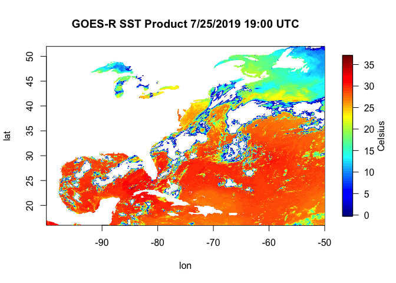

Week2: R Syntax, Classes, & Datatypes
================

How does an R script generally flow?
------------------------------------

Now it's time to get your hands dirty. We can sit and chat about all these things R can do and how to do them, but you won't retain that information until you use R yourself. This will be confusing at first if you're new to this type of programming, but the longer you spend with it, the more sense it will make.

A typical R script will generally look like this:

``` r
# James Simkins
# Load libraries
library(ncdf4)
library(fields)
ncFile <- ncdf4::nc_open("~/Documents/Github/geog473-673/datasets/OR_ABI-L2-SSTF-M3_G16_s20192081300453_e20192081400161_c20192081406297.nc")
sstK <- ncdf4::ncvar_get(nc=ncFile, varid="SST")
lat <- ncdf4::ncvar_get(nc=ncFile, varid="latitude")
lon <- ncdf4::ncvar_get(nc=ncFile, varid="longitude")
# convert sst from Kelvin to Celsius
sstC <- sstK - 273.15
# remove values below 0C
sstC[sstC < 0] = NA
# Plot the matrix
fields::image.plot(x=lon, y=lat, z=sstC, legend.lab="Celsius")
title("GOES-R SST Product 7/25/2019 19:00 UTC")
```


Now Let's Break Down This Script
--------------------------------

``` r
# Load libraries
library(ncdf4)
library(fields)
```

In R, we need to call on packages/libraries that we want to load in. We do this via the "library()" function or the "require()" function - both do the same thing. Notice that we do this at the beginning of the script because R reads line by line and we need these loaded before we can use the functions within the packages.

``` r
# Load libraries
library(ncdf4)
library(fields)
#######################################

ncFile <- ncdf4::nc_open(filename="~/Documents/Github/geog473-673/datasets/OR_ABI-L2-SSTF-M3_G16_s20192081300453_e20192081400161_c20192081406297.nc")
sstK <- ncdf4::ncvar_get(nc=ncFile, varid="SST")
lat <- ncdf4::ncvar_get(nc=ncFile, varid="latitude")
lon <- ncdf4::ncvar_get(nc=ncFile, varid="longitude")
```

Object = something. In this case, object name is ncFile and it holds an opened NetCDF file. We open this file via the "nc\_open" function that's within the "ncdf4" library. Note the "ncdf4::" syntax. This is NOT necessary for coding in R. Once you load in the library, R knows what you mean when you type in a function such as "nc\_open". I added it here so you know where these functions are coming from.

Notice that I use "&lt;-" for objects and "=" for arguments within the function. This is key, as I can use either "&lt;-" or "=" for objects (like ncFile or sstK) but I MUST use "=" within the function 'walls' (the parantheses).

For those of you not used to NetCDF files, they're an efficient filetype heavily used in physical sciences. Within each file, metadata (time, latitude info, longitude info, projection, etc.), and variables (sea surface temperature, latitude points, longitude points, chlorophyll, etc.) are stored in these. We open the netcdf file and then extract what we want out of it using "ncvar\_get", which is short for "netcdf variable get". Confused about how to use ncvar\_get? Try:

``` r
# Load libraries
library(ncdf4)
library(fields)
ncFile <- ncdf4::nc_open(filename="~/Documents/Github/geog473-673/datasets/OR_ABI-L2-SSTF-M3_G16_s20192081300453_e20192081400161_c20192081406297.nc")
sstK <- ncdf4::ncvar_get(nc=ncFile, varid="SST")
#######################################

help(ncvar_get)
```

This is a really attractive feature within R and exists for every function within an official R library. Now, back to the script...

``` r
# Load libraries
library(ncdf4)
library(fields)
ncFile <- ncdf4::nc_open(filename="~/Documents/Github/geog473-673/datasets/OR_ABI-L2-SSTF-M3_G16_s20192081300453_e20192081400161_c20192081406297.nc")
sstK <- ncdf4::ncvar_get(nc=ncFile, varid="SST")
#######################################
# convert sst from Kelvin to Celsius
sstC <- sstK - 273.15
```

The SST variable from the netCDF file was in Kelvin and we want to convert it to Celsius. Right now, sstK is a matrix. How do I know this? Look at your environment, or simply type into your console:

``` r
# Load libraries
library(ncdf4)
library(fields)
ncFile <- ncdf4::nc_open(filename="~/Documents/Github/geog473-673/datasets/OR_ABI-L2-SSTF-M3_G16_s20192081300453_e20192081400161_c20192081406297.nc")
sstK <- ncdf4::ncvar_get(nc=ncFile, varid="SST")
#######################################

class(sstK)
```

    ## [1] "matrix"

Class is a useful function that is loaded with the base library everytime you fire up R. It tells us what type of object we have. Now that we know this is a matrix, we can subtract 0 Celsius, or 273.15 Kelvin. When we have a matrix in R and perform any math on it, it does that math on each and every matrix value.

Quick and Dirty Quality Control
===============================

There are bad values that crept into the dataset and we need to convert all of them to NaN (aka Not A Number...also known as NA (Not Available) in R). How do we know there are bad values in this dataset?

``` r
# Load libraries
library(ncdf4)
library(fields)
ncFile <- ncdf4::nc_open(filename="~/Documents/Github/geog473-673/datasets/OR_ABI-L2-SSTF-M3_G16_s20192081300453_e20192081400161_c20192081406297.nc")
sstK <- ncdf4::ncvar_get(nc=ncFile, varid="SST")
#######################################

summary(as.vector(sstK))
```

    ##    Min. 1st Qu.  Median    Mean 3rd Qu.    Max.    NA's 
    ##  -999.0   286.9   300.0   278.2   302.0   310.0 2175822

summary() is another great base function. In order to use it on a matrix, we need to convert it to a vector - summary can't do 2 dimensional objects like matrices, it needs a one dimensional vector of numbers. The "as.vector" function just says hey R read in sstK as a vector for me would ya? Notice the 'Min' in the summary output. -999? No way is that a valid Kelvin value, especially since we subtract another 273.15 to this number to make the the Celsius matrix. So clearly we have some bad data that we need to convert to NA's. We do this by...

``` r
library(ncdf4)
library(fields)
ncFile <- ncdf4::nc_open("~/Documents/Github/geog473-673/datasets/OR_ABI-L2-SSTF-M3_G16_s20192081300453_e20192081400161_c20192081406297.nc")
sstK <- ncdf4::ncvar_get(nc=ncFile, varid="SST")
lat <- ncdf4::ncvar_get(nc=ncFile, varid="latitude")
lon <- ncdf4::ncvar_get(nc=ncFile, varid="longitude")
# convert sst from Kelvin to Celsius
sstC <- sstK - 273.15
# remove values below 0C
#######################################

sstC[sstC < 0] = NA
```

This line reads as: sstC where sstC is less than 0 equals NA. The brackets here can be thought of as the 'condition', that is what you're looking to change. This is called a vector operation, which we will get more into later but these are important becuase it's far faster to do this than a for loop.

``` r
library(ncdf4)
library(fields)
ncFile <- ncdf4::nc_open("~/Documents/Github/geog473-673/datasets/OR_ABI-L2-SSTF-M3_G16_s20192081300453_e20192081400161_c20192081406297.nc")
sstK <- ncdf4::ncvar_get(nc=ncFile, varid="SST")
lat <- ncdf4::ncvar_get(nc=ncFile, varid="latitude")
lon <- ncdf4::ncvar_get(nc=ncFile, varid="longitude")
# convert sst from Kelvin to Celsius
sstC <- sstK - 273.15
# remove values below 0C
#######################################

sstC[sstC < 0] = NA
summary(as.vector(sstC))
```

    ##    Min. 1st Qu.  Median    Mean 3rd Qu.    Max.    NA's 
    ##     0.0    19.8    27.6    24.1    29.0    36.8 2679819

Now we see that our summary looks good (even though we're looking at a matrix in celsius now). So all that's left to do is plot this up...

``` r
# James Simkins
# Load libraries
library(ncdf4)
library(fields)
ncFile <- ncdf4::nc_open("~/Documents/Github/geog473-673/datasets/OR_ABI-L2-SSTF-M3_G16_s20192081300453_e20192081400161_c20192081406297.nc")
sstK <- ncdf4::ncvar_get(nc=ncFile, varid="SST")
lat <- ncdf4::ncvar_get(nc=ncFile, varid="latitude")
lon <- ncdf4::ncvar_get(nc=ncFile, varid="longitude")

# convert sst from Kelvin to Celsius
sstC <- sstK - 273.15
# remove values below 0C
sstC[sstC < 0] = NA

#######################################
# Plot the matrix
fields::image.plot(x=lon, y=lat, z=sstC, legend.lab="Celsius")
title("GOES-R SST Product 7/25/2019 19:00 UTC")
```



Now we plot this up using the 'image.plot()' function from the 'fields' library. We just tell it to plot the sstC but notice that I didn't place an argument in here. If you don't tell image.plot() what an argument actually is, it assumes you're following the order that the function was written in. If you declare arguments, such as 'z=sstC' or like 'varid="SST"' from above, you can place the arguments in whatever order you want in that function. Notice that for this kind of plot, the 'title()' function is a separate function rather than an argument of 'image.plot()'. This goes for a lot of plot aesthetics that we'll get into later. Remember, if you're ever confused about something like this just tell R you need 'help()'.

In Class Exercise
-----------------

1.  Go to <https://github.com/jsimkins2/geog473-673/tree/master/datasets>
2.  Download 'OR\_ABI-L2-SSTF-M3\_G16\_s20192081300453\_e20192081400161\_c20192081406297.nc'
3.  Make simple plot of the 'DQF' (Data Quality Flag) variable

Hint: You may have to use 'install.packages' in your console first


