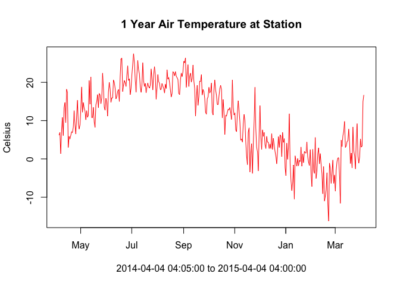
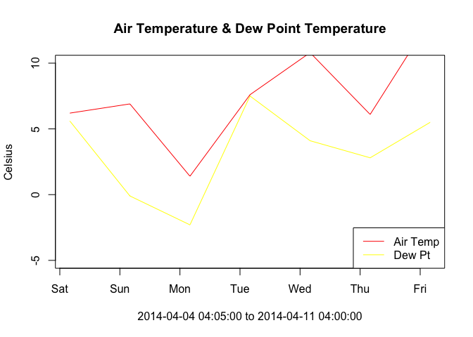

Week3: Time Series fun with DEOS
================

Essential Skills: The For Loop
------------------------------

For loops & conditional statements are a key skill in programming. They allow you to process through large datasets or multiple datasets thus minimizing the amount of manual work you need to do. The basic for loop looks like this...

``` r
# Generate sequence of numbers from 1 to 10 using the seq() function (seq for sequence)
numbersList = seq(from=1,to=10,by=1)
# Multiply each number in the numbersList by 8 and print the result
for (i in numbersList){
  temNumber = i * 8
  print(temNumber)
}
```

    ## [1] 8
    ## [1] 16
    ## [1] 24
    ## [1] 32
    ## [1] 40
    ## [1] 48
    ## [1] 56
    ## [1] 64
    ## [1] 72
    ## [1] 80

Notice the general structure of R for loops. 'for' signals to R you're beginning a for loop, which requires the general structure to look like:

for (something in something inside these parentheses){ do something within these curly brackets }

Yes, you must have these parentheses and curly brackets present and surrounding the appropriate code. If you forget a parentheses or curly bracket you'll have errors pop up...this happens to me all the time still.

While these must be present, R doesn't care where they are in your code (\*\*\*\*which is very unique amongst programming languages). For example, notice how this ugly code is different but still runs...

``` r
# Generate sequence of numbers from 1 to 10 using the seq() function (seq for sequence)
numbersList = seq(from=1,to=10,by=1)
# Multiply each number in the numbersList by 8 and print the result
for (        i in numbersList       
      ){
  temNumber = i * 8
  print(temNumber)
        }
```

    ## [1] 8
    ## [1] 16
    ## [1] 24
    ## [1] 32
    ## [1] 40
    ## [1] 48
    ## [1] 56
    ## [1] 64
    ## [1] 72
    ## [1] 80

The general structure is still: for(condition){do something}. If statements are set up the same way

``` r
# Generate sequence of numbers from 1 to 10 using the seq() function (seq for sequence)
numbersList = seq(from=1,to=10,by=1)
# Multiply each number in the numbersList by 8 and print the result
for (i in numbersList){
  if (i==4){
    temNumber = i * 8
    print(temNumber)
  }
}
```

    ## [1] 32

This is referred to as a 'nested loop', because there is a conditional statement within another one. Key takeaway here: in programming languages, '=' is an assignment (i.e. x = 4), whereas '==' is an equality test (i == 4). To put this loop in layman's terms: for i in numbersList, if i is equal to 4, multiply i by 8 and then print temNumber.

We can also have nested for loops.

``` r
# Generate sequence of numbers from 1 to 3 this time using the seq() function (seq for sequence)
numbersList = seq(from=1,to=3,by=1)
lettersList = list("A", "B", "C")

for (num in numbersList){
  for (let in lettersList){
    print(c(num,let))
  }
}
```

    ## [1] "1" "A"
    ## [1] "1" "B"
    ## [1] "1" "C"
    ## [1] "2" "A"
    ## [1] "2" "B"
    ## [1] "2" "C"
    ## [1] "3" "A"
    ## [1] "3" "B"
    ## [1] "3" "C"

You can name the object within the list whatever you want (i, j, num, let, etc.). Also, c() is the concatenate functin that combines values into a vector or list. The order doesn't matter in this for loop...

``` r
# Generate sequence of numbers from 1 to 3 this time using the seq() function (seq for sequence)
numbersList = seq(from=1,to=3,by=1)
lettersList = list("A", "B", "C")

for (let in lettersList){
  for (num in numbersList){
    print(c(num,let))
  }
}
```

    ## [1] "1" "A"
    ## [1] "2" "A"
    ## [1] "3" "A"
    ## [1] "1" "B"
    ## [1] "2" "B"
    ## [1] "3" "B"
    ## [1] "1" "C"
    ## [1] "2" "C"
    ## [1] "3" "C"

But it does in this one...

``` r
# Generate sequence of numbers from 1 to 10 using the seq() function (seq for sequence)
numbersList = seq(from=1,to=10,by=1)
# Multiply each number in the numbersList by 8 and print the result
if (i==4){
  for (i in numbersList){
    temNumber = i * 8
    print(temNumber)
  }
}
```

Here's one more example for multi conditional statement with an else...

``` r
# Generate sequence of numbers from 1 to 3 this time using the seq() function (seq for sequence)
numbersList = seq(from=1,to=3,by=1)
lettersList = list("A", "B", "C")

for (num in numbersList){
  for (let in lettersList){
    if (num == 3 && let == "B"){
      print(c(num,let))
    } else{
      print("Not what we want")
    }
  }
}
```

    ## [1] "Not what we want"
    ## [1] "Not what we want"
    ## [1] "Not what we want"
    ## [1] "Not what we want"
    ## [1] "Not what we want"
    ## [1] "Not what we want"
    ## [1] "Not what we want"
    ## [1] "3" "B"
    ## [1] "Not what we want"

&& means "and" ... || means "or"...these are useful in multi conditional statements. The 'else' statement is an appendage of the 'if' statement. It basically means if num == 3 and let == B is false, print "not what we want". Notice that the 'else' statement is outside of the 'if' statement but immediately after it.

In Class Exercise: debug this for loop

``` r
soiltype <- list("sand", "silt", "saline", "clay", "peat")
permeability <- c(0.09, 0.05, 0.03, 0.01, 0.005)

for (s in seq(length(soiltype)){
  print(a)
  for (p in permeability)
    if (p == 0.05 | p == 0.005){
      print(permeability[s])
    }
  }
}
```

DEOS Data
---------

Delaware has the highest concentration of environmental monitoring stations in the country thanks to DEOS (Delaware Environmental Observing System) which is controlled by University of Delaware's CEMA (Center for Environmental Monitoring and Analysis). The data collected using this dense network is useful for a variety of purposes. Let's dive into some data - find the file (<https://github.com/jsimkins2/geog473-673/tree/master/datasets>) - download it, unzip it, and open it up in R!

``` r
deos_data <- read.csv("~/Downloads/DEOS.csv", header = TRUE, skip=0, stringsAsFactors = FALSE)

head(deos_data)
```

    ##    Timestamp..UTC. Air.Temperature.deg..C. Dew.Point.Temperature.deg..C.
    ## 1 2014-04-04 04:05                     7.1                           4.3
    ## 2 2014-04-04 04:10                     6.9                           4.3
    ## 3 2014-04-04 04:15                     6.8                           4.3
    ## 4 2014-04-04 04:20                     6.7                           4.4
    ## 5 2014-04-04 04:25                     6.6                           4.4
    ## 6 2014-04-04 04:30                     6.6                           4.4
    ##   Wind.Speed.m.sec. Wind.Direction.deg.. Barometric.Pressure..
    ## 1               3.7                351.7                    NA
    ## 2               3.5                352.9                    NA
    ## 3               3.9                357.5                    NA
    ## 4               3.9                356.8                    NA
    ## 5               3.3                  5.5                    NA
    ## 6               2.7                 18.4                    NA
    ##   Solar.Radiation.UNKNOWN. Wind.Gust.Speed..5..m.sec.
    ## 1                        0                        5.1
    ## 2                        0                        5.8
    ## 3                        0                        6.2
    ## 4                        0                        5.9
    ## 5                        0                        4.9
    ## 6                        0                        3.5
    ##   Gage.Precipitation..5..mm.
    ## 1                       0.00
    ## 2                       0.00
    ## 3                       0.25
    ## 4                       0.00
    ## 5                       0.00
    ## 6                       0.00

``` r
summary(deos_data)
```

    ##  Timestamp..UTC.    Air.Temperature.deg..C. Dew.Point.Temperature.deg..C.
    ##  Length:182645      Min.   :-51.0           Min.   :-53.300              
    ##  Class :character   1st Qu.:  7.6           1st Qu.:  2.200              
    ##  Mode  :character   Median : 15.2           Median : 10.200              
    ##                     Mean   : 14.1           Mean   :  8.505              
    ##                     3rd Qu.: 21.2           3rd Qu.: 16.200              
    ##                     Max.   : 37.0           Max.   : 25.500              
    ##  Wind.Speed.m.sec. Wind.Direction.deg.. Barometric.Pressure..
    ##  Min.   : 0.100    Min.   :  0.0        Mode:logical         
    ##  1st Qu.: 1.800    1st Qu.: 99.3        NA's:182645          
    ##  Median : 2.600    Median :202.2                             
    ##  Mean   : 2.997    Mean   :187.0                             
    ##  3rd Qu.: 3.700    3rd Qu.:258.9                             
    ##  Max.   :16.700    Max.   :360.0                             
    ##  Solar.Radiation.UNKNOWN. Wind.Gust.Speed..5..m.sec.
    ##  Min.   :   0.0           Min.   : 0.100            
    ##  1st Qu.:   0.0           1st Qu.: 2.900            
    ##  Median :   4.0           Median : 4.400            
    ##  Mean   : 192.7           Mean   : 4.907            
    ##  3rd Qu.: 313.0           3rd Qu.: 6.400            
    ##  Max.   :1335.0           Max.   :24.400            
    ##  Gage.Precipitation..5..mm.
    ##  Min.   :0.00000           
    ##  1st Qu.:0.00000           
    ##  Median :0.00000           
    ##  Mean   :0.01354           
    ##  3rd Qu.:0.00000           
    ##  Max.   :9.65000

``` r
#the variable names look wonky because they have spaces in them - spaces in variable names is a big no-no
#change the names to something more readable
names(deos_data) = c("datetime", "air_temperature", "dewpoint", "windspeed", "winddirection", "pressure", "solar_radiation",
                     "wind_gust", "precipitation")
deos_data$datetime[1]
```

    ## [1] "2014-04-04 04:05"

``` r
class(deos_data$datetime)
```

    ## [1] "character"

``` r
# give it a datetime class, notice the format
deos_data$datetime = as.POSIXct(deos_data$datetime, format = '%Y-%m-%d %H:%M')

plot(deos_data$datetime[1:365*24*12], deos_data$air_temperature[1:365*24*12], type = "l", col = 'red', xlab = paste0(deos_data$datetime[1], " to ", deos_data$datetime[365*24*12]), ylab = "Celsius")
title("1 Year Air Temperature at Station")
```



``` r
# Now add dewpoint to that plot
plot(deos_data$datetime[1:7*24*12], deos_data$air_temperature[1:7*24*12], type = "l", col = 'red', xlab = paste0(deos_data$datetime[1], " to ", deos_data$datetime[7*24*12]), ylab = "Celsius", ylim = c(-5,10))
lines(deos_data$datetime[1:7*24*12], deos_data$dewpoint[1:7*24*12], col = 'yellow')
legend('bottomright', legend=c('Air Temp', 'Dew Pt'), col = c('red', 'yellow'), lty = c(1, 1))
title("Air Temperature & Dew Point Temperature")
```



Assignment:

1.  Subset dataset to 2015 only
2.  Convert Wind Speed & Wind Gust data from m/s to mph
3.  Plot wind speed and wind gust on same plot - wind speed as lines and wind gust as points (using points() function) -
4.  Make Title the Correlation Coefficient between wind gust and wind speed (using cor() function)

Deliver Resulting Plot to simkins at udel dot edu
