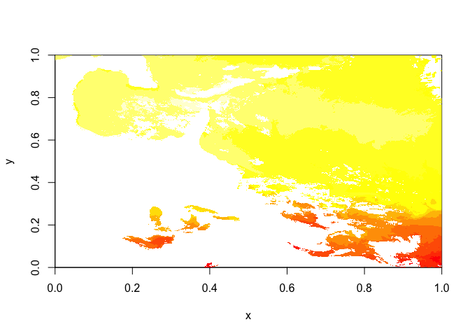
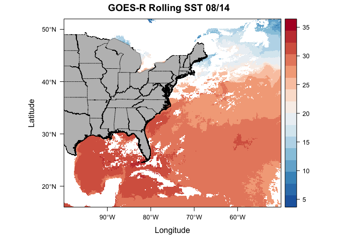
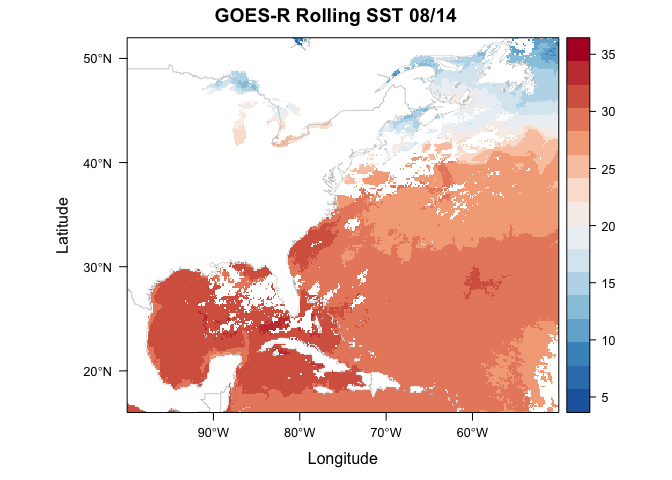

Matt Oliver Oceanography with Rasters
================

Essential Skills: The For Loop with Paste0
==========================================

Last week we covered the for loop which is an essential programming skill. We also touched on the paste0 function, but this is incredibly useful and should be expanded upon. paste0() is the sister function of paste(), who's cousin is sprintf() . It depends on preference, but most coders I know gravitate towards paste0(). Let's check out all 3.

``` r
# Paste Example 1 - default sep (aka separation) is space
paste("file", "number", "32")
```

    ## [1] "file number 32"

``` r
# Paste Example 2 - set sep to "_"
paste("file", "number", "32", sep = "_")
```

    ## [1] "file_number_32"

``` r
# Paste0 Example 1 - 0 for 0 separating characters
paste0("file", "number", "32")
```

    ## [1] "filenumber32"

``` r
# sprintf example 1
sprintf("%s %s %s", "file", "number", "32")
```

    ## [1] "file number 32"

``` r
# sprintf example 2
person <-"Grover"
action <-"flying"
message(sprintf("On %s I realized %s was...\n%s by the street", Sys.Date(), person, action))
```

    ## On 2019-08-19 I realized Grover was...
    ## flying by the street

``` r
# Notice that paste() is limiting because the separating character is not always present between
# each string you're concatenating
# Let's use paste0 here
fileList <- c('filename1', 'filename2', 'filename3', 'filename4')
dateFolder <- c('0813', '0814', '0815', '0816')
homeDir <- "~/Documents/"
pathList <- list()

for (i in 1:length(fileList)){
  print(i)
  tempString <- paste0(homeDir, dateFolder[i], '/', fileList[i])
  pathList[i] <- tempString
}
```

    ## [1] 1
    ## [1] 2
    ## [1] 3
    ## [1] 4

``` r
pathList
```

    ## [[1]]
    ## [1] "~/Documents/0813/filename1"
    ## 
    ## [[2]]
    ## [1] "~/Documents/0814/filename2"
    ## 
    ## [[3]]
    ## [1] "~/Documents/0815/filename3"
    ## 
    ## [[4]]
    ## [1] "~/Documents/0816/filename4"

``` r
pathList[[1]]
```

    ## [1] "~/Documents/0813/filename1"

``` r
# Now let's rewrite using sprintf
fileList <- c('filename1', 'filename2', 'filename3', 'filename4')
dateFolder <- c('0813', '0814', '0815', '0816')
homeDir <- "~/Documents/"
pathList <- list()

pathList <- sprintf("%s%s/%s", homeDir, dateFolder, fileList)

pathList
```

    ## [1] "~/Documents/0813/filename1" "~/Documents/0814/filename2"
    ## [3] "~/Documents/0815/filename3" "~/Documents/0816/filename4"

``` r
pathList[[1]]
```

    ## [1] "~/Documents/0813/filename1"

``` r
#sprintf is a very useful and quick function for combining various strings into longer strings
#but paste0 allows you a little more freedom and is slightly more intuitive
```

Debug and fix the following code:

``` r
# Let's use paste0 here
fileList <- c('sstData20190912', 'sstData20190913', 'sstData20190914', 'sstData20190915')
dateFolder <- seq(0912, 0915, 1)
homeDir <- "~/Documents/"
pathList <- list()

for (i in fileList){
  print(i)
  tempString <- paste0(homeDir, dateFolder[i], '/', i)
  pathList[i] <- tempString
}

pathList

pathList[[1]]
```

The final `pathList[[1]]` should look like this...

`"~/Documents/0912/sstData20190912"`

Rasters with Oceanography
=========================

Plot GOES-R Rolling 1 day data
------------------------------

``` r
library(maptools) # also loads sp package
library(ncdf4)
library(raster)
```

    ## Warning: package 'raster' was built under R version 3.4.2

``` r
library(rasterVis)
library(RColorBrewer)
ncFile <- nc_open("~/Downloads/GOES_R_ROLLING_1DAY_20190814.nc")
sstGoes <- ncvar_get(ncFile, varid = "sst")
sstRast <- raster(sstGoes)

# plot using quick 'image' function from raster
image(sstRast)
```


``` r
# netcdf stores data backwards, so to convert it to raster we need to transpose it
sstRast <- t(sstRast)

# plot using quick 'image' function from raster
image(sstRast)
```



``` r
# now we see that the data is just upside down, so we use the flip() function
sstRast <- flip(sstRast, 2)

# plot using quick 'image' function from raster
image(sstRast)
```


``` r
sstRast
```

    ## class       : RasterLayer 
    ## dimensions  : 1989, 2778, 5525442  (nrow, ncol, ncell)
    ## resolution  : 0.0003599712, 0.0005027652  (x, y)
    ## extent      : 0, 1, 0, 1  (xmin, xmax, ymin, ymax)
    ## coord. ref. : NA 
    ## data source : in memory
    ## names       : layer 
    ## values      : 5.344696, 34.9397  (min, max)

``` r
# notice that the extent and crs information are wrong/not included so let's fix this
lat = ncvar_get(ncFile, "latitude")
lon = ncvar_get(ncFile, "longitude")

# define new extents for the raster
extent(sstRast) = c(min(lon), max(lon), min(lat), max(lat))
# define the proj4 projection string
crs(sstRast) = "+proj=longlat +datum=WGS84 +no_defs "

sstRast
```

    ## class       : RasterLayer 
    ## dimensions  : 1989, 2778, 5525442  (nrow, ncol, ncell)
    ## resolution  : 0.01799352, 0.0180909  (x, y)
    ## extent      : -99.99015, -50.00415, 16.00283, 51.98563  (xmin, xmax, ymin, ymax)
    ## coord. ref. : +proj=longlat +datum=WGS84 +no_defs +ellps=WGS84 +towgs84=0,0,0 
    ## data source : in memory
    ## names       : layer 
    ## values      : 5.344696, 34.9397  (min, max)

``` r
image(sstRast)
```


``` r
# load raster Visualization package
library(rasterVis)

# levelplot the sstRast
levelplot(sstRast)
```


``` r
# USA shapefiles via the getData function
usa <- getData('GADM', country = 'USA', level = 1)

# Throw together the usa spatial polygons data frame
plt <- levelplot(sstRast, margin=F, par.settings=BuRdTheme,
       main="GOES-R Rolling SST 08/14")
plt + layer(sp.polygons(usa, col='black',fill='grey', lwd=0.4))
```



``` r
# Now let's do the same with geotiff
tifFile = "~/Downloads/goesSST.tif"
sstRast = raster(tifFile)

# Quick image using raster's image plot generator function
image(sstRast)
```


``` r
# Now let's load a base dataset of world maps that R already has stored
data(wrld_simpl)
plt <- levelplot(sstRast, margin=F, par.settings=BuRdTheme,
       main="GOES-R Rolling SST 08/14")
plt + layer(sp.lines(wrld_simpl, col='black', lwd=0.4))
```


``` r
# Let's do the same plot but with a custom shapefile
# note that even though we only point the function to the '.shp' file, the '.shx' and '.dbf' need to be in the same folder for this to work. 
world.shp <- readShapeLines("~/Downloads/world.shp",proj4string=CRS("+proj=longlat"))
```

    ## Warning: use rgdal::readOGR or sf::st_read

``` r
plt <- levelplot(sstRast, margin=F, par.settings=BuRdTheme,
       main="GOES-R Rolling SST 08/14")
plt + layer(sp.lines(world.shp, col='gray', lwd=0.4))
```



Assignment:

1.  Download treecov.nc from the datasets folder

2.  Open tree cover % as a variable, remove bad values.

3.  Plot tree cover variable using the GrTheme (green theme). Be sure to add coastlines via your choice of underlying dataset. Ensure correct latitude/longitudes are displayed. Add title.

4.  Email resulting png to simkins at udel dot edu.
