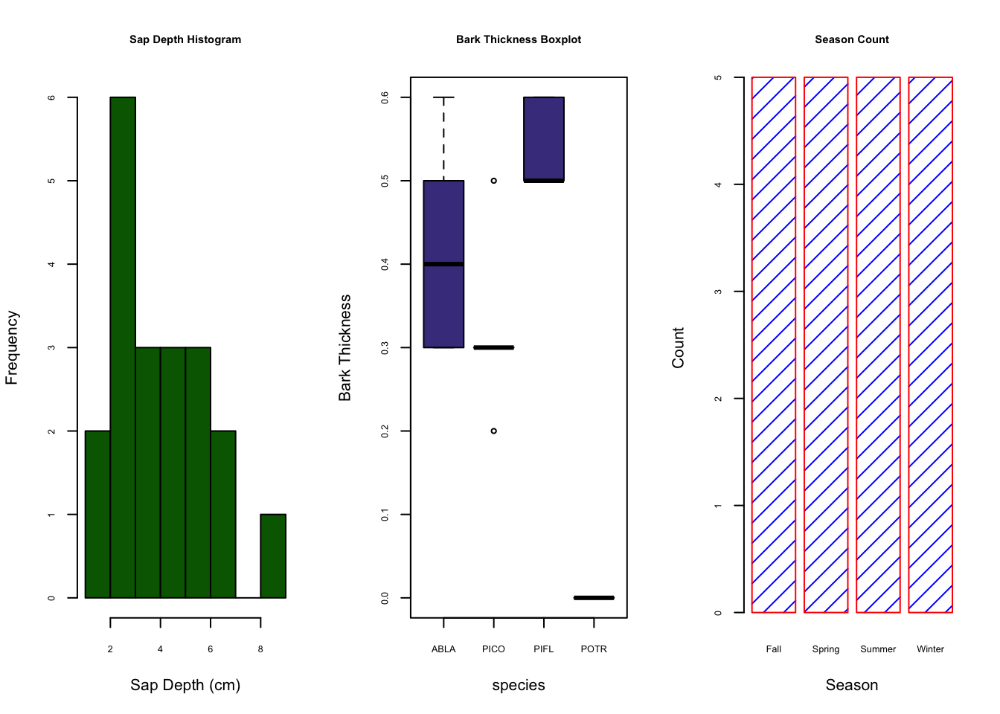

# Customizing R Base Plots

```{r, echo=FALSE, out.width="100%", fig.align="center"}
  
```

R has a plethora of plotting packages, tools, and techniques. Generally speaking, base R graphs aren't as popular amongst advanced R users as others (e.g. `ggplot`). That being said, R base graphing offers a variety of styling techniques and unique customization. The base R plotting methods will offer a solid foundation before we learn more about the aforementioned `ggplot`. 

Boxplots, histograms, pie charts, bar charts, and scatter plots are readily available and customizable in the base R plotting package. We can customize and style colors, text, line types, plotting symbols, line thicknesses, symbol size, and much more. 


## Expanding on Basic Plots in R

Variable Assignment & Operations
```{r, out.width="60%", fig.align="center"}
x = 7
y = 9
z <- y * (x/2 + 7) + sqrt(y)

print(x)
y
z

X <- 1:20
Y <- (1 + 1/X) + 2
X
Y

plot(X,Y)
```

Now let's add in some extra arguments to the plot function to make it prettier
```{r, out.width="60%", fig.align="center"}
plot(x=X,y=Y, type = "b", pch=c(24), col = 'blue', bg='yellow', cex = 1.6, xlab = "X", ylab = "Y", 
     col.lab = "orange", lwd=1.4, lty=2, main = "X vs Y")
```

| `plot()` Argument | Definition |
|----|----------|
| `type` | type of plot - p stands for points|
| `pch` | plotting ‘character’, i.e., symbol to use|
| `col` | color|
| `bg` | background color (only applicable for pch's between 21:25)|
| `cex` | size of the points|
| `xlab` | x label|
| `ylab` | y label |
| `col.lab` | x and y label color |
| `lwd` | line width |
| `lty` | line type |
| `main` | title of the plot | 


For more argument definitions, use the `help()` function or `?` function like so - `help(plot)` or `?plot`. Multiple options may pop up. This occurs when you have two functions from different packages with the same name. In this case, the `plot()` function we are using is from the `base` package. 

### Adding to a Plot
We can add additional items to a particular plot. Some of these items might be...

| Function | Definition |
|----|----------|
| `legend` | adds a legend to a plot |
|`lines` |connects points sequentially with lines (added to a plot) |
| `points` | plots points (adds to a plot)
|`segments`| add lines to a plot (between pairs of points)|
|`text` |add text to a plot|
|`legend` |add a legend to a plot|
|`abline` |add a line to a plot by specifying its slope and intercept|
| `title` | title can also be added outside of the function you use. This is necessary when we want an overarching title for multiple plots in one figure.  |

Let's use our previous example but go about plotting it a different way to show how it works.

```{r, out.width="60%", fig.align="center"}
# plot our X and Y as a line plot
plot(x=X,y=Y, type = "l", col='blue', xlab = "X", ylab = "Y",col.lab = "orange", lwd=1.4, lty=2, main = "X vs Y")
# add points to the line via the points function
points(x=X, y=Y, pch=c(24), col = 'blue', bg='yellow', cex = 1.6)
# add a vertical line at 3.4 
abline(v=10)
# add a legend
legend(x = "topright", legend=c("my points"), pch=c(24), col = 'blue', pt.bg='yellow')
```

Let's add in another 

```{r, out.width="70%", fig.align="center"}
plot(1:25, 1:25, xlab="",ylab="",pch=1:25,col=1:25,cex=2)
grid(lty=1, col="gray90")
points(1:25, 1:25, xlab="",ylab="",pch=1:25,col=1:25,cex=2)
title("Plotting symbol, line type, & color codes")
legend("topleft", legend=1:6, lty=1:6, lwd=1.5, ncol=2, bg="gray95")
legend("bottomright", legend=1:8, col=1:8, ncol=3, pch=19, bg="gray95")
```

## Barplots, Boxplots, Pie Charts
We're going to create a fake dataset of those who are infected by the coronavirus. Let's do so using the `sample()` function.
```{r}
# Create a random sample of the 3 types - Susceptible, Infected and Recovered
InfStatus <- factor(sample(c("Susceptible", "Infected", "Recovered"),size = 50, replace = TRUE))
I <- table(InfStatus)
I

# Now let's make a random sample of 3 genotypes (RR, Rr, and rr)
Genotype <- factor(sample(c("RR", "Rr", "rr"), size = 50, replace = TRUE))
G <- table(Genotype)
G

#show genotype and infected status as a table 
table(Genotype, InfStatus)
```

Note - We turned the sample data info a `factor` to add `levels` (i.e. categories) of our test data.

```{r}
# WITHOUT the factor
test <- sample(c("Susceptible", "Infected", "Recovered"),size = 50, replace = TRUE)
test
class(test)

# Now as a factor
test2 <- factor(sample(c("Susceptible", "Infected", "Recovered"),size = 50, replace = TRUE))
test2
class(test2)
```

### Combining Plots

R makes it easy to combine multiple plots into one overall graph, using either the `par()` function. With the `par()` function, you can include the option `mfrow=c(nrows, ncols)` to create a matrix of `nrows` x `ncols` plots that are filled in by row. The  Additionally, we can control text size with `cex` - a number indicating the amount by which plotting text and symbols should be scaled relative to the default. 1=default, 1.5 is 50% larger, 0.5 is 50% smaller, etc. Here's some more descriptions. 

| option|	description|
| :--- | :------ |
| `mfrow` |  `mfrow=c(nrows, ncols)` - `nrows` x `ncols` plots that are filled in by row|
| `mar` | A numerical vector of the form c(bottom, left, top, right) which gives the number of lines of margin to be specified on the four sides of the plot |
|`oma` | A vector of the form c(bottom, left, top, right) giving the size of the outer margins in lines of text.| 
| `bg` | background color |
| `cex` | magnification of text and symbols relative to default.  
|`cex.axis`	|magnification of axis annotation relative to `cex`|
|`cex.lab`|	magnification of x and y labels relative to `cex`|
|`cex.main`	|magnification of titles relative to `cex`|
|`cex.sub`|	magnification of subtitles relative to `cex`|

We can always list the `par` settings by entering `par()` in the console. Let's use these par settings with our test data created above.

```{r, out.width="60%", fig.align="center"}
par(mfrow=c(2, 2), mar=c(3, 2, 2, 1), oma=c(0, 0, 3, 0), bg = "white") ## create plot array of 2 row x 2 columns
plot(InfStatus, ylim = c(0, 27)) # basic plot with y limit set as a range
box() # adds a box around the plot coded before this line
barplot(table(Genotype, InfStatus), ylim = c(0, 13), beside = TRUE, col = c("seagreen4", "coral", "dodgerblue2")) # barplot
box() # adds a box around the plot coded before this line
legend("topright", c("RR", "Rr", "rr"), fill = c("seagreen4", "coral", "dodgerblue2"), ncol = 1, cex = 0.75) # legend for the previous plot, which in this case is the barplot
boxplot(rnorm(50, mean = 15, sd = 3) ~ Genotype,  col = c("seagreen4", "coral", "dodgerblue2")) # boxplot
pie(G, col = c("seagreen4", "coral", "dodgerblue2")) # pie plot
mtext("Basic R Plots with Test Genotype Data", outer = TRUE, cex = 1.5, font = 2) # main title
```


## Tree Data
We're going to download the `TreeData.csv` file from the [course github]("https://github.com/jsimkins2/geog473-673/tree/master/datasets/") using a direct method. We can use the `download.file()` function to do this. 

`download.file(url = "https://github.com/jsimkins2/geog473-673/tree/master/datasets/TreeData.csv", destfile = "/Users/james/Downloads/TreeData.csv" , mode='wb')`

The `url` argument is the direct url of the file we wish to download. `destfile` is the destination file path + name - note that this is *my relative path* and that yours will look different. `mode` describes the method with whcih to write the file (`wb` can be used in most cases). 

### Loading the Dataset

```{r}
# Our file location is our destfile argument above. For me, it's /Users/james/Downloads/TreeData.csv
treedat <- read.csv("/Users/james/Documents/Github/geog473-673/datasets/TreeData.csv")
treedat
```

`treedat` is a data frame. As a reminder, a data frame is essentially a 2-dimensional array that contains a *combination* of vectors (columns of data) that are of the class; integer, numeric, character. This is *different* from a matrix which can only contain *1 type* of data. In this case, we have some tree data that includes species of tree, season the data was collected, diameter of the tree, bark thickness, area of no bark, heartwood diameter, and sapwood diameter.

```{r, echo=FALSE, out.width="60%", fig.align="center"}
knitr::include_graphics("../documents/images/heartwoodvssapwood.jpeg")
```

Let's manipulate this dataframe to make it easier to work wtih.

```{r, out.width="60%", fig.align="center"}
# let's set the rownames equal to the tree column
treedat <- read.csv("/Users/james/Documents/Github/geog473-673/datasets/TreeData.csv",row.names='tree')
# print treedat
treedat
# look at the data frame variable names 
names(treedat)
# print the dbh variable
treedat$dbh
# rename the dbh variable, but first let's be sure our index of the dbh variable is correct
colnames(treedat)[4]
# yep, dbh is the index number 4 
colnames(treedat)[4] = "tree.diameter"
treedat
```

Now that our data is curated, let's create a figure with 2 plots in the window; plot 1 will be a histogram of bark thickness and plot 2 will be a boxplot of sapdepth by species.


```{r, out.width="60%", fig.align="center"}
# Now let's do some plotting 
par(mfrow=c(1,2)) ## create plot array of 1 row x 2 columns
par(cex.axis=0.8) ## shrinks the name size of the x axes. If we don't do this, not all the names in the boxplot show up
par(cex.main=0.7) ## shrinks the name size of the titles. If we don't do this, the titles don't fit in the window
# Use the his() function to plot a histogram 
hist(treedat$BarkThick, xlab= "Bark Thickness (cm)", main= "Histogram: Bark Thickness", col= "darkgreen")
boxplot(SapDepth ~ spp, data= treedat, ylab= "SapDepth", col= "darkslateblue", main= "Boxplot: Sapwood Depth by Species")

```

First we notice that with the `par()` function, we can declare arguments in different lines so long as we call the `par()` function again. `hist()` is the histogram function; `boxplot()` is the boxplot function. The `boxplot()` function using a slightly different syntax for plotting in the form of `y ~ x`, or **y versus x**. `hist()`, on the other hand, can only plot numerical values. For categorical data, such as our tree species column, must be plotted with `barplot()` and the `table()` function. 

```{r, out.width="60%", fig.align="center"}
# print the table function output of treedat$spp - notice the categorical help from the table function
table(treedat$spp)
# plot this categorical data using barplot() function
barplot(table(treedat$spp))

# customize the barplot function
barplot(table(treedat$spp), main="SPP Count Barplot",
xlab="SPP",
ylab="Count",
border="red",
col="blue",
density=10)
```


## Assignment:

1. Create the plot below using a sequence of X values where Y is the `log` of the X values. For the line type, use `type = "b"` to obtain lines and points. Use a `pch` of 21, `cex` of 1.5, and colors of your choosing. 

```{r, echo=FALSE, out.width="60%", fig.align="center"}
X=1:10
Y=log(X)
plot(x=X,y=Y, type = "b", pch=c(24), col = 'yellow', bg='blue', cex = 1.6, xlab = "X", ylab = "Y")
title("X vs Y")
```

Using the `TreeData.csv` from the course dataset folder, complete the following:

2. Rename `spp` variable to `species`
3. Make a 3 column plot consisting of a **Sapwood Depth histogram**, **a boxplot of Bark Thickness by species**, and a **seasonal count barplot**. Use your own colors, borders, line types, etc. Your plot does not have to perfectly match the example below, but try and get close to it. 
4. **Submit the plot to UD Canvas.**


Your final plot should look like this

```{r, echo=FALSE, out.width="60%", fig.align="center"}
# let's set the rownames equal to the tree column
treedat <- read.csv("/Users/james/Documents/Github/geog473-673/datasets/TreeData.csv",row.names='tree')
# rename the dbh variable, but first let's be sure our index of the species variable is correct
#colnames(treedat)[1]
colnames(treedat)[1] = "species"

# Now let's do some plotting 
par(mfrow=c(1,3)) ## create plot array of 1 row x 3columns
par(mar=c(3, 2, 2, 1), oma=c(0, 0, 3, 0), bg = "white")
par(cex.axis=0.6) ## shrinks the name size of the x axes. If we don't do this, not all the names in the boxplot show up
par(cex.main=0.7) ## shrinks the name size of the titles. If we don't do this, the titles don't fit in the window
# Use the his() function to plot a histogram 
hist(treedat$SapDepth, xlab= "Sap Depth (cm)", main= "Sap Depth Histogram", col= "darkgreen")
boxplot(BarkThick ~ species, data= treedat, ylab= "Bark Thickness", col= "darkslateblue", main= "Bark Thickness Boxplot")
barplot(table(treedat$season), main="Season Count",
xlab="Season",
ylab="Count",
border="red",
col="blue",
density=10)
mtext("James' Tree Data Plot", outer = TRUE, cex = 0.5, font = 2) # main title
```
