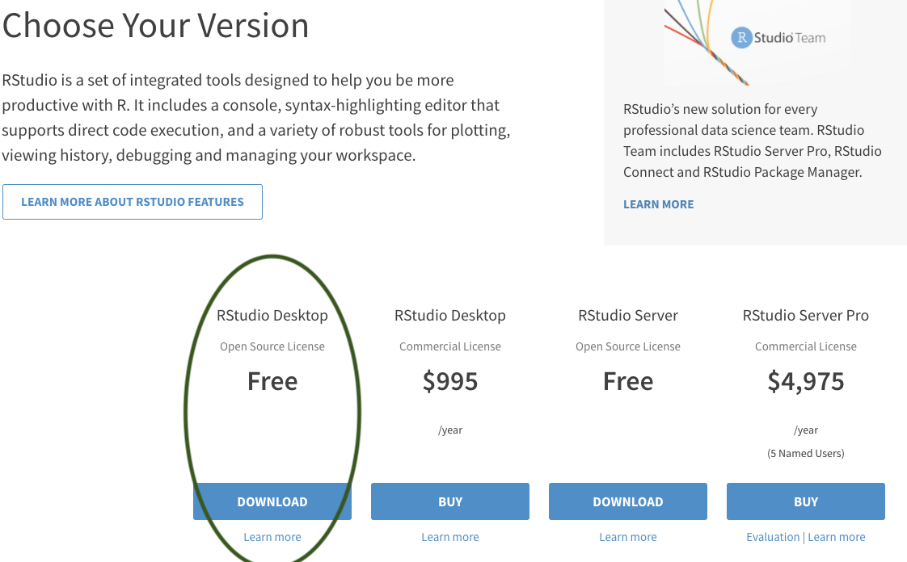
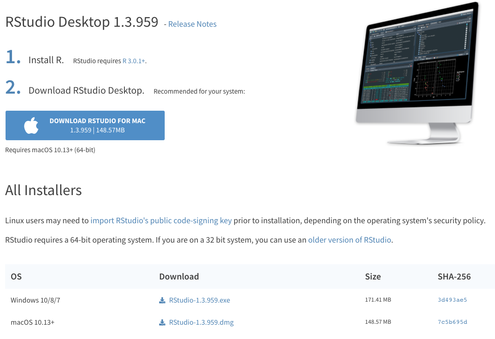

# Getting Started with R

## Why is there such a buzz around R?

R is an open-source programming language used for data science, statistics, and data visualization. R is currently ranked as the [7th most popular language in the world](http://pypl.github.io/PYPL.html). Since R is open-source, anyone can contribute to or use R packages that contain pre-built functions/operations. This greatly accelerates our ability to share and collaborate. 

The first thing you need to do to get started with R is to install it
on your computer. R works on pretty much every platform available,
including the widely available Windows, Mac OS X, and Linux
systems. R takes up very little space on your machine, despite it's pleathora of data-science capabilities. All of these downloads are 100% free and trusted sources.

## Reasons to love R

| Attribute | Reason |
|----|----------|
| Speed | R is FAST. It can number crunch magnitudes faster than Microsoft Excel, for example. |
| Capacity | R can handle millions of data records. Large datasets that crash in Microsoft Excel or ArcGIS won't crash in R. |
| Risk Reduction | After writing a single R Script, the process of your data science routine is auditable and reproducible within milliseconds. We can write 1 script and make alterations as we see fit. We don't have to replicate a process of pointing and clicking in Microsoft Excel or ArcGIS. For example, if you are working with a dataset that multiple people are using, you can load this dataset in R and perform the tasks that you need *without* making any changes to the original dataset. |
| Visualizations | R is capable to create high quality visualizations and also has the capacity to create interactive visualizations that can easiliy be shared. Plots or images can easily be exported to PNG, JPEG, or even web-based interactive dashboards that can be hosted on a webpage |
| Collaboration | R script sharing is safe and easy. As mentioned above, a team using the same data input file but performing different tasks on it can do so without editing the data input file for everyone else. Data output can also be shared without the concern of a colleague editing the file output. RStudio connect or Github are also popular free track all changes that take place between R script files.|
| Price | R is completely free! Yes...every bit of it!  |

## Downloading Guide

1. Navigate to the R website: <https://cloud.r-project.org/>
  
  
2. Click Download for your Operating System (Windows, Mac OSx, or Linux - if you don't have a MacBook, then you're using Windows most likely)

```{r, echo=FALSE, out.width="70%", fig.align="center"}
knitr::include_graphics("images/os_image.png")  
```


3. Click the most recent R version to download. Install the downloaded application as you would with any other application on your computer.

```{r, echo=FALSE, out.width="70%", fig.align="center"}
knitr::include_graphics("images/download_r.png")  
```


## Rstudio

While R is the language, RStudio is the application we use to run R. Technically speaking, RStudio is an integrated development environment for R. RStudio makes coding in R easier by highlighting syntax, autocompleting symbols and names, and visualizing our R environment. These aspects are explained in further detail in the [R Coding Fundamentals] section. For now, let's download RStudio. 


1. Navigate to the RStudio Website: <http://www.rstudio.com/download> 
  
  
2. Click Download under RStudio Desktop Free

```{r, echo=FALSE, out.width="70%", fig.align="center"}
  
```


3. This website detects your operating system, allowing you to just click download again. *Note that if it doesn't automatically detect just select the download next to your operating system below this*

*Note that you may be asked to install command line developer tools if you're using a Mac - select Yes.*
  
```{r, echo=FALSE, out.width="70%", fig.align="center"}
  
```


4. Install the downloaded application as you normally would on your computer. 


## Download Course Datasets

1. Navigate to the database - https://github.com/jsimkins2/geog473-673/tree/master/datasets

2. Click on **Code** - then click **download as zip**
  
```{r, echo=FALSE, out.width="70%", fig.align="center"}
knitr::include_graphics("images/download_as_zip.png")  
```

## Video Examples

If you want to watch a step-by-step tutorial on how to install
R for Mac or Windows, you can watch these videos courtest of Dr. Roger Peng

- [Installing R on Windows](http://youtu.be/Ohnk9hcxf9M)

- [Installing R on the Mac](https://youtu.be/uxuuWXU-7UQ)

- [Installing RStudio](https://youtu.be/bM7Sfz-LADM)

## Getting familiar with RStudio

By now you've downloaded R and RStudio and you're probably wondering, why do I need to download both? R is that programming language that is running on your computer. RStudio is what we call an Indegrated Development Environment (IDE) - this is a technical term for a pretty application that's all dressed up on the surface but underneath is really crunching some numbers (using R) at serious speeds. RStudio is the application we'll be using. Let's open RStudio and get familiar with it.


## Open RStudio
Navigate to your applications folder on your computer. Launch RStudio. When you open it for the first time, you should see this.


```{r, echo=FALSE, out.width="100%", fig.align="center"}
knitr::include_graphics("images/openR_1.png")  
```


This is RStudio. When you open it for the first time, we'll need to open a new RScript to begin coding. 


**Open new R Script**


To open a new R Script, we select the blankpage with green plus icon and select R Script from the menu. 


```{r, echo=FALSE, out.width="100%", fig.align="center"}
knitr::include_graphics("images/new_script2.png")  
```


This opens up the new R script and we can begin coding in R. Now that we have the R Script open, you'll notice 4 quadrants. Let's run through what those quadrants are.


## R Studio Layout


```{r, echo=FALSE, out.width="100%", fig.align="center"}
knitr::include_graphics("images/Full_image_3.png")  
```


Now let's describe what's going on here in a little more detail.


**R Script** - This is your canvas. This is where we write and edit our code. A lot of trial and error goes on here. 


```{r, echo=FALSE, out.width="100%", fig.align="center"}
knitr::include_graphics("images/script4.png")  
```


**R Console** - This is where you run your code. When we talk about running code, we mean we're telling R to execute the code we've written in the R Script. R Console is the place inside RStudio where we are using the R programming language. 


```{r, echo=FALSE, out.width="100%", fig.align="center"}
knitr::include_graphics("images/console5.png")  
```


**Variable Environment** - This area keeps track of your variables, data tables, filenames, etc. Anything that you run in R that has a name will be stored here. Imagine the Variable Environment to be your closet - every time you make/buy a new sweater, the sweater goes in the closet. We can select data tables to view from this list here.


```{r, echo=FALSE, out.width="100%", fig.align="center"}
knitr::include_graphics("images/environment6.png")  
```


**Files/Plots/Help** - In this quadrant, we can toggle through files on our computer (we can view where your files are stored), view plots/visualizations that we're creating in R (whenever you create a plot in R it is output here first), search for help and descriptions of R functions (there's descriptions on every function you'll use in R - they can all be loaded here in the help tab), and more.


```{r, echo=FALSE, out.width="100%", fig.align="center"}
knitr::include_graphics("images/files7.png")  
```

