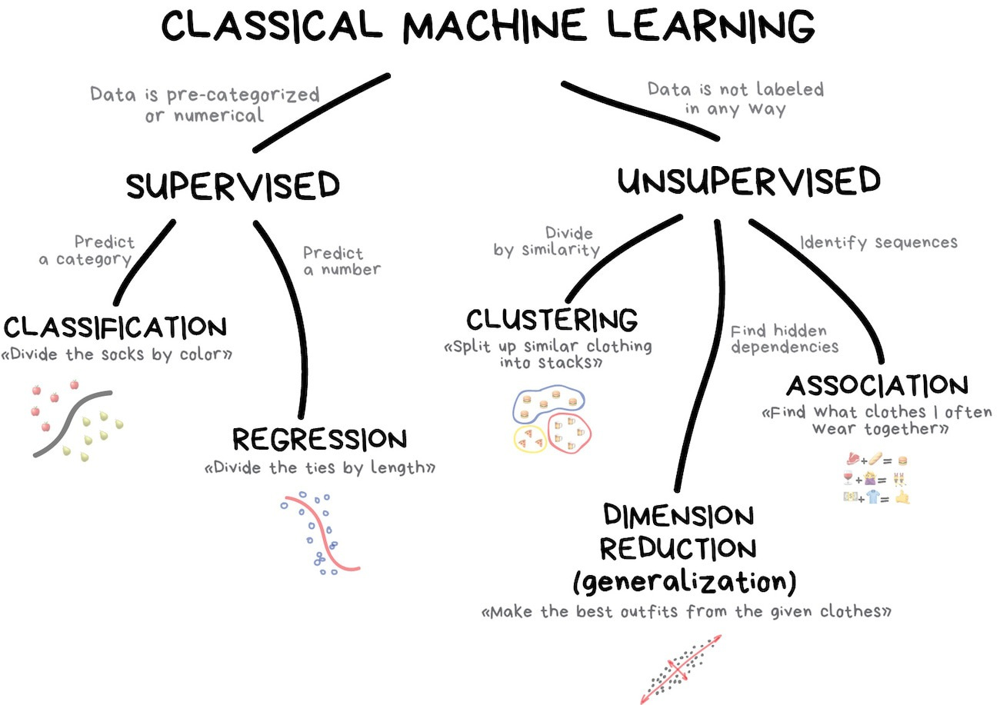

# Machine Learning with R

```{r, echo=FALSE, fig.width=6, fig.align="center", fig.height=8}
knitr::include_graphics("../documents/images/robot.jpeg")  
```

Machine Learning is data science technique where we predict results based on incoming data. Machine Learning is behind the recommended videos for you to watch on YouTube, the recommended products for you to purchase on Amazon, and the targeted advertisements you see on search engine results. Huge companies use data from our browsing history or purchase history to evaluate trends and create predictions on what product a consumer will want to buy next - this is machine learning in action.Various tasks for machine learning include data concepts learning, data function learning, or predictive modeling which involves the identification of predictive patterns. Each of these tasks are learned from an initial dataset. Algorithms, or simply R code with a purpose, can be used to observe patterns, trends, experiences, and/or instructions from this initial dataset. The goal of machine learning is to use these initial instructions to create advanced insights and improve algorithms. As humans, we're constantly undergoing subconscious machine learning. We recognize patterns in our daily lives and use this data to form a more accurate analysis or form a better prediction model for ourselves. 

Let's explain machine learning with an example regarding mathematics in school. Students in math classes are often given practice problems to train their mathematic ability. Often times, a math concept is taught to the students and then students use this concept to help solve practice problems. Let's assume that for this example, *the math concept is not taught*. Instead, only practice problems and their associated answers are given. Each practice problem encodes pieces of information that a student observes alongside the answer. We can call this learning process the training of an algorithm. After many practice problems, we expect that the students would have identified a pattern they can use to help solve the problem. So a test is given to the student and we compare their results to the answer key. Evaluating the accuracy of the students answers gives us a measure of effectiveness for both the student and the set of practice problems. To summarize, machine learning algorithms are like math students who have been given vast amounts of practice problems and instructed to find methods for solving them by finding patterns between the math problems and their associated answers. Machine Learning aims to understand the concepts or the formulas behind datasets. Computers are much better at crunching numbers than us and this is why we use machine learning. 

## Machine Learning Terms

```{r, echo=FALSE, out.width="80%", fig.align="center"}
knitr::include_graphics("../documents/images/learning_vs_intelligence.jpeg")  
```

Machine Learning is a subject within a broader knowledge category known as artificial intelligence. Machine learning has 3 components associated with it - data, features, and algorithms. These components are present within every sub-category or technique of Machine Learning. Let's start from the top and describe some important terms as simply as possible. 

Artificial Intelligence
: Intelligence demonstrated by machines. This is the name of the knowledge field machine learning lies in, similar to physics in the science knowledge field. 

Machine Learning
: Data science technique aimed to predict results based on data. One category of artificial intelligence. 

Data
: A collection of observations or informative metrics used to practice machine learning. Many times we will encounter training datasets - used to train an algorithm, and test datasets - datasets used to test an algorithm. In our math example above, training datasets are the practice problems, test datasets are the exam given to the students. 

Training Data
: Dataset that is used to train a machine learning algorithm. The algorithm aims to find patterns within this dataset that it can then use to make predictions. In our math example above, the training dataset is the set of practice problems the students are given initially. 

Test Data
: Dataset that is used to test an algorithm. In the math example above, the test dataset is the exam given to the students to check their comprehension. 

Features
: Variables/columns of a dataset that act as input for a machine learning model or algorithm. 

Algorithms
: A process, set of functions, or calculation aimed to solve problems. In our case, we'll develop machine learning algorithms via R code. Algorithm is a fancy term that gets used as a buzzword but we've developed code in this course that are technically algorithms, just not with the purpose of *machine learning*. 

Model
: A mathematical representation of a real-world process that are built with algorithms and training data. Models are the entire process from inputting data, to training an algorithm, to analyzing output.

Label/Output
: The final output of a machine learning process which can be output classes such as students who got an A on a math exam, students who got a B, etc. 

Regression
: Machine learning technique used on continuous data such as time series data. This technique involves fitting a line. We've fit regression lines to time-series data before with the Willow Creek Air Temperature dataset. In machine learning, regression would be used to predict future temperatures based on the dataset we've initially used.

Classification
: Categorizing data into groups or predefined classes. For example, we could classify a particular lat/lon point as land or ocean. Another example would be classifying fruits and vegetables. 

Generalization
: The entire point of machine learning. A model is trained to utilize patterns learned from a task to solve a similar task with slight variations. For example, a consumer product model may be used to suggest next purchases for that consumer. Let's say a consumer buys a basketball so the machine learning model recommends basketball shoes, as consumers who bought basketballs prior have also purchased basketball shoes. Generalization is the act of performing tasks of the same difficulty and nature. This may also be referred to as interpolation, although generalization is a more commonly used and understood term.

Extrapolation
: Extrapolation, on the other hand, is when the model is able to obtain higher-dimensional insights from a lower-dimensional training. Extrapolation is a more difficult task. Weather models use extrapolation to predict the future based on current values. 

Overfitting
: A term used when a machine learning model fits the training dataset *too well*. A model is overfitting if it fits the training data too well and there is a poor generalization of new data.

Underfitting
: A machine learning model that fits a training dataset poorly. 

Parameter
: A function argument for algorithms. For example, in a climate change prediction model, a parameter is carbon dioxide emission scenario. 

Ensemble
: A member of a collection of varying output data. Ensembles are used to show variance of output within a model. For example, algorithms often have calculations that have some variance associated with them - in other words, we have a range of possibilities. Ensembles are used to show that output can vary despite having the same input data and algorithm. 

Decision Tree
: A method for finding answers by asking questions with binary answers and proceeding accordingly.

Feature Engineering
: Feature engineering refers to a process of selecting and transforming variables when creating a predictive model using machine learning such as random forest or regression.

## Classical Machine Learning

```{r, echo=FALSE, out.width="60%", fig.align="center"}
  
```

Classical machine learning has actually been around since the 1950s. These machine learning models were built on algorithms that solved formal math tasks — searching for patterns in numbers, evaluating the proximity of data points, and calculating vectors' directions. These same algorithms are used today by social media companies (Instagram), e-commerce companies (Amazon), and credit card companies (Chase). Ever wonder how targeted ads on Instagram, Facebook, or Google work? This is classical machine learning in action. Classical machine learning is often divided into two categories – Supervised and Unsupervised Learning.

### Supervised Learning

In supervised learning, we have clear training data that serves as the "Superviser" or "Teacher" who gives the machine all the answers. In our math example, the students were given the answers with the practice problem (training dataset) by the Superviser. As another example, let's say we wish to train an algorithm to identify a latitude and longitude point as land or ocean. In order to teach the algorithm, we would provide it with the answer (ocean or land) of a particular point so it can learn. There are two primary types of supervised learning - classification and regression. 

#### Classification

```{r, echo=FALSE, out.width="40%", fig.align="center"}
knitr::include_graphics("../documents/images/classification.jpg")  
```

Categorizes objects based on one of the attributes beforehand. For example, separate music by genre, highlight video by sport, student by grade, etc. 

We've all seen same-day loan services through commercials or billboards before. Some of these loan services today don't involve human interaction. How can machine learning be used to decide whether someone should be given a loan or not? The loan company has lots of profiles of people who took money before. They have data about age, education, occupation and salary and – most importantly – the fact of paying the money back. Or not. They use this data as input for a machine learning algorithm that decides whether to give an applicant a loan or not. 

#### Regression

```{r, echo=FALSE, out.width="80%", fig.align="center"}
knitr::include_graphics("../documents/images/regression.jpg")  
```

Regression is basically classification where we forecast a number instead of category. Examples are temperature by time of day, traffic by time of the day, housing prices by year, etc. Regression is perfect when something depends on time. In the image above we draw a line through some data points - yes, this is machine learning.

### Unsupervised Learning

Unsupervised learning is a technique that was created out of bad data. Labeled data with variables/columns is not always available and this is where unsupervised learning can come in and help. Exploratory data analysis can be used to aid unsupervised learning techniques. Two of the more popular unsupervised learning techniques include clustering, dimension reduction, and association. 

#### Clustering

```{r, echo=FALSE, out.width="40%", fig.align="center"}
knitr::include_graphics("../documents/images/clustering.jpg")  
```

Divides objects based on unknown features and let the machine choose the best way. Clustering is done with creating a gridded dataset from a point dataset. For example, with weather modeling, clustering is a step that is used to spatially interpolate points to a structured grid. Popular clustering algorithms include K-means clustering, mean-shift, and DBSCAN. 


#### Dimension Reduction

```{r, echo=FALSE, out.width="40%", fig.align="center"}
knitr::include_graphics("../documents/images/reduction.jpg")  
```

Assembles specific features into more high-level ones. For example, we can merge all dogs with triangle ears, long noses, and big tails to a nice abstraction — "shepherd". Yes, we're losing some information about the specific shepherds, but the new abstraction is much more useful for naming and explaining purposes. As a bonus, such "abstracted" models learn faster, overfit less and use a lower number of features. Principal Component Analysis (PCA) and Singular Value Decomposition (SVD) are often used in Earth Science machine learning applications.

#### Association

Look for a pattern based on consumer purchases. Basketball purchases are sometimes followed by basketball shoe purchases. Recommend basketball shoe purchases to the consumer!

### Neural Networks

Any neural network is basically a collection of neurons and connections between them. Neuron is a function with a bunch of inputs and one output. Its task is to take all numbers from its input, perform a function on them and send the result to the output.

Here is an example of a simple but useful in real life neuron: sum up all numbers from the inputs and if that sum is bigger than N — give 1 as a result. Otherwise — zero.

Connections are like channels between neurons. They connect outputs of one neuron with the inputs of another so they can send digits to each other. Each connection has only one parameter — weight. It's like a connection strength for a signal. When the number 10 passes through a connection with a weight 0.5 it turns into 5.

These weights tell the neuron to respond more to one input and less to another. Weights are adjusted when training — that's how the network learns. Basically, that's all there is to it.

```{r, echo=FALSE, out.width="60%", fig.align="center"}
knitr::include_graphics("../documents/images/neural.jpg")  
```

### Reinforcement Learning

This type of machine learning is used by self driving cars and robot vacuums. Reinforcement learning is used in cases when your problem is not related to data at all, but you have an environment to live in. The algorithm learns based on the reactions of an action within an environment. 


The images shown in this tutorial were taken from [Vasily Zubarev who wrote an excellent machine learning concepts manual](https://vas3k.com/blog/machine_learning/?ref=hn). Vasily Zubarev is the best Machine Learning educator I've come across and I suggest poking around [his website](https://vas3k.com) for more Machine Learning content. 


