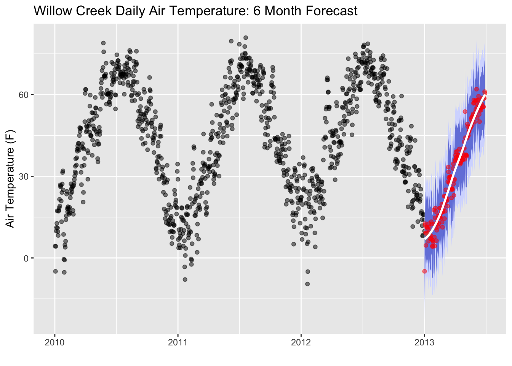

# Time Series Forecasting

```{r, echo=FALSE, out.width="70%", fig.align="center"}
  
```

Time series forecasting is widely used in sciences with the intended purpose of predicting the future based on present data. This type of machine learning technique has been used for weather forecasting, glacier melting outlooks, and carbon dioxide concentration predictions. In this tutorial, we will use the Willow Creek Weather Datasets and build an Air Temperature Forecast using Linear Regression Modeling. The goal of this exercise is to build a linear regression model using existing training data to accurately predict existing testing data. This is an isolated tutorial that **does not** account for other variables (precipitation, shortwave radiation, etc.) that may have an influence on Air Temperature. While it may not serve as the best predictive model for air temperature, it serves as a first step in linear regression modeling and machine learning. 


## Load the Packages and Data

Let's use the `read.wcr` function that we previously created to load in our dataset. 

```{r, warning=FALSE, message=FALSE, out.width="50%", fig.align="center"}
library(ncdf4)
read.wcr = function(fname) {
  fullname = strsplit(fname, "/")
  dataset_str = fullname[[1]][length(fullname[[1]])]
  datname = strsplit(dataset_str, "_")[[1]][1]
  data.year = substr(dataset_str, nchar(dataset_str)-6, nchar(dataset_str)-3)
  data.date = seq(from=as.POSIXct(paste0(data.year,"-1-1 0:00", tz="UTC")),to=as.POSIXct(paste0(data.year,"-12-31 23:00", tz="UTC")),by="hour")
  vars.info <- data.frame(CF.name = c("date", "air_temperature", "precipitation_flux", "surface_downwelling_shortwave_flux_in_air",
                                      "specific_humidity", "surface_downwelling_longwave_flux_in_air", "air_pressure",
                                      "eastward_wind", "northward_wind", "wind_speed"))
  df <- list()
  tem <- ncdf4::nc_open(fname)
  dim <- tem$dim
  for (j in seq_along(vars.info$CF.name)) {
    if (exists(as.character(vars.info$CF.name[j]), tem$var)) {
      df[[j]] <- ncdf4::ncvar_get(tem, as.character(vars.info$CF.name[j]))
    } else {
      df[[j]] = NA
    }
  }
  names(df) <- vars.info$CF.name
  df <- data.frame(df)
  nc_close(tem)
  if(all(is.na(df$date))){
    df$date = data.date
  }
  return(df)
}

```

Now, let's throw the `read.wcr` function into a loop so we can read in the data for each year. 

```{r, warning=FALSE, message=FALSE, out.width="50%", fig.align="center"}

# create a sequence of years for the years we have data
yearSeq = seq(2010,2012)

# begin the for loop to open each year of data
for (y in yearSeq){
  # use our read.wcr() function and paste in the filename that changes for each year of data
  tem_df = read.wcr(fname = paste0("~/Documents/Github/geog473-673/datasets/WCr_1hr.",y,".nc"))
  # != means DOES NOT EQUAL. This statement reads as - if y DOES NOT EQUAL the first year in yearSeq, proceed to use rbind
  # otherwise, if y is indeed the first year in yearSeq, we need to initialize wcr_df BEFORE we overwrite tem_df
  if (y != yearSeq[1]){
    wcr_df = rbind(wcr_df, tem_df)
  } else {
    wcr_df = tem_df
  }
}

length(wcr_df$date)
head(wcr_df)
```

Our data has been read in. Let's convert the Air Temperature units from degrees Kelvin to degrees Fahrenheit. Then, let's plot our time series. 

```{r, warning=FALSE, message=FALSE, out.width="50%", fig.align="center"}
library(ggplot2)
library(lubridate)

# convert the data to Fahrenheit
wcr_df$air_temperature = (wcr_df$air_temperature - 273.15) * (9/5) + 32

ggplot(data = wcr_df, aes(x = date, y = air_temperature)) +
    geom_rect(xmin = as.POSIXct("2010-01-01"),
              xmax = as.POSIXct("2012-06-01"),
              ymin = -10, ymax = 100,
              fill = "lightblue", alpha = 0.1) +
    annotate("text", x = as.POSIXct("2011-01-01") , y = 80,
             color = "blue", label = "Train Region") +
    annotate("text", x = as.POSIXct("2012-12-01"), y = 80,
             color = "coral", label = "Test Region") +
    geom_point(size=0.5, alpha = 0.5, color = "black") +
    labs(title = "Willow Creek Hourly Air Temperature - 2010-2013",y = "Air Temperature (F)", x = "")

```

## Aggregate Data

Let's *aggregate* our dataset from an hourly resolution to a **daily resolution**. This can be done using the `xts` (a time series library) library which has a convenient function called `apply.daily()` that averages the default resolution data to a daily resolution. This will enhance speed but also decrease accuracy as we are removing data. In real practice and with proper computer resources we would rather stick with our original hourly resolution. 

```{r, warning=FALSE, message=FALSE, out.width="50%", fig.align="center"}
library(xts)
library(zoo)
# create time series data frame based on our datetime 
xt = xts(wcr_df, order.by = wcr_df$date)
# aggregate to daily resolution
daily = xts::apply.daily(xt,mean)
# recreate the date variable which has been deemed as the index of our daily dataframe - while it is the index, it's easier to use if it's a variable.
daily = data.frame(date=index(daily), coredata(daily))
# remove artifact of daily aggregation
daily$date.1 = NULL
# plot the new daily air temperature
ggplot(data = daily, aes(x = date, y = air_temperature)) +
    geom_rect(xmin = as.POSIXct("2010-01-01"),
              xmax = as.POSIXct("2012-06-01"),
              ymin = -10, ymax = 85,
              fill = "lightblue", alpha = 0.1) +
    annotate("text", x = as.POSIXct("2011-01-01") , y = 70,
             color = "blue", label = "Train Region") +
    annotate("text", x = as.POSIXct("2012-12-01"), y = 70,
             color = "coral", label = "Test Region") +
    geom_point(alpha = 0.5, color = "black") +
    labs(title = "Willow Creek Daily Air Temperature - 2010-2013",y = "Air Temperature (F)", x = "")


```


## Prepping the Model
Now that we have our data in daily resolution, we can split our dataset into 2; a test dataset, and a train dataset. When we build a linear regression model for a time series dataset, we select a training period and a testing period. For our case, we're going to train the dataset with data from 2010-01-01 to 2012-05-31. In other words, we're using 5/6ths of our dataset to train the model. Then, we'll use the remaining 1/6th (2012-06-01 to 2013-01-01) to test the model to see how well it predicts the temperature using linear regression. 


```{r, warning=FALSE, message=FALSE, out.width="50%", fig.align="center"}
train = daily[1:which(daily$date == as.POSIXct("2012-05-31 23:00:00 EDT")),]
test = daily[which(daily$date == as.POSIXct("2012-06-01 23:00:00 EDT")):length(daily$date),]

train = data.frame(date = train$date, air_temperature =  train$air_temperature)
test = data.frame(date = test$date, air_temperature =  test$air_temperature)

# print out the results of our split
head(train)
head(test)
```

We have our test and train datasets, but now we must prepare these datasets for the linear regression model. Remember, we are trying to train the model using the train dataset and use that model to accurately predict the temperature values of the test dataset. We'll need to provide the model with some information regarding the number of variables that go into the model. 

```{r, warning=FALSE, message=FALSE, out.width="50%", fig.align="center"}
library(timetk)
library(recipes)
# create a recipe for the air temperature variable
rec_train = recipe(air_temperature ~ ., data = train)
recipe_ts = step_timeseries_signature(recipe = rec_train, "date") 

recipe_ts
```

We only have 1 predictor (day of year) and 1 outcome variable (air temperature). When we initiate a linear regression model for a time series, the model will add extra columns (second, minute, hour, day of year, week of year, weekday, etc.) to the training dataset. Remember, we're creating a *recipe* that holds instructions for the actual model. We can add recipe instructions on whether to evaluate the interaction of these columns and Air Temperature or not.  We'll remove seconds, minutes, hours since we are at a daily resolution. These instructions are used on the training dataframe while it's training the particular model but does not impact the actual dataframe itself. 

```{r, warning=FALSE, message=FALSE, out.width="50%", fig.align="center"}
recipe_spec = recipe_ts
# when we run the model, extra dat values will be added automatically - so let's remove our default date column when teh model is run - note this does not change the dataframe
recipe_spec = step_rm(recipe_spec, date)
# some other variables will be added in automatically as well, let's remove the ones that aren't imoprtant. 
recipe_spec = step_rm(recipe_spec, contains("iso"), 
            contains("second"), contains("minute"), contains("hour"),
            contains("am.pm"), contains("xts"))
# create new columns based on the interaction of these variables
recipe_spec = step_interact(recipe_spec, ~ date_month.lbl * date_day)
recipe_spec = step_interact(recipe_spec, ~ date_month.lbl * date_mweek)
recipe_spec = step_interact(recipe_spec, ~ date_month.lbl * date_wday.lbl * date_yday)
recipe_spec_final = step_dummy(recipe_spec, contains("lbl"), one_hot = TRUE) 

recipe_spec_final

```

Our instructions have been specified, now let's use the `linear_reg` function from the `parsnip` package to create the instance. We'll need to set an engine to run the model (there are multiple regression model engines that are beyond the scope of this tutorial) and that engine will be `glmnet`. We'll initiate the model, create a workflow for the model where we add in our prewritten recipe above, then we'll add our model to the workflow. Once it's ready, we can run the model and it's workflow using the `fit` function. Our model has been trained. Now, we can use our trained model to predict the test air temperature based on the test date. 

## Running the Model
```{r, warning=FALSE, message=FALSE, out.width="50%", fig.align="center"}
library(workflows)
library(parsnip)
library(recipes)
library(yardstick)
library(glmnet)
library(tidyverse)

# initiate the model with a penalty of 2 and no mixture - these parameters can be changed for more variability
model_spec_glmnet <- parsnip::linear_reg(mode = "regression", penalty = 2, mixture = 0)
set_engine(model_spec_glmnet, "glmnet")

# add our recipe to the workflow, then add the model to the workflow
workflow_glmnet = add_recipe(workflow(), recipe_spec_final)
workflow_glmnet = add_model(workflow_glmnet, model_spec_glmnet)
workflow_glmnet

# tune the model based on the training data
workflow_trained <- workflow_glmnet
workflow_trained = fit(workflow_glmnet, data = train)

# predict the test air temperature based on our model
prediction_tbl = predict(workflow_trained, test)
prediction_tbl = bind_cols(prediction_tbl, test) 
prediction_tbl

# plot our modeled test air temperature against the actual test air temperature
ggplot(data = daily, aes(x = date, y = air_temperature)) +
    geom_rect(xmin = as.POSIXct("2010-01-01"),
              xmax = as.POSIXct("2012-06-01"),
              ymin = -10, ymax = 85,
              fill = "lightblue", alpha = 0.01) +
    annotate("text", x = as.POSIXct("2011-01-01") , y = 75,
             color = "blue", label = "Train Region") +
    annotate("text", x = as.POSIXct("2012-12-01"), y = 75,
             color = "coral", label = "Test Region") + 
   geom_point(alpha = 0.5, color = "black") +
    geom_point(aes(x = date, y = .pred), data = prediction_tbl, 
               alpha = 0.5, color =  "darkblue") +
    labs(title = "GLM: Out-Of-Sample Forecast")

```


## Validation and Accuracy

The plot seems to show that the model predicted the test air temperature fairly well, but let's evaluate the metrics the see how it does based on the statistics. Then, let's plot the residuals - the difference between the actual test air temperature and the predicted air temperature. 


```{r, warning=FALSE, message=FALSE, out.width="50%", fig.align="center"}
# calculate the metrics of test air temperature vs. predicted air temperature
metrics(prediction_tbl, air_temperature, .pred)

# plot the residuals
ggplot(data = prediction_tbl, aes(x = date, y = air_temperature - .pred)) +
  geom_hline(yintercept = 0, color = "black") +
  geom_point(color = "blue", alpha = 0.5) +
  geom_smooth(span = 0.05, color = "red") +
  geom_smooth(span = 1.00, se = FALSE) +
  labs(title = "GLM Model Residuals, Out-of-Sample", y = "Air Temperature: Actual - Predicted",  x = "") +
  scale_y_continuous(limits = c(-5, 5))
```

Remember, we don't want to overfit our model and make it too accurate! Overfitting of our model to the training dataset can create unrealistic outcomes with unrealistic regularity. Temperatures are variable!

## Future Forecasting

The residuals show the model performed fairly well. Now, can we forecast the temperature into the future? We'll follow the same procedure as before but now we'll create extra time series values and fill those using the model we've built

```{r, warning=FALSE, message=FALSE, out.width="50%", fig.align="center"}
# Extract daily index
idx <- tk_index(daily)
# Get time series summary from index
daily_summary <- tk_get_timeseries_summary(idx)

# add 180 days to the model 
idx_future <- tk_make_future_timeseries(idx, n_future = 180)
# create a tibble table 
future_tbl <- tibble(date = idx_future) 
head(future_tbl)

# run the model using the entire dataset, predict the temperature for the dates of future_tbl, and bind the columns together. 
future_predictions_tbl = fit(workflow_glmnet, data = daily)
future_predictions_tbl = predict(future_predictions_tbl, future_tbl)
future_predictions_tbl = bind_cols(future_predictions_tbl, future_tbl)

# plot the future forecasted temperature
ggplot(data = daily, aes(x = date, y = air_temperature)) +
    geom_rect(xmin = as.POSIXct("2010-01-01"),
              xmax = as.POSIXct("2012-06-01"),
              ymin = -10, ymax = 85,
              fill = "lightblue", alpha = 0.01) +
    annotate("text", x = as.POSIXct("2011-01-01") , y = 75,
             color = "blue", label = "Train Region") +
    annotate("text", x = as.POSIXct("2012-12-01"), y = 75,
             color = "coral", label = "Test Region") + 
   geom_point(alpha = 0.5, color = "black") +
  geom_point(aes(x = as.POSIXct(date), y = .pred), data = future_predictions_tbl,
               alpha = 0.5, color = "dodgerblue1") +
    geom_smooth(aes(x = as.POSIXct(date), y = .pred), data = future_predictions_tbl,
                method = 'loess', color = "dodgerblue4") + 
    labs(title = "Willow Creek Air Temperature: 6-Month Forecast", y = "Air Temperature (F)", x = "")


```

Let's add in some error regions. We'll calculate the spread of the 95th percentile and the 80th percentile confidence intervals. 95% of the area under a normal curve lies within roughly 1.96 standard deviations of the mean, and due to the central limit theorem, this number is therefore used in the construction of approximate 95% confidence intervals. For 80%, the are under a normal curve lies within roughly 1.28 standard deviations. We'll use these values to create our prediction error thresholds. 

```{r, warning=FALSE, message=FALSE, out.width="50%", fig.align="center"}
# Calculate standard deviation of residuals (actual temp subtracted from residuals)
test_resid_sd <- summarize(prediction_tbl, stdev = sd(air_temperature- .pred))
# create lo.95 and other variables for the error areas
future_predictions_tbl <- mutate(future_predictions_tbl, 
        lo.95 = .pred - 1.96 * test_resid_sd$stdev,
        lo.80 = .pred - 1.28 * test_resid_sd$stdev,
        hi.80 = .pred + 1.28 * test_resid_sd$stdev,
        hi.95 = .pred + 1.96 * test_resid_sd$stdev)

# plot the error areas
ggplot(data = daily, aes(x = date, y = air_temperature)) +
    geom_point(alpha = 0.5, color = "black") +
    geom_ribbon(aes(y = .pred, x = as.POSIXct(date),ymin = lo.95, ymax = hi.95), 
                data = future_predictions_tbl, 
                fill = "#D5DBFF", color = NA, size = 0) +
    geom_ribbon(aes(y = .pred, x = as.POSIXct(date),ymin = lo.80, ymax = hi.80, fill = key), 
                data = future_predictions_tbl,
                fill = "#596DD5", color = NA, size = 0, alpha = 0.8) +
    geom_point(aes(x = as.POSIXct(date), y = .pred), data = future_predictions_tbl,
               alpha = 0.5, color = "red") +
    geom_smooth(aes(x = as.POSIXct(date), y = .pred), data = future_predictions_tbl,
                method = 'loess', color = "white")+ 
    labs(title = "Willow Creek Daily Air Temperature: 6 Month Forecast",y = "Air Temperature (F)", x = "")
    
```

Remember, no forecast is ever perfect!

## Assignment

Perform the same analysis for the Willow Creek Air Temperature (2010,2011, and 2012 datasets) but this time aggregate to a **weekly** resolution using the `apply.weekly()` function from `xts`. Proceed with the same workflow and create the same plots. Add plots to a document (Word, Google Docs, or RMarkdown file, your choice) and answer the following questions;

1) How does the weekly resolution model compare to the daily resolution model?
2) Why do you think it performs better/worse? 
3) How could we enhance the accuracy of the model? 

Upload file (as word doc, PDF, whatever works) to UD Canvas. 


