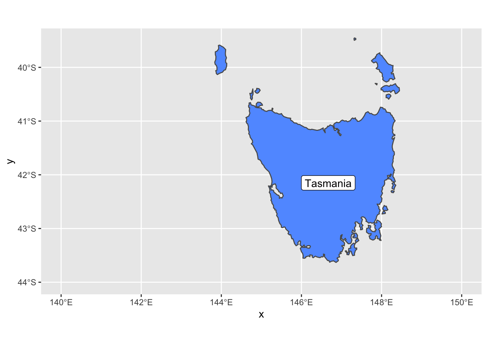

# Spatial Plots with `ggplot2`

```{r, echo=FALSE, out.width="60%", fig.align="center"}
  
```

In Geospatial Sciences we're constantly working with spatial datasets that come in many different projections. We've previously shown how R can be used to read in spatial data, reproject spatial data, and resample spatial datasets. Once a spatial dataset can be stored in R as a data frame, we can use `ggplot` to plot it. 

| Function | Description |
| -----------| --------------------------- |
| `geom_sf()` | Adds geometry stored in a `sf` object to a ggplot |
| `coord_sf()` | Provides coordinate specifications for a ggplot |
| `geom_raster()` | Plots a data frame as a raster on a ggplot |
| `st_crs()` | Obtains projection information from an EPSG code |
| `geom_sf_label()` | adds label to an sf geometry |
| `scale_fill_gradientn()` | adds a density plot to a ggplot |
| `borders()` | Adds country borders to a ggplot | 
| `coord_quickmap()` | Approximates projected lines for faster image creation | 
| `colorRampPalette()` | Create custom color ramp palette | 
| `brewer.pal()` | Grabs premade color palette from RColorBrewer | 
| `grid.arrange()` | Function that allows you to organize multiple ggplot objects into the same window | 

## Simple Features

One package useful for spatial data in R is the `sf` package (short for simple features). It contains functions that perform equations that place uneven projections on a 2 dimensional computer screen. It can handle many projections and is built to work seamlessly with `ggplot`. For sample data, we're also going to load `ozmaps` which contains maps of Australia.

```{r}
library(ozmaps)
library(sf)

oz_states <- ozmaps::ozmap_states
oz_states
```

`oz_states` is a simple feature which stores data like data frames but has a projection (proj4string), spatial extents, and polygon geometry. In other words, we have shapes on a map that are georeferenced and stored within a data frame that `ggplot` is great at working with. There are two columns - `NAME` and `geometry`. The `NAME` column is the name of the Australian State. The `geometry` specifies where the lines of the polygons are drawn (the state boundaries). So, let's plot these polygons!

```{r, out.width="70%", fig.align="center"}
library(ggplot2)
ggplot(data = oz_states) + 
  geom_sf() + 
  coord_sf()
```

```{r, out.width="70%", fig.align="center"}
# if we declare mapping aesthetics, we can tell ggplot to fill the spatial features (australian states) based on the NAME column / variable - ggplot automatically chooses coloring for us if we don't specify
ggplot() + 
  geom_sf(data = oz_states, mapping = aes(fill = NAME)) +
  coord_sf()
```

The function `coord_sf` allows to deal with the coordinate system, which includes both projection and extent of the map. By default, the map will use the coordinate system of the first layer that defines one (i.e. scanned in the order provided), or if none, fall back on WGS84 (latitude/longitude, the reference system used in GPS). Remember, our `oz_states` is a simple feature data frame that contains projection information. Thus, `coord_sf` is assuming we want the projection of `oz_states` - `+proj=longlat +ellps=GRS80 +towgs84=0,0,0,0,0,0,0 +no_defs`. We can specify our own `crs` argument if we want to override the assumed projection. If we set the `crs` argument to a valid PROJ4 string, we can accoimplish this. Let's project our `oz_states` onto a Mollewide graph.

```{r, out.width="70%", fig.align="center"}
ggplot() + 
  geom_sf(data = oz_states, mapping = aes(fill = NAME)) +
  coord_sf(crs = "+proj=moll +lon_0=0 +x_0=0 +y_0=0 +datum=WGS84 +units=m +no_defs") + 
  ggtitle("oz_states projected onto Mollewide ggplot")
```

We did not overwrite the data to this new projection. We simply performed a transformation on the fly to fit the data to a new grid. Instead of a PROJ4 string, we could use an EPSG code with the `st_crs()` function. Let's not project our data onto a grid with EPSG code 3112. 

```{r, out.width="70%", fig.align="center"}
ggplot() + 
  geom_sf(data = oz_states, mapping = aes(fill = NAME)) +
  coord_sf(crs = st_crs(3112)) + 
  ggtitle("oz_states projected onto EPSG 3112")
```

`st_crs()` is that simple, just plug in the code and the function will grab the PROJ4 string for you. `coord_sf` has other options that are useful too such as x and y limits. Let's go back to our regular projection of this data and show the limits in action. 

```{r, out.width="70%", fig.align="center", warning=FALSE}
ggplot() + 
  geom_sf(data = oz_states, mapping = aes(fill = NAME), show.legend = FALSE) +
  coord_sf(xlim = c(140, 150), ylim=c(-44, -39.5)) +
  geom_sf_label( data = oz_states, aes(label = NAME))
```

We also added `geom_sf_label` which adds a label to an `sf` geometry. In this case, we added the Tasmania name tag to the geometry. 

## Sea Surface Temperature ggplot

When it comes to spatial data, the `raster` package is our go-to library. After the data is translated to a dataframe and ready to plot, we'll need the help of a package called `mapproj` which makes sense of some external maps that `ggplot2` uses.

```{r, out.width="70%", fig.align="center"}
library(ggplot2)
library(mapproj)
library(maptools) # also loads sp package
library(raster)
library(rasterVis)
library(RColorBrewer)
sstRast <- raster("/Users/james/Documents/Github/geog473-673/datasets/GOES_R_ROLLING_1DAY_20190814.nc")
# crop the raster so this runs faster
sstRast <- crop(sstRast, extent(-100,-80,16,30))
sstRast

# convert to dataframe and 
df <- as.data.frame(sstRast, xy = TRUE)
head(df)

# plot the raster
ggplot() +
  geom_raster(data = df , aes(x = x, y = y, fill = Sea.Surface.Temperature)) + 
  coord_sf()
```

In this case, `df` is just a data frame - not an `sf` data frame. We need to use `geom_raster` in this case to plot a regular data frame as a raster. As for the projeciton, `ggplot` automatically guessed lat/long which in this case is correct. A better practice is to use the `crs` from the `sstRast` which contains all of the projection information.

```{r, out.width="70%", fig.align="center"}
# print the crs of the sstRast
crs(sstRast)

# plug in crs into the `coord_sf` function
ggplot() +
  geom_raster(data = df , aes(x = x, y = y, fill = Sea.Surface.Temperature)) + 
  coord_sf(crs=crs(sstRast))
```

The georeferenced data is properly placed. Let's now turn our attention to the coloring of the data. We can use the `RColorBrewer` package to create our own color palettes. Also, becuase we're in lat/long projection, we're going to use `coord_quickmap` instead of `coord_sf`. This function approximates geolocated lines for faster plotting. This can be used in lat/long projected data close to the equator. 

```{r, out.width="70%", fig.align="center"}
# now let's use a better colorscheme
jet.colors <- colorRampPalette(c("#00007F", "blue", "#007FFF", "cyan", "#7FFF7F", "yellow", "#FF7F00", "red", "#7F0000"))
ggplot() +
  geom_raster(data = df , aes(x = x, y = y, fill = Sea.Surface.Temperature)) + 
  scale_fill_gradientn(colors = jet.colors(7), limits = c(28, 33)) + 
  coord_quickmap()

# now let's add borders using the borders function
ggplot() +
  geom_raster(data = df , aes(x = x, y = y, fill = Sea.Surface.Temperature)) + 
  scale_fill_gradientn(colors = jet.colors(7), limits = c(28, 33)) + 
  borders(fill="white", xlim = c(-100,-80), ylim=c(16,30),alpha = 0.5) +
  coord_quickmap(xlim = c(-100,-80), ylim=c(16,30))
```

Let's get rid of the expanded area beyond the raster domain using the `expand=FALSE` argument in `coord_quickmap()`

```{r, out.width="70%", fig.align="center"}
ggplot() +
  geom_raster(data = df , aes(x = x, y = y, fill = Sea.Surface.Temperature)) + 
  scale_fill_gradientn(colors = jet.colors(7), limits = c(28, 33)) + 
  borders(fill="white", xlim = c(-100,-80), ylim=c(16,30),alpha = 0.5) +
  coord_quickmap(xlim = c(-100,-80), ylim=c(16,30),expand = FALSE)
```

## R Color Brewer Palettes

There are a number of pre-made color palettes from `RColorBrewer`. Here is a list. 

```{r, fig.width=8, fig.height=12, fig.align="center"}
library(RColorBrewer)
display.brewer.all()
```

Let's plot using a Yellow-Orange-Red palette and a white NA value

```{r, out.width="70%", fig.align="center"}
cols <- brewer.pal(9, "YlOrRd") # maximum number of colors in palette YlOrRd is 9
pal <- colorRampPalette(cols)

ggplot() +
  geom_raster(data = df , aes(x = x, y = y, fill = Sea.Surface.Temperature)) + 
  scale_fill_gradientn(colors = pal(20), limits = c(25, 35),na.value = "white") + 
  borders(fill="white", xlim = c(-100,-80), ylim=c(16,30),alpha = 0.5) +
  coord_quickmap(xlim = c(-100,-80), ylim=c(16,30),expand = FALSE)    

```

### Multi Plot ggplot 

Multiple Plots in one window is possible with ggplot2 but is done with a different method. Remember how we explicitly named ggplot2 instances in the previous tutorial? We must do that again in order to achieve the results we want. Let's split up the image above into West Gulf of Mexico and East Gulf of Mexico. 

```{r, out.width="70%", fig.align="center"}
library(ggplot2)
library(grid)
library(gridExtra)

p1 = ggplot() +
  geom_raster(data = df , aes(x = x, y = y, fill = Sea.Surface.Temperature), show.legend=FALSE) + 
  scale_fill_gradientn(colors = pal(20), limits = c(25, 35),na.value = "white") + 
  borders(fill="white", xlim = c(-100,-90), ylim=c(16,30),alpha = 0.5) +
  coord_quickmap(xlim = c(-100,-90), ylim=c(16,30),expand = FALSE)    

p2 = ggplot() +
  geom_raster(data = df , aes(x = x, y = y, fill = Sea.Surface.Temperature), show.legend=FALSE) + 
  scale_fill_gradientn(colors = pal(20), limits = c(25, 35),na.value = "white") + 
  borders(fill="white", xlim = c(-90,-80), ylim=c(16,30),alpha = 0.5) +
  coord_quickmap(xlim = c(-90,-80), ylim=c(16,30),expand = FALSE)    

# use the grid.arrange function from grid and gridExtra to plot our 2 ggplots in the same window
grid.arrange(p1,p2, ncol=2, nrow=1)
```

`grid.arrange` takes ggplot objects and plots them onto a window with specified rows and columns. Here we wanted these two separate plots side by side. 

## Assignment

1. Download `treecov.nc` from the datasets folder

2. For South America and Africa, plot the tree cover variable using `ggplot2`. Use a green color theme from `RColorBrewer`. Add borders.

3. Place each `ggplot` next to each other in one plot window using `grid.arrange`.  

4. Submit resulting image to UD Canvas.


Your final product should look something like...

```{r,echo=FALSE, fig.width=14, fig.height=14}
library(ggplot2)
library(grid)
library(gridExtra)
library(maptools) # also loads sp package
library(raster)
library(rasterVis)
library(RColorBrewer)

treeRast <- raster("/Users/james/Documents/Github/geog473-673/datasets/treecov.nc")
df <- as.data.frame(treeRast, xy = TRUE) 
cols <- brewer.pal(9, "Greens")# nmaximum for palette YlOrRd is 9
pal <- colorRampPalette(cols)

g1 = ggplot() +
  geom_raster(data = df , aes(x = x, y = y, fill = treecov)) + 
  scale_fill_gradientn(colors = pal(20), limits = c(0, 100), na.value = "white") + 
  borders(colour='black') + 
  coord_quickmap(xlim = c(-100,-30), ylim=c(-60,20),expand = FALSE) +
  labs(title="South America Tree Cover %", y="Latitude", x="Longitude")

g2 = ggplot() +
  geom_raster(data = df , aes(x = x, y = y, fill = treecov)) + 
  scale_fill_gradientn(colors = pal(20), limits = c(0, 100), na.value = "white") + 
  borders(colour='black') + 
  coord_quickmap(xlim = c(-20,60), ylim=c(-40,40),expand = FALSE) +
  labs(title="Africa Tree Cover %", y="Latitude", x="Longitude")


grid.arrange(g1,g2, ncol=2, nrow=1)
```


### Extra Credit - 2 Points

Using the data above, approximate the average tree cover for South America and Africa (extents don't have to be exact, just generally)

1) Plot the same domains above but this time color each continent (yes, the whole thing) based on the average tree cover. For example, if one of the continent has an average tree cover of 30%, the entire continent would be red based on the colorscale you choose where 30% is red. 

2) Submit plot and code to canvas 